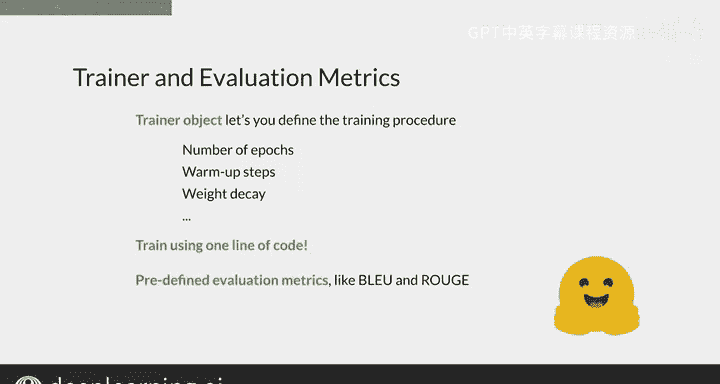

#  178：Hugging Face 入门 III 🚀

在本节课中，我们将要学习如何利用 Hugging Face 生态系统来微调一个 Transformer 模型。Hugging Face 提供了一套完整的工具，从数据集、模型到训练和评估，极大地简化了自然语言处理任务的流程。

---

## 概述：Hugging Face 的核心组件 🧩

Hugging Face 提供了微调 Transformer 模型所需的一切工具。

他们提供了超过 1000 个针对特定任务的数据集，你可以使用 `datasets` 库快速加载。

他们还提供了分词器，帮助你在训练前预处理数据，并在模型运行后处理输出。

此外，他们拥有超过 15,000 个模型检查点，你可以从 `transformers` 库中加载。

`Trainer` 对象让你无需担心编写训练过程代码即可训练模型。

不仅如此，它还预定义了可用于评估模型性能的指标，这些指标可以集成到 `Trainer` 对象中。

---

## 模型检查点：微调的起点 🏁

上一节我们介绍了 Hugging Face 的丰富资源，本节中我们来看看如何选择和使用模型检查点。

Hugging Face 拥有超过 15,000 个模型检查点，你可以将它们作为微调过程的起点。

模型检查点是在特定数据集上训练模型过程中学习到的权重集合。

例如，你可以使用一个在问答数据集上训练得到的 DistilBERT Transformer 蒸馏版本的模型检查点。

你可以在 Hugging Face 上找到名为 `distilbert-base-cased-distilled-squad` 的检查点。

或者，你也可以使用在区分大小写的英语语料库上训练的 BERT 基础版本模型。

你可以在 Hugging Face 上找到名为 `bert-base-cased` 的检查点。

因此，你可以探索 Hugging Face 模型库，为你的特定用例寻找合适的检查点。

一旦你选择了想要使用的检查点，你可以使用 `transformers` 库中的函数，通过一行代码加载其架构和权重。

你将在下一个未评分的实验课中看到具体做法，所以现在不必担心代码细节。

---

## 数据集：获取与加载 📊

为了针对特定任务微调 Transformer 模型或在特定领域表现出色，你需要大量数据。

你可以通过爬取网页甚至从自己开发的应用程序中收集数据来获取和处理数据集。

但在你大费周章之前，Hugging Face 拥有一个包含特定任务数据集的库，值得探索。

你可以在他们的网站上按任务类别、语言和大小筛选来搜索这个数据集库。

要加载你选择的任何数据集，你只需要 `datasets` 库中的一个函数。

因此，如果你决定使用 Hugging Face 的数据集，只需一行代码即可加载数据。

如果你已经拥有自己的数据集，加载过程也同样简单。

使用 Hugging Face 的 `datasets` 库是一个明智的选择，因为它针对处理海量数据集进行了优化，并且拥有可以帮助你预处理数据的方法，即使你决定使用自己的数据。

---

## 数据预处理：使用分词器 🔧

一旦确定了用于微调模型的数据集，你需要预处理数据以便将其输入模型进行训练。

预处理数据的方式因任务和你要微调的模型而异。

但 Hugging Face 提供了分词器对象。在这个过程中，你只需要指定你正在使用的模型检查点，分词器几乎会完成所有繁重的工作。

分词器接收你的文本数据，并返回你的模型可以读取的标记。

例如，你可以向 DistilBERT 分词器传递文本：“What well-known superheroes were introduced between 1939 and 1941 by Detective Comics?”

它会返回 DistilBERT 模型可用于训练和推理的数值标记。

在获得标记后，你可能需要根据要微调的模型、使用的数据集以及训练模型的任务，采取一些额外的预处理步骤。

为了确保在预处理步骤中完成了所有必要的工作，你需要阅读模型检查点和所用数据集的描述，这些描述也由 Hugging Face 提供。

---

## 模型训练：使用 Trainer 对象 🏋️

现在，为了执行模型的微调，你需要运行一个训练过程。

正如你可能已经猜到的，Hugging Face 也会让这一步变得更容易。

Hugging Face 的 `transformers` 库有一个 `Trainer` 对象，它将你想要微调的模型作为输入，并附带一些你可以根据需要调整的其他参数，例如预热步数、训练轮数或权重衰减的强度。

要执行训练过程，你需要调用 `Trainer` 对象的 `train` 方法，这只需一行代码。

此外，你可以定义一个函数来使用 Hugging Face 提供的一些预定义指标，例如 BLEU 分数，或者如果你愿意，甚至可以定义自己的指标。

在 Hugging Face 中，使用 `Trainer` 对象计算你想要的指标，只需在训练、验证或测试数据上调用一个 `evaluate` 方法即可。

---

## 总结 📝

本节课中我们一起学习了 Hugging Face 平台如何为微调 Transformer 模型提供一站式解决方案。我们了解了如何利用其庞大的**模型检查点**库作为起点，如何使用 `datasets` 库高效地**加载和处理数据**，以及如何借助**分词器**和 **`Trainer` 对象**来简化数据预处理和模型训练流程。这套工具极大地降低了自然语言处理任务的门槛，让开发者能够更专注于模型的应用和创新。