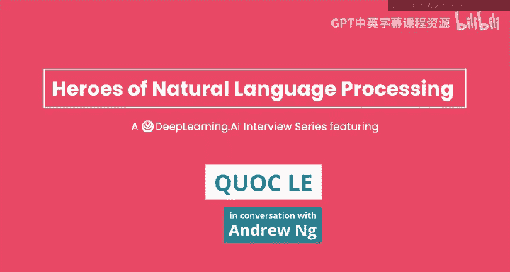
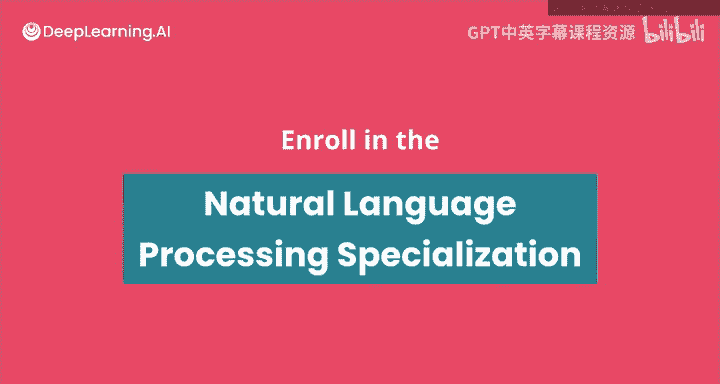

#  180：吴恩达《自然语言处理》P180 - 与Quoc Le的访谈 🎙️

## 概述

在本节课中，我们将学习Quoc Le的AI研究历程。Quoc Le是Google Brain的研究员，也是深度学习和自然语言处理领域的先驱之一。我们将了解他从学生时代到成为顶尖研究员的旅程，以及他在序列到序列模型、聊天机器人等关键项目上的工作与思考。

---

## 早期经历与AI启蒙 🤖

Quoc Le的AI之旅始于高中时期。他对人工智能产生了浓厚兴趣，阅读了大量书籍，并编写了一些简单的AI程序。他构建了一个类似聊天机器人的系统，试图与程序对话，并探索图灵测试的概念。尽管这个程序很简单，但这段经历为他未来的研究奠定了基础。

随后，他获得了澳大利亚国立大学的本科奖学金。在大学期间，他联系了Alex Moeller教授，并在其指导下进行关于核方法的机器学习研究。这是他第一次正式接触机器学习，并认识到机器学习在实现AI方面的巨大潜力。

---

## 学术深造与研究转向 🧠

在德国进行研究期间，Quoc Le接触到了神经科学，并聆听了吴恩达关于使用机器学习实现AI的演讲。这与他将机器学习视为实现AI工具的理念产生了共鸣。因此，他申请并进入了斯坦福大学的博士项目，师从吴恩达。

大约在2010年至2011年间，吴恩达告知他正在Google启动一个旨在将深度学习研究规模扩大数百甚至数千倍的项目。Quoc Le认为这代表了未来方向，因为在他看来，神经网络的显著进步往往源于更多的数据和计算资源。他因此加入了Google Brain项目，并成为该项目的首位实习生。

---

## Google Brain与“谷歌猫”项目 🐱

在Google Brain的早期，Quoc Le参与了一个具有里程碑意义的项目——谷歌猫。这个项目的灵感来源于他们在斯坦福大学研究的自编码器技术。自编码器是一种尝试重建输入图像的无监督学习方法，当应用稀疏性约束时，网络底层会学习到类似边缘检测器的特征。

他们的核心想法是：**如果将这个网络的规模扩大100或1000倍，是否能够学习到更复杂、更高级的特征？** 他们决定进行尝试。

以下是项目的关键步骤：
*   他们将训练从单机扩展到16000台机器。
*   选择YouTube的海量图像作为训练数据集。
*   训练了一个稀疏自编码器网络约一周时间。

经过大量调试，他们在网络中发现了一些对“人脸”和“猫”特别敏感的神经元。这个通过网络无监督学习发现的“猫”特征，成为了早期深度学习无监督学习的一个标志性成果。

---

## 序列到序列模型的突破 🔄

在“谷歌猫”项目之后，Quoc Le的另一个重大贡献是序列到序列模型，这项研究改变了自然语言处理的轨迹。

最初的灵感来源于词向量对齐工作。当时，Word2Vec等方法展示了词向量的强大能力，例如通过向量运算解决类比问题（如“国王-男人+女人≈女王”）。他们思考：**不同语言（如英语和西班牙语）的词向量空间是否存在相似结构？能否通过少量对齐的词汇学习一个旋转矩阵，实现跨语言的词映射？**

这项工作取得了成功，并促使他们思考：既然词到词的翻译可行，那么能否实现句子到句子的翻译？他们意识到，生成句子时，逐个单词地预测并建立依赖关系（即基于已生成的词预测下一个词）比同时独立预测所有单词更有意义。

然而，从构思到实现花费了近一年时间，过程非常困难。他们最初使用传统的循环神经网络，效果不佳。后来，在与Ilya Sutskever和Oriol Vinyals的合作中，他们尝试使用长短期记忆网络，获得了显著改进。但最初的翻译结果仍然很差。

关键的突破来自于一个看似简单但至关重要的决定：**投入更多资源，训练更大的LSTM模型，并优化训练过程。** 通过持续降低复杂度、扩大模型规模并延长训练时间，翻译质量在几个月内逐步提升，最终证明了该方向的有效性。

---

## Meena聊天机器人项目 💬

受到高中时期构建简单聊天机器人经历的驱动，以及序列到序列模型成功的鼓舞，Quoc Le开始探索构建更先进的对话AI。

在Google内部，他们首先尝试使用技术支持对话数据训练了一个模型。虽然回答仍有些生硬，但已显示出潜力。随后，在Transformer架构出现后，他们意识到其处理长距离依赖的能力优于LSTM，更适合多轮对话。

他们与工程师Daniel合作，开始使用Transformer架构，并投入更多计算资源训练更大的模型。随着模型规模的扩大和训练的深入，效果逐步改善。

一个令人惊喜的时刻是，他们在检查聊天日志时，发现机器人讲了一个关于“牛去哈佛，所以马也应该去哈佛”的双关语笑话。经过仔细检查训练数据，他们确认这个特定的笑话组合并未在语料库中出现过。这表明模型可能在一定程度上理解了“笑话”和“双关语”的概念，并能进行一定程度的创造性组合。

---

## 对未来的展望与生成式模型 🚀

展望自然语言处理的未来，Quoc Le最感兴趣的是生成式模型。他认为，当前很多NLP任务仍局限于传统范畴，如情感分类或命名实体识别。而生成式模型的潜力在于创造新内容。

例如，**生成式模型能否创作出被人类消费、传授新概念的新书？或者帮助编剧构思更好的电影情节？** 他认为这是技术应用的巨大潜力所在。

除了扩大模型规模和数据量，他认为生成式模型进步的一个重要方向是提升“事实正确性”和“常识理解”。当前模型生成的内容有时会包含虚构的事实。如何让模型生成更符合事实、更具常识的输出，将是一个重要的研究向量。他认为，可以通过构建专注于事实正确性的评测数据集来衡量这一方面的进展。

---

## 给AI从业者的建议 📚

Quoc Le分享了他对希望进入AI领域或寻求职业发展的人的一些建议。

首先，**保持耐心**。有影响力的工作往往需要时间的积累。他的职业生涯从起步到做出显著贡献，也经历了漫长的过程。

其次，**保持一定的“天真”或好奇心有时是好事**。不必在开始时就想读遍所有文献、理解一切。有时正是因为对现有复杂方法（如基于短语的机器翻译）了解不深或实现困难，才促使他去探索更简洁的端到端方法（如序列到序列），从而取得了突破。

对于学习者，他建议采用“课程学习”的策略：
*   **从简单的任务开始**：例如，选择一篇感兴趣的AI论文，尝试复现其结果。先确保自己能快速实现并复现基线效果。
*   **建立信心**：在游泳池学会游泳，而不是直接跳进大海。先通过复现等相对容易的任务获得成就感。
*   **逐步挑战**：在掌握了复现和实现的能力后，再逐步尝试提出自己的新想法、开展独立研究。

---

## 总结

本节课中，我们一起学习了Quoc Le的研究历程与深刻见解。我们回顾了他从高中编程聊天机器人起步，到在Google Brain参与“谷歌猫”、开创序列到序列模型、以及开发Meena聊天机器人的关键项目。我们还探讨了他对生成式模型未来的展望，以及他关于耐心、保持好奇心、采用渐进式学习策略的宝贵建议。他的故事展示了AI研究是一个需要长期投入、勇于探索的精彩旅程。