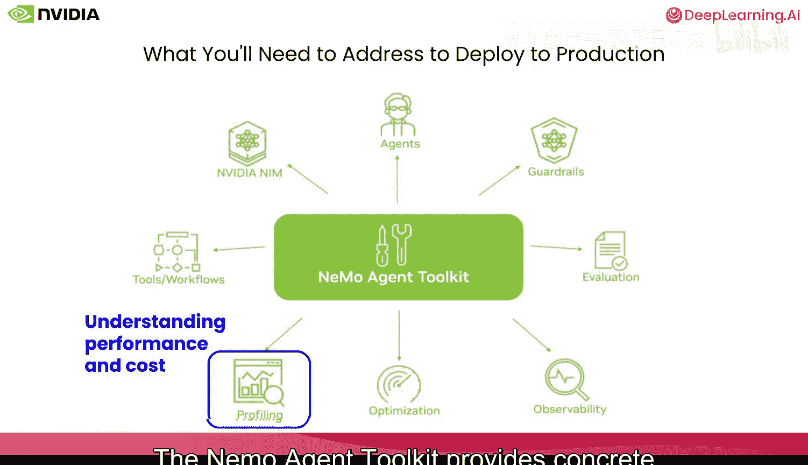
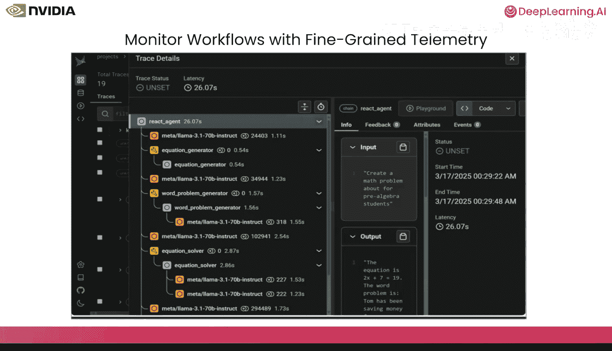
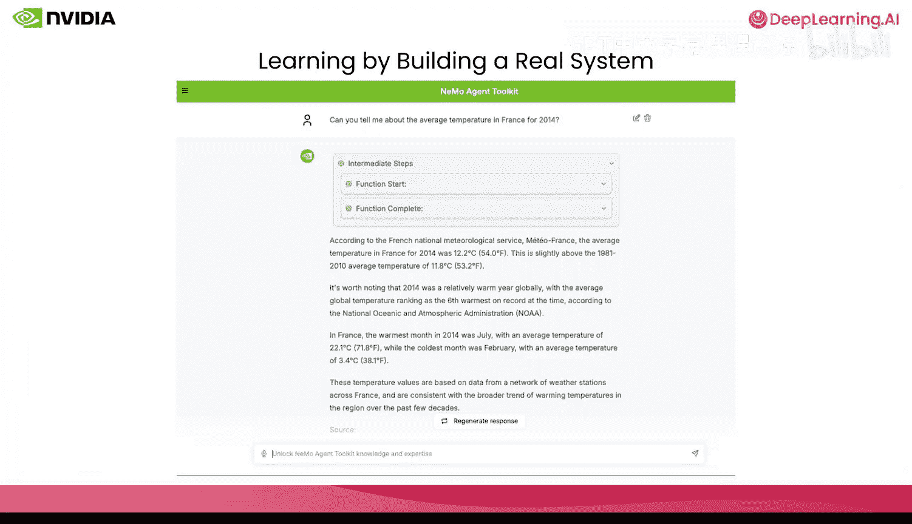
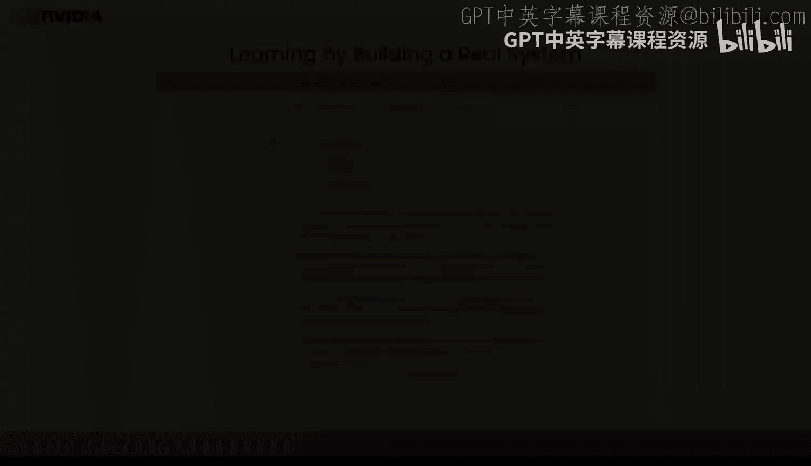

# 002：课程概述与核心挑战 🎯

在本课程中，我们将学习如何使用 NVIDIA NeMo 智能体工具包构建企业级就绪的智能体系统。你将学会如何构建超越原型的智能体 AI 系统，这些系统在生产环境中是可观测、可部署且可维护的。

课程结束时，你将构建一个完整的智能体应用程序，具备可观测性、API 部署、评估功能，并拥有一个连接到实际运行智能体的前端 UI。

## 从原型到生产的挑战

上一节我们介绍了课程目标，本节中我们来看看将智能体从原型推向生产时面临的核心挑战。

你或许知道如何构建一个本地原型智能体。它能够处理你发送的提示，并在你的实验中给出预期的答案。但将其部署到生产环境时，现实问题才会真正显现。

无论你是使用 LangChain、LlamaIndex、CrewAI 还是自定义 Python 代码构建的智能体，将其交付给他人使用时，真正的挑战才会暴露出来。此外，虽然市面上有许多优秀的智能体框架，但它们并非都能无缝协作。这些都是“第二天”的问题。

*   **第一天**是构建智能体。
*   **第二天**是处理其他所有事情。

以下是“第二天”面临的具体挑战：

*   **集成复杂性**：管理基于异构组件构建的多智能体系统变得越来越困难，因为智能体可能包含任意嵌套的工具和子智能体。
*   **可重复性**：智能体系统是非确定性的。没有一致性，其价值就会降低。一个小的参数变化或新的 LLM 都可能显著影响性能。“在我机器上能运行”在生产环境中行不通。
*   **代码复用**：团队实现了优秀的智能体和工具，但跨框架共享通常意味着重新实现。这种碎片化导致开发者重复劳动，而不是利用整个组织的集体成果。
*   **性能与成本**：大部分计算发生在外部系统中，涉及昂贵的 LLM 调用。瓶颈隐藏在复杂性之中。时间花在哪里？令牌消耗在哪里？混合工作负载使得优化生产需求变得困难。

我们需要将智能体作为 API 暴露出来。我们需要监控内部发生的情况。我们必须确保边缘情况不会破坏生产。我们需要能够从反馈中持续学习并保护数据隐私。我们还需要建立评估机制以快速发现问题。

## NeMo 智能体工具包的解决方案

我们如何解决这些问题？NeMo 智能体工具包正是为解决这些“第二天”问题而设计的，并且它能与你“第一天”构建的任何东西协同工作。

NeMo 智能体工具包是一个开源的 Python 库，它在你的原型智能体与经过实战考验、可部署的产品之间架起了一座桥梁。开源意味着没有供应商锁定。你可以检查代码、贡献改进，并部署到任何地方。

你无需抛弃现有的智能体框架或重写应用程序来使用 NeMo 智能体工具包。它可以与任何流行框架（如 LangChain、LangGraph、CrewAI、Semantic Kernel、Google AIK 或 LlamaIndex 等）构建的智能体协同工作。它增强了你已经构建的内容。可以将其视为一个统一的接口层，提供以下功能：

*   **生产基础设施**：它提供 API 部署，并可使用 YAML 进行配置。这支持快速原型设计和快速变更。
*   **统一可观测性**：它提供跨异构框架的端到端追踪。你可以确切地看到发生了什么，即使智能体调用了不同框架中的其他智能体。
*   **系统化评估**：它为工作流的任何部分提供标准化、完全可定制的评估。
*   **性能智能**：发现瓶颈、分析工作流并找到优化机会。自动超参数调优将帮助你提高准确性并降低成本。
*   **集成支持**：正如我们将看到的，NeMo 智能体工具包支持许多插件，包括内存系统、MCP（客户端和服务器）等。

安装很简单，只需 `pip install nvidia-nat`。对于特定框架，还有可选的插件，你可以根据需要安装。

## 配置驱动的核心理念

以下是 NeMo 智能体工具包与典型库的不同之处：它是**配置驱动**的。

与其将智能体、工具和工作流硬编码到你的代码中，不如在 YAML 配置文件中定义它们。你的工具变成可组合的函数。你的 LLM 选择在配置中声明。你的工作流结构也在同一个配置中定义。

为什么这很重要？因为配置文件更容易更改。它们可以进行版本控制，并且你比修改代码更容易地对它们进行实验。你可以不碰 Python 代码就更换 LLM。你可以通过向 YAML 配置添加几行来添加新工具。你可以针对不同的工作流配置运行评估，以查看哪种效果最好，所有这些都无需触及你的代码。

在本课程中，你将通过构建一个气候科学聊天机器人来亲眼看到这一点。但我们将看到的模式适用于任何智能体系统。

## 生产环境中的具体问题

当你将智能体投入生产时，会出现几个具体问题。

1.  **了解内部情况**：你的智能体接收输入并返回输出。但中间发生了什么？调用了多少工具？这些工具是按什么顺序调用的？如果出现错误，错误是什么？没有这种可见性，调试生产问题就是猜测。
2.  **作为服务部署**：本地脚本对其他应用程序没有用。你必须将智能体作为某种 API 暴露出来，以便其他服务、仪表板和应用可以查询它。这需要一个结构化的部署。
3.  **判断是否正常工作**：你的智能体在测试中似乎正确。但部署后，你会发现边缘情况、幻觉或错误的工具选择。你必须进行系统化评估，以便在它们影响用户之前发现这些问题。
4.  **理解性能与成本**：LLM 调用需要花钱，工具调用需要时间。因此，在生产中，你需要对计算周期和资金去向有细致的了解，以便进行智能优化。

NeMo 智能体工具包提供了解决这些问题的具体工具。

## 统一可观测性

如何从智能体系统中获取遥测和性能数据？一些编写智能体代码的团队根本没有考虑这一点。其他团队则在代码库中硬编码遥测同步，导致业务逻辑与日志记录和遥测同步交织在一起。

但更好的方法是用能够获取开放遥测数据并将其传递给你的可观测性团队/系统的工具来检测你的代码库。NeMo 智能体工具包使得可以通过配置文件添加这种检测，而不是将代码逻辑与遥测同步交织在一起。其结果是提供一个统一、单一的视图，提供完整的可见性，并使你的团队能够使用他们已知和信任的工具来管理和调试复杂系统。

这样做的好处是：当生产中出现问题时，你可以查看执行轨迹。你可以识别问题是出在工具速度慢、令牌使用过多、工具选择错误，还是其他完全不同的原因。

## 系统化评估

我们刚刚讨论了可观测性。NeMo 智能体工具包还提供评估，这两者相似但不同。可观测性告诉你**发生了什么**，它让你查看运行中的系统。但评估告诉你**发生的事情是否正确**。对于智能体系统，你需要知道什么是正确或错误的。

给定一个输入，你知道正确的输出应该是什么。NeMo 智能体工具包允许你构建这些输入和输出的评估集，并以自动化方式运行它们来测试你的智能体系统。然后，你可以自由地更改配置文件并运行评估，看看它如何影响你的智能体。

这很重要，因为智能体是自适应系统，它们不遵循预定的代码路径。它们能够适应，这很强大，但也意味着边缘情况可能出现。评估帮助你系统地发现这些问题。在本课程中，你将实际遇到一个部署后出现的错误，这个错误在随意测试中不会出现，你将使用评估来系统地捕获它，然后理解它发生的原因。

## 性能优化与分析

除了可见性和评估，NeMo 智能体工具包还包括自动超参数优化和全面的性能分析能力。

优化器使用 Optuna 和遗传算法自动调整你的工作流。在一个智能体应用中，我们仅通过运行优化器就看到了巨大的改进。

那么优化器如何工作？你定义哪些参数是可调的，例如 LLM 温度、模型选择、检索逻辑或工具参数。然后你指定哪些指标对你重要，例如准确性、延迟或令牌成本。接着，优化器使用不同的参数组合针对测试用例运行你的工作流，并找到优化你目标的设置。

分析器让你深入了解工作流性能。它提供关于令牌使用、工具执行时间、工作流模式的详细见解。你需要这些来优化你的智能体。这些工具共同消除了智能体调优中的猜测。我们不会在课程中实现这些，但它们是你在掌握基础知识后可以探索的强大功能。

## 集成与互操作性

NeMo 智能体工具包让你将各种系统组合在一起。它使你的智能体和工具可重用，可以混合搭配组件。这里我们可以看到它原生集成的一些框架和库。它是开源且可插拔的。所以，如果你的库不在这里，你可以轻松集成它，并且我们一直在添加新的框架和库。

## 实践项目：气候科学聊天机器人

你将构建一个真实的系统。这将是一个气候科学聊天机器人，能够获取、分析和可视化真实的 NOAA 气候数据。这不仅仅是一个演示。你将编写代码，自己部署它，并实时看到它工作（有时失败）。你将面临真正的挑战：连接 API、组合多个智能体、调试意外行为。我们将观察令牌使用情况，然后将其部署以进行实际查询。你甚至将使用评估工具发现并修复一个真实的错误。

你将从一个由独立 Python 函数构建的基础 ReAct 智能体开始。这将是一个具体、简单的基础。然后，你将逐步添加现实世界的能力：API 部署、可观测性集成、互操作性、系统化评估，最后是一个 UI。每一步都直接建立在前一步的基础上。你将通过亲手实现来学习生产模式。

## 总结

本节课中我们一起学习了使用 NVIDIA NeMo 智能体工具包构建企业级智能体的核心概念与挑战。我们了解到，将智能体从原型推向生产面临集成复杂性、可重复性、代码复用及性能成本等“第二天”问题。NeMo 智能体工具包作为一个配置驱动的开源库，通过提供统一可观测性、系统化评估、性能优化和广泛的集成支持，为解决这些问题提供了强大方案。在接下来的课程中，我们将通过构建一个气候科学聊天机器人，亲手实践这些概念。