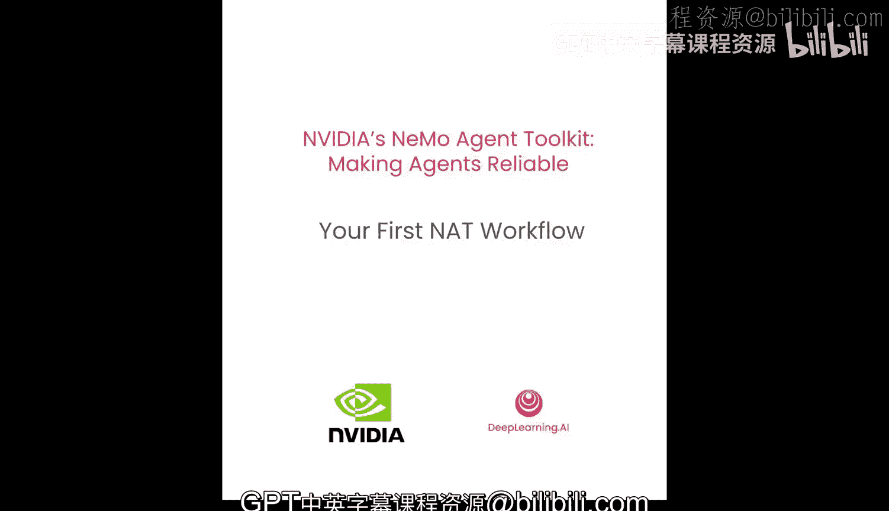
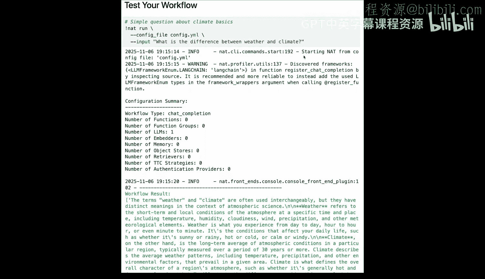
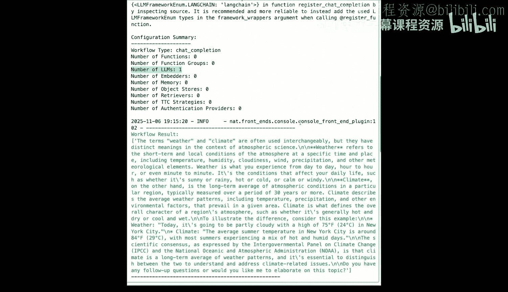
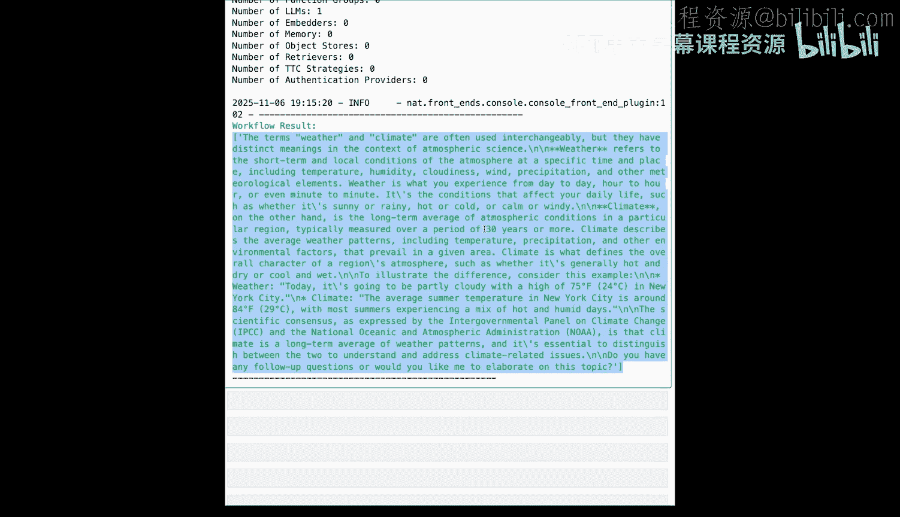
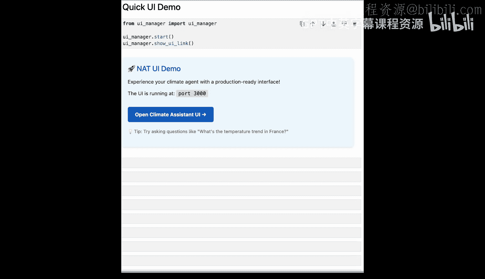
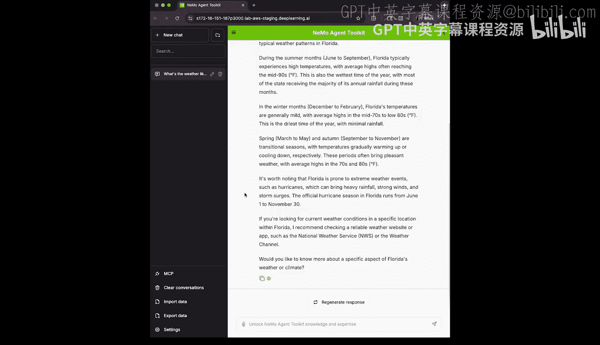
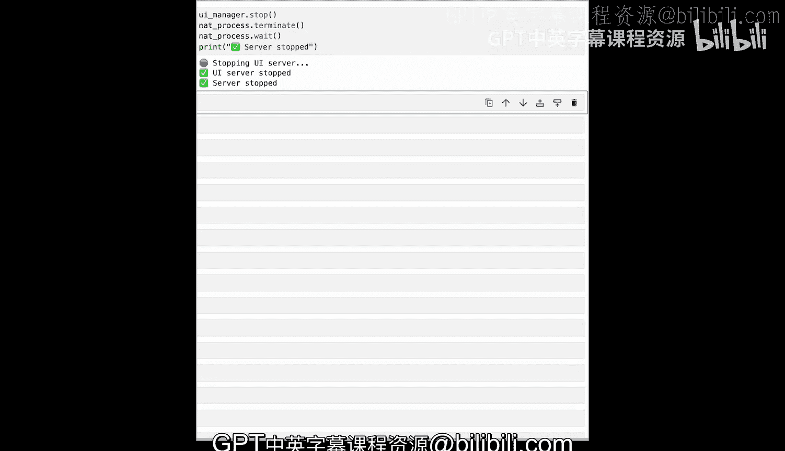

# 003：创建你的第一个NAT工作流 🚀



在本节课中，我们将学习如何创建并运行一个NAT工作流。我们将构建一个最小化的工作流，并将其部署为REST API，展示NAT如何为即使是简单的工作流也带来生产就绪的能力。


## 工作流配置：YAML文件的核心作用

上一节我们介绍了NAT的基本概念，本节中我们来看看构建工作流的核心——配置文件。

NAT CLI使你能够快速运行智能体，并将其作为API供其他服务调用。在本课程中，我们将构建一个简单但可用于生产环境的NAT智能体，使用NAT CLI将其作为API提供服务，并将其连接到UI界面以观察其运行。

NAT智能体工作流的核心是一个配置文件。这是一个简单的YAML文件，允许我们快速更改智能体的运行方式。

以下是一个配置文件的示例：

```yaml
workflow:
  type: react_agent
  llm: climate_llm

llms:
  climate_llm:
    type: nvidia_nim
    model: llama-3-70b-instruct
    base_url: "https://your-nim-endpoint"
    api_key: "your-api-key"
    temperature: 0.7
    max_tokens: 2048
```

该配置文件包含两个顶级属性：`workflow` 和 `llms`。

*   **`llms`**：定义并配置如何连接到大型语言模型。在NVIDIA NeMo容器中，它可以是其他提供商，如OpenAI或Gemini。
*   **`workflow`**：定义智能体的行为。在本例中，它是一个ReAct智能体，并使用下面定义的LLM。

配置可以很简单，也可以很复杂。它们可以包含评估信息、可观测性信息，可以定义多个供智能体调用的工具，以及许多其他功能，如检索器或重排序器，或者也可以像本例一样简单：一个工作流和一些LLM定义。

## 运行与部署：NAT CLI命令

为了运行这些工作流，我们使用NAT CLI。以下是几个核心的CLI命令：

*   `nat run`：使用简单输入运行工作流。
*   `nat serve`：针对相同的配置文件，将其作为API服务器运行。
*   `nat eval`：在CI/CD中或自行运行评估。
*   `nat optimize`：检查和优化你的工作流。
*   `nat validate`：检查你的YAML文件是否有效。

## 动手实践：构建第一个工作流

现在，让我们开始创建我们的第一个NAT工作流。首先，我们需要创建NAT配置文件。该配置是一个YAML文件，包含两个顶级属性：`llms` 和 `workflow`。NAT会将它们组合成你的智能体工作流。

### 配置LLM

我们首先来看`llms`。你可以配置多个LLM。在我们的简单工作流中，我们只配置一个，并将其命名为`climate_llm`。

每个LLM必须有一个`type`。这告诉NeMo智能体工具包如何连接到LLM提供商。它可以是`openai`、`google`或许多其他提供商。在我们的例子中，我们选择了`nvidia_nim`，这是一个NVIDIA推理容器。

`type`决定了你需要为LLM提供哪些属性。例如，它可能需要一个OpenAI API密钥。在我们的例子中，我们需要一个模型名称（`llama-3-70b-instruct`）、一个告诉它调用地址的基础URL（`base_url`）、一个API密钥（`api_key`），并决定将温度（`temperature`）设置为0.7，最大令牌数（`max_tokens`）设置为2048。

### 配置工作流



现在我们的LLM已准备就绪，可以接入生成工作流了。让我们看看`workflow`部分。



同样，我们定义了一个`type`。NAT内置了许多类型，当然你也可以创建自己的类型。在本例中，我们使用一个名为`chat_completion`的内置类型。这是一个对LLM的简单输入-输出响应。



`chat_completion`需要一个LLM，因此我们将之前定义的`climate_llm`传递给它。同时，还需要一个系统提示（`system_prompt`）：“你是一个知识渊博的气候科学助手”。

当我们运行这个工作流时，NeMo智能体工具包将查看这个配置文件，加载`chat_completion`工作流类型，创建我们定义的LLM并将其传递给该工作流类型，然后运行我们的输入与系统提示的组合，并给出输出。

### 运行工作流

现在我们可以运行工作流了。在本课程中，我们将看到多种运行工作流的方式。在本例中，我们将使用NAT CLI和`run`命令。这将对工作流执行一次简单的运行。

我们将传递之前保存的配置文件和一个输入问题：“天气和气候有什么区别？”。运行后，我们可以看到工具包已从配置文件开始运行，并返回了答案。

让我们继续问第二个问题。我们使用相同的配置文件，但输入改为：“自工业化前时代以来，全球平均气温上升了多少？”。运行后，我们得到了输出。

让我们再运行一次。这次，我们提出一个需要真实数据分析的具体问题：“2023年全球平均气温是多少？”。在这种情况下，我们的LLM将受限于其训练数据，因此我对结果不抱太高期望。正如我们所见，LLM尽力回答了，但我不相信这些数字是正确的。这里注意到了一个限制：我们的智能体只是一个LLM调用，它无法访问任何外部数据，只有LLM训练时包含的一般知识。我们看到它引用了一些来源，但这些来源可能过时，甚至可能是它“幻觉”出来的。

## 部署为API

现在我们有了这个NeMo智能体工具包配置，让我们将其部署为API。在生产环境中，你会在终端中运行`nat serve`。然而，这是在Jupyter notebook环境中运行，因此我们必须将其作为子进程运行。

我们正在处理子进程，因为这是一个Jupyter notebook，但我们运行的命令是`nat serve`，并传递了配置文件。之前，我们运行`nat run`并传递了一个输入。而这个`serve`命令将把该智能体工作流作为一个自包含的API来提供服务。

我们看到服务器已在后台运行，现在我们可以测试API了。为了测试API，我们将使用标准的Python `requests`库。如果你熟悉OpenAI API的聊天补全端点，那么对此会很熟悉。

我们的服务器运行在本地主机的8000端口上，我们将调用 `/v1/chat/completions` 端点。对于输入，我们将传递消息和一个单条消息：“是什么导致了厄尔尼诺现象，它如何影响全球天气？”。我们告诉它不要流式返回结果，以便获得一个自包含的JSON。

一旦我们收到200状态码，就可以解析OpenAI API兼容的响应：`choices[0].message.content`。如果出现错误，我们可以打印出错误信息。运行后，我们得到了一个描述厄尔尼诺是复杂天气现象的响应。

## 连接用户界面

我们已经看到了如何使用单个输入运行NeMo智能体工具包，以及如何将其作为API提供服务。现在，我们将看看如何启动一个UI，以便通过聊天界面与我们的智能体工作流进行交互。



NAT API可以被任何UI使用。然而，NAT本身提供了一个生产就绪的UI。从Jupyter notebook展示它可能比较复杂，因此我们这里有一个`UIManager`类来帮助我们从Jupyter notebook中显示它。

NeMo智能体工具包附带了一个功能丰富的UI，我们将在后面的课程中更深入地了解它。现在，让我们快速浏览一下这个UI，看看它如何与我们创建的简单气候助手对话。

这个UI可能让你感到有些熟悉，如果你使用过其他聊天机器人UI的话。它允许你创建新聊天、搜索现有聊天、连接到MCP服务器、导入数据、导出数据等。现在它已连接到我们创建的简单气候助手。

让我向我们的初级气候智能体发送一个提示：“佛罗里达州的天气怎么样？”。由于我们的智能体没有基于任何真实世界的数据集，它只会从LLM的知识中提取信息。我们看到它给出了一些关于佛罗里达天气的一般信息。

你会注意到它给了我一个后续提示，以便我可以继续聊天。尽管我们的智能体很简单，但你可以看到在其之上添加UI为你提供了强大的工具，以便在一系列对话中与智能体工作流进行交互。在本课程我们将要完成的一系列notebook中，我们将构建一个非常强大的气候和数学智能体，能够回答关于多年气候数据的深入问题。有了这个UI，我们将能够深入探讨这些数据。



## 总结与展望

在本节课中，我们一起学习了如何构建一个简单但可工作的气候助手，它能够回答关于气候数据的一般性问题。我们将其作为API进行了部署，甚至在一个聊天机器人UI中使用了它。虽然它目前还有局限，无法访问真实数据，但这只是一个开始。



接下来，我们将为实际的气候数据分析添加工具。