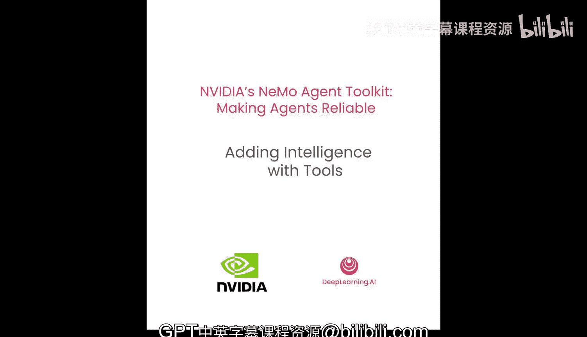
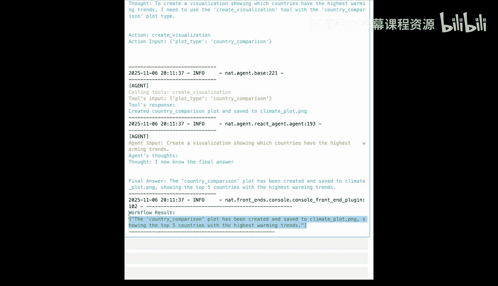
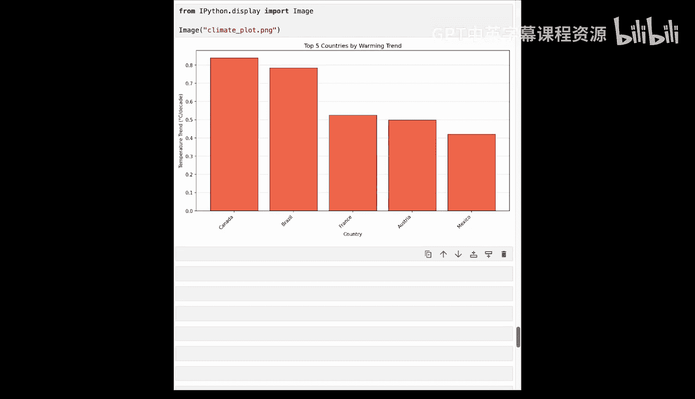
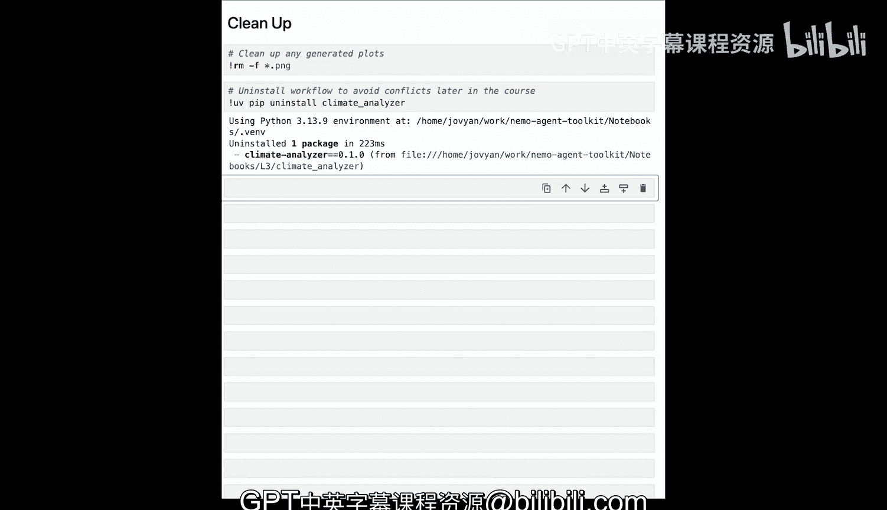

# 004：使用工具为智能体增添智能 🛠️




在本节课中，我们将学习如何扩展之前的实体工作流，使其成为一个能够“推理-行动”的智能体。我们将通过为分析NOAA气候数据的Python函数添加工具支持，将简单的聊天机器人转变为能够采取智能、数据驱动行动的智能体。

## 概述

上一节我们介绍了基础的工作流。本节中，我们将深入探讨如何将普通的Python函数转化为NVIDIA NeMo Agent Toolkit（NAT）可用的工具，并注册给一个“推理-行动”智能体使用。我们将使用真实的NOAA气候数据集，并构建一个气候分析助手。

## 什么是“推理-行动”智能体？

“推理-行动”是一种常见的智能体模式。它代表“推理”和“行动”，本质上是一个循环。大型语言模型会推理下一步该做什么，制定一个或多个行动，调用这些行动，然后再次推理，直到任务完成为止。

这个智能体可以访问多个工具，并且能够决定在何时使用哪个工具，通过迭代使用工具来获得最终答案。

## 准备数据与基础函数

我们将使用来自NOAA的真实气候数据集，其中包含美国、法国、日本、巴西等多个国家的信息。首先，我们引入一些能够分析这些数据的普通Python函数。

以下是加载数据并查看其结构的代码：
```python
# 加载气候数据
climate_df = load_climate_data()
print(f"数据集包含 {len(climate_df)} 条温度记录，时间范围从 {climate_df['year'].min()} 到 {climate_df['year'].max()}，涵盖 {climate_df['country'].nunique()} 个国家。")
```

让我们看看其中两个基础函数：
1.  **`calculate_statistics`**: 计算温度数据的基本统计信息。
2.  **`create_visualization`**: 创建气候数据可视化图表并保存为图片。

这些函数目前是独立的，尚未集成到我们的智能体工作流中。

## 将Python函数注册为NAT工具

要将一个Python函数注册为NAT工具，需要考虑三个核心部分。

### 1. 定义输入模式

使用Pydantic来定义工具的输入参数，这能帮助大型语言模型理解如何调用该工具。
```python
from pydantic import BaseModel, Field

class CalculateStatsInput(BaseModel):
    country: str | None = Field(
        default=None,
        description="要筛选的国家名称。留空则计算全球统计信息。"
    )
```

### 2. 创建配置类

NAT基于配置运行。配置类用于从YAML配置文件中接收属性。
```python
class CalculateStatisticsConfig:
    # 如果工具需要从YAML接收配置参数，可以在这里定义
    # 本例中不需要，所以使用 `...` 表示无属性
    ...
```

### 3. 使用装饰器注册工具

使用 `@register_function` 装饰器将函数包装并注册到NAT中。
```python
from nemoa_agent_toolkit import register_function

@register_function(config_type=CalculateStatisticsConfig)
async def calculate_statistics_tool(config: CalculateStatisticsConfig, builder) -> AsyncIterator[FunctionInfo]:
    # 加载数据
    climate_df = load_climate_data()

    # 定义实际的工具函数
    async def _calculate_statistics(country: str | None = None) -> str:
        result = calculate_statistics(climate_df, country)
        return result

    # 向NAT描述这个工具
    yield FunctionInfo(
        function=_calculate_statistics,
        input_schema=CalculateStatsInput,
        description="计算指定国家或全球的温度数据统计信息，包括平均值、趋势等。"
    )
```

虽然需要一些样板代码，但NAT CLI可以自动生成大部分内容。

## 配置工作流以使用工具

工具注册后，需要在YAML配置文件中进行配置，以便工作流使用。

以下是配置文件的节选：
```yaml
functions:
  - type: “simple_tool_demo.CalculateStatistics”
    description: “计算温度统计信息”

workflow:
  type: “react_agent”
  llm: “climate_llm”
  tools: [“calculate_statistics”] # 引用上面定义的函数
  max_iterations: 5
  max_retries: 2
  verbose: true
```

关键变化是：
*   `workflow.type` 从简单的 `llm_call` 变为 `react_agent`。
*   在 `tools` 列表中引用了我们注册的函数。
*   可以设置迭代和重试次数，以处理更复杂的任务。

## 运行增强后的智能体

安装包含工具的包并运行工作流。

让我们询问一个全球性问题：
```
nat run config.yaml --input “全球每十年的温度趋势是什么？”
```
智能体会进行推理，决定调用 `calculate_statistics` 工具（不指定国家），获取结果，并给出最终答案：“全球温度趋势是每十年上升0.241摄氏度。”

现在，让我们测试一个需要多个工具协作的复杂问题：
```
nat run config.yaml --input “比较加拿大和巴西的变暖趋势，哪个更快？并创建一张全球趋势的可视化图。”
```
智能体的推理过程可能如下：
1.  调用 `filter_by_country` 或直接为加拿大调用 `calculate_statistics`。
2.  为巴西调用 `calculate_statistics`。
3.  比较结果。
4.  调用 `create_visualization` 生成全球趋势图。
5.  综合所有信息，生成包含数据和图表位置的最终回答。

通过这个过程，智能体展示了其使用多种工具进行复杂分析和决策的能力。

## 项目打包与生成

一个NAT项目就是一个标准的Python项目。你可以使用NAT CLI快速生成项目脚手架：
```
nat workflow create climate_assistant
```
这将创建一个包含正确结构的标准Python项目，你可以在此基础上添加自己的工具和逻辑。





## 总结

本节课中我们一起学习了如何为NVIDIA NeMo智能体增添智能。核心步骤包括：
1.  **理解“推理-行动”智能体**的工作原理：一个通过循环进行推理、行动直至完成任务的模式。
2.  **将普通Python函数转化为NAT工具**：通过定义Pydantic输入模式、创建配置类和使用 `@register_function` 装饰器进行包装。
3.  **在YAML配置中集成工具**：在 `functions` 部分声明工具，并在 `react_agent` 工作流的 `tools` 列表中引用它们。
4.  **运行和测试智能体**：智能体现在可以自动选择并组合使用多个工具，回答复杂的数据驱动问题。



通过为智能体添加工具，我们极大地扩展了其能力，使其从简单的文本响应者转变为能够执行实际数据分析、可视化等任务的高级助手。