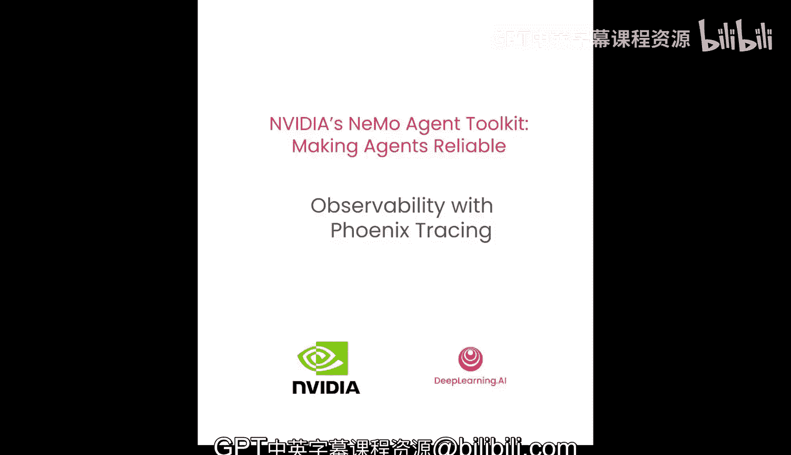
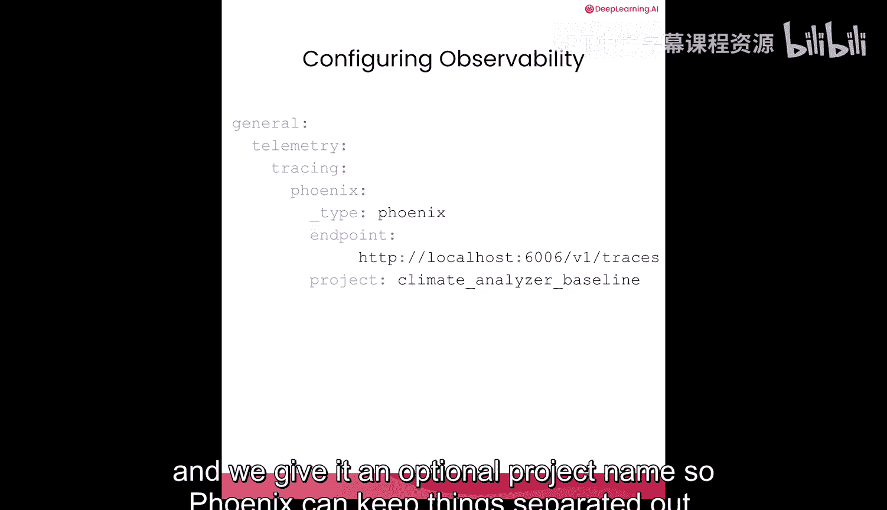
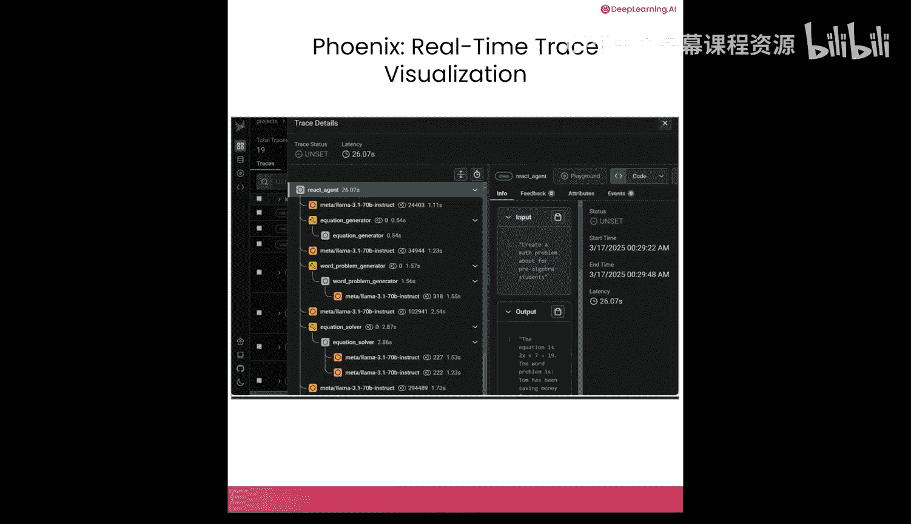
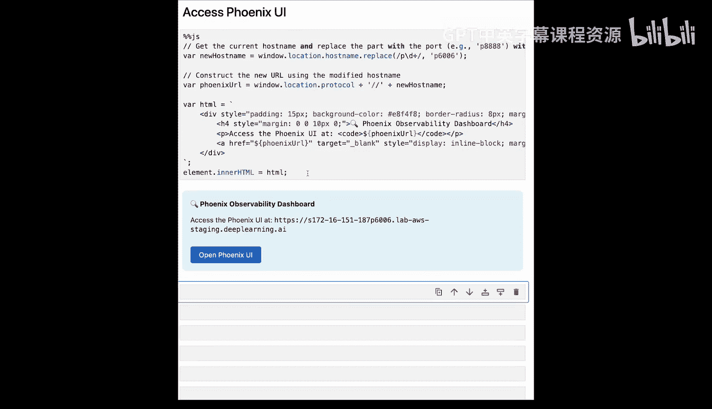
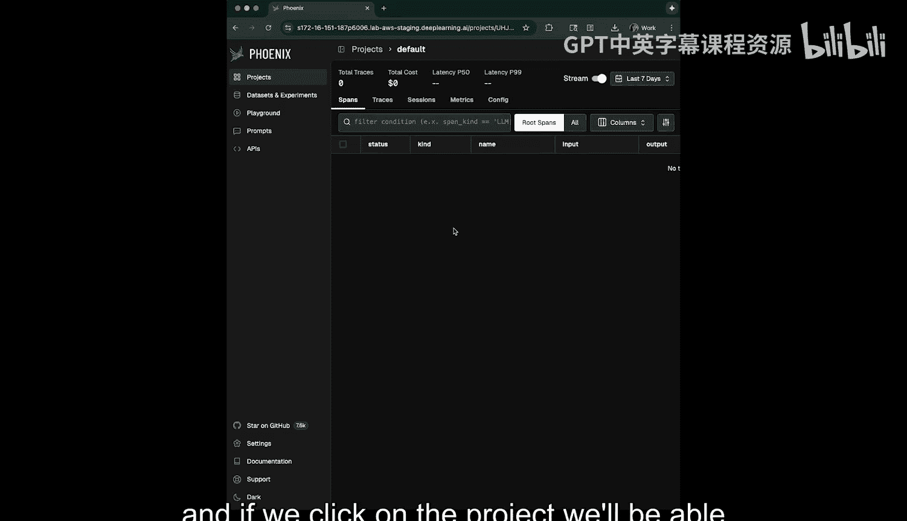
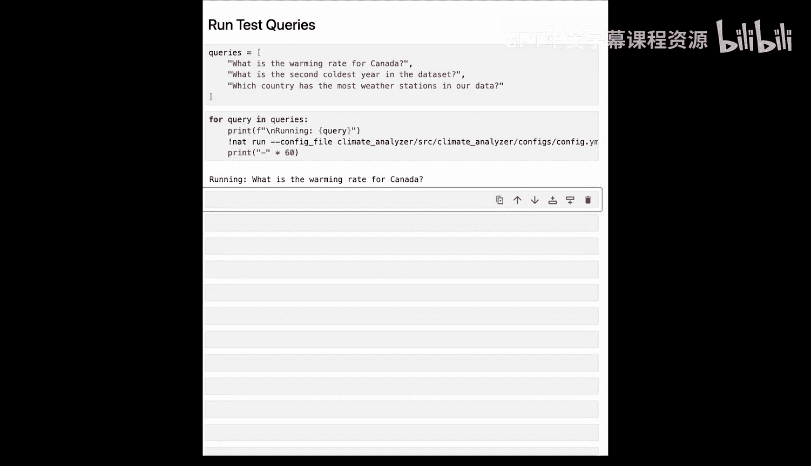
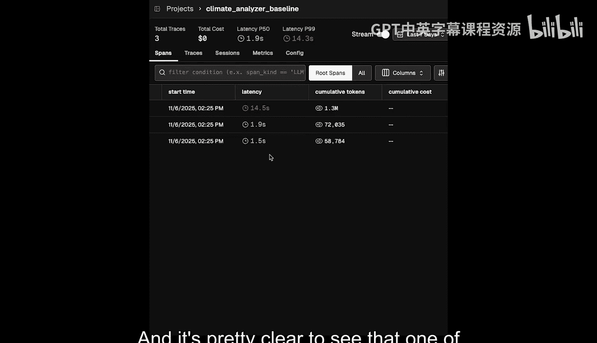
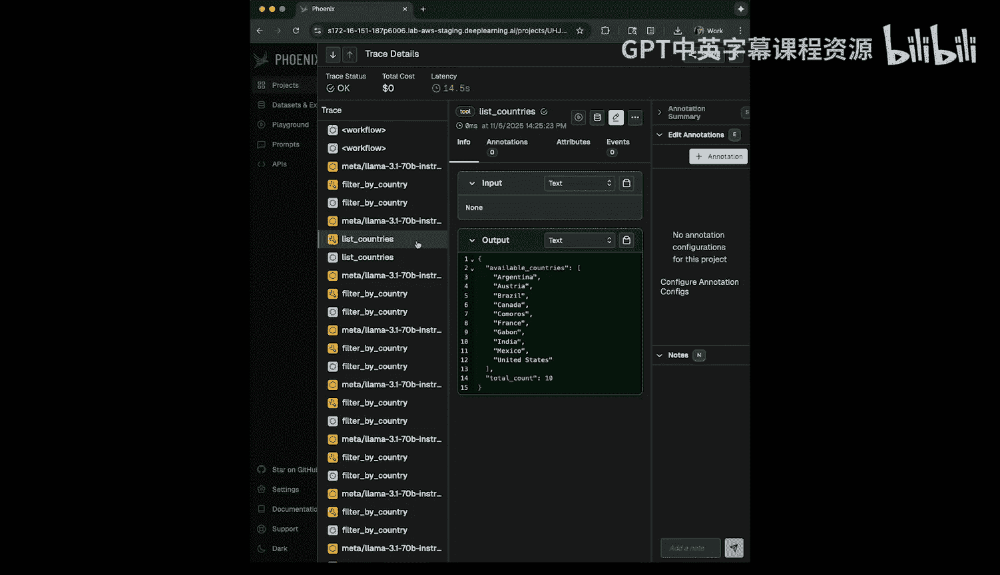
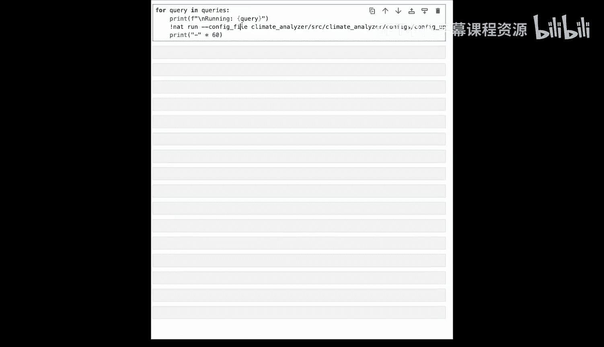
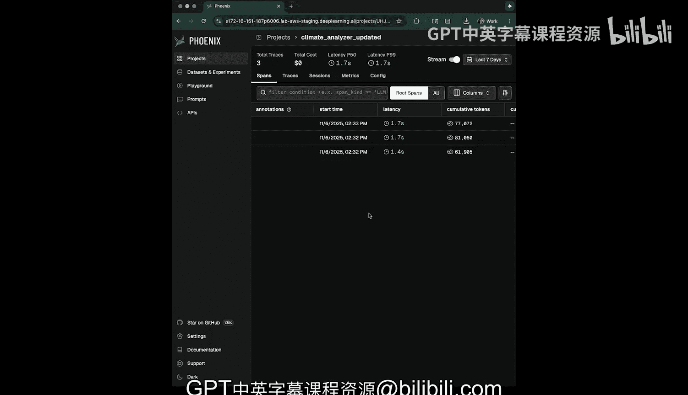

# 005：使用 Phoenix 实现可观测性与追踪 🔍




在本节课中，我们将学习如何为你的智能体添加追踪和监控功能，以便实时发现性能问题，并自信地优化工作流程。通过配置几行代码，你将能够洞察智能体内部的工作状态。

## 什么是可观测性？ 🤔

上一节我们介绍了课程目标，本节中我们来看看可观测性的核心概念。

可观测性意味着通过检查AI工作流程的输出来理解其内部发生的情况。在简单的函数级别做到这一点并不难。NVIDIA NeMo 智能体工具包（NAT）的强大之处在于，它能在你所有的函数中实现可观测性，无论这些函数是复杂的、自身也集成了可观测性功能的子智能体，还是简单的Python函数。NAT会收集所有这些数据，并将其发送到你正在使用的任何可观测性服务器。

配置可观测性就像修改配置文件一样简单。

以下是配置可观测性的核心步骤：

1.  **配置顶层通用部分**：在配置文件的顶部，我们有一个通用部分。
2.  **指定遥测类型**：我们告诉NAT我们将配置遥测，特别是追踪遥测。
3.  **设置目标**：我们指定一个名为“Phoenix”的目标，其类型也是“Phoenix”。
4.  **提供服务器端点**：我们给出Phoenix服务器的端点地址。
5.  **（可选）设置项目名称**：提供一个项目名称，以便Phoenix对数据进行分类管理。



对应的配置代码结构如下：
```yaml
general:
  telemetry:
    tracing:
      targets:
        phoenix:
          type: phoenix
          endpoint: "http://your-phoenix-server:port"
          project_name: "your_project_name"
```



## 设置 Phoenix 服务器 🚀

现在，我们来设置一个Phoenix服务器，并观察可观测性数据如何流入。Phoenix是由Arize开发的一个便捷的UI和可观测性服务器。

通常，你只需在终端运行Phoenix服务器即可启动它。但在本笔记本环境中，我们需要运行一些特定的命令来启动它。

启动后，Phoenix将在后台运行，准备接收来自NAT的遥测数据。

在运行NAT并发送数据之前，我们先查看一下Phoenix UI。以下是一些JavaScript代码，用于显示在你自己的系统上运行的Phoenix位置。运行后，它会提供一个“打开Phoenix UI”的按钮。

这是Phoenix UI的界面。我们不会深入探讨其所有功能，但可以看到它显示“尚未上传任何追踪数据”。当我们的NAT工作流程开始发送追踪数据时，它会附带一个项目名称，该名称将与此处的追踪数据一起显示。点击项目，我们将能看到所有已流入的追踪数据。



## 运行智能体并观察追踪数据 📊



让我们安装我们一直在使用的气候分析智能体。安装完成后，我们来看看如何将来自Nemo智能体工具包的开源遥测数据流导入Phoenix。

在我们的配置文件中，我们已经配置了LLM、工作流程和工具，现在可以添加另一个名为“General”的部分。这是我们可以放置NAT特定配置数据的地方，例如遥测配置。遥测有多种类型，如日志记录或追踪。我们将进行追踪配置。

因此，我们在这里会有一个追踪头部配置。然后我们可以定义多个不同的追踪目标。你可能拥有多个Phoenix服务器或一个Prometheus服务器。在我们的案例中，我们有一个Phoenix服务器，我们将其命名为“Phoenix”，类型也是“Phoenix”。我们将为此Phoenix配置提供一个指向我们之前启动的Phoenix服务器的端点，并给它一个项目名称“ClimAnalyzer_Baseline”。

这就是我们需要做的全部工作，以便让NeMo智能体工具包工作流程开始将其数据流入Phoenix。

为了看到追踪数据，我们需要实际运行我们的智能体。因此，让我们设置一些查询。这里有三个查询：加拿大的变暖速率、第二冷的年份，以及哪个国家在我们的数据中拥有最多的气象站。让我们运行这些查询。

在运行查询的同时，我将切换到Phoenix界面。



现在我们可以看到这个名为“ClimAnalyzer_Baseline”的项目，这就是我们在配置中命名的。我们总共有三个追踪，这对应于我们运行的三个查询。

如果我们点击进入，可以看到追踪工作流程。我们有三个思维链。在顶层，我们可以看到一些关于这些追踪的信息，例如追踪类型、工作流程名称（如果我们愿意，可以在配置中更改）、输出、任何注释、开始时间、消耗的令牌数量以及延迟时间。很明显，其中一个查询花费的时间比其他两个长得多。让我们深入查看一下。

在这里，我们可以看到智能体在处理其思维链时的思考过程。它进行了LLM调用、工具调用、更多的LLM调用、更多的工具调用。实际上，它进行了大量的LLM调用和工具调用。在我看来，它似乎在反复尝试却进展缓慢。



分析这些调用后，我们得出结论：智能体正在寻找气象站数据，而我们没有专门用于获取气象站数据的工具。因此，它一直在尝试从其他工具中收集各种信息来寻找气象站。

## 优化工作流程：添加新工具 ⚙️



上一节我们通过追踪发现了性能瓶颈，本节中我们来看看如何通过添加新工具来优化。

让我们看看我们的修复方案。这将在一个新的配置文件中，我们会将旧的配置文件复制到其中。在这个新文件中，我们将添加一个名为“station_statistics”的新函数。

我们将把“station_statistics”注册为智能体工作流程中的一个新工具。可以想象其他所有配置都保持不变。我还要注意我们更改的另一处是项目名称。因此，当我们再次运行这些查询后查看Phoenix时，会看到一个新项目，这有助于将数据分开，以便我们可以看到旧的调用和新的调用。但这将保存在一个新的配置文件中。



让我们在更新后的配置文件中再次运行这些查询。

随着查询的运行，我们可以更新Phoenix界面。我们可以看到数据正在流入。好的，让我们进入更新后的项目。我们可以看到传入的三个查询，但现在让我们看看它们的时间。我们可以看到它们现在都有相似的延迟时间，这表明我们的智能体能够使用新的气象站工具来大幅减少此调用的延迟。

如果没有可观测性，我们的智能体虽然会返回正确答案，但效率低下。现在，借助可观测性，我们可以减少令牌使用量、LLM调用次数以及系统的延迟时间。

## 总结 📝



在本节课中，我们一起学习了可观测性的重要性。即使我们可能得到了正确答案，但获取方式可能效率低下。我们看到了如何使用Nemo智能体工具包来检测我们的智能体工作流程，将可观测性数据流入像Phoenix这样的工具，检查工作流程，然后修复低效问题。通过实践，我们成功优化了工具使用，并比较了配置更改前后工作流程的性能。