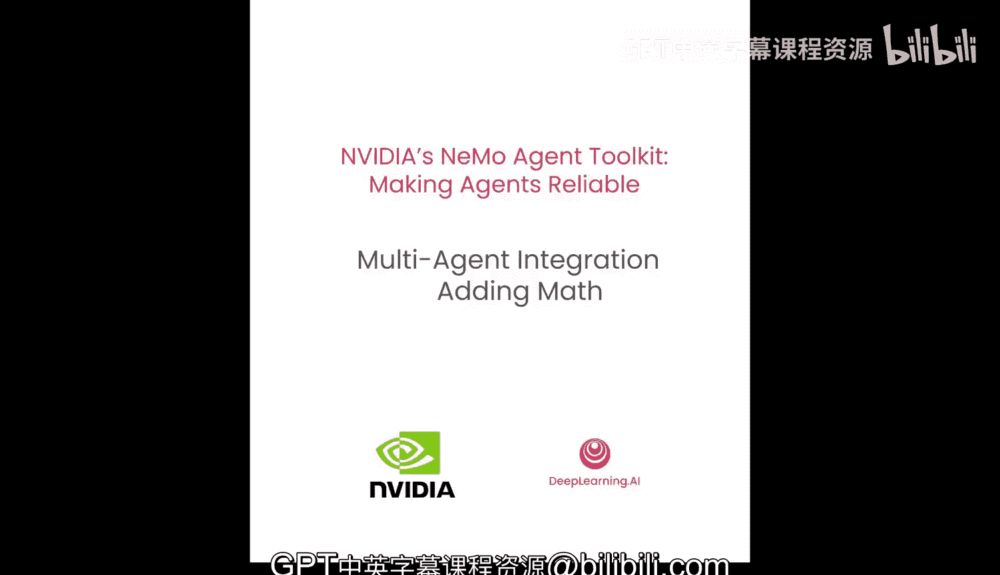
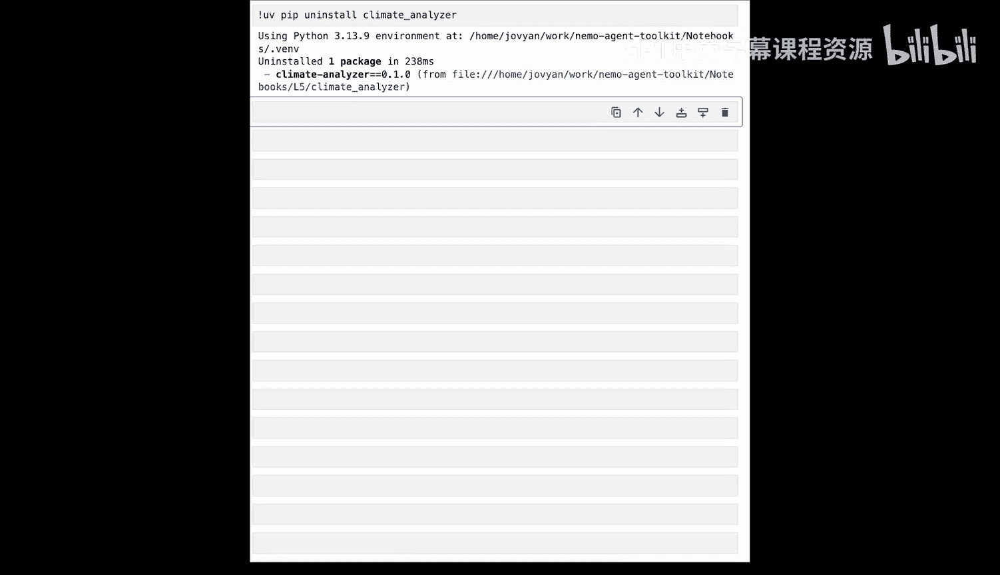

# 006：多智能体集成 - 添加数学能力

在本节课中，我们将学习如何将预先构建的智能体（无论使用何种框架）集成到NVIDIA NeMo智能体工具包中。我们将把多个智能体组合在一起，并观察NAAT如何协调不同框架，使它们像一个协调的团队一样无缝协作。

## 智能体集成的必要性

上一节我们介绍了如何构建和使用基础工具。本节中我们来看看，当工具本身的能力不足时，如何通过集成更强大的智能体来扩展工作流。

有时，仅靠工具是不够的。例如，我们当前的气候分析智能体可以检索温度数据、计算基本统计数据并创建可视化图表。但对于更复杂的数学运算，如复合增长率、多步骤计算或复杂预测，它则无法胜任。然而，我们恰好有一个现有的LangGraph计算器智能体，它可以处理复杂的计算。

## 集成现有智能体

我们将把一个现有的、功能强大的LangGraph智能体，作为NAT工具暴露给我们现有的智能体。这将展示如何通过智能体组合来扩展工作流能力。

我们还将看到如何将LLM等提供商的硬编码配置从智能体中提取出来，放入配置文件，这使得后续的实验和迭代更加容易。

我们会看到NAT如何协调多个智能体框架一起工作。这意味着，通过组合现有智能体，我们将能够构建更强大的工作流。

## 当前智能体的局限性

以下是我们的气候分析智能体目前无法处理的一些问题示例：

*   **计算复合年增长率**：如果我们需要观察温度数据并计算其复合年增长率，智能体将无法完成，因为它是一个气候智能体，而非数学智能体。
*   **计算加权平均人口**：这同样是一个数学问题，我们的气候智能体会在此处遇到困难。
*   **预测可再生容量增长**：询问关于可再生容量预计增长，何时能达到特定吉瓦数的问题，我们的智能体也无法处理。

它是一个优秀的气候智能体，但不知道如何进行数学运算。

## 引入计算器智能体

我们这里有一个完全独立的智能体，它与NeMo智能体工具包无关。这是一个LangGraph智能体，也是一个计算器。它已经构建完成，经过测试，可以随时使用，并且懂得如何进行数学运算。

让我们来看一下这个计算器智能体的结构。这是一个多步骤计算器智能体，使用LangGraph编写，并拥有多个可用的数学工具。

以下是该智能体可用的工具示例：

*   **基础数学运算**
*   **计算百分比变化**
*   **计算复合增长率**

让我们设置一个复杂的问题让这个数学智能体来计算。我们将在提示词中输入一个国家的排放数据及其减少情况，然后要求它对这些排放数据进行一些计算。

智能体运行该提示词后，给出了最终结果。我们可以看到它在计算各年份排放量时的推理过程，最终它给出了2025年的计算排放量。这表明它能够执行多种数学函数。

## 集成到NAT工作流

现在切换回我们的气候智能体。我们向气候智能体提出一个关于印度温度统计的问题。虽然它能够获取气候信息，但无法进行数学计算。让我们运行这个工作流，观察其失败过程。

我们可以看到智能体尝试解决这个问题。它开始计算印度的统计数据，但我们看到它多次调用同一个函数，试图计算包括我们数据集中不存在的年份在内的统计数据。它挣扎了一段时间，最终为了给出我们想要的答案而产生了幻觉。

问题在于：它正确地检索了温度数据，也知道所需的值，但它无法进行数学计算，因此很可能会产生幻觉答案。

我们需要做的是集成我们之前看到的计算器智能体。那么，如何将这个LangGraph智能体集成到我们的NeMo智能体工具包工作流中呢？

我们已经见过如何集成一个简单的Python函数。这没有什么不同，它只是另一个函数。我们已经见过如何获取一个Python函数并将其包装起来，使其作为一个工具暴露的样板代码。

只需要进行几处修改：

1.  **指定框架包装器**：当我们用`@register_function`装饰器装饰函数时，现在可以声明`framework_wrapper`为`LlmChain`，因为我们的智能体是LangGraph智能体，因此属于LlmChain智能体。这使得NeMo智能体工具包能够更好地将可观测性和评估工具集成到这个被包装的智能体中。
2.  **使用构建器获取LLM**：我们之前见过被注入包装函数的构建器，但当时没有使用它。现在我们可以使用它。我们可以向构建器请求一个LLM。我们在这里请求一个名为`calculator_llm`的特定LLM，并告诉构建器需要用适用于LlmChain智能体的适配器来包装这个LLM。然后，我们就可以用那个LLM来创建我们的计算器智能体。
3.  **返回函数信息**：包装函数内部调用智能体本身并返回结果。最后，我们生成一个`FunctionInfo`对象，它告诉我们的NeMo智能体工具包工作流如何与这个智能体通信。

## 更新配置文件

现在我们已经准备好了一个供NeMo智能体工具包使用的计算器智能体，让我们看看配置文件会是什么样子。

我们已经在LLM部分看到了`climate_llm`。虽然我们可以为计算器智能体重用它，但让我们为它指定一个专用的LLM。

我们将这个LLM称为`calculator_llm`。这就是之前我们向构建器请求`calculator_llm`时，它找到该配置的方式。它也将是Anthropic的模型。我们将使用与之前类似的参数，但将`max_tokens`改为1024，因为进行数学计算应该输出更少的令牌。

我们的气候工具保持不变，但我们将把计算器智能体简单地注册为一个函数。现在，整个计算器智能体作为一个简单的工具被暴露出来，我们可以将这个工具插入到我们的ReAct智能体工作流中。现在，一个ReAct智能体将可以调用所有的气候函数和计算器智能体。

## 运行集成后的工作流

让我们用新的配置文件运行之前相同的问题，看看它是否能够使用数学智能体。

我们可以看到它从印度获取气候信息。现在，当它开始计算温度统计数据时，我们看到它决定调用我们的计算器智能体。计算器智能体运行，我们可以看到它的输出。最终，它得出了一个非幻觉的答案：印度2050年的温度将约为25.24度。

## 总结

本节课中我们一起学习了以下内容：

1.  **扩展智能体能力**：我们通过引入另一个现有智能体，为气候智能体添加了数学计算能力。
2.  **统一集成视角**：对于NeMo智能体工具包而言，被集成的智能体只是另一个Python函数。
3.  **深度配置集成**：我们看到可以将NAT深度集成到现有的智能体工作流中，使其基于配置的开发模式能够贯穿我们所有的智能体。

现在，我们的气候智能体可以处理复杂的数学运算了。这就是统一编排的力量。无论你拥有的是LangGraph智能体、CrewAI智能体，还是某些自定义的FastAPI服务，你都可以包装所有这些组件，并通过NATT的统一编排层来协调它们。