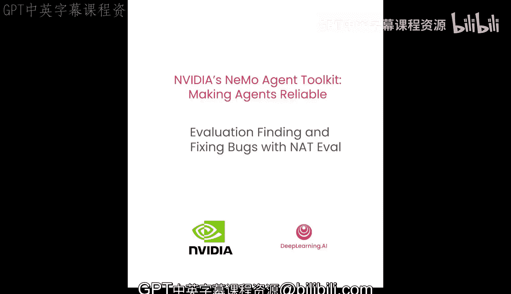
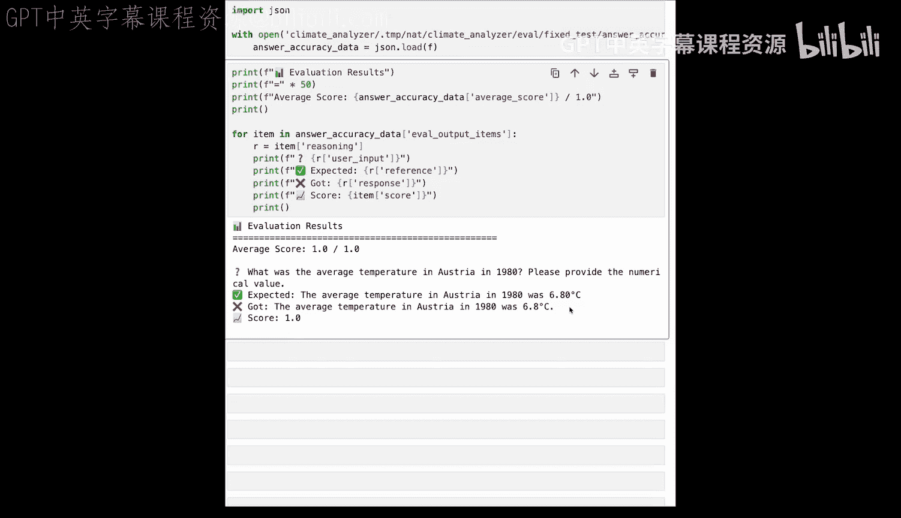

# 007：使用NAT评估框架发现并修复错误

在本节课中，我们将学习如何使用NVIDIA NeMo Agent Toolkit（NAT）的评估框架来衡量智能体和工作流的性能。我们将创建包含标准答案的数据集，发现潜在的错误，并利用评估结果来指导我们进行数据驱动的改进。

## 为什么需要评估智能体？🤔

评估对于智能体至关重要。在复杂的智能体环境中，评估环节常常被忽视。NAT使得针对您的工作流运行评估变得简单直接。

上一节我们介绍了智能体的基本构建，本节中我们来看看如何系统地评估其表现。

## NAT评估流程概述 📊

NAT的评估流程是怎样的？您需要提供一个包含输入列表和预期输出列表的数据集。NAT将针对您的智能体系统运行这些评估，并统计正确和错误的数量。当然，您可能拥有无法用简单输入输出对来表达的自定义评估框架。NAT的评估系统是可插拔的，您可以围绕自己的评估框架创建一个包装器。

## 在配置文件中设置评估 ⚙️

这在配置文件中如何体现？我们的配置文件新增了一个名为`eval`的顶级属性。这个`eval`属性下可以配置几个其他属性。

以下是配置评估的关键部分：
*   `general`属性：用于指定评估结果的输出位置以及数据集的加载路径。
*   评估器配置：您可以配置一个或多个评估器。

在我们的示例中，我们配置了一个名为`answer_accuracy`的评估器。它是一个`Ragas`评估器（这是一个您可能熟悉的评估框架，已内置在NAT中）。Ragas提供了多种不同的评估指标可供选择，本例中我们选择了`answer_accuracy`。您可以在我们的文档中查看其他指标。

## 配置驱动开发的优势 🚀

这就是配置驱动开发的力量所在。我们无需修改代码、重写大量Python程序并担心破坏原有功能，而是可以在配置中进行实验。我们可以更改函数、替换所有LLM。如果我们正确设置了评估，就可以在运行评估的同时进行这些更改，并确信我们的修改是正确的。

当然，您可以在配置中添加多个评估项，数量不限。您还可以将它们与我们已介绍过的其他功能（如可观测性）结合使用。您可以在连接到Phoenix的同时并行运行评估，并观察评估运行时追踪数据的流入。

没有可观测性，我们不知道智能体是如何得出正确答案的；没有评估，我们不知道智能体是否得出了正确答案。借助NAT的评估框架，我们可以对多个评估问题-答案对进行评分，并确信我们的智能体已准备就绪。

## 实践：运行评估并发现错误 🐛

在这个实践环节，我们将具体看看如何进行评估，以及如何使用NeMo智能体工具包发现和修复错误。

首先，我们安装一直在使用的`climate_analyzer`包，并针对它运行一些评估。

现在，让我们看看我们的评估数据集。这里有一个非常小的评估数据集，包含一个问题和一个答案：
*   **问题**：1980年奥地利的平均温度是多少？
*   **答案**：1980年奥地利的平均温度是6.8摄氏度。

让我们从气候数据中查找奥地利1980年的数据。我们得到了一些数值。计算平均值以确认我们的标准答案，从气候数据中我们看到奥地利1980年的平均温度确实是6.8摄氏度。

## 如何在NAT中运行评估？▶️

让我们查看一个预先写好的评估配置文件。这个文件对您来说应该很熟悉。它包含了我们在之前章节中编写的LLM（气候LLM和计算器LLM）、我们一直在使用的函数（气候函数和计算器函数）以及我们的工作流。

但现在我们添加了一个评估配置部分。`eval`是一个顶级部分，在`eval`内部，我们可以添加多个评估集。

以下是配置的核心内容：
1.  首先，我们添加一个`general`属性，用于指定评估数据的存储位置、运行后是否清理数据以及数据集的来源。
2.  然后，我们可以列出我们的评估器。您可以运行多种不同类型的评估器，可能是您自己编写的，也可能是使用标准评估器（如Ragas）。这里我们将使用Ragas。
3.  我们将这个评估器命名为`answer_accuracy`，类型为`ragas`（已内置在NeMo智能体工具包中）。Ragas需要一个评估指标，它提供了多个不同的指标，如`groundedness`。在我们的案例中，我们将选择一个名为`answer_accuracy`的指标。您可以在我们的文档中找到这些指标。
4.  评估器如何评估这个指标？它需要一个LLM，因此我们将传入预配置好的`climate_llm`来进行准确性检查。

## 执行评估命令 📈

我们之前见过`nat run`命令，现在我们将看到一个新的命令：`nat eval`。这个命令接收我们之前查看的配置文件，并针对其中定义的工作流运行评估。

评估器会将文件输出到我们在配置中指定的位置。我们看到这里生成了一个`answer_accuracy_output.json`文件。让我们看看里面有什么。

我们可以看到评估结果：平均得分是0/1，这意味着我们的评估结果非常差。

**问题**：1980年奥地利的平均温度是多少？这是我们期望得到6.8摄氏度的问题，但我们却得到了9.574摄氏度。因此，我们答错了唯一的评估问题，正确率为0/1。

## 分析错误原因 🔍

现在，让我们看看它是如何得出这个错误答案的推理步骤。评估器会输出相当庞大和详细的JSON文件，以帮助您追踪评估中哪里出了问题。

我们可以看到评估的推理步骤。它试图获取1980年的平均温度，但它甚至没有将年份传递给我们的`calculate_statistics`函数。正因为如此，它得到了整个气候时期（1950年至2025年）的平均值。然而，它却给出了一个非常自信的答案。

如果我们没有运行评估，我们很可能会错过这个错误。这个答案并非明显错误，而且智能体对其答案充满信心。但由于我们现在可以使用NAT对智能体运行基于事实的评估，我们可以看到它是不正确的。

## 修复错误并验证 ✅

现在，让我们使用一个更直接地指示智能体以正确年份进行调用的配置来运行评估。

运行完成后，让我们加载这些评估结果，看看它们是否正确。

现在，从我们拥有的一个问答对的评估结果中，我们可以看到：一个问题中我们得到了一个正确答案。我们正确地得出了6.8摄氏度。

## 总结 📝

本节课中我们一起学习了如何构建评估数据集，以及如何使用NeMo智能体工具包针对我们的智能体工作流运行评估。我们研究了一个实际案例，其中智能体自信地给出了错误答案，而我们通过运行评估发现了这个问题。随后，我们修复了那个错误，并将我们的智能体重新部署到生产环境中。通过系统的评估，我们可以确保智能体的可靠性和准确性。