# 008：使用NAT UI进行生产部署 🚀

在本节课中，我们将学习如何将构建好的智能体工作流部署到生产环境。我们将通过一个专业的Web界面来部署我们的气候分析器工作流，学习如何将NAT工作流作为HTTP和WebSocket API提供服务，并连接Nemo Agent Toolkit UI，在一个生产就绪的设置中与智能体进行交互。

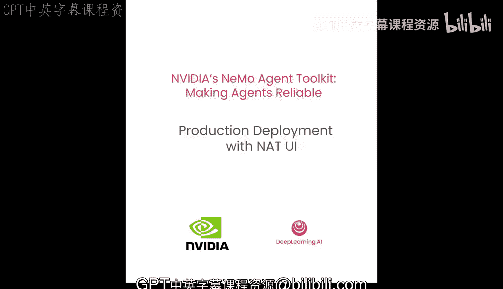


---

## 概述

上一节我们完成了智能体的构建与组合。本节中，我们将把工作流部署为API，并为其添加一个用户界面，使其能够以自然语言进行交互，从而投入实际使用。

## 启动API服务器

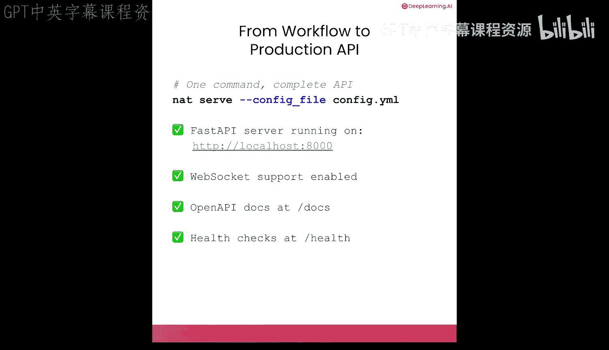

我们已经见过这个命令：`nat serve`。该命令会启动一个FastAPI服务器，并支持WebSocket、OpenAPI文档和健康检查。

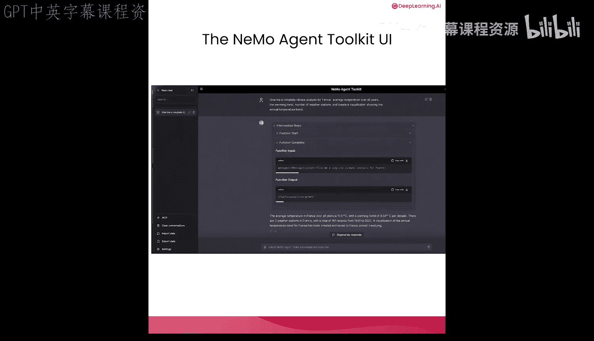

```bash
nat serve
```

API服务器非常有用。现在，我们可以在其之上运行一个UI，并使用自然语言与其聊天。

## 部署工作流与UI

我们构建了一个强大的智能体，接入了可观测性，并对其进行了评估。现在，让我们为其添加一个UI，以便在现实世界中使用它。

在本节中，我们将把智能体作为API服务，连接我们在第一课中看到的UI，并了解智能体的“API优先”架构是什么样子。

首先，确保我们的气候分析器已准备就绪。

在之前的课程中我们看到，通常部署智能体工作流API只需运行`nat serve`。但由于我们将在Jupyter Notebook后台运行它，因此需要一些额外的代码将其作为子进程运行。不必过于纠结这些细节，只需关注我们正在针对配置文件运行`nat serve`这一事实。API服务器正在运行。

接下来，我们将拉取Nemo Agent Toolkit UI。UI是一个独立开源的代码仓库，这是为了解耦依赖，方便你使用自己的UI。我们现在将其拉取到本地系统并运行。

仓库拉取并准备就绪后，安装依赖并启动它。

在命令行中，你可以运行`npm run dev`，因为这是一个标准的npm项目。当然，在Jupyter Notebook中我们需要将其作为子进程运行。

UI已启动并在本地3000端口运行。根据你的Jupyter Notebook托管环境，实际URL可能不同。以下是一个辅助脚本，用于获取正确的UI访问地址。

现在，打开这个UI并查看。

## 与智能体交互

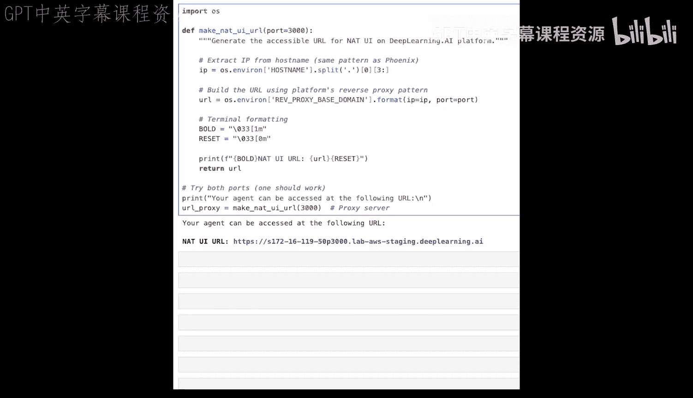

现在，我们可以与气候智能体聊天了。

让我们从一个建议的问题开始：“1990年至2000年，墨西哥的平均温度与全球相比如何？”

你可能记得在第一课中我们看过这个UI，当时它只能输出LLM训练数据中的内容。但现在，我们的气候智能体拥有可以从真实世界数据源获取数据的工具，并且可以使用计算器对该数据进行计算。让我们看看它如何处理这个问题。

对于我们的问题，可以看到智能体成功运行，并给出了正确答案。我们还可以查看中间步骤。例如，我们可以看到智能体的思维链，它调用了各种计算统计数据的工具，以及传递给这些函数的数据和从函数返回的数据。

这是一种在实时聊天环境中评估智能体的方式。

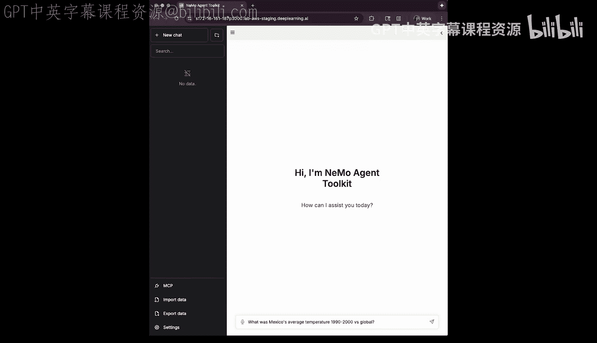

我们可以接着问一个后续问题：“2000年墨西哥的具体平均温度是多少？”，这样我们就能在更贴近人类对话的场景下探讨数据。

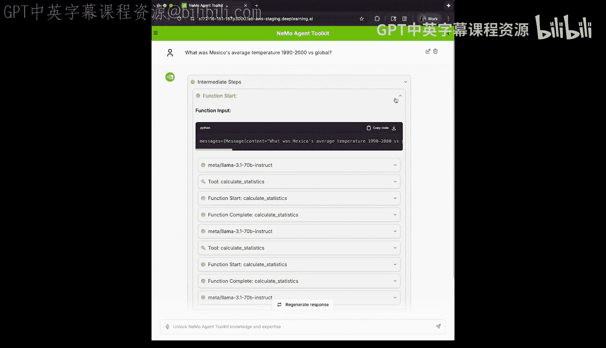

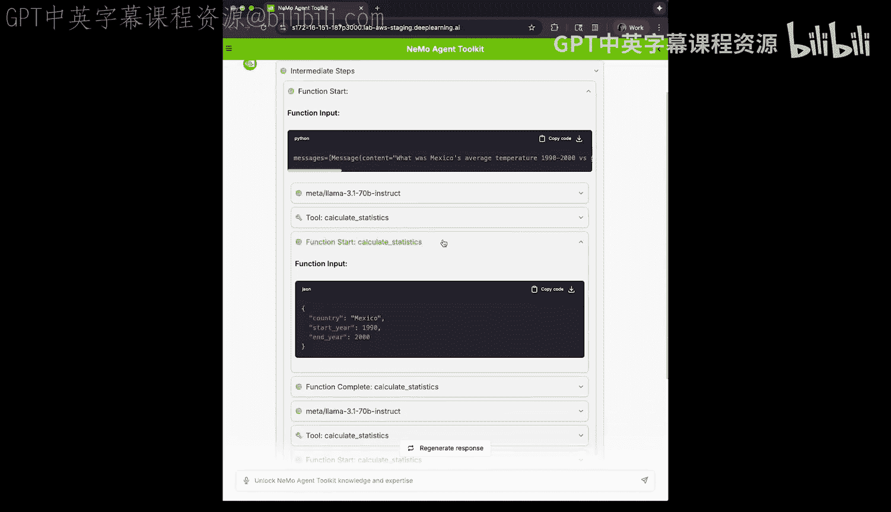

让我们再问一个更复杂的问题：“为法国提供完整的气候分析，包括趋势和可视化。”

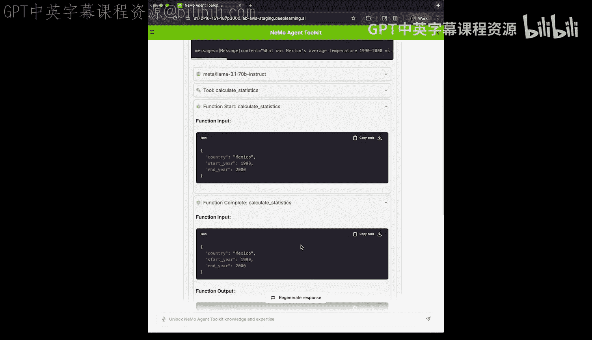

可以看到，它为法国完成了这项复杂的气候分析，并生成了一个可视化图表，将其存入了仓库。

## UI功能与架构

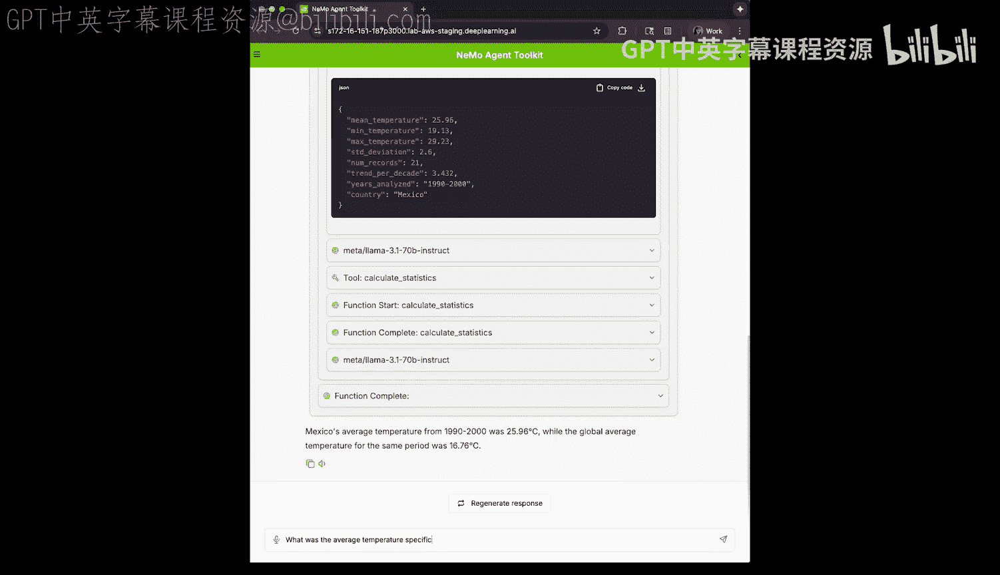

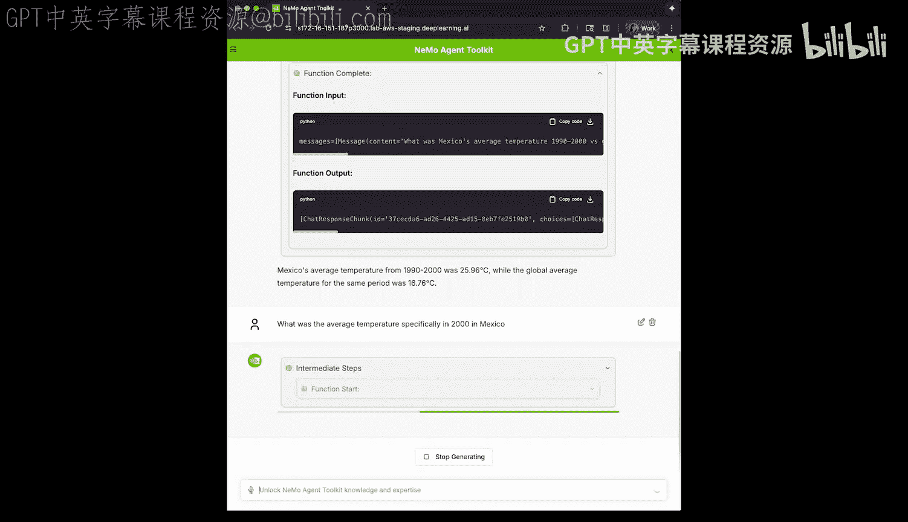

UI功能复杂，具有许多附加特性。例如，我们可以实时流式传输结果，观察智能体的思考过程，而不是一次性获取所有结果。你可以通过HTTP流、WebSocket或标准HTTP与UI通信。

这个UI只是一个示例。任何前端现在都可以连接到你的API。

## 清理与总结

在查看了UI并让其与我们的智能体交互后，让我们清理所有进程，为后续工作做好准备。

至此，我们完成了部署。

## 总结

本节课中，我们一起学习了如何将智能体工作流部署到生产环境。

我们构建了一个气候分析器。它连接到真实世界的数据源，组合了多个智能体（一个用LangChain编写，另一个用纯Python函数编写）。我们使用生产级API为其提供服务，对其运行了评估，接入了可观测性工具，并在该API前放置了一个UI，证明了我们可以与智能体进行对话。

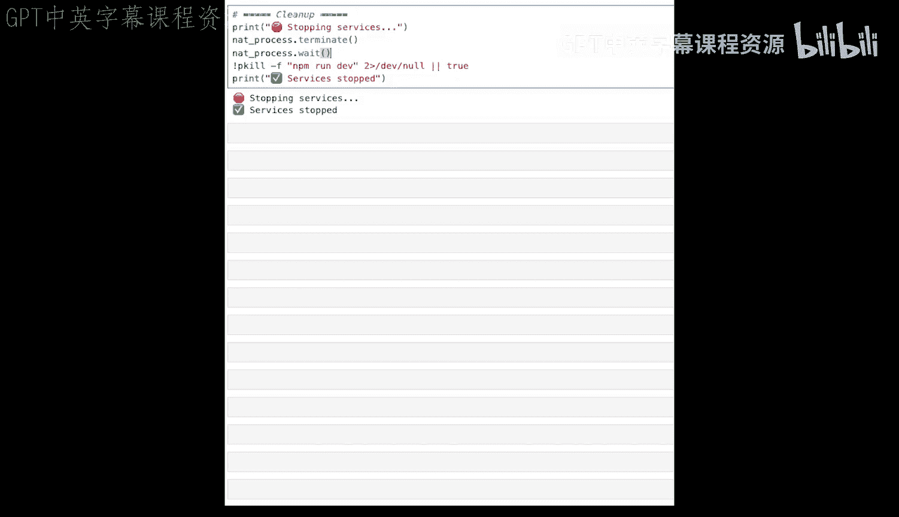

通过本节，你已经掌握了使用NVIDIA NeMo Agent Toolkit部署和交互智能体的完整流程。