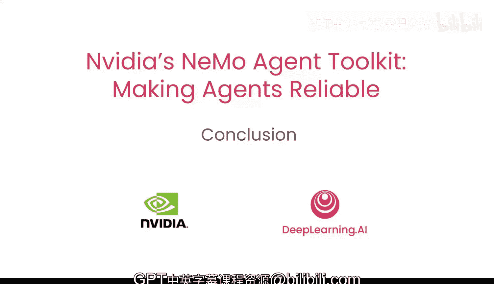

# 009：9.课程总结

在本课程中，我们学习了如何使用 NVIDIA NeMo 智能体工具包来创建、观察、评估和部署智能体工作流。现在，让我们回顾一下所学的核心内容。

## 课程内容回顾

上一节我们介绍了工作流的部署与界面优化，本节中我们将对整个课程进行总结。

以下是我们在本课程中掌握的关键技能：

*   **将 Python 函数转化为可复用工具**：我们学会了如何将自定义的 Python 功能封装成智能体可以调用的标准化工具。
*   **构建具备推理能力的智能体**：我们创建了能够分析任务、并自主决定使用哪些工具的智能体。
*   **分析与处理现实世界数据**：智能体被应用于分析和处理实际场景中的数据。
*   **实现智能体行为的可视化**：通过追踪和评估功能，我们能够观察和分析智能体的决策过程与行为。
*   **编排多智能体协作**：我们设计了由多个智能体协同工作以完成复杂任务的工作流。
*   **评估智能体性能**：我们建立了评估体系，以量化衡量智能体的表现。
*   **部署生产级应用**：最终，我们将工作流部署为可通过 API 访问、并具备友好界面的生产就绪型应用程序。

## 核心收获与未来方向

掌握以上技能后，你现在可以：

1.  **系统化地调试、衡量与改进智能体**：基于观察和评估结果，持续优化智能体的表现。
2.  **扩展工作流规模**：将验证过的工作流模式应用到更大、更复杂的场景中。
3.  **组合工具与智能体以解决新问题**：灵活运用所学，构建创新的解决方案来解决各类挑战。

课程虽然结束，但探索才刚刚开始。请持续实验与深入研究，期待看到你构建出的精彩应用。