# 001：课程介绍 🧠

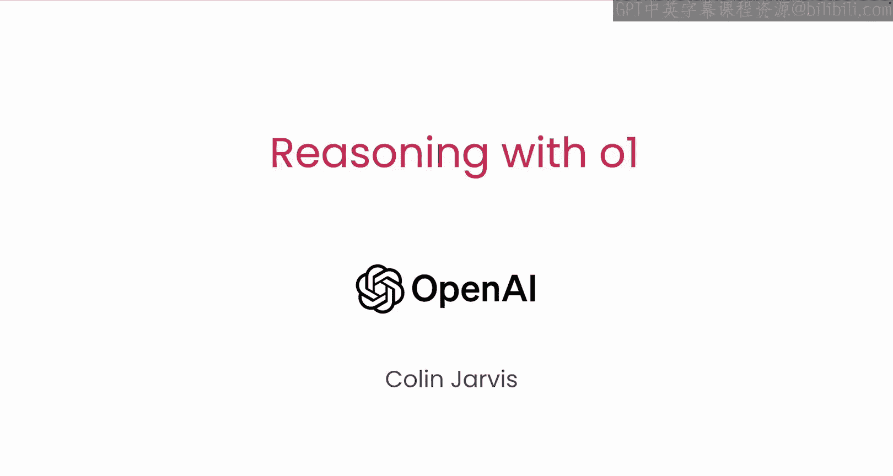

在本课程中，我们将学习如何有效地提示和使用OpenAI的o1模型。这个新发布的模型在推理和规划任务上展现了显著的进步。

## 课程概述

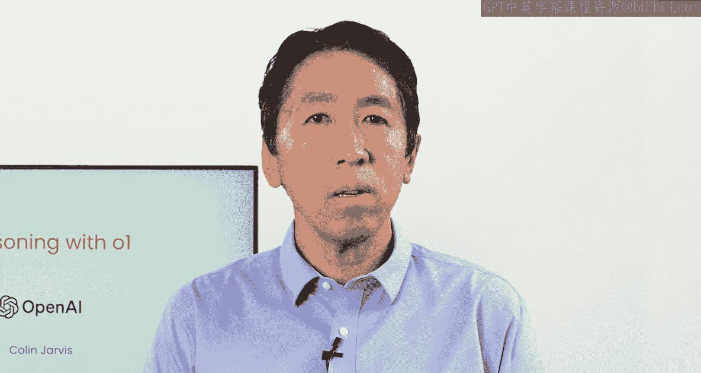

欢迎来到《使用o1进行推理》课程，本课程是与OpenAI合作开发的。您的讲师是Colin Jarvis，他是OpenAI的AI解决方案负责人。我们很高兴能与您一起探索这个强大的模型。

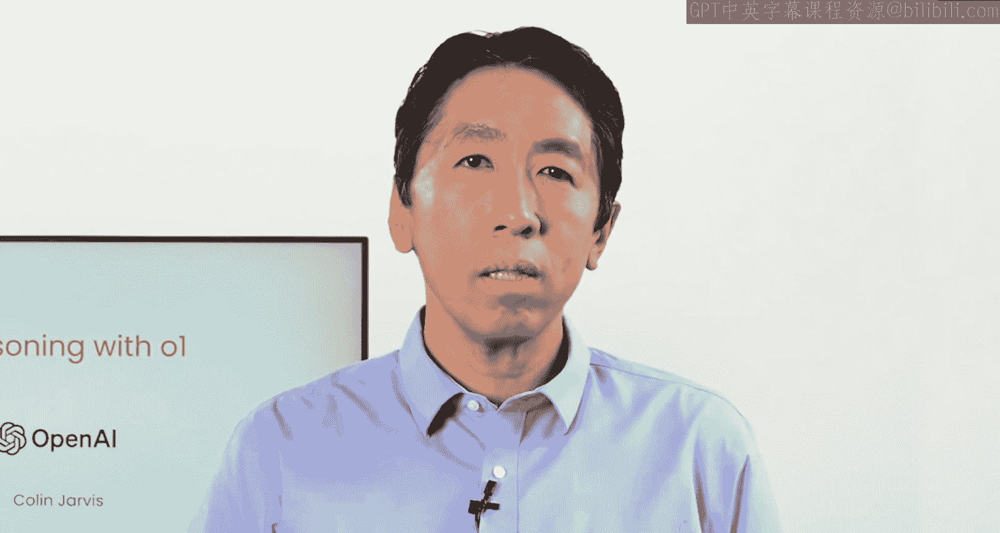

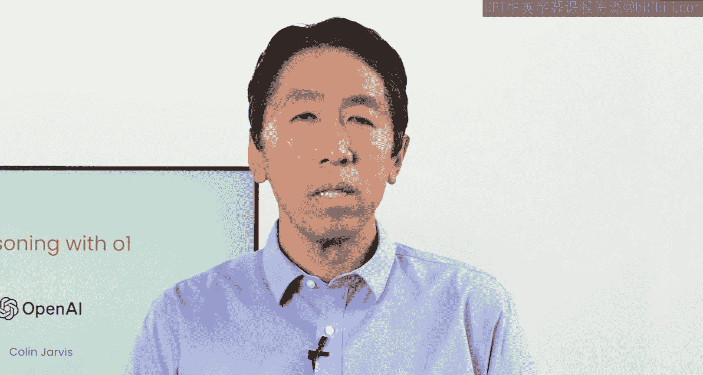

在之前的短期课程中，OpenAI的Isabella Fulford介绍了一些提示技巧，以优化GPT-3.5的性能。她描述了**思维链**技术，这是一种让模型有时间思考的方法。

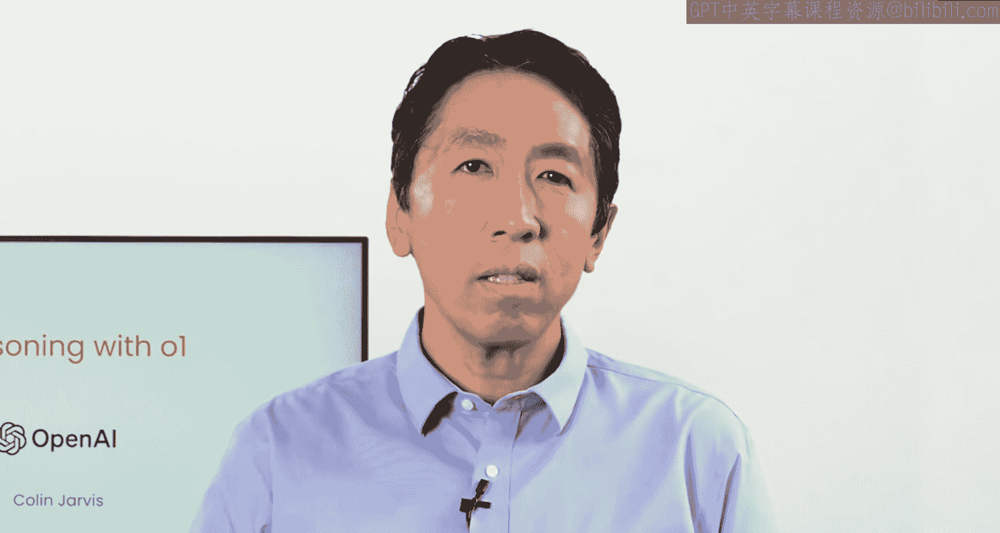

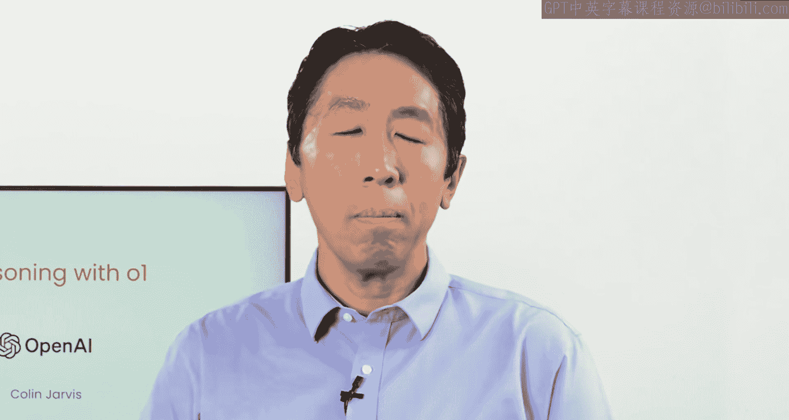

## 思维链技术详解

上一节我们提到了思维链，本节中我们来看看它的具体运作方式。

使用思维链提示时，您可能会指示模型“逐步思考”，并可能提供一些逐步推理的示例。作为回应，模型不会直接给出答案，而是会**逐步处理查询**。

以下是2022年论文《Chain-of-Thought Prompting Elicits Reasoning in Large Language Models》中的一个例子。在使用思维链提示时，您还需要为模型提供一个将问题分解为最简单步骤的响应示例。在回答查询时，模型会创建一系列简单步骤，从而成功回答问题。

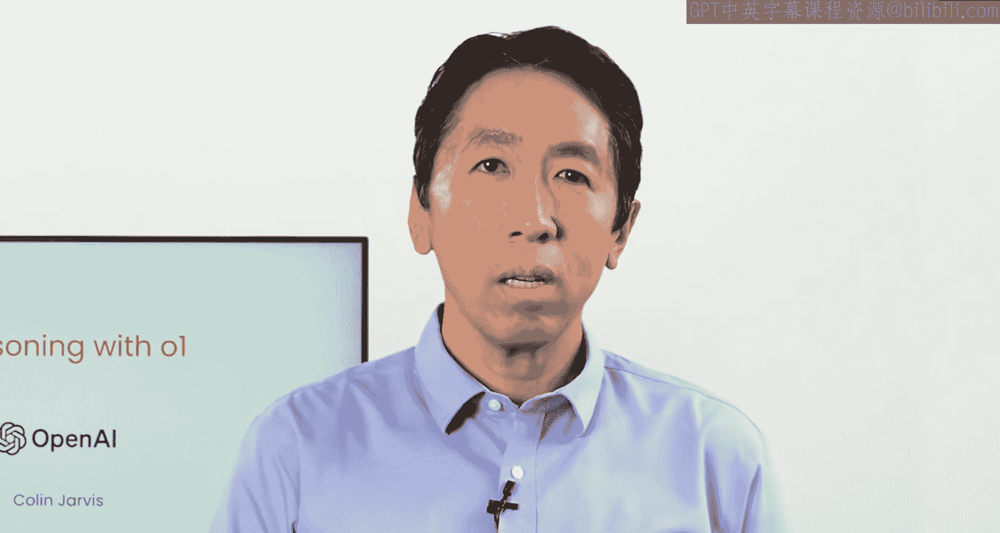

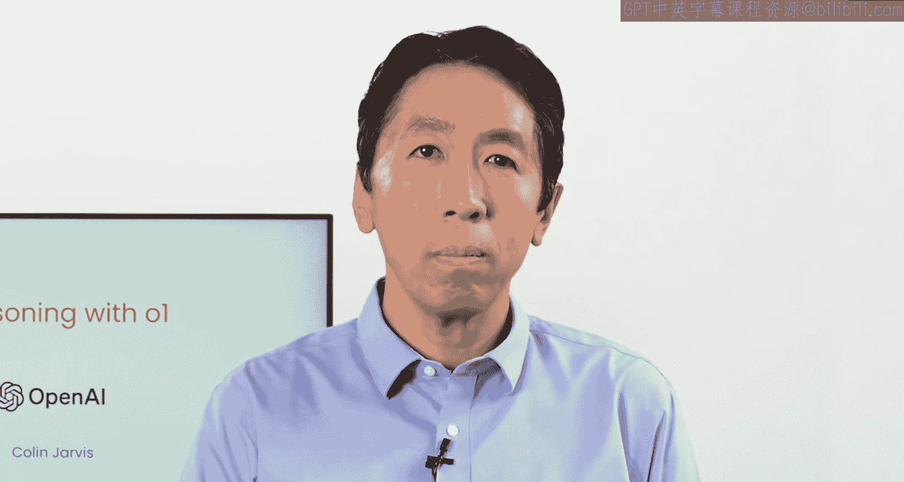

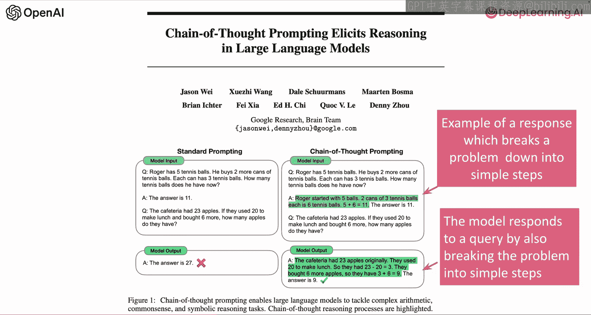

## o1模型的突破

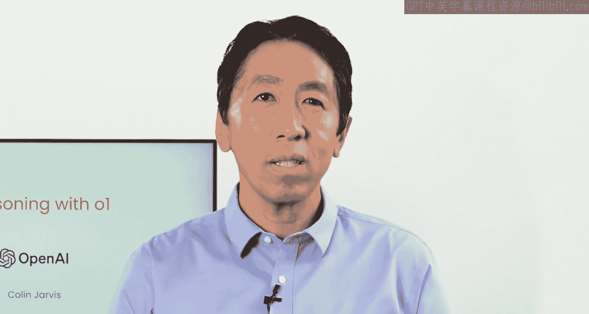

OpenAI将这一技术提升到了新的高度，通过强化学习对模型进行微调，使其能够**自主地将逐步推理的思维链整合到其响应过程**中。

虽然我们今天看到的性能令人印象深刻，但从长远来看，更重要的是**测试时间或推理时间的扩展性**。

我们发现，o1的性能会随着更多强化学习（称为训练时间计算）和更多思考时间（称为测试时间或推理时间计算）而持续提升。这为您扩展语言模型性能提供了一个全新的维度。

然而，o1模型并非适用于所有情况。在本课程中，您将学会识别哪些任务适合o1，以及何时可能需要使用更小、更快的模型，或将两者结合使用。

## 课程大纲

以下是本课程的主要内容安排：

*   **o1模型概览与适用场景**：我们将从o1模型的概述开始，了解何时使用它们，以及推理时性能扩展的工作原理。
*   **如何有效提示o1模型**：您将学习如何提示o1模型以获得最佳性能。提示o1的最佳方式与早期模型有很大不同。
*   **使用o1解决复杂多步骤任务**：您将学习如何使用o1通过规划来解决复杂的多步骤任务。例如，使用一个由o1协调器和4.0工作者组成的系统来优化供应链物流挑战。您将结合使用多种模型：o1用于规划任务序列，而更快、成本更低的模型用于任务执行。
*   **使用o1进行编程**：之后，您将使用o1进行一些编码工作。它在这方面非常出色。
*   **图像推理新功能**：接着，您将尝试一个非常酷的新功能：**图像推理**。图像理解传统上难以投入生产，但借助o1，我们在这些任务上看到了新的性能水平。
*   **使用o1生成和优化提示**：最后，我们将总结如何使用o1来生成和优化您的提示，这种技术我们称之为“元提示”。

## 总结

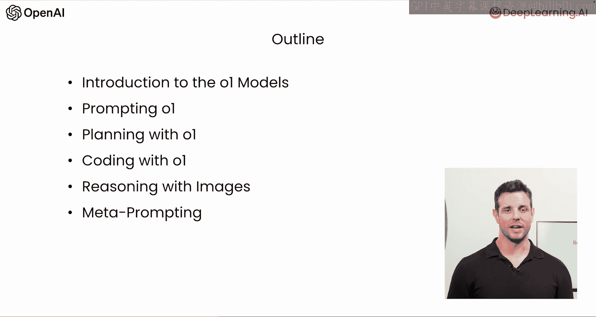

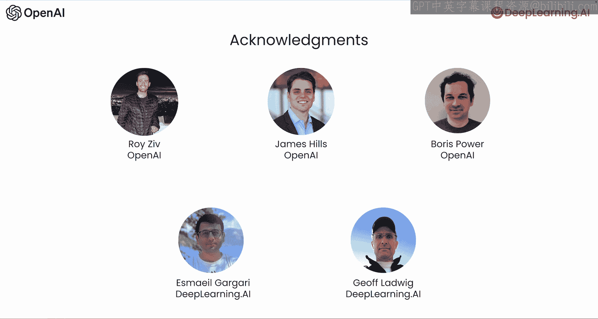

本节课中，我们一起学习了《使用o1进行推理》课程的介绍部分。我们回顾了思维链技术的基础，了解了o1模型如何通过自主整合推理步骤和利用推理时间计算来实现性能突破，并预览了课程将涵盖的核心主题，包括模型选择、提示技巧、复杂任务规划、编码和图像理解等。接下来，让我们进入下一个视频，详细了解o1是如何被训练的。