# 002：o1模型介绍 🧠

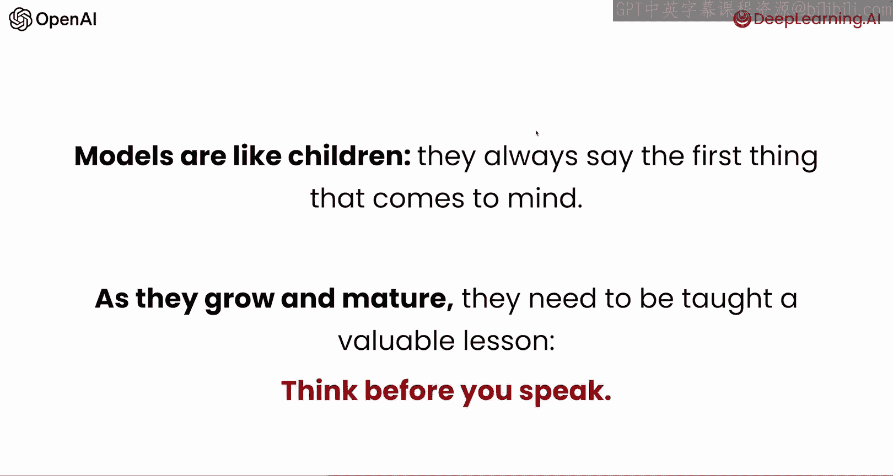

## 概述
在本节课中，我们将全面介绍OpenAI的o1系列模型。我们将了解它与以往模型的核心区别、其工作原理、以及人们如何使用它。o1模型的核心在于“先思考，再回答”，这使其在数学、编程、科学等复杂任务上达到了新的性能高度。

---

## o1模型的核心思想：先思考，再回答 🤔

在o1模型出现之前，大多数模型可以被看作是“孩子”，它们总是说出脑海中浮现的第一个想法。随着成长，它们需要学习一个宝贵的经验：**在开口之前先思考**。

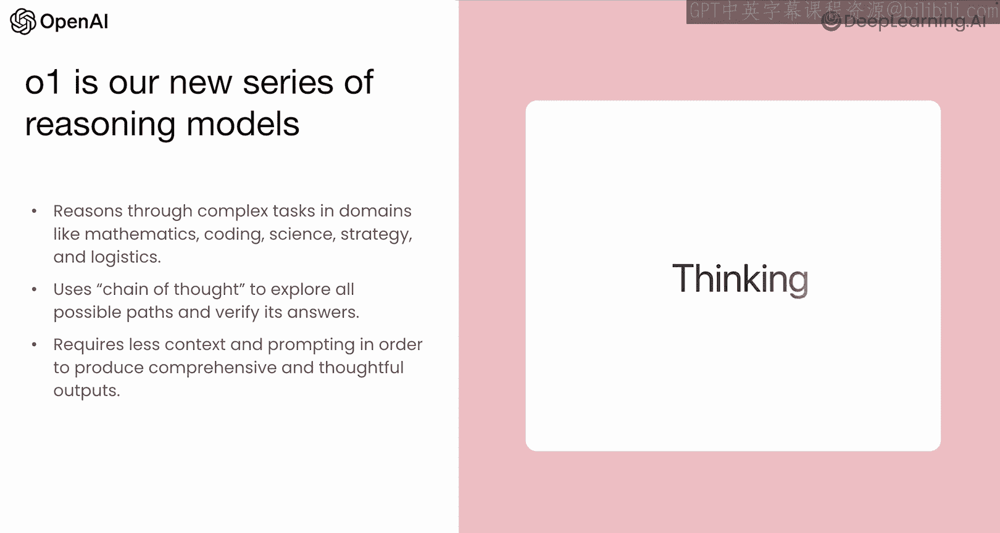

o1模型之所以如此不同，是因为它每次都会在回答前进行显式的思考。这帮助它在数学、编程、科学、策略和物流等复杂任务和领域中达到了新的性能水平。

其实现方式是使用**思维链**来探索所有可能的路径，并在生成答案时进行验证。这意味着o1模型需要更少的上下文和提示，就能产生非常有效的结果。

---

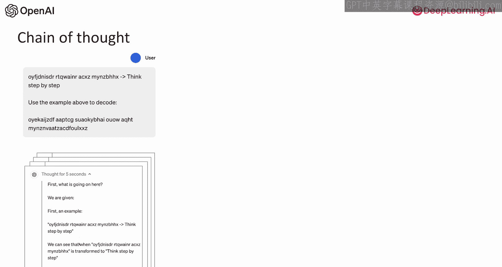

## o1系列模型简介 📦

OpenAI发布了o1系列的前两个模型。

*   **o1**：这是我们的主力推理模型，适用于需要广泛常识的复杂任务，支持函数调用和图像输入。
*   **o1-mini**：这是一个更快、更具成本效益的版本，专为编码、数学和科学任务量身定制，适用于对成本或延迟更敏感的场景。

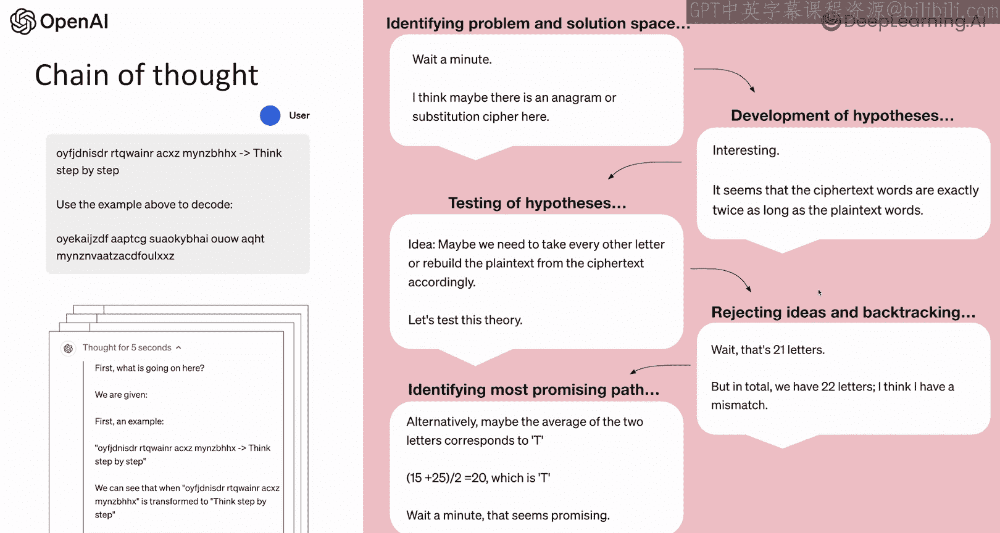

o1系列模型的关键区别在于，它们将**思维链**原生地整合到了解决问题的过程中。

---

## o1如何工作：一个示例 🔍

让我们通过一个例子来理解o1的思考过程。假设我们给模型一些打乱的字母，并展示如何翻译它们，然后给它一个新问题去解决。

它的解决过程大致如下：
1.  它思考给定的信息，并“自言自语”地分析如何解决问题。
2.  它识别示例，并理解这里发生的转换规则。
3.  然后，它提出假设并进行测试。例如，它可能认为这里存在字谜或密码。
4.  接着，它注意到密文单词的长度正好是原文的两倍。
5.  于是它提出一个想法进行测试，发现行不通，但利用这个结果迭代出新的假设，最终找到正确答案。

简而言之，这就是o1如此特别的原因。**我们无需通过提示来要求它这样做，而是通过训练让模型原生地应用这种推理过程**，从而使其能够在科学、法律、编码和数学等众多不同领域中处理更复杂的问题。

---

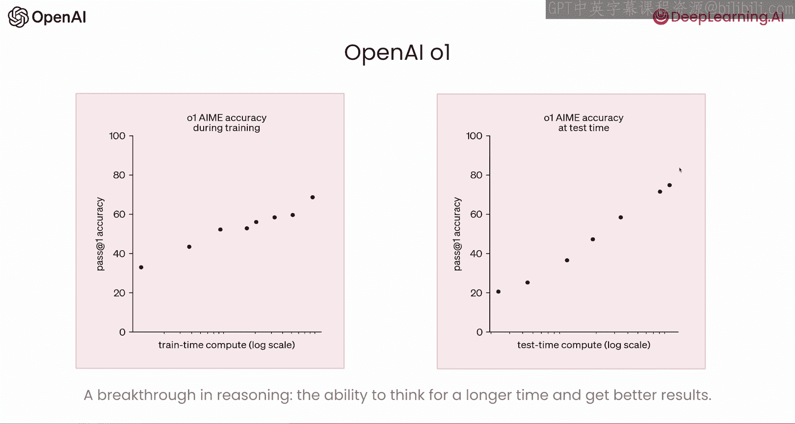

## 使用o1的权衡：推理令牌 ⚖️

使用o1系列模型会引入一个权衡：模型会生成额外的**完成令牌**，这些令牌你实际上看不到，但模型正用它们来解决问题。

以下是其工作原理。完成令牌可以分为两个不同的类别：
*   **推理令牌**：模型用于内部思考和解决问题的令牌。
*   **输出令牌**：最终提供给你的生成结果的令牌。

需要注意以下几点：
1.  推理令牌不会从一个对话轮次传递到下一个轮次。如果你想实现类似效果，需要提示模型输出某种推理过程，然后由你选择是否将其传递下去。
2.  你需要将推理令牌计入使用成本。
3.  在计算上下文限制时，推理令牌也会计入。如果你的输出超过了这个限制，输出将被截断。

---

## 性能提升的两大关键突破 🚀

o1性能提升的两大关键突破是：

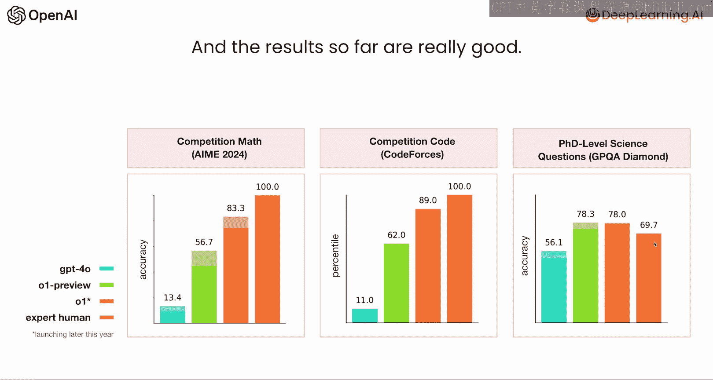

**1. 更长的推理时间**
在训练后过程中我们发现，进行的强化学习越多，模型就越准确。但更令人惊讶的是，**在推理时允许它思考更长时间，性能提升更为显著**。因此，关键突破在于能够在推理时进行更长时间的思考以获得更好的结果。

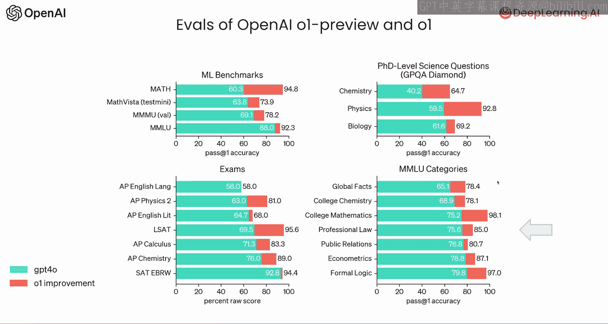

**2. 通过共识投票验证输出**
另一个关键突破是教会模型通过共识投票来验证输出。其工作方式是：我们生成一批解决方案，并训练语言模型选择最常见的那个。你可以将其类比为在低“温度”参数下进行采样。

在一项测试中，仅通过共识投票，数学基准测试的成绩就从33%提高到了50%。共识投票的效果在大约100个样本之前就趋于稳定，因此你不需要海量样本就能实现性能提升。

---

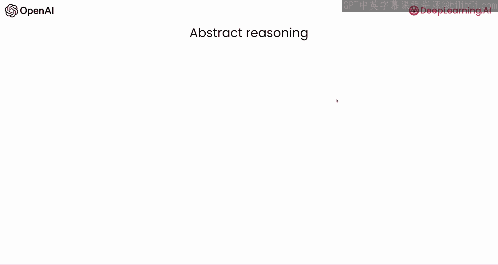

## o1的性能表现 📈

这些突破带来了显著的成果。o1模型的表现非常出色，例如：
*   **数学**：o1在基准测试中达到了83%，而GPT-4o仅为13%，提升巨大。
*   **编码**：o1达到89%，GPT-4o为11%。
*   **科学**：o1也有超过20个百分点的提升。
*   **其他领域**：在法律考试、MMLU（大规模多任务语言理解）等各类基准测试中，o1均表现出全面且显著的提升，例如在大学数学科目中达到了98.1%的惊人成绩。

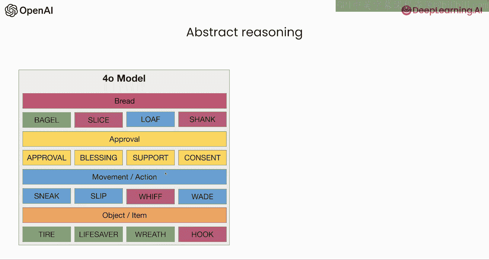

---

## o1的工作原理与抽象推理能力 🧩

o1模型工作的关键因素是，它使用**大规模强化学习**在回答前生成思维链。它产生的思维链比仅通过提示所能获得的更长、质量更高，并且包含错误纠正、尝试多种策略并选择最佳方案、或将问题自然分解为更小步骤等行为。

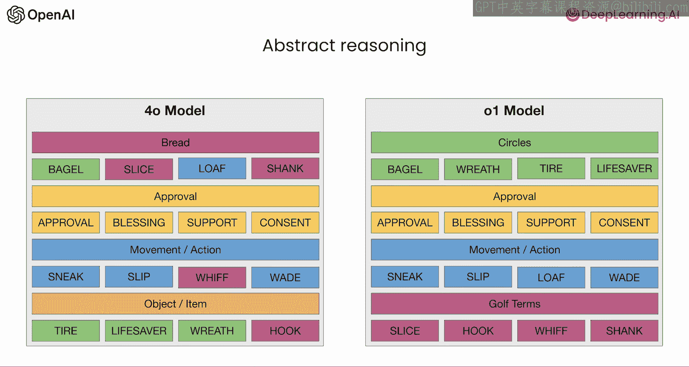

o1模型在**抽象推理**方面也代表了超越4o模型的新性能标准。例如，在一个挑战中，给模型16个单词，要求识别出将这些单词联系起来的4个类别，并将每个词放入正确的类别。GPT-4o的表现相当随意，而o1则能正确识别所有4个类别和全部16个单词。

这种抽象推理能力并不容易归类到编码、数学等传统基准中，但它展示了o1模型开始显现的一些新兴能力。

---

## 生成器-验证器差距的应用场景 🎯

o1系列模型展现出显著新兴能力的另一个领域是存在**生成器-验证器差距**的问题。

所谓生成器-验证器差距，是指对于某些问题，验证一个好的解决方案比首先生成完美的解决方案更容易。例如，在数独、数学、编程中，你通常可以先生成一个尚可的解决方案，验证它，找出问题，然后利用这些信息迭代到下一个方案，这比一开始就构建完美方案要容易得多。

当然，也存在验证-生成方法不适用的情况，例如信息检索（问题需要第一次就回答正确）或图像识别（需要第一次就正确识别图像内容）。但在存在生成器-验证器差距、并且我们拥有可以运行验证过程的良好验证器的场景下，我们可以在推理时投入更多计算资源以获得更好的性能。在这些方面，o1展现出了强大的能力。

---

## o1的潜在应用领域 💡

那么，o1模型可能应用于哪些领域呢？
*   **数据分析**：解释复杂数据集，如基因组序列。
*   **数学问题求解**：性能相比前代模型有阶跃式提升。
*   **实验设计**：为化学、物理等专业领域提出创新方法。
*   **科学编码**：涉及大量STEM（科学、技术、工程、数学）主题。
*   **生物化学推理**
*   **算法开发**
*   **文献综述**：跨越多篇研究论文进行推理，形成连贯的结论或摘要。

---

## 关键要点总结 ✨

让我们回顾一下o1介绍的关键要点：
1.  **核心机制**：o1系列模型通过在推理时生成用于迭代推理问题的令牌，来扩展计算规模。
2.  **权衡**：o1提供更高的智能，但代价是更高的延迟和成本，因此并非适用于所有用例。
3.  **优势场景**：它在需要“测试-学习”方法、可以迭代验证结果的任务上表现出色。
4.  **新兴用例**：规划、编码，或法律、STEM等领域的特定推理。

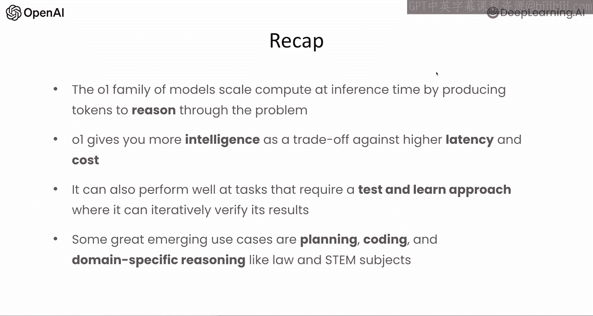

---

## 实践应用示例 💻

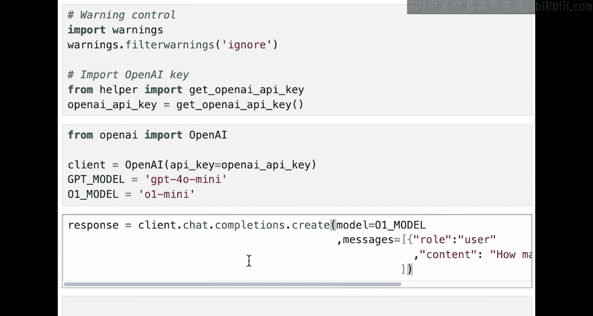

现在，让我们跳转到一些实际应用，并了解如何为你的用例使用o1。

我将展示一个在聊天补全中o1如何工作的快速示例。

首先，导入API密钥并设置OpenAI客户端。我将使用o1-mini模型，并准备一个聊天补全请求。你可以看到o1请求与典型的聊天补全请求完全相同：我们指定一个o1模型，然后向它提出经典问题：“strawberry（草莓）这个词里有几个字母r？”

让我们看看返回的响应对象。这里我们关注的是o1的不同之处。我们可以打印出令牌使用情况：提示令牌、总完成令牌，以及完成令牌的组成部分（包括推理令牌和输出令牌）。

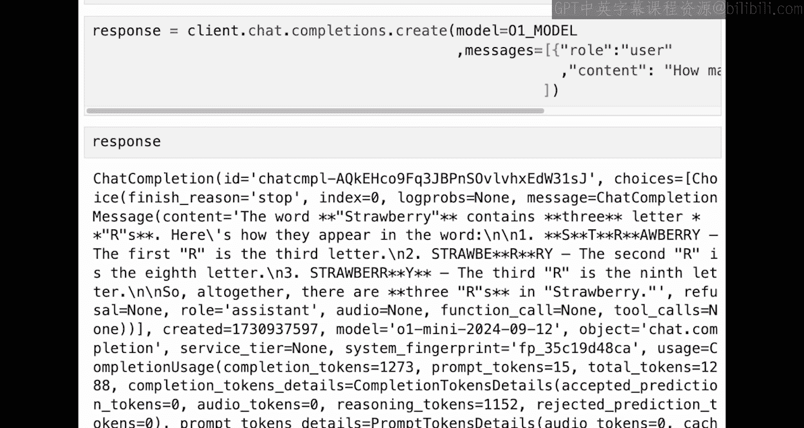

你会发现，模型在这里进行了大量的“思考”。我们只给了它15个提示令牌，但它产生了超过1000个推理令牌才得出输出。这突显了使用o1的关键权衡：你获得了更高的智能，但在这个案例中，我们为此支付了10倍于输出令牌的成本。

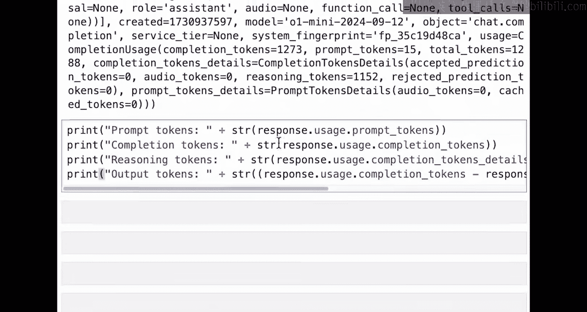

**这是一个重要的考量点：不要在所有事情上都使用o1。它仅适用于那些智能提升值得用延迟和成本来交换的用例。**

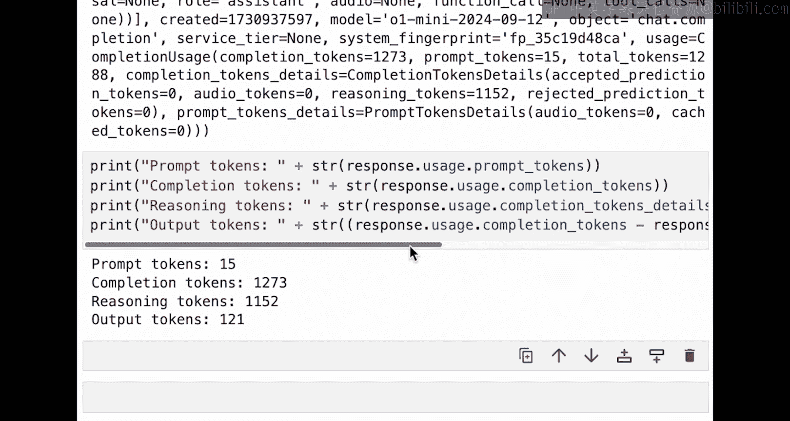

期待在下一课中与你相见，我们将深入探讨如何提示o1以获得最佳性能。