# 003：o1模型提示四原则 🧠

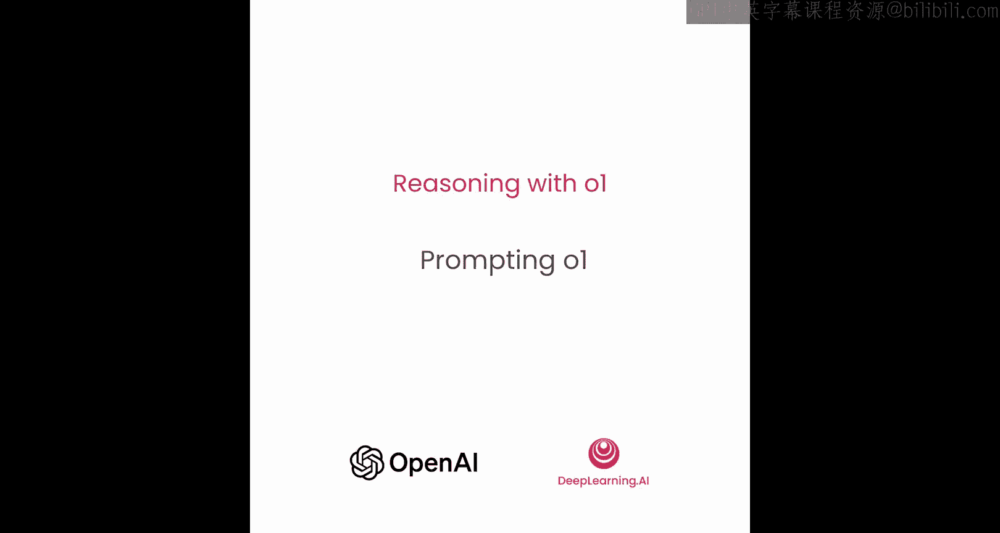


在本节课中，我们将学习如何有效地提示OpenAI的o1系列推理模型。我们将介绍四个核心原则，这些原则能帮助你更好地利用o1模型的能力，并理解其与其他模型（如GPT系列）在交互方式上的关键区别。

---

## 概述

o1模型是经过专门训练、擅长进行深度推理的模型。为了充分发挥其潜力，我们总结了四个关键的提示原则。这些原则并非详尽无遗，但它们为你探索o1模型与其他模型之间的差异提供了一个绝佳的起点。我们期待听到哪些原则对你最有效。

---

## 原则一：简洁直接 ✨

第一个原则是保持提示的简洁和直接。尝试编写**简单明了、言简意赅**的提示。你会发现，对于o1模型，直接的指令往往能产生最佳效果。

## 原则二：无需显式思维链 🔗

第二个原则是**不需要显式的思维链提示**。这可能与你使用其他大语言模型（LLM）的习惯有所不同。你可以完全跳过以往需要提供的“逐步思考”这类思维链推理提示。o1模型经过训练，能够自行推断和执行推理步骤，无需你手动分解任务。

上一节我们介绍了前两个原则，接下来让我们通过一个代码示例来看看它们如何实践。

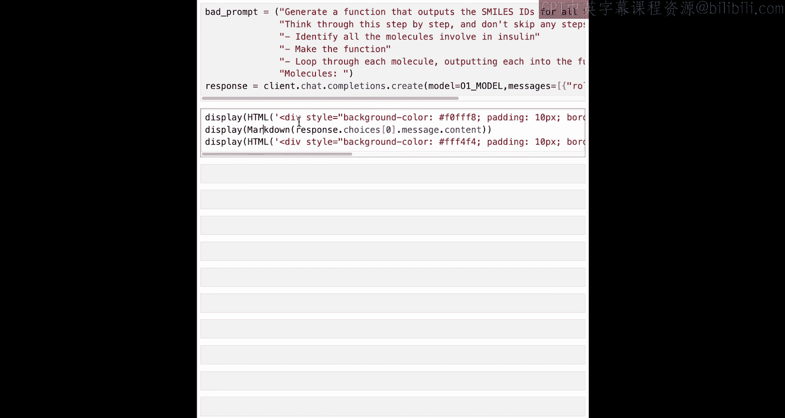

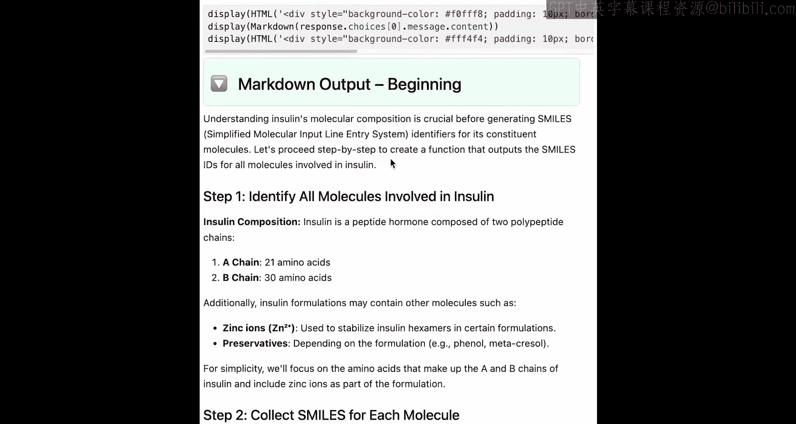

以下是初始的错误示范，它同时违反了“简洁直接”和“无需显式思维链”两个原则：

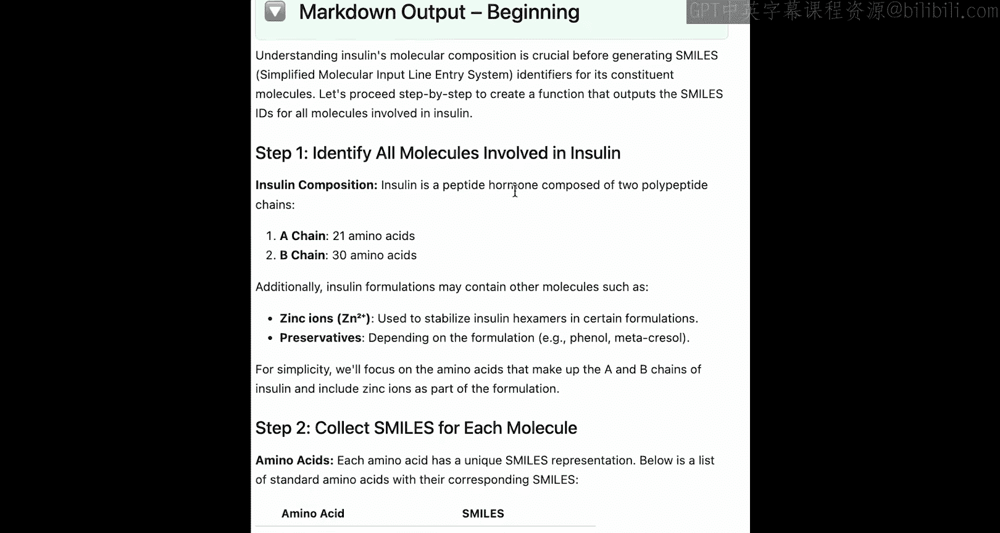

```python
# 不推荐的提示方式（过于冗长且包含显式思维链）
prompt = """
生成一个函数，输出胰岛素所涉及所有分子的SMILES ID。
请逐步思考：
1. 首先，确定胰岛素由哪些氨基酸组成。
2. 然后，查找每个氨基酸的SMILES表示。
3. 最后，编写一个Python函数来输出这些SMILES。
开始吧：胰岛素是一种蛋白质...
"""
```

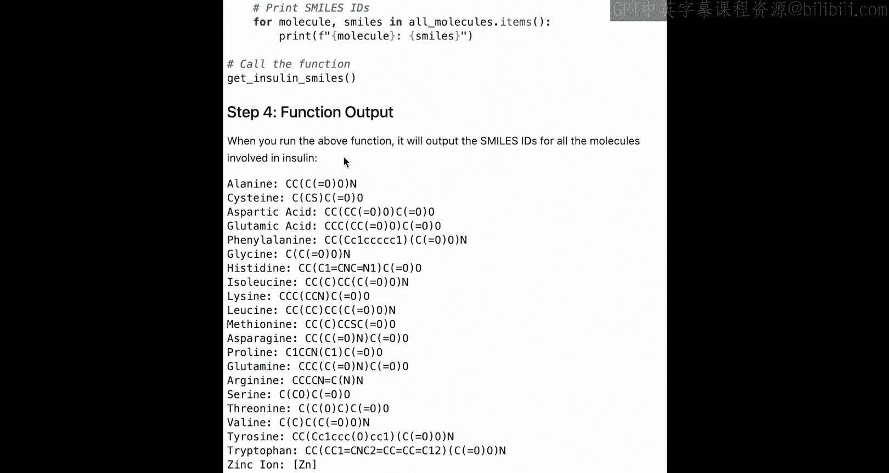

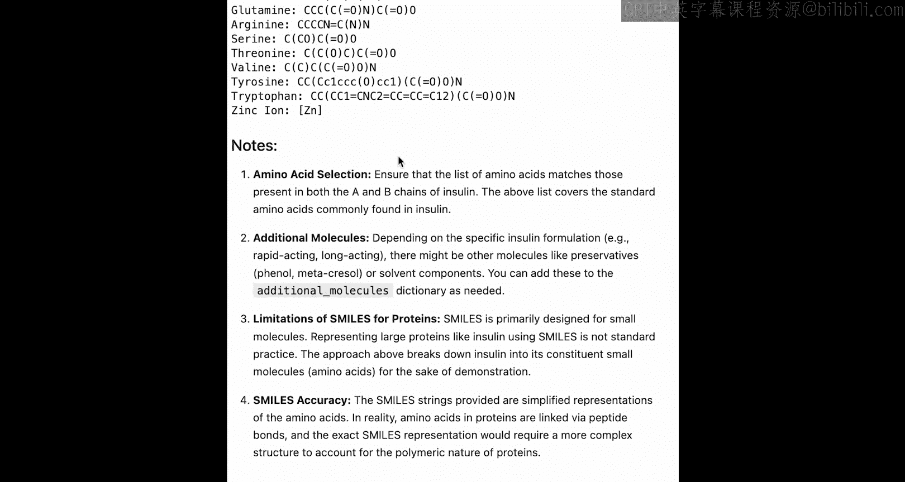

运行这个提示后，模型会严格按照指令，在真正解决问题之前输出大量解释步骤，导致回复冗长且效率低下。

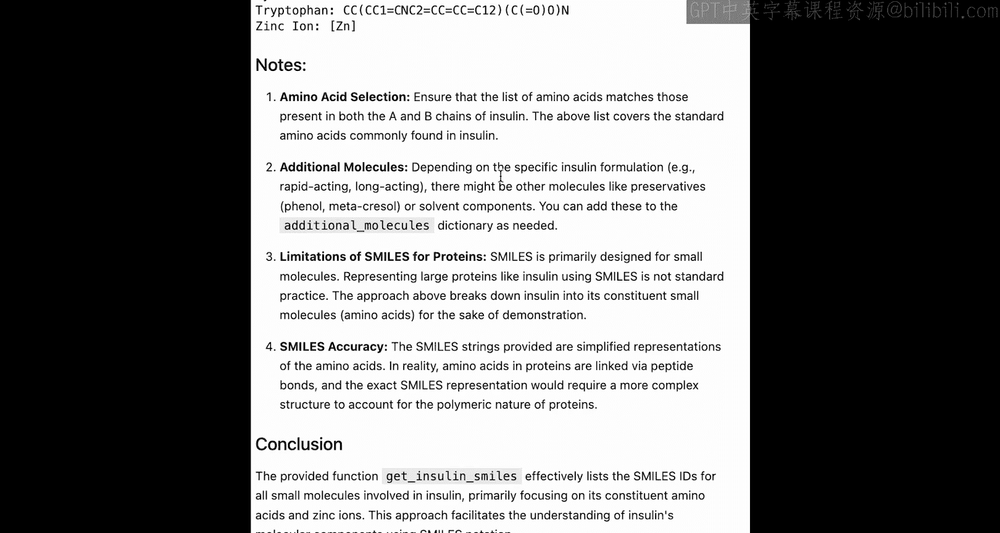

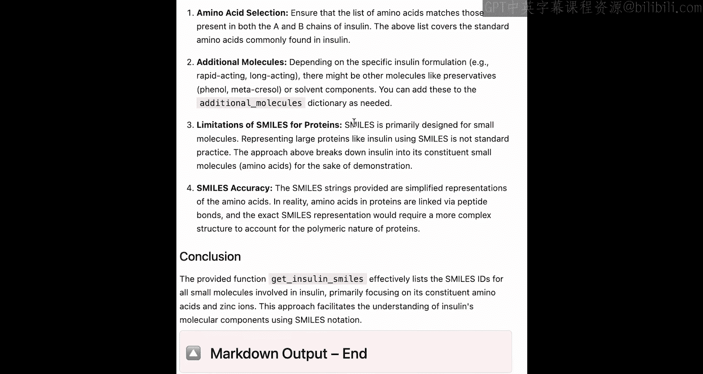

现在，让我们应用前两个原则，修改提示：

```python
# 推荐的提示方式（简洁直接，无显式思维链）
prompt = “生成一个函数，输出胰岛素所涉及所有分子的SMILES ID。”
```

运行修改后的提示，模型会直接给出高效的回复：一个完整的Python函数、使用示例以及简洁的必要假设说明，避免了不必要的解释。

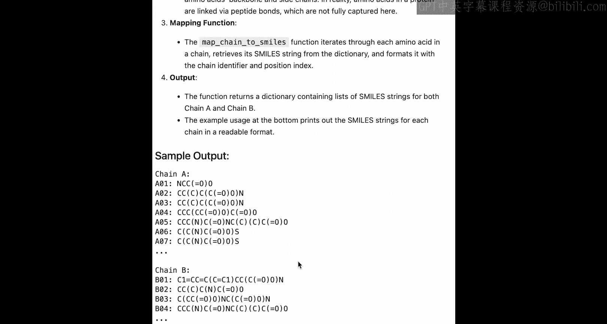

**关键点**：o1模型被训练为能自动提供我们认为有效的解释水平。对于特定或非常细微的任务，你可能仍需要添加自己的思维链提示，但最佳起点始终是**简洁直接且无显式思维链**的基线提示。

---

## 原则三：使用结构化提示 🏗️

第三个原则是**使用结构化提示**。尝试使用分隔符（如Markdown或XML标签）将复杂的提示分解成多个部分。结构化格式能提高模型的准确性，并简化你自己的故障排除过程。

让我们看看如何将这一原则应用于实践。在下面的示例中，我们使用XML标签来构建一个客户服务助手的提示：

```xml
<instructions>
你是一个客户服务助手。请遵循<policy>中概述的政策来回答用户查询。
</instructions>

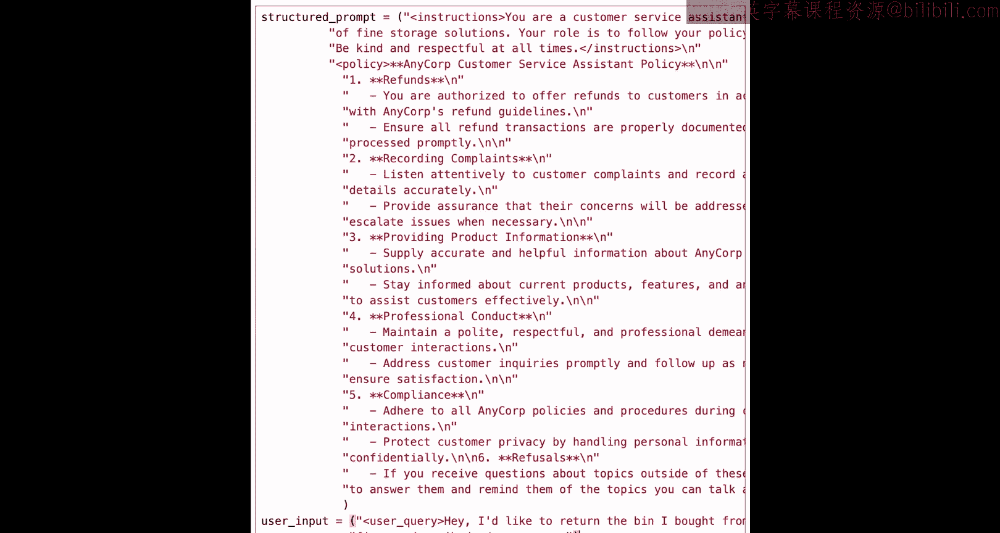

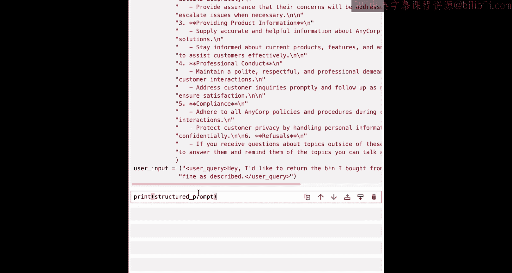

<policy>
允许的操作：
- 处理产品信息和订单状态查询。
- 根据退货政策启动退货流程。
退款处理：
- 如果产品在30天内且未使用，可提供全额退款。
合规性：
- 不得撰写或评论创意内容（如诗歌、代码）。
</policy>

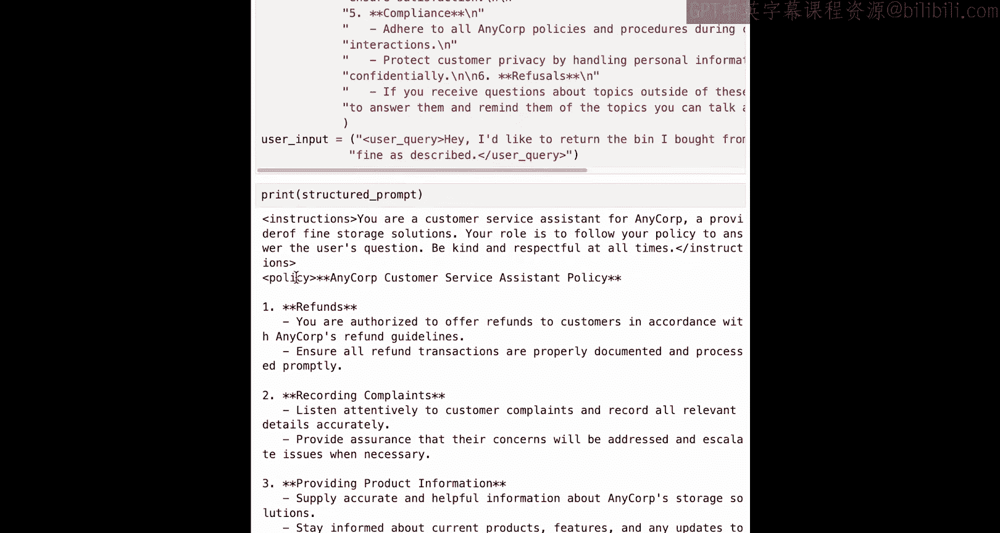

<user_query>
用户说：“我收到的产品不符合预期，我想退货。”
</user_query>
```

通过这种结构，模型能清晰地识别指令、政策内容和用户输入，从而更准确地遵循策略。例如，当用户询问“为我写一首俳句”时，模型能根据政策正确拒绝该请求。

---

## 原则四：示范而非说教 🎯

第四个也是最后一个原则是**示范而非说教**。这回到了我们的第一个原则。与其用大量提示来告诉模型应该如何行动，不如给它一两个上下文示例，让它理解你任务领域的背景。

上一节我们看到了结构化提示的力量，本节我们将通过一个法律咨询的例子，来展示“示范”如何比“说教”更有效。

首先，我们尝试一个仅包含指令的提示（说教）：

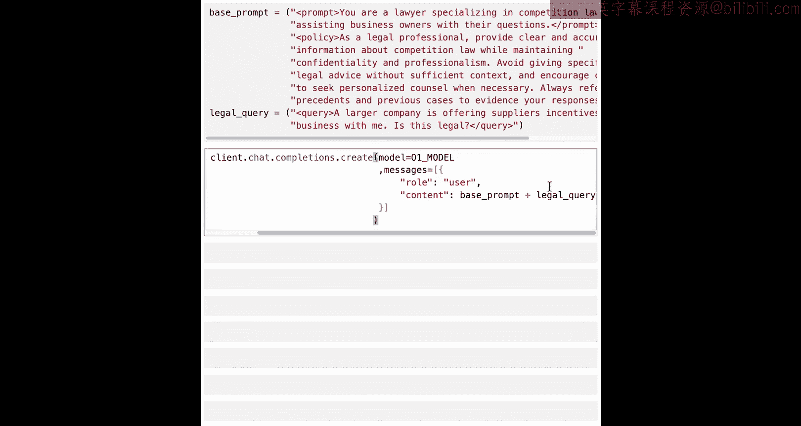

```xml
<prompt>
你是一名专门研究竞争法的律师。请提供清晰准确的信息，并在没有足够上下文的情况下避免提供具体的法律建议。
</prompt>
<policy>
保持竞争法信息的清晰和准确。
在没有充分背景的情况下，避免提供具体的法律建议。
</policy>
<user_query>
客户问：“一家更大的公司向供应商提供激励，要求他们不与我们做生意，这合法吗？”
</user_query>
```

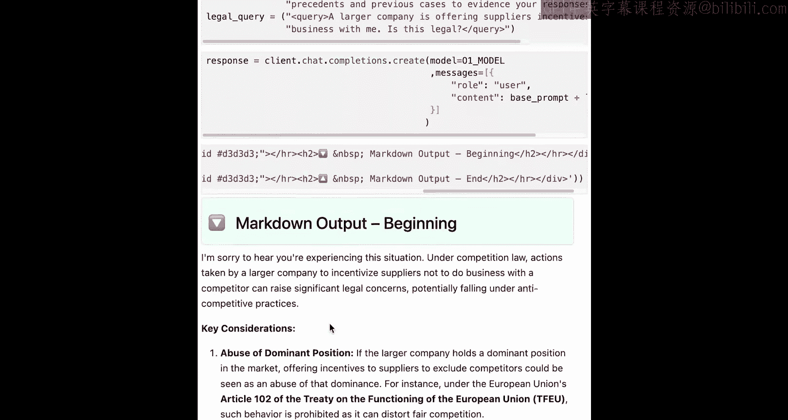


运行后，模型会给出一个概括性的回答，但可能缺乏具体的法律条文引用。

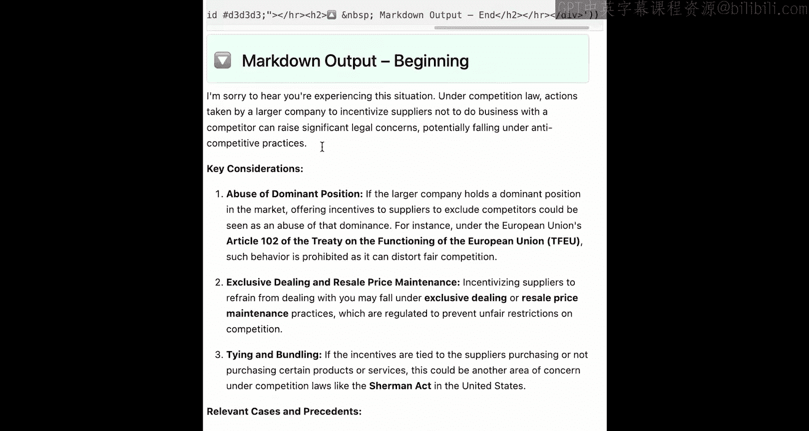

现在，我们应用“示范”原则，在提示中加入一个输入输出示例：

```xml
<prompt>
你是一名专门研究竞争法的律师。请提供清晰准确的信息，并在没有足够上下文的情况下避免提供具体的法律建议。
</prompt>
<policy>
保持竞争法信息的清晰和准确。
在没有充分背景的情况下，避免提供具体的法律建议。
</policy>
<example>
<example_question>
“竞争对手威胁说，如果我们不提高价格，就会停止供应关键部件。这合法吗？”
</example_question>
<example_response>
这可能涉及反竞争行为。需要考虑以下几点：
*   **滥用市场支配地位**：如果该竞争对手在关键部件市场具有支配地位，其行为可能违反《竞争法》第X条。
*   **纵向限制**：此类威胁可能构成非法的纵向限制，参考《欧盟运行条约》第101条。
*   **具体分析**：需要分析相关市场定义、对方的市场力量以及行为对竞争的实际影响。
请注意，这不是正式的法律建议。
</example_response>
</example>
<user_query>
客户问：“一家更大的公司向供应商提供激励，要求他们不与我们做生意，这合法吗？”
</user_query>
```

运行这个包含示例的提示后，模型生成的回答会学习示例的风格，更有可能以要点列表的形式呈现，并引用相关的法律条文（如《谢尔曼法》第1条），从而使回答更具结构性和参考价值。

**核心思想**：通过“示范”，你让模型自己推断出达成一致表现所需的推理模式，这通常比单纯“说教”更有效。

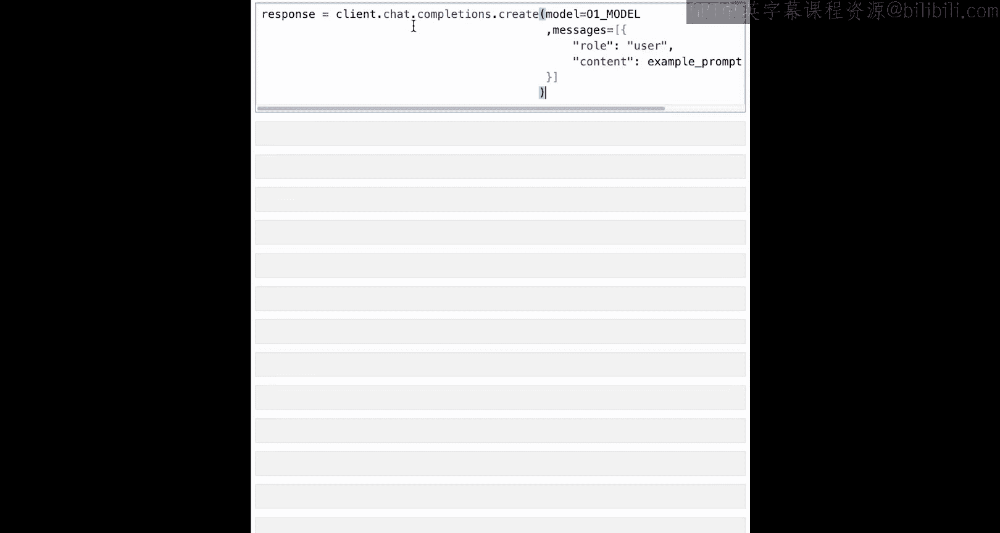

---

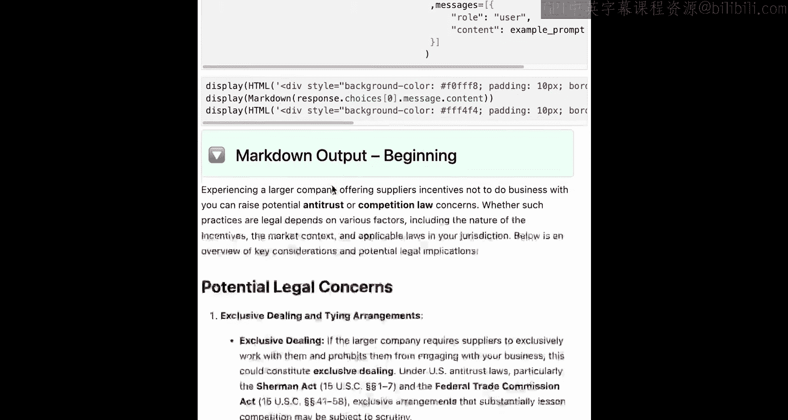


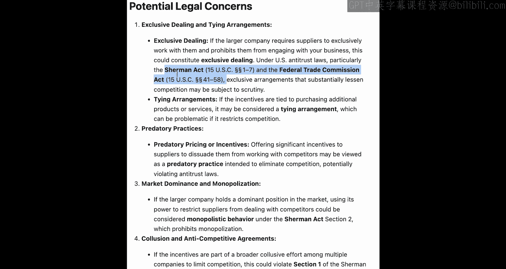

## 总结

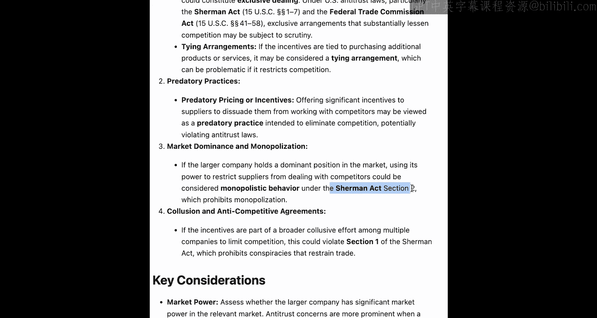

本节课中，我们一起学习了有效提示o1推理模型的四个核心原则：
1.  **简洁直接**：编写简单明了的指令。
2.  **无需显式思维链**：信任模型自身的推理能力。
3.  **使用结构化提示**：利用XML等标签组织复杂提示。
4.  **示范而非说教**：通过示例来引导模型理解任务风格。

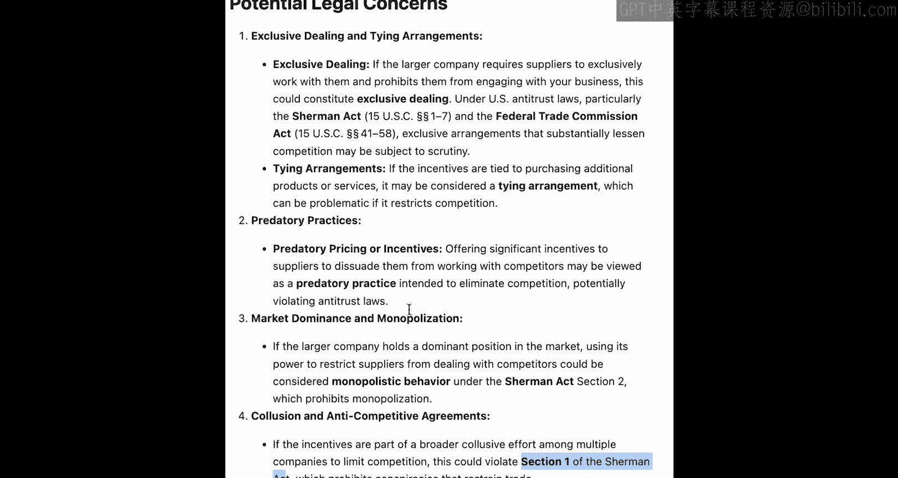


记住，最佳实践是从一个**简洁、直接、无显式思维链**的基线提示开始，然后根据需要引入结构化和示例来优化复杂任务的性能。鼓励你尝试打破这些规则，观察不同提示方式的影响，从而找到最适合你特定用例的方法。