# 004：规划 🧠

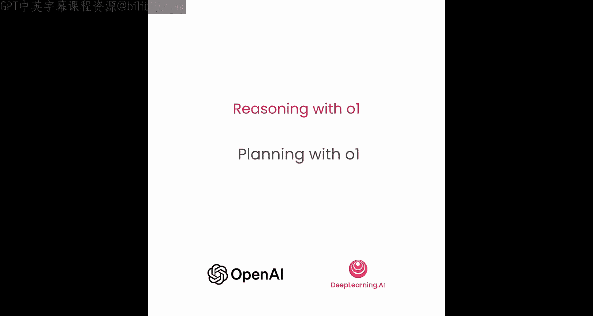

在本节课中，我们将学习如何利用o1模型的强大推理能力来制定任务计划。我们将看到如何结合o1-mini的智能规划和GPT-4o-mini的高效执行，以平衡智能、延迟和成本，从而解决复杂的多步骤任务。


## 概述

o1模型的一个突出应用场景是：在给定一组执行工具和任务约束的条件下，创建解决问题的计划。如果每一步都使用o1模型，整个过程会非常缓慢。因此，我们将采用一种实用的权衡策略：使用o1-mini生成计划，然后使用GPT-4o-mini执行每个步骤。这种以智能换取延迟和成本的方法在实践中非常有效。

## 整体架构

在深入代码细节之前，我们先了解任务的整体架构，以免迷失在细节中。

整个流程始于一个**场景**，这通常来自客户提出的、需要多步骤逻辑来回答的请求。这个场景会被提供给**o1-mini**模型。o1-mini将根据如何构建计划的指令，以及一系列可用于执行计划的工具，来制定一个详细的计划。这是o1模型的绝佳用例，我们利用其多步骤推理逻辑来制定一个稳健的计划。

计划制定完成后，我们将启用**GPT-4o-mini**作为“工人”，来执行计划中的每一步。一旦计划执行完毕，我们将得到一个**答案**，并将其反馈给客户。

现在，让我们深入代码，看看这在实践中是如何运作的。

## 代码实现步骤

以下是实现上述架构的关键步骤。

### 1. 初始设置

首先，导入OpenAI密钥，并初始化OpenAI客户端以及o1和GPT-4o模型。

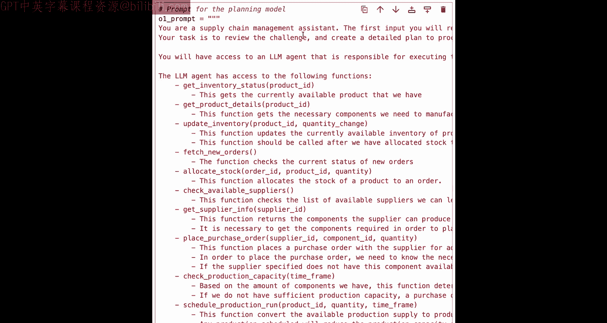

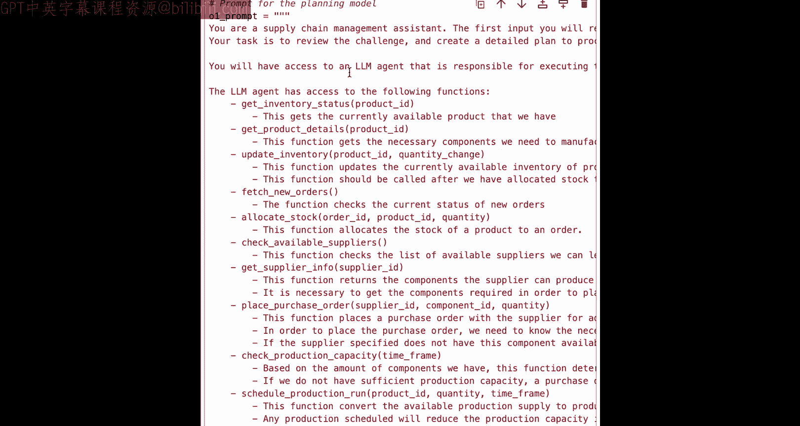

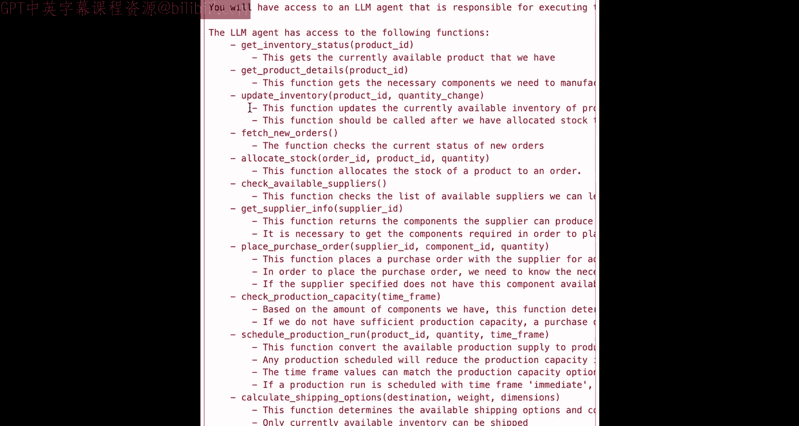

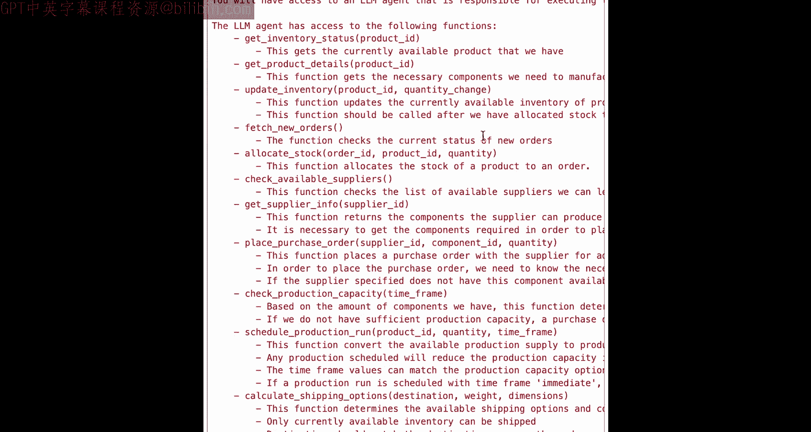

```python
import openai

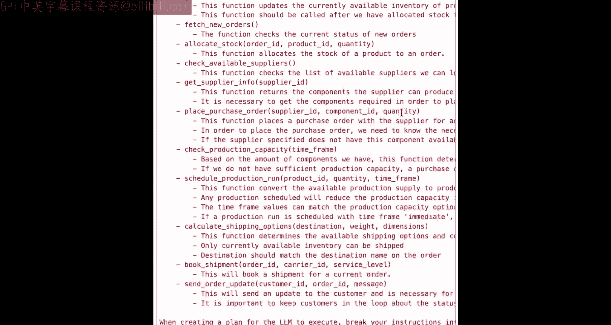

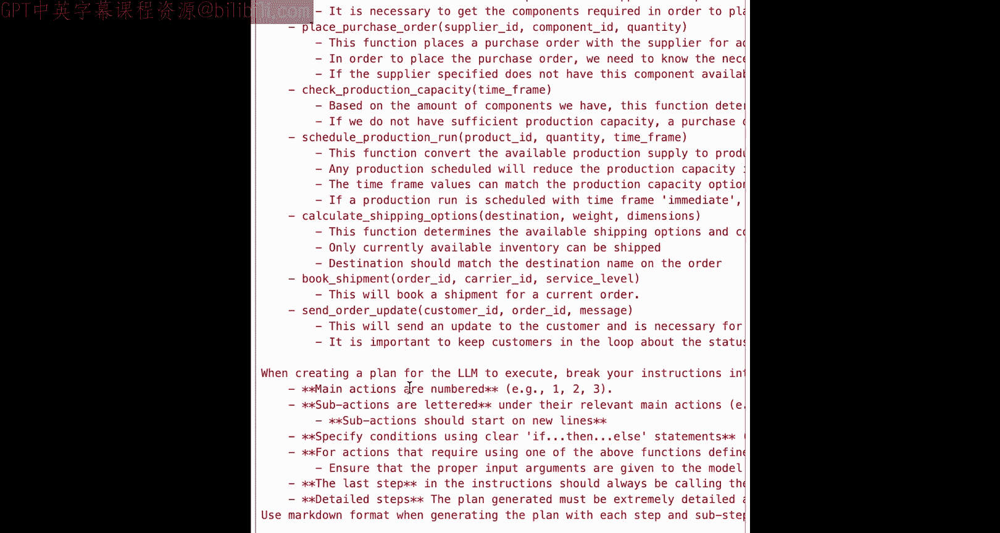

# 初始化客户端和模型
client = openai.OpenAI(api_key='your_api_key')
o1_model = "o1-mini"
gpt4_model = "gpt-4o-mini"
```

### 2. 定义约束和上下文

接下来，定义任务场景的约束条件和上下文变量。

*   **消息列表**：因为我们的GPT-4o工人需要循环执行多个步骤，所以需要一个消息列表来累积历史记录，以便工人知道它已经执行了计划中的哪些步骤。
*   **上下文变量**：包括库存清单、客户订单、供应商信息（用于补充库存）、运输选项以及客户元数据等。
*   **状态管理**：由于会进行多轮对话，需要维护对话状态。在实际应用中，可以考虑在特定节点重置状态，以允许客户提交多个场景。

```python
# 示例上下文变量
message_history = []
inventory = {...}
customer_order = {...}
suppliers = [...]
shipping_options = [...]
customer_metadata = {...}
conversation_state = {}
```

### 3. 定义o1-mini的系统提示词

我们需要为o1-mini定义一个提示词，指导它如何构建解决问题的计划。这个提示词包含几个主要部分：

*   **角色和任务**：告诉它，它是一个供应链助手，任务是审查给定的挑战（场景）并创建一个详细的计划来回答它。
*   **可用资源**：告知它将可以访问一个LLM代理（即GPT-4o-mini工人），并提供一个**函数列表**。这里需要注意，o1模型本身不会直接调用这些OpenAI函数，这些函数是提供给GPT-4o-mini工人使用的。但o1需要知道这些函数是什么以及它们的大致功能，以便为GPT-4o-mini工人制定多步骤计划。
*   **计划格式指令**：给o1一套指令，告诉它如何布局这个计划，以便我们之后能够解析它并提供给GPT-4o-mini执行。

```python
o1_system_prompt = """
你是一个供应链助手。你的任务是审查面临的挑战（场景），并创建一个详细的计划来应对它。
你将可以访问一个LLM代理来执行具体步骤。
以下是代理可以使用的工具函数列表：
- fetch_new_orders: 获取新订单状态。
- get_inventory_status: 检查库存状态。
- check_production_capacity: 检查生产能力。
- ... (其他函数)

请按照以下结构创建计划：
1. 第一步：使用 [函数名] 做某事。
2. 第二步：对于每个X，做Y。
...
确保计划清晰、可执行。
"""
```

### 4. 定义GPT-4o-mini的系统提示词和函数

接下来，定义指导GPT-4o-mini工人如何工作的系统提示词。

*   **角色和职责**：告诉它是一个负责执行给定策略（即计划）的助手，必须严格按照书面计划执行。
*   **决策解释**：要求它在各个步骤中解释其决策过程，这在后续很有用，例如决定是否更新客户进度或是否遇到障碍。
*   **逐步指令**：给予它一些思维链提示，帮助其做出正确决策。
*   **注入计划**：最后，将o1生成的那个计划（策略）实例化，并提供给GPT-4o-mini执行。

为了让GPT-4o-mini能够对计划的每一步采取行动，它需要能够进行OpenAI函数调用。我们需要定义这些函数，每个函数对应计划中的一个步骤。

```python
# 示例：定义一个检查生产能力的函数
function_definitions = [
    {
        "name": "check_production_capacity",
        "description": "检查在给定时间范围内的生产能力。",
        "parameters": {
            "type": "object",
            "properties": {
                "timeframe": {
                    "type": "string",
                    "enum": ["immediate", "next_week", "next_month"],
                    "description": "要检查生产能力的时间范围。"
                }
            },
            "required": ["timeframe"]
        }
    },
    # ... 其他函数定义
]

# 对应的Python执行函数
def check_production_capacity(timeframe):
    # 根据timeframe查询生产能力的逻辑
    capacity = query_capacity_from_db(timeframe)
    return {"capacity": capacity}
```

### 5. 创建编排函数

现在，我们已经定义了输入变量、两个模型的系统提示词以及函数定义，接下来可以创建一个函数，将所有部分编织在一起，以编排整个过程。

编排函数的主要步骤是：
1.  **生成计划**：接收客户提供的场景，调用o1-mini生成计划。
2.  **执行计划**：获取该计划，并初始化一个GPT-4o-mini工人。这个工人将循环工作，直到完成整个计划，然后返回消息记录。
3.  **返回结果**：将最终结果返回给用户，告知他们我们是如何处理其给出的场景的。

```python
def orchestrate_scenario(scenario):
    # 步骤1: 调用o1-mini生成计划
    plan = generate_plan_with_o1(scenario, o1_system_prompt)
    
    # 步骤2: 使用GPT-4o-mini执行计划
    final_messages = execute_plan_with_gpt4o(plan, gpt4_system_prompt, function_definitions)
    
    # 步骤3: 从final_messages中提取答案返回给用户
    answer = extract_answer(final_messages)
    return answer
```

在编排包装器内部，主要包含以下辅助函数：
*   `append_message_function`: 负责管理消息历史，为GPT-4o提供上下文。
*   `generate_plan_with_o1`: 将场景提供给o1并生成计划响应。
*   `execute_plan_with_gpt4o`: 调用GPT-4o执行o1生成的计划。这里会启动一个循环，GPT-4o-mini根据计划内容产生工具调用，并决定采取什么行动，直到收到“指令完成”的信号为止。

### 6. 运行示例

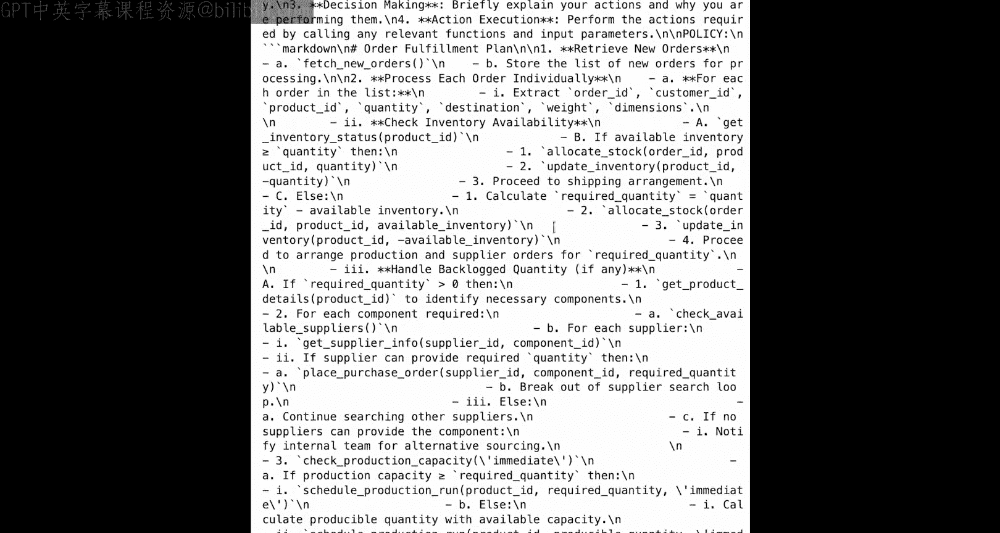

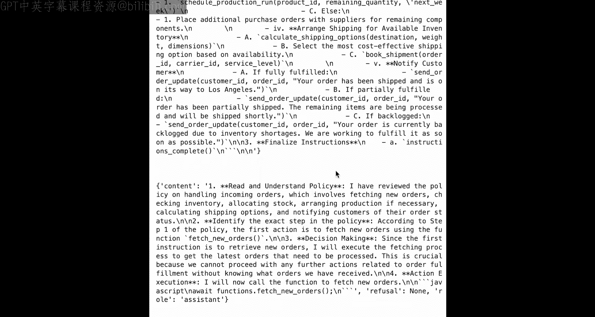

定义好所有变量后，剩下的就是提出一个客户希望我们执行的场景。

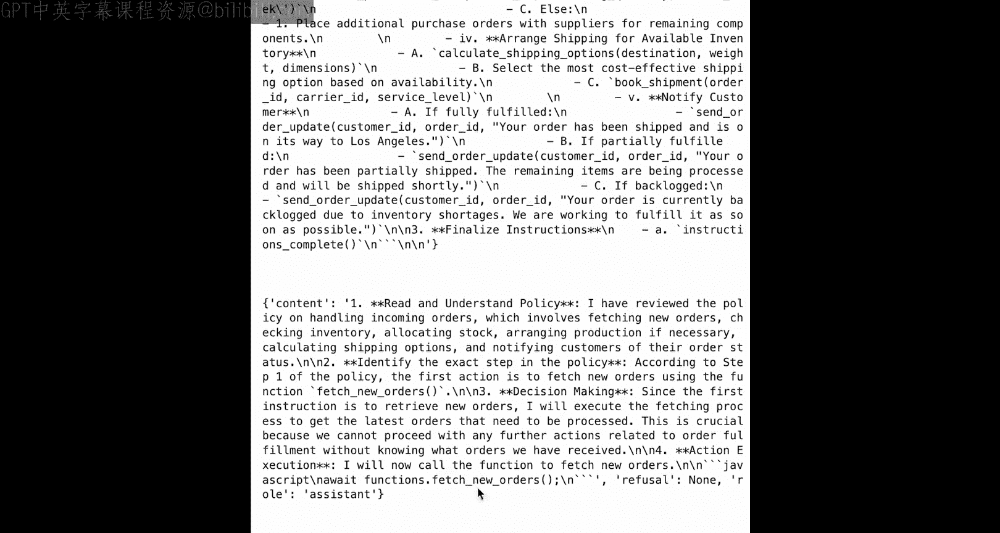

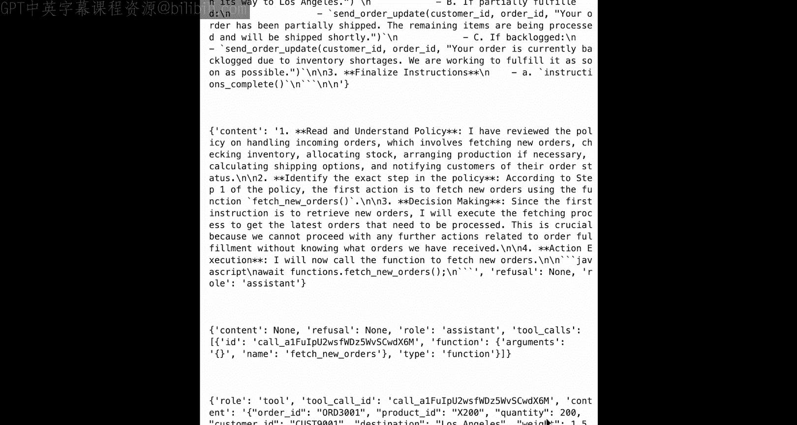

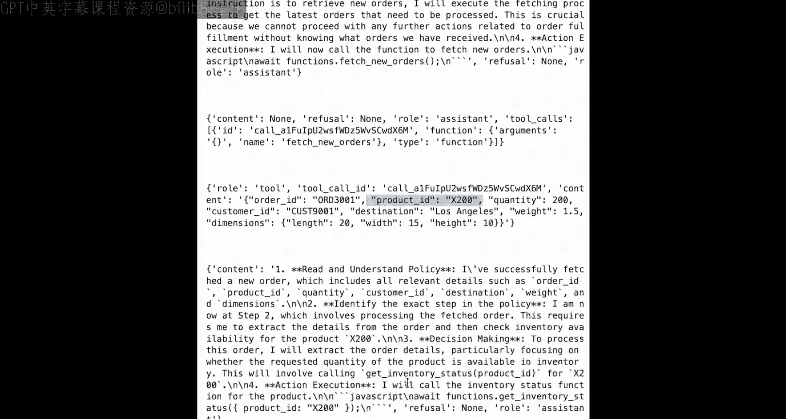

```python
# 示例场景
customer_scenario = """
我们收到了一批重要的新订单。
请生成一个计划，以获取等待处理的订单列表，并确定履行这些订单的最佳策略。
计划应包括检查库存、处理积压订单、安排运输等。
在完成前应通知客户。
优先考虑尽可能发出所有可能的订单，同时为任何积压项目下订单。
"""

# 运行编排流程
result = orchestrate_scenario(customer_scenario)
print(result)
```

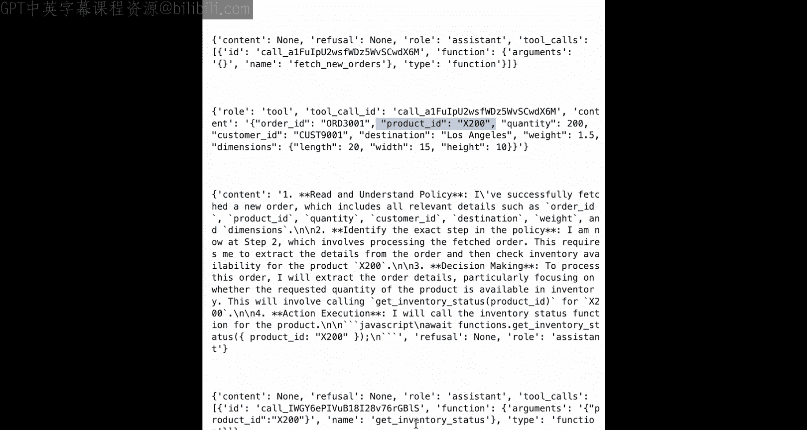

## 计划与执行分析

运行上述代码后，o1-mini会生成一个清晰的Markdown格式计划。例如，计划可能包括：
1.  **检索新订单**（使用 `fetch_new_orders` 函数）。
2.  **逐个处理每个订单**：提取变量、检查可用性、处理积压数量（使用 `get_inventory_status`, `check_production_capacity` 等函数，并包含if-else逻辑）。
3.  **为可用库存安排运输**。
4.  **通知客户**（根据订单是完全履行、部分履行还是有积压，提供不同信息）。
5.  **最终完成指令**（调用 `instructions_complete` 函数，跳出循环）。

接着，GPT-4o-mini会严格按照这个计划执行。通过查看执行过程中的消息记录，我们可以验证它是否遵循了计划。例如，它可能依次调用了 `fetch_new_orders`、`get_inventory_status`、`allocate_stock`、`check_available_suppliers`、`place_purchase_order`、`check_production_capacity`（分立即和下周检查）、`calculate_shipping_options`，最后 `send_order_update` 给客户，并成功结束流程。

## 总结

本节课中，我们一起学习了如何利用o1-mini的智能规划能力与GPT-4o-mini的高效执行能力，构建一个**智能体工作流**。o1扮演**编排者**的角色，负责制定复杂的多步骤计划；而GPT-4o则作为**执行者**，以较低的延迟和成本按顺序执行该计划。这种模式在需要复杂推理和分步操作的任务中非常实用，例如供应链管理、复杂问题解答等。

现在，你可以退一步思考，在你的应用场景中，是否有机会使用这种规划范式，将o1的智能与GPT-4o的低延迟、低成本结合起来，处理复杂的多步骤智能体流程。

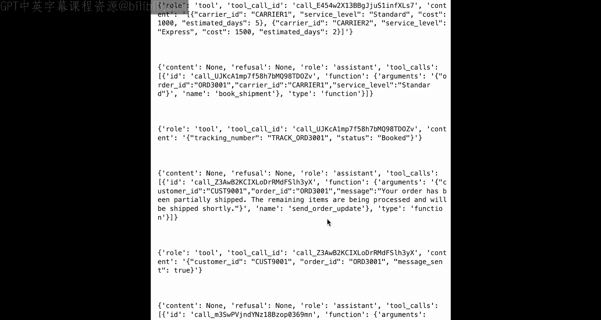

接下来，我们将把焦点从规划转向o1模型的另一个非常常见的用例：**编程**。期待在那里与你相见！🚀