# 005：编码实践 🧑‍💻

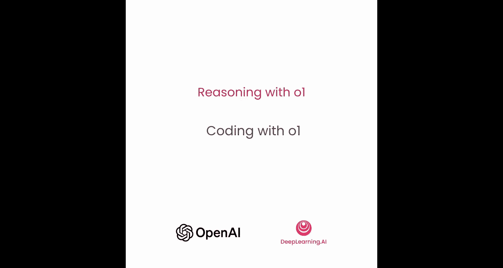

在本节课中，我们将学习如何利用o1模型来辅助编程任务。我们将通过两个具体的实验来对比o1-mini和GPT-4o模型的表现：一个是创建一个全新的React应用，另一个是编辑和优化一段已有的代码。通过实践，你将了解o1在代码生成和代码编辑方面的优势。

---


## 创建新应用

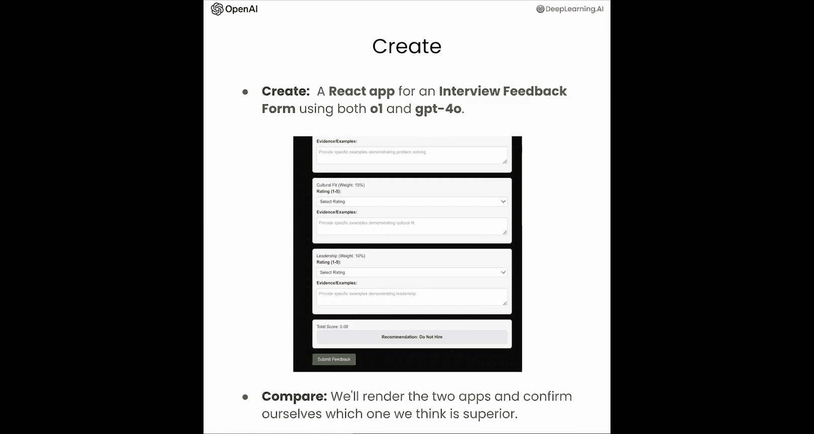

上一节我们介绍了如何利用规划来辅助任务，本节中我们来看看如何将类似的方法应用于编码任务。o1模型在创建新应用和编辑现有代码方面表现最佳，尤其是在使用简单、直接的提示时。

为了验证这一点，我们将运行两场编码竞赛：一场是使用o1-mini和GPT-4o从头创建一个全新的应用，另一场是让它们编辑一段现有的代码。

首先，我们需要导入必要的变量，例如OpenAI API密钥，以及我们将要使用的GPT-4o和o1模型。

以下是获取模型聊天补全响应的函数定义：

```python
def get_chat_completion(model, prompt):
    # 调用OpenAI API获取响应
    response = openai.ChatCompletion.create(
        model=model,
        messages=[{"role": "user", "content": prompt}]
    )
    return response.choices[0].message.content
```

接下来，我们需要定义一个提示词，指导o1和GPT-4o如何思考并创建这个应用。

以下是提供给模型的提示词内容，它要求创建一个优雅、令人愉悦的面试反馈表单React组件，并给出了一些性能标准和总体目标：

```
请创建一个优雅、令人愉悦的React组件，用于面试反馈表单。
该表单应包含以下评分类别：技术能力、沟通技巧、问题解决能力、团队合作、总体评价。
每个类别使用1-5分的下拉菜单进行评分。
表单底部应有一个文本框用于收集总体反馈。
提交后，表单应显示一个感谢信息。
请确保UI美观、响应式，并提供清晰的视觉反馈。
```

现在，我们将使用GPT-4o和o1分别生成代码，然后渲染两个应用，并直观地比较它们的质量。

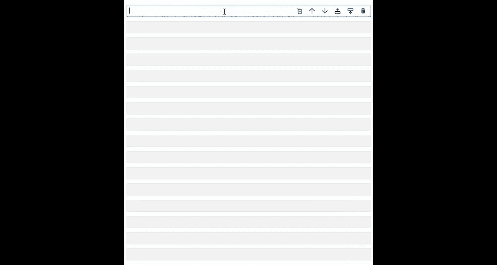

我们先从GPT-4o开始。让它生成应用代码，然后进行渲染。

```python
# 使用GPT-4o生成代码
gpt4o_prompt = "请根据以上要求，生成React面试反馈表单的代码。"
gpt4o_code = get_chat_completion("gpt-4o", gpt4o_prompt)
print(gpt4o_code)
```

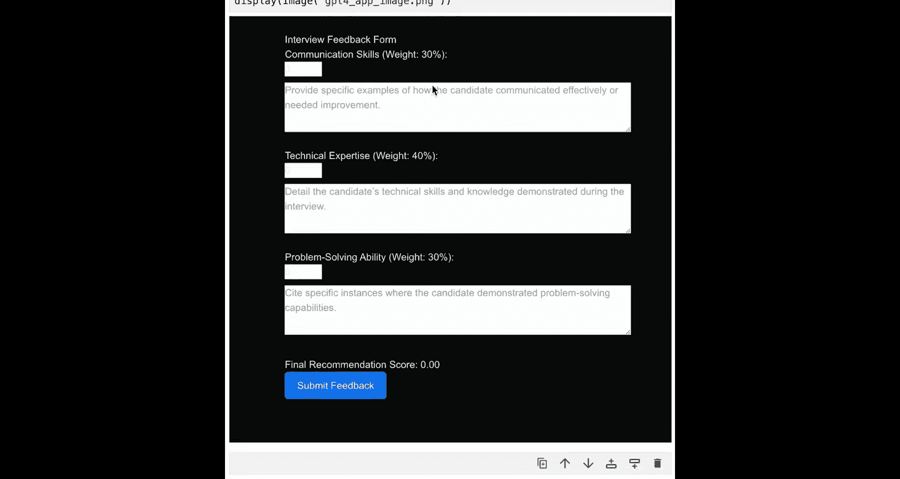

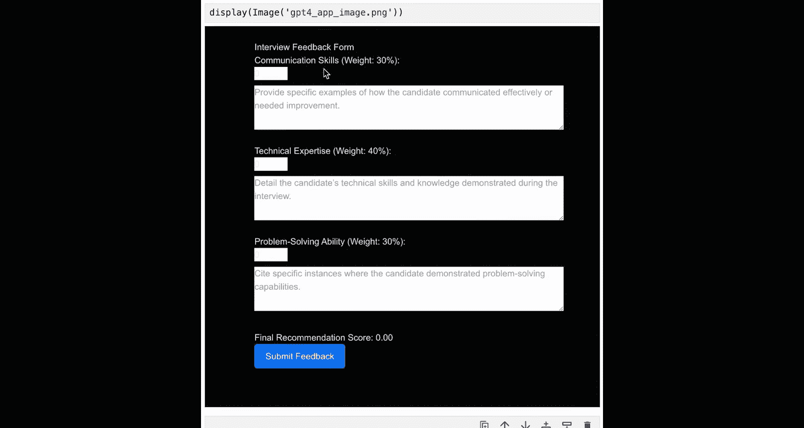

代码生成后，我们将其复制到开发环境中进行渲染。下图展示了GPT-4o生成的表单效果：


我们可以看到这是一个面试反馈表单，但外观并不理想，存在一些奇怪的格式问题。希望o1能够对此进行改进。

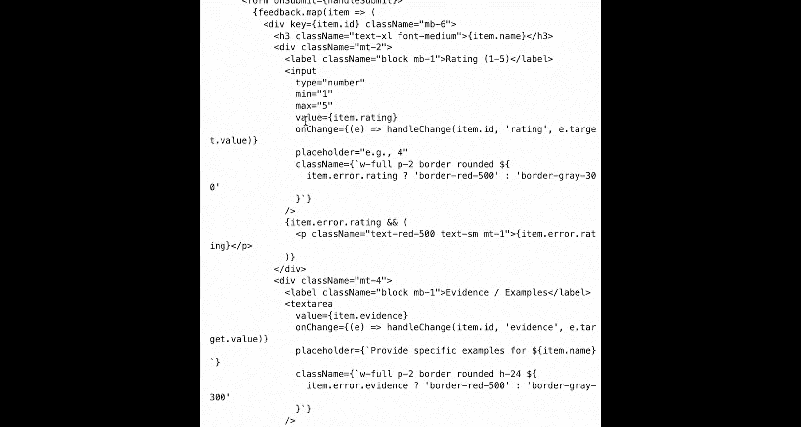

现在，我们使用相同的提示词，用o1模型重复这个过程。

```python
# 使用o1生成代码
o1_prompt = "请根据以上要求，生成React面试反馈表单的代码。"
o1_code = get_chat_completion("o1-mini", o1_prompt)
print(o1_code)
```

代码生成后，我们同样进行渲染。下图展示了o1生成的表单效果：


我们可以看到，o1生成的无疑是一个更优秀的应用。它为不同的评分数字使用了下拉菜单，完整遵循了所有指令（而非只包含部分类别），并且提供了一个美观的绿色反馈框。

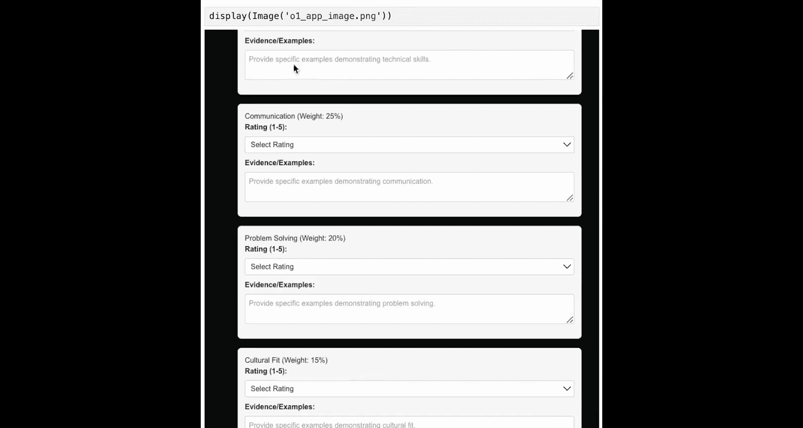

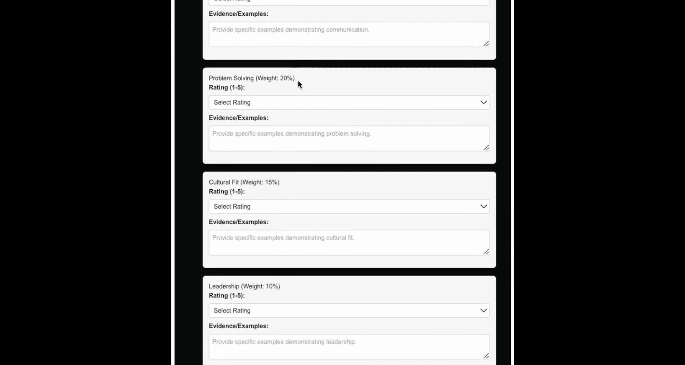

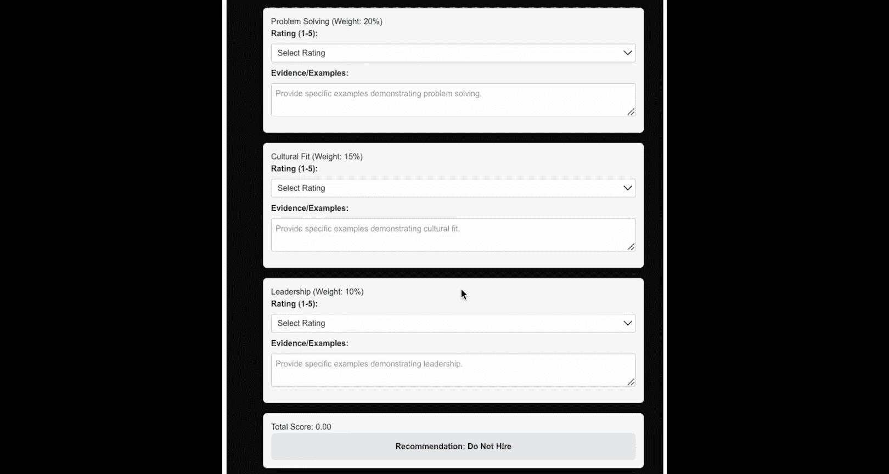

这个简单的例子展示了当你有一个应用的高层设计并希望获得一个良好的起点时，o1如何提供帮助。在相同的提示下，o1通常能比GPT-4o走得更远一些。

如果你想亲自尝试这段代码，可以按照Notebook中的说明，将代码复制到编辑器中，它将渲染出表单。你可以看到在填写内容时推荐信息的变化，并且可以提交反馈。Notebook中还提供了如何下载包含可在本地计算机上运行的应用程序的zip文件的说明。

---

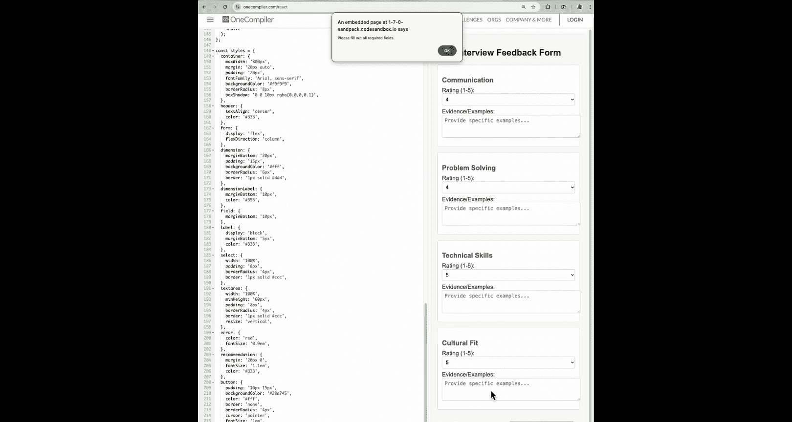

## 编辑现有代码

接下来，我们将转向编辑现有代码，展示o1如何提供有用的反馈，从而再次产生优于GPT-4o的代码。

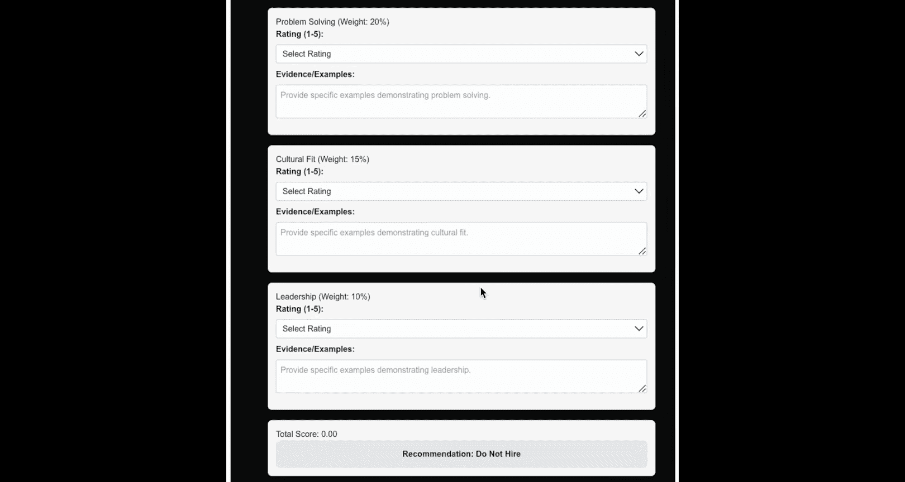

为了比较GPT-4o和o1的代码编辑能力，我们准备了一段存在明显问题的代码，例如多重嵌套循环、缺乏错误处理，并且整体可读性不佳。

我们将这段代码同时提供给两个模型，观察它们如何清理代码。然后，我们将使用o1模型作为“裁判”来评估两个生成的代码块，并告诉我们哪个更好。

我们再次从一个简单直接的提示词开始，首先使用GPT-4o进行生成。

提示词如下：“我有一段需要清理和改进的代码，请只返回修复了问题的更新后的代码。”然后附上我们之前展示的代码片段。

```python
# 待改进的原始代码
problematic_code = """
def process_data(data):
    result = []
    for i in range(len(data)):
        for j in range(len(data[i])):
            for k in range(len(data[i][j])):
                val = data[i][j][k]
                if val > 0:
                    result.append(val * 2)
    return result
"""

# 使用GPT-4o改进代码
edit_prompt_gpt4o = f"请清理并改进以下代码，只返回更新后的代码：\n{problematic_code}"
gpt4o_edited_code = get_chat_completion("gpt-4o", edit_prompt_gpt4o)
print("GPT-4o改进后的代码：")
print(gpt4o_edited_code)
```

现在，我们生成改进后的代码。乍一看，结果似乎好了一些。但让我们生成o1的代码，然后用大语言模型作为裁判来比较两者。

```python
# 使用o1改进代码
edit_prompt_o1 = f"请清理并改进以下代码，只返回更新后的代码：\n{problematic_code}"
o1_edited_code = get_chat_completion("o1-mini", edit_prompt_o1)
print("o1改进后的代码：")
print(o1_edited_code)
```

同样，结果看起来是合理的。但最好的判断方法是利用AI来比较两者。我们使用o1作为评分员，因为在这种需要细微、多步骤推理的过程中，o1通常比GPT-4o表现更好。

我们再次使用一个简单直接的提示词：“哪段代码更好？为什么？选项1是GPT-4o的代码，选项2是o1的代码。”

```python
# 使用o1作为裁判进行评估
judge_prompt = f"""
请评估以下两段代码，指出哪段更好并说明原因。
选项1 (GPT-4o):
{gpt4o_edited_code}

选项2 (o1):
{o1_edited_code}

请只返回评估结果，格式为：'更好的代码是：选项X。原因：...'
"""
judgment = get_chat_completion("o1-mini", judge_prompt)
print("裁判评估结果：")
print(judgment)
```

评估结果已出。o1推断两者都在尝试做同一件事，但两个实现之间存在几个关键差异，使得选项2（o1的代码）更好。它指出了可读性和结构、错误处理和健壮性（选项2选择了更有效的方法）、数据处理和计算、调试和日志记录以及一般的性能考虑。

这再次提供了一个有用的例子，说明即使你不依赖GPT-4o作为代码编辑器或代码助手来帮助你解决问题和编辑现有代码，o1在这方面也表现得相当出色。

---

## 总结

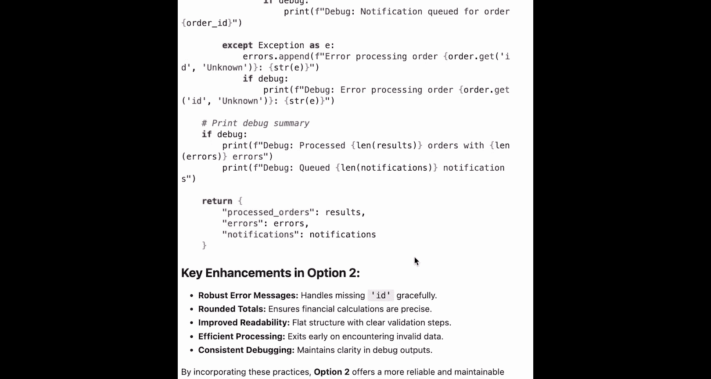

本节课中，我们一起学习了如何使用o1来辅助编程。无论是创建全新的应用程序，还是帮助改进现有代码，o1都能提供有力的支持。特别是在你拥有高层设计并希望获得一个出色的初步实现时，o1展现出了巨大的潜力。我们期待在下一阶段与你一起，探索o1如何在图像上进行推理。