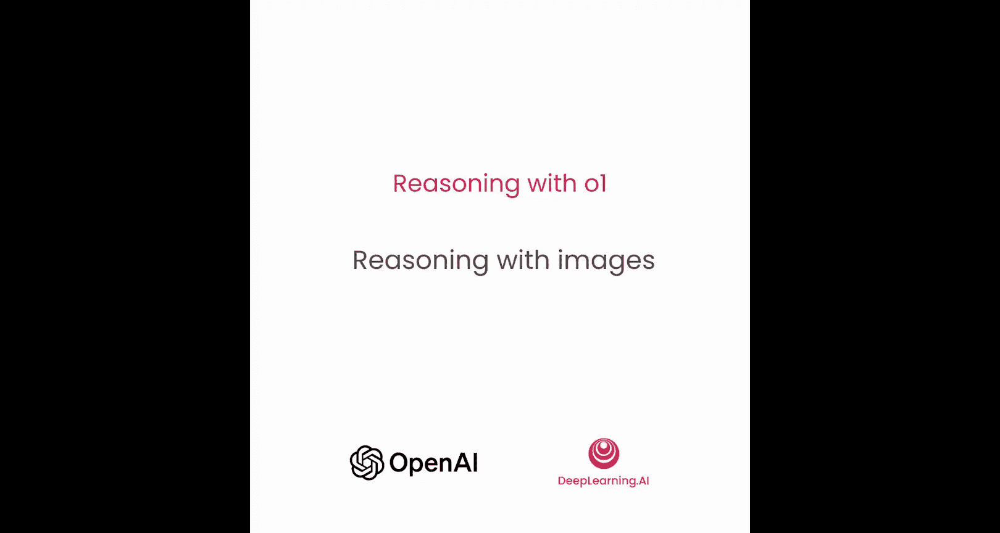
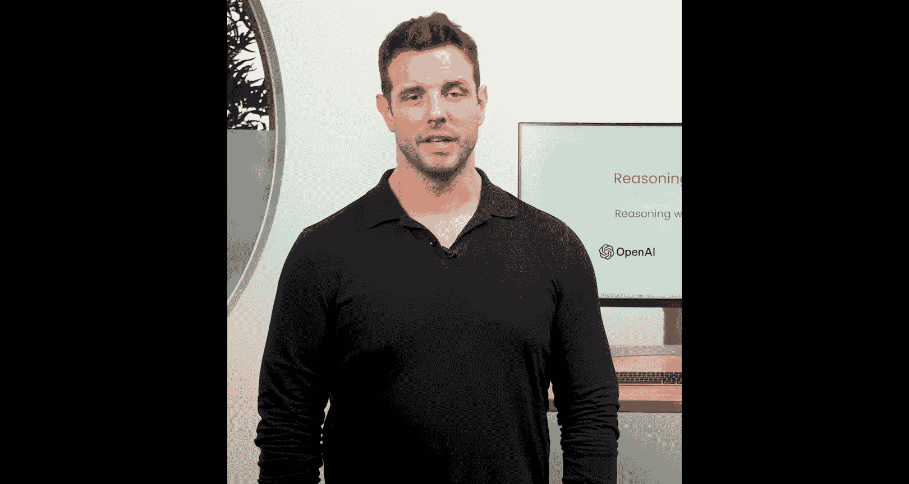
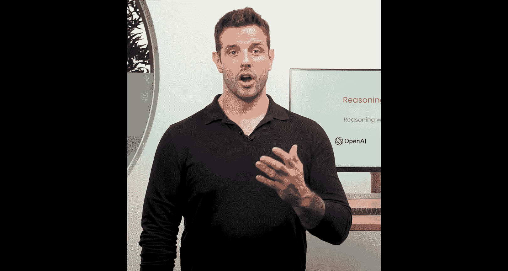
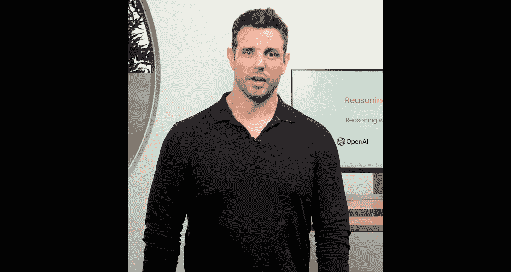
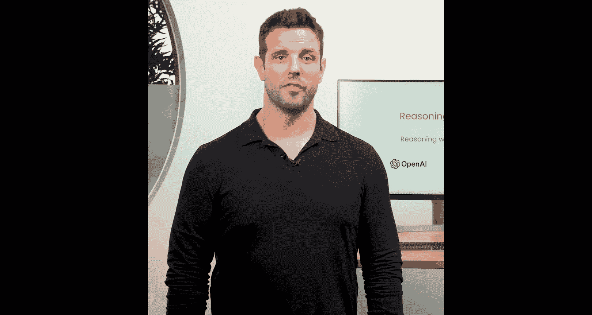
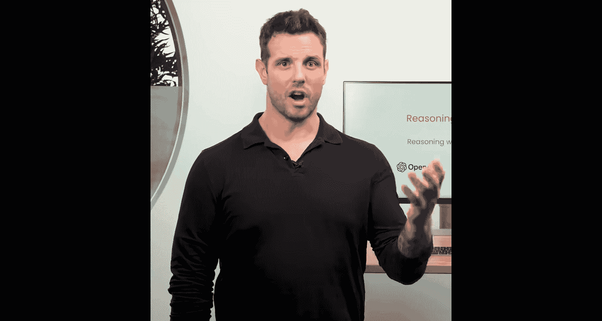
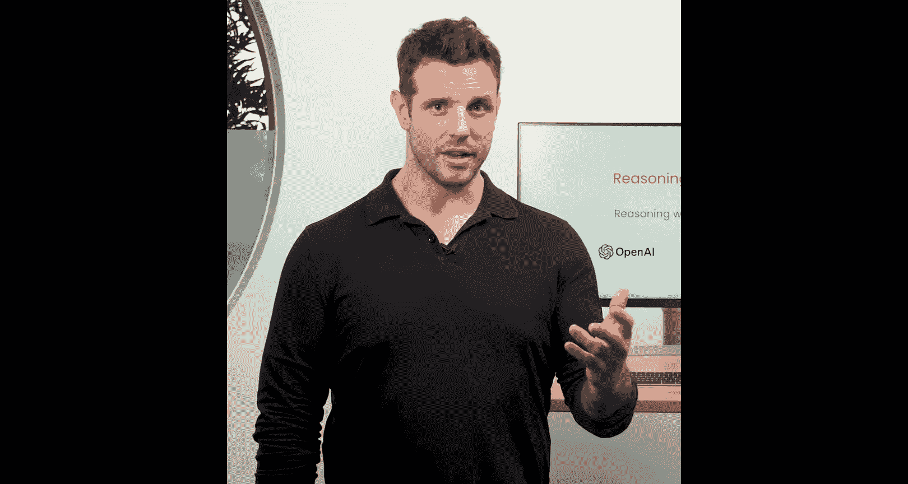
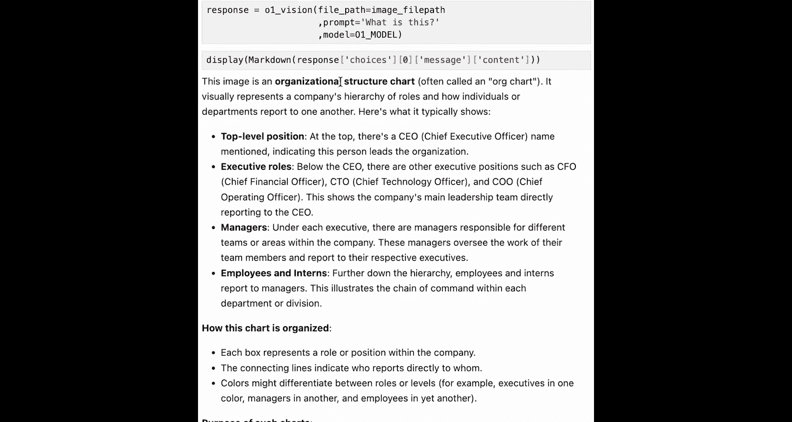
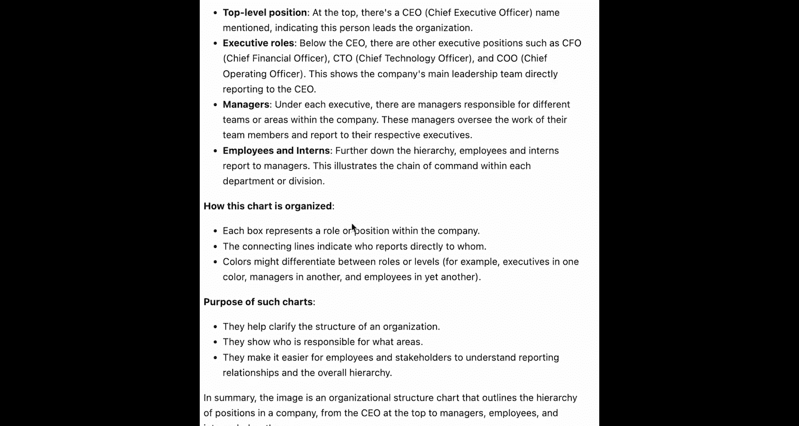
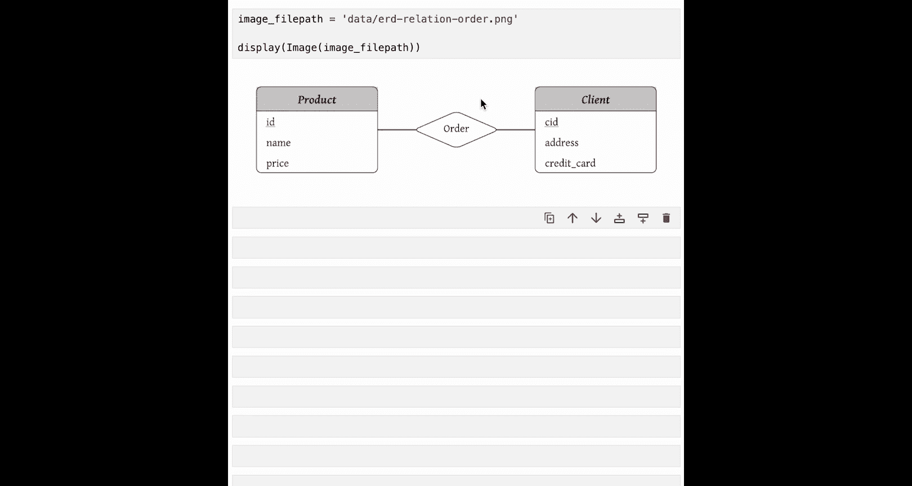

# 006：图像推理 🖼️



在本节课中，我们将要学习如何利用o1模型进行图像理解。我们将探讨o1与GPT-4在图像理解能力上的差异，并通过一个组织架构图的实际案例，演示如何将图像信息提取为结构化数据，以便进行后续的文本问答分析。



## 模型图像理解能力对比

上一节我们介绍了o1模型的基本推理原理，本节中我们来看看它在图像理解方面的具体表现。







GPT-4在理解图像方面可以表现良好，但通常需要思维链提示、少量示例或微调才能达到最佳效果。







相反，o1在开箱即用的情况下就能很好地理解图像。这是由于它在推理过程中遵循的“测试与学习”方法，使其在提供答案之前有多次机会检测幻觉。


一个新兴的用例是预先承担o1的延迟和成本，对图像进行预处理，并用丰富的细节为其建立索引，以便后续用于问答。这很有趣。


## 实战：处理组织架构图

对于这个图像推理任务，我们将使用一个虚构组织的架构图。这是一种包含空间推理的微妙图表，GPT-4通常会在此类图表上产生幻觉，但我们发现o1的表现要好得多。这归功于我们之前提到的测试与学习方法，它会先对图表传达的信息形成初步印象，然后不断迭代，直到认为自己对该图表的用途有了一个像样的概述。

我们将从相当基础的问题开始，先让o1告诉我们这是什么，然后我们将转向一个我们发现客户在现实世界中经常使用的实际用例：使用o1进行图像理解，并提取一个详细的JSON来描述该图像及其中的详细内容，然后你可以进行纯文本的后续操作来解释这些信息。这样，你就不必每次都为处理图像支付额外的成本和延迟，而是用o1以高质量、详细的方式有效地预处理它，然后将其用于后续的问答。

让我们继续，看看这在实践中是如何运作的。和往常一样，我们将从导入开始。

### 环境准备

以下是我们的标准库，我们将视觉请求存储在一个工具文件中，并在这里导入。为此，我们将使用新的主线o1模型，因为它是能够进行图像推理的模型。

```python
# 导入必要的库和变量
import openai
from utils import vision_request
```

为了理解我们将要处理的图像，你应该打开我们提供的组织架构图文件。你将能够看到，顶部有一位CEO，下面是他们的C级高管、经理，然后是这些经理的下属。



### 基础图像描述



我们将从一个简单的问题开始：“这是什么？”，以便获得该组织架构图图像中包含内容的详细说明。

```python
# 发起一个简单的图像描述请求
prompt_basic = "What is this?"
response_basic = vision_request(prompt_basic, image_path="org_chart.png", model="o1")
print(response_basic)
```

模型会给你一个详细的说明：这是一个组织结构图，它指出了不同的层级，并简要描述了图表的组织方式和目的。


这很有信息量，但不是特别有用，所以我们接下来要做的是将其处理成数据，以便我们可以用于后续问题，从而在此组织架构图的基础上进行分析，并理解这些不同角色如何相互关联的细节。

### 提取结构化数据

我们即将在这里进行的工作，是我们开始真正看到从GPT-4到o1在图像理解质量方面的改进。我们之前在GPT-4上看到的是，它通常可以对图像内容给出一个高层次的描述。但一旦你开始询问关于空间推理的微妙问题，比如那个箭头指向什么，或者组织架构图中谁向谁汇报，GPT-4的表现会不一致，通常需要少量示例或微调才能达到体面的性能水平。

我们在这里用o1应该看到的是，开箱即用，它的表现会相当好，并且能够将我们相当复杂的组织架构图简化为一个简单的JSON数组，然后我们可以用它进行分析。

为了实现这一点，我们这里有一个结构化的提示，再次运用我们在第2课中学到的原则。我们有一些指令，其中有一个处理组织数据的咨询助手，我们希望它提取组织层级。我们为它指定了我们想要的JSON格式。

```python
# 用于提取组织层级结构的结构化提示
prompt_extract = """
You are a consulting assistant who processes organizational data.
Extract the hierarchy from the provided organizational chart image.

Return the data as a JSON array of objects. Each object should represent a person and have the following keys:
- `id`: An arbitrary unique integer ID for the person.
- `name`: The person's name.
- `role`: The person's role/title.
- `reports_to`: An array of IDs representing who this person reports to. (Empty array if they report to no one).
- `direct_reports`: An array of IDs representing who reports directly to this person.
"""
```

所以我们希望它为每个人编造一个任意的ID、姓名、角色，然后给我们一个他们汇报对象的ID数组和一个向他们汇报的ID数组。一旦我们有了这个，我们就有了将图像中的关系编码为数据的东西，并使其能够进行持续处理。

```python
# 执行提取请求
response_extract = vision_request(prompt_extract, image_path="org_chart.png", model="o1")
print(response_extract)
```

你执行这个单元格，我们打印出提示。现在，你可以将该提示与图像一起输入到o1请求中。如果我们运行它并打印结果，我们应该收到一个JO字典数组，它描述了该组织架构图中的不同人员以及他们彼此之间的关系。

你现在可以在面前看到该组织架构图的数据表示了。我们得到了我们的字典数组。每个都包含那个任意的ID。如果我们只核对第一个，我们有Juliana Silva，CEO，ID 1，我们可以看到她不向任何人汇报，她是CEO，这是正确的，她的下属是编号2、3和4。如果我们检查2、3和4，这些确实是CFO、CTO、COO，很好。

### 基于数据的问答分析

现在你已经将这个组织架构图简化为数据，你现在可以用它进行分析了，所以让我们继续，在此数据基础上做一些问答，看看o1是否能够使用处理过的数据来准确回答一些关于组织架构图的问题。

你可以先加载o1的响应，假设它是JSON。然后我们可以创建一个提示，将这些数据添加到其中，然后向它提问。

```python
import json

# 假设 response_extract.content 包含 JSON 字符串
org_data = json.loads(response_extract.content)

# 创建分析提示
analysis_prompt = f"""
You are an org chart expert assistant. Your role is to answer any org chart questions using the provided organizational data.

<org_data>
{json.dumps(org_data, indent=2)}
</org_data>
"""
```

在你向AI数据提出分析问题之前，你需要初始化一个新的OpenAI客户端。我们不使用o1视觉请求的原因是，我们现在只是发出一个纯文本请求。既然我们已经预处理了那个图像，我们不需要每次发送图像，我们只是使用我们提取的数据，并用它进行我们的问答。

```python
# 初始化OpenAI客户端（纯文本）
client = openai.OpenAI(api_key="your-api-key")

# 构建包含数据和问题的请求
question = """
Based on the organizational data provided:
1. Who has the highest-ranking direct reports?
2. Which manager has the most direct reports?
"""

full_prompt = analysis_prompt + "\n\n" + question

response_analysis = client.chat.completions.create(
    model="gpt-4", # 或任何适合纯文本分析的模型
    messages=[
        {"role": "user", "content": full_prompt}
    ]
)
```

这里你有一个简单的请求。你有了开头的分析提示，然后这里有一个结构化的问题。其中包含两个问题。1. 谁拥有最高级别的直接下属？2. 哪个经理拥有最多的直接下属？

```python
# 打印分析结果
print(response_analysis.choices[0].message.content)
```

你可以将结果显示为Markdown。我们可以解读我们得到的答案。首先，Juliana Silva，CEO，拥有最高级别的直接下属。这是正确的。她所有的下属都是C级高管。哪个经理拥有最多的下属？首先，它成功地筛选出只有角色为经理的人。确实，这两个人确实拥有最多的直接下属。所以这是对问题的正确答案，也是我们图像理解任务的结论。

## 扩展练习：实体关系图

在我们结束之前，我想再分享一个例子，以便你可以将所学知识应用并测试到一个新的图像和领域。

在文件夹中，你可以看到我们包含的一张实体关系图照片。这是图像理解的一个很好的用例。想象一下你处理过的所有数据仓库，都有一个复杂的ERD，需要本地的数据科学家或仓库的所有者为你讲解。现在，我们可以通过图像理解将其提供给o1，并让它为你解析。

所以，给你的挑战是为这个实体关系图想出几个用例。例如，你可能想要求具有视觉功能的o1生成一个订单记录表，这些记录具有链接到这些产品和客户表的ID，然后让它生成SQL来实际查询这三个表。在这些情况下，生成合成数据是我们为客户站点使用视觉功能的一个很好的用例。

我们非常有兴趣看到你想出什么用例，并且非常兴奋地看到你将o1与图像理解用于什么用途。

期待在下一课与你见面，我们将深入探讨提示工程，如何使用o1自动优化你的提示。期待在那里见到你。



## 总结


本节课中我们一起学习了o1模型在图像推理方面的强大能力。我们了解到o1通过其“测试与学习”的推理方法，在开箱即用的情况下就能出色地理解复杂图像，避免了GPT-4可能产生的幻觉问题。通过将组织架构图提取为结构化JSON数据的实战案例，我们掌握了如何利用o1预处理图像信息，并将其转化为可用于高效、低成本后续问答分析的数据源。最后，我们探讨了将此方法应用于实体关系图等其他领域的可能性。