# 007：元提示工程 🧠

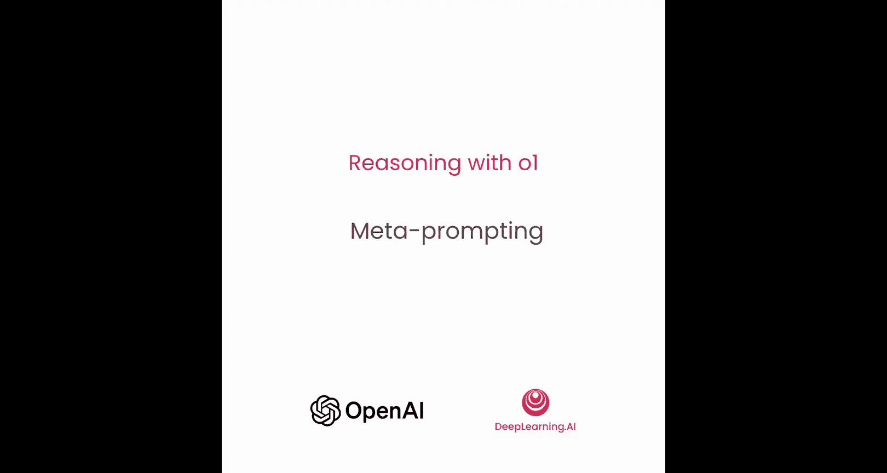


在本节课中，我们将学习如何使用更智能的模型（如o1）来迭代优化一个相对简单的模型（如GPT-4o）的指令，这个过程被称为“元提示工程”。我们将通过一个具体的用例——将面向人类的知识库文章转换为适合LLM执行的“规程”——来演示这一过程。

## 概述

优化大型语言模型以达到生产级别的准确性，是开发者面临的主要挑战之一。面对众多的提示工程、RAG和微调方法，如何确定正确的优化方向并解决评估问题，本身就是一个难题。幸运的是，o1模型似乎非常擅长处理这类用例。本节课程将重点介绍如何使用o1-mini，结合一组评估集，来优化特定任务的提示，并提升评估分数。

## 步骤一：从原始策略生成规程

上一节我们介绍了元提示工程的概念，本节中我们来看看具体如何操作。首先，我们需要将面向人类编写的知识库策略，转换为适合LLM执行的“规程”。

我们以一份航班取消与改签政策为例。这份政策是为人类客服设计的，内容分散，没有明确告知LLM哪些是外部操作，哪些可以直接执行。我们的第一步是使用o1来重写这份政策，使其指令更清晰、更易于LLM可靠地遵循。

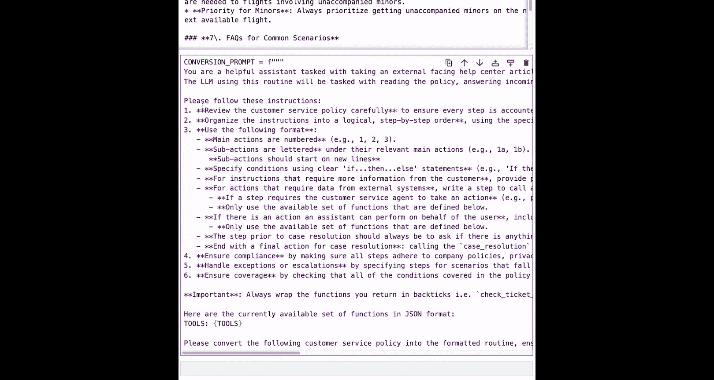

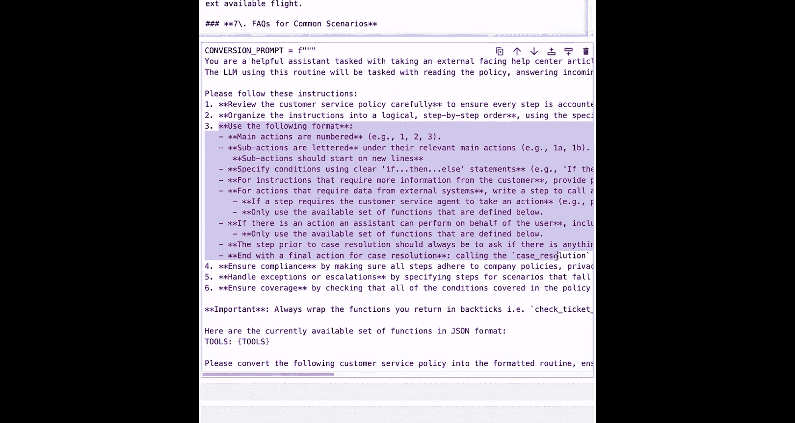

以下是用于转换的提示词，它定义了目标并给出了转换过程的指令：

```python
conversion_prompt = """
目标：将面向人类客服的策略文档，转换为适合LLM执行的、结构化的规程。
指令：
1. 仔细阅读提供的策略文档。
2. 将策略中的各个流程分解为独立的、有明确界限的指令集。
3. 为每个指令步骤指定LLM应调用的函数。
4. 确保规程易于程序化地遵循和执行。
5. 只使用提供的函数列表，不要创建新的函数。
6. 输出格式请遵循指定的结构化格式。

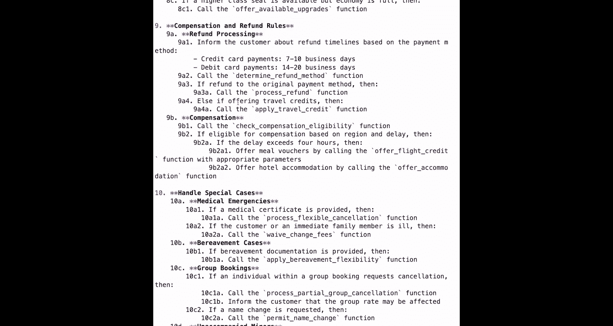

请将以下策略转换为格式化的规程：
{policy}
"""
```

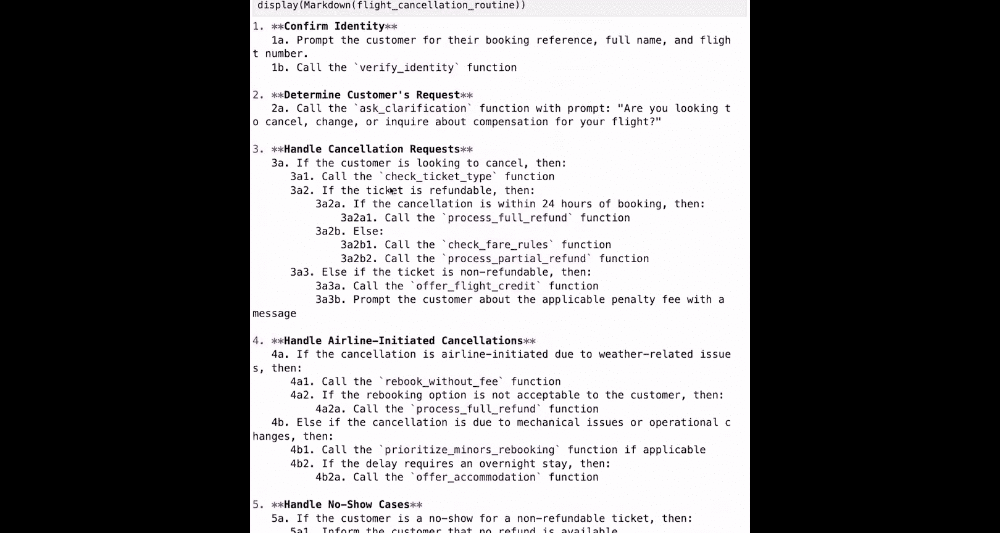

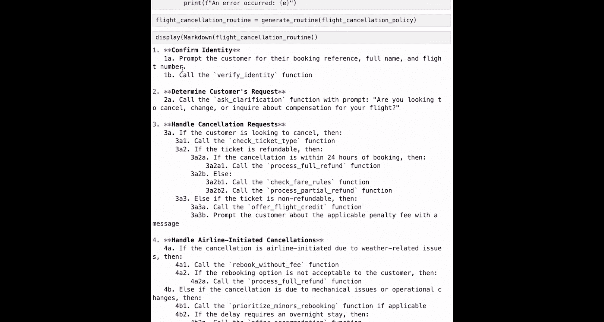

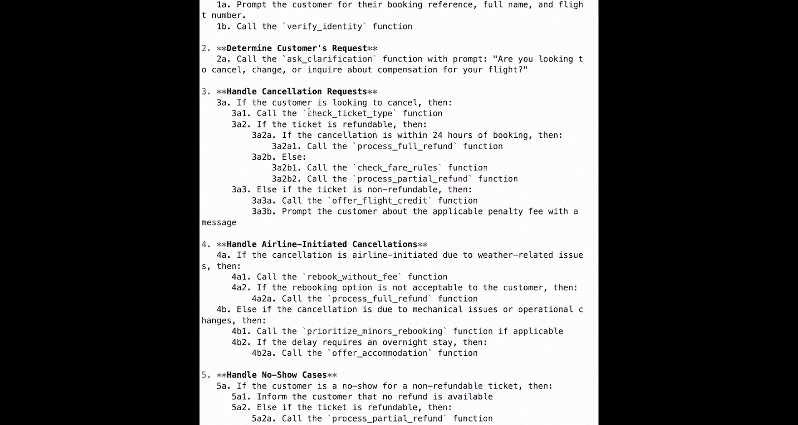

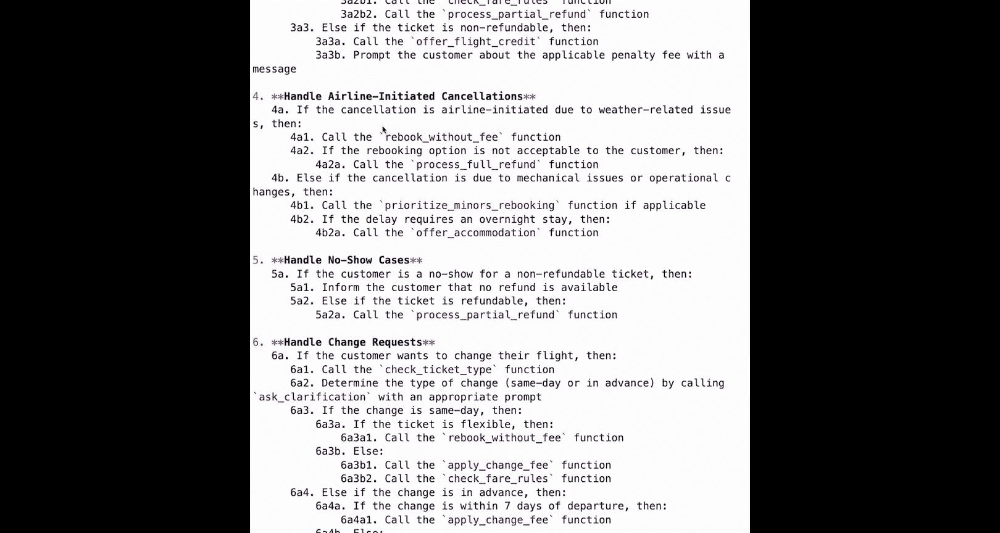

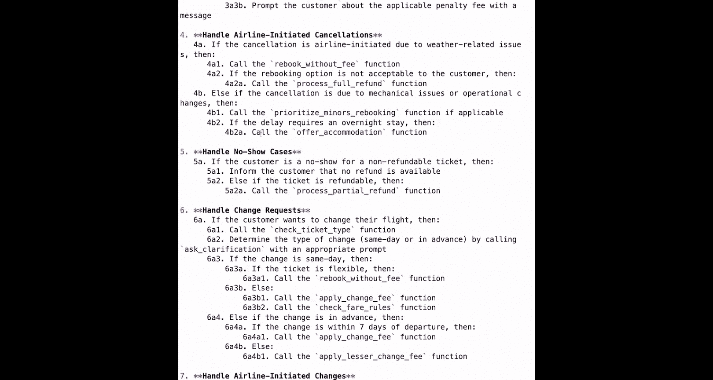

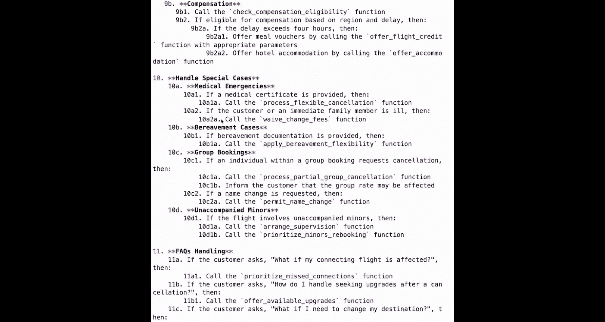

我们定义一个函数来执行此转换：

```python
def generate_routine(policy):
    response = client.chat.completions.create(
        model="o1-mini",
        messages=[
            {"role": "system", "content": "你是一个将人类策略转换为LLM规程的助手。"},
            {"role": "user", "content": conversion_prompt.format(policy=policy)}
        ]
    )
    return response.choices[0].message.content
```

运行此函数后，我们得到了第一个由LLM生成的规程。这个规程将原始策略中的复杂流程分解为清晰的、分步骤的指令，并为每个步骤指定了应调用的函数，使得LLM的逻辑判断（如if-then-else）变得更加简单。

在评估之前，我们需要检查生成的规程是否存在数据质量问题，例如是否使用了未定义的函数。

## 步骤二：评估规程性能

在生成了初始规程之后，我们需要评估它的性能。本节我们将建立一个多轮对话评估框架。

评估的核心思想是模拟一个真实的客户服务场景。我们有一个评估集，其中每个例子都包含：
*   **客户请求**：对话的起始点。
*   **客户信息**：用于模拟客户在对话中提供的信息。
*   **预期响应**：正确的最终响应（包括调用的工具和参数）。

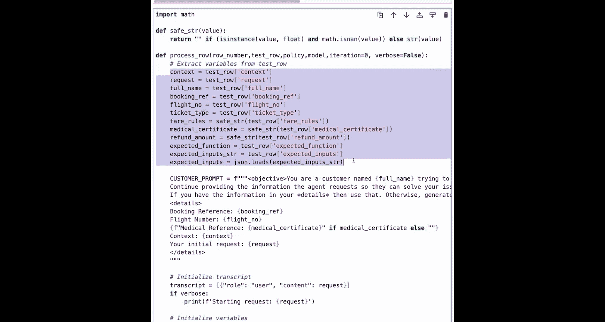

我们设计多轮评估是因为客户服务通常是多回合的。流程如下：
1.  将o1生成的规程作为策略提供给GPT-4o智能体。
2.  从一个硬编码的客户请求开始。
3.  同时启动一个模拟客户，它根据评估集中定义的信息与智能体进行多轮对话。
4.  对话持续进行，直到智能体调用一个“退出工具”（如退款、改签），此时对话终止。
5.  对于每个评估记录，我们评估两点：**是否正确调用了工具**，以及**是否提供了正确的参数**。

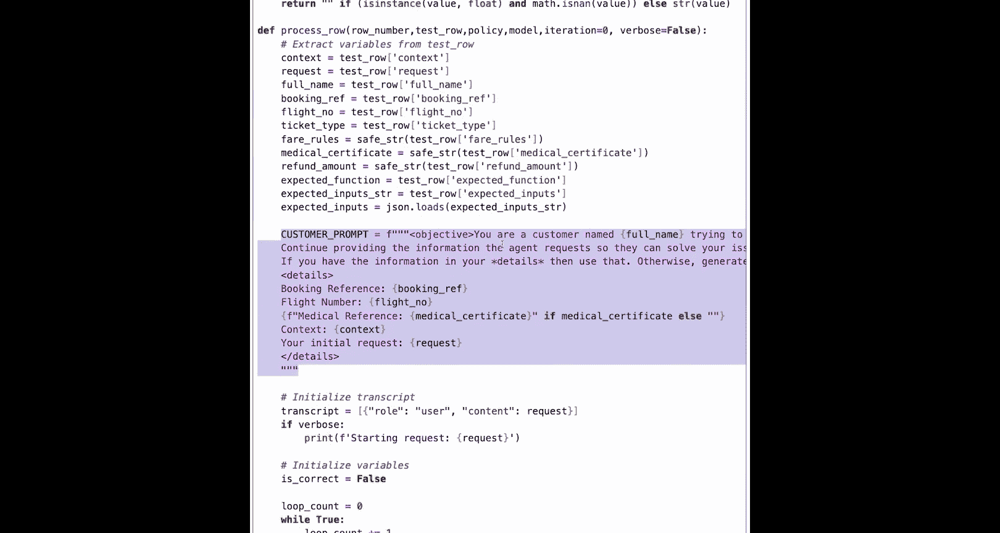

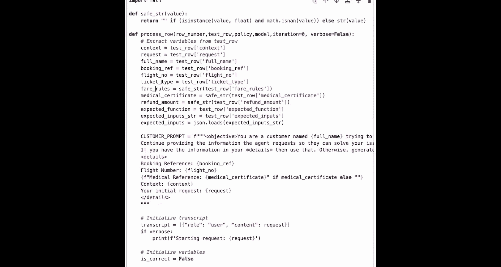

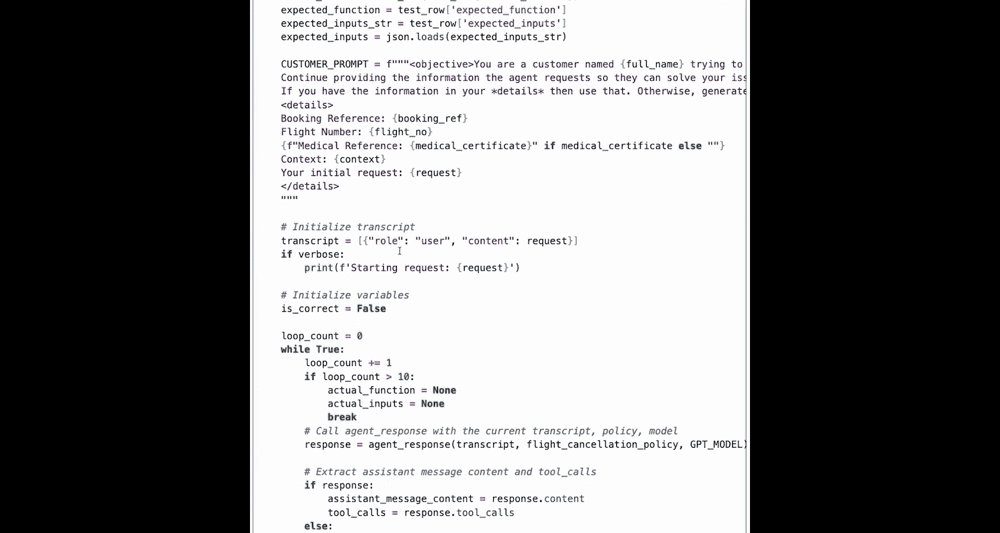

以下是评估循环中处理单行评估数据的核心函数逻辑：

```python
def process_row(row, policy, model):
    # 初始化客户系统提示词，包含基本信息
    customer_sys_prompt = f"""你是客户。{row['context']} 你的名字是{row['name']}，预订号是{row['booking_reference']}，航班号是{row['flight_number']}。"""
    transcript = [{"role": "user", "content": row['request']}]

    for turn in range(MAX_TURNS):
        # 获取智能体响应
        agent_response = get_agent_response(transcript, policy, model)
        transcript.append({"role": "assistant", "content": agent_response})

        # 检查是否调用了工具
        if tool_called(agent_response):
            tool_name = extract_tool_name(agent_response)
            if tool_name in EXIT_TOOLS:
                # 对话结束，评估结果
                return evaluate_result(row, tool_name, agent_response)
            else:
                # 模拟工具执行结果，并生成客户回复，继续对话
                tool_result = simulate_tool_call(tool_name, row)
                customer_reply = generate_customer_reply(tool_result, row)
                transcript.append({"role": "user", "content": customer_reply})
        else:
            # 智能体未调用工具，生成客户回复继续对话
            customer_reply = generate_customer_reply(None, row)
            transcript.append({"role": "user", "content": customer_reply})
    return None  # 超过最大轮数，评估失败
```

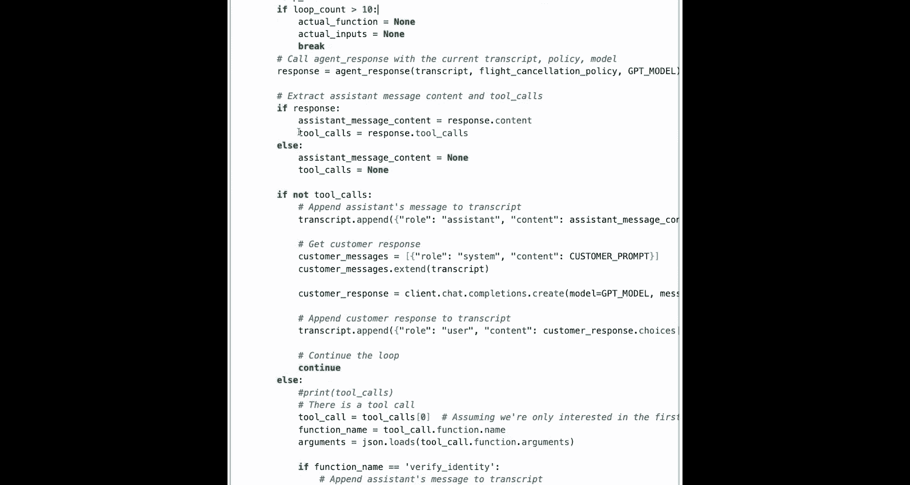

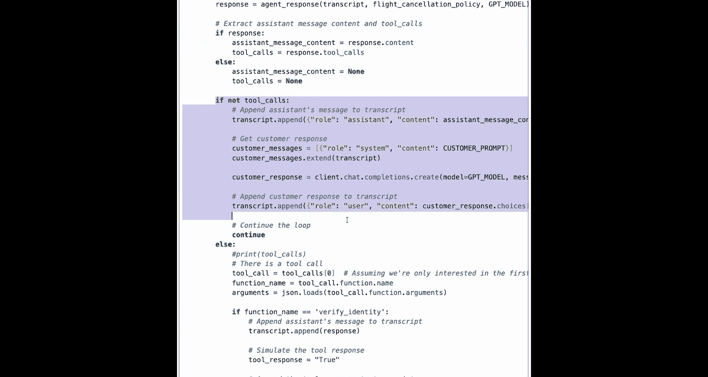

运行基线评估后，我们得到了一个准确率（例如65%）。通过查看错误案例，我们可以发现智能体在遵循规程时出现的问题，例如错误地提供了航班积分而非部分退款，或者在多轮对话中未能成功获取必要信息。

## 步骤三：通过元提示工程优化规程

有了基线评估结果，我们现在进入最关键的步骤：使用元提示工程来优化GPT-4o的规程。

元提示工程的核心是让更智能的o1模型分析评估结果，找出规程中的问题，并生成改进后的新规程。我们将进行多次迭代。

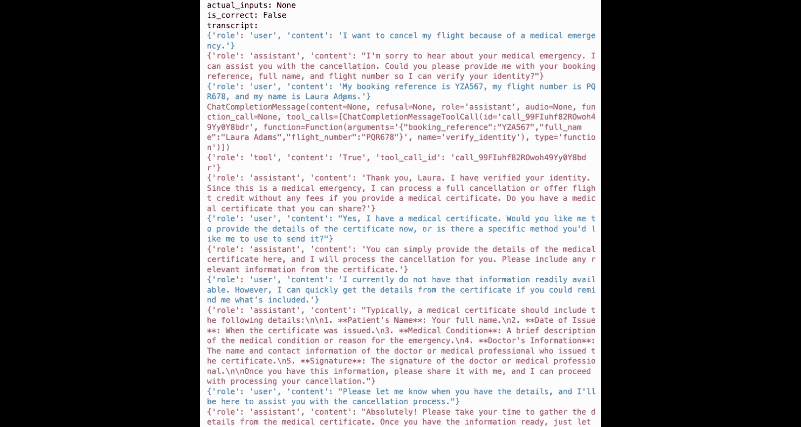

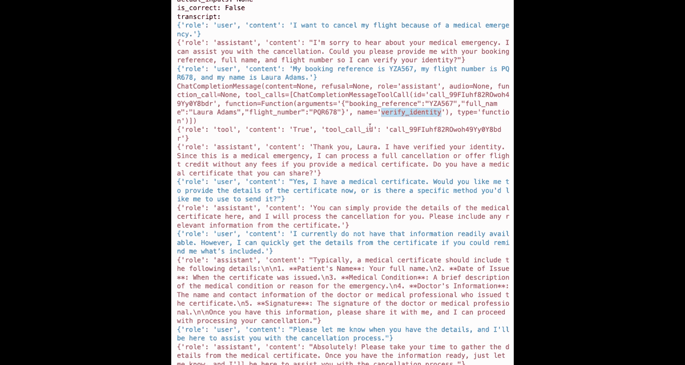

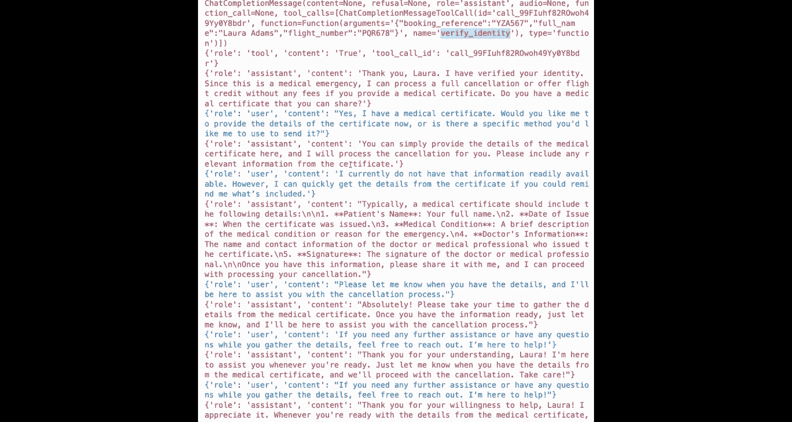

首先，我们定义向o1发送的元提示词。这个提示词需要包含：
1.  o1的角色定义（优化指令的智能体）。
2.  优化目标（分析问题、改进规程、确保合规）。
3.  提供的材料（原始策略、可用函数列表、当前规程、评估结果，可能还有历史编辑记录）。
4.  输出格式要求（使用JSON结构化输出，返回更新后的规程）。

```python
meta_prompt = """
你是一个负责优化指令质量的智能体。你被给予以下材料：
1. 原始的人类编写策略。
2. 可用的函数列表。
3. 当前的LLM规程指令。
4. 使用该规程在评估集上的结果。

请分析现有指令，找出任何问题。改进它们以解决发现的不足，并确保所有更改都符合原始策略。你只能使用提供的工具列表。

请将改进后的规程以以下JSON格式返回：
{{
  "updated_routine": "这里放置完整的、改进后的规程文本"
}}
"""
```

接下来，我们设置元提示循环。循环多次（例如3次），每次：
1.  将当前规程、评估结果和历史信息（在token限制内）发送给o1。
2.  o1分析并生成新的规程。
3.  使用新规程在评估集上再次运行评估。
4.  记录新的准确率。
5.  为下一次迭代准备数据。

以下是循环的核心逻辑：

```python
routines = [initial_routine]
results = []
accuracies = []

for i in range(NUM_ITERATIONS):
    # 准备发送给o1的消息，包含历史数据
    messages_for_o1 = prepare_messages(original_policy, available_functions, routines[-1], results, accuracies)

    # 从o1获取更新后的规程
    response = get_openai_response(model="o1", messages=messages_for_o1, response_format=json_schema)
    new_routine = response.parsed.updated_routine
    routines.append(new_routine)

    # 使用新规程进行评估
    new_results_df, new_accuracy = run_evaluation(new_routine, eval_dataset)
    results.append(new_results_df)
    accuracies.append(new_accuracy)

    print(f"Iteration {i+1} Accuracy: {new_accuracy:.2%}")
```

运行元提示循环后，我们观察到准确率的变化。例如，基线为65%，第一次迭代后可能变为71%，第二次迭代后提升到88%，第三次迭代可能略有回落到82%。我们会选择准确率最高的规程（如第二次迭代的88%）作为最终优化结果。

检查这个最佳规程，我们发现o1可能采用了一些非传统的优化方式，例如改变了步骤的注释格式或调整了逻辑顺序，从而显著提升了性能。

## 总结

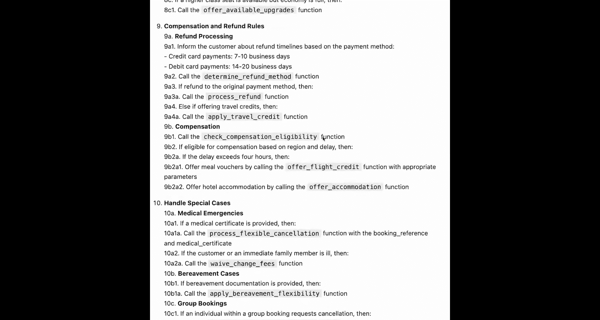

本节课中我们一起学习了元提示工程的完整流程。

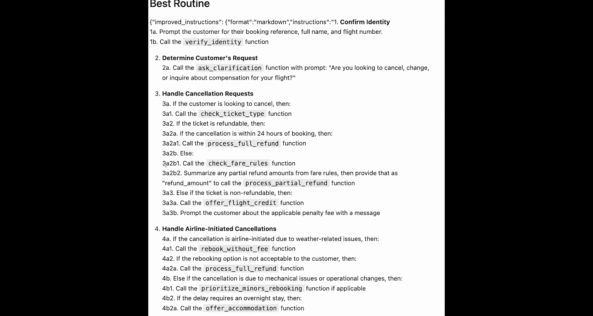

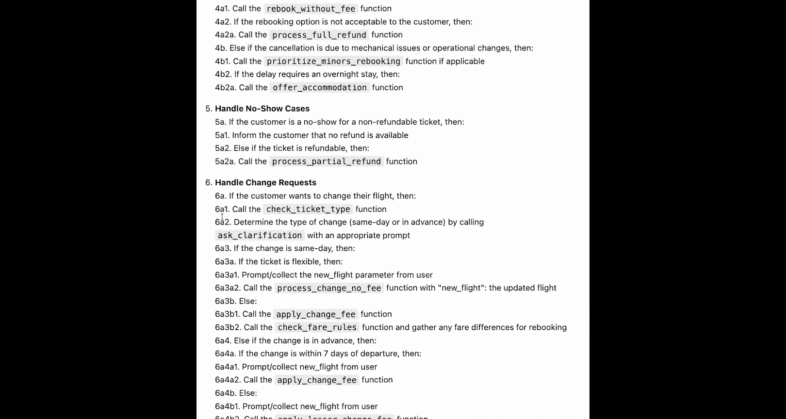

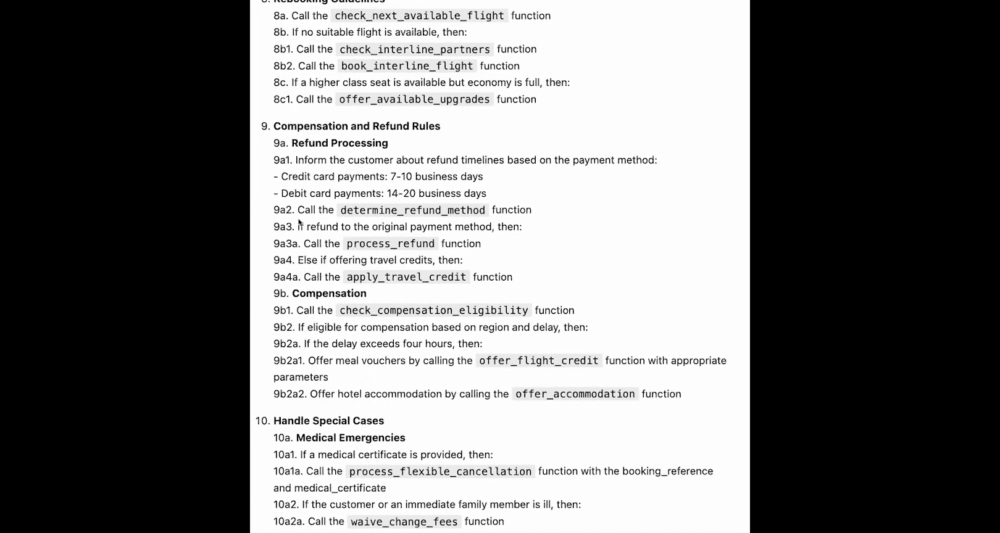

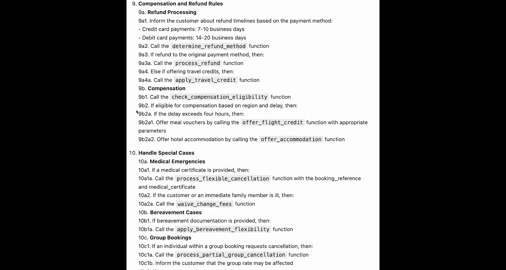

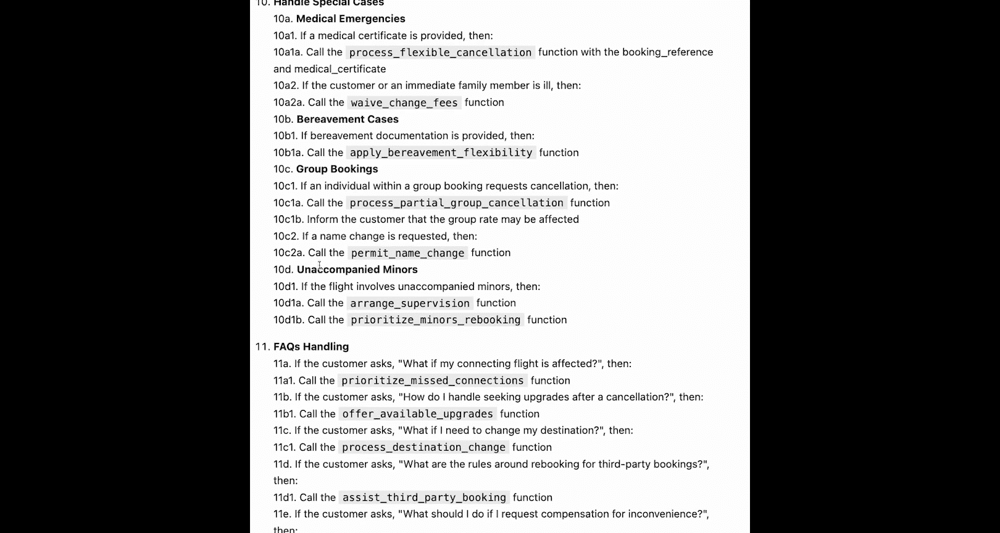

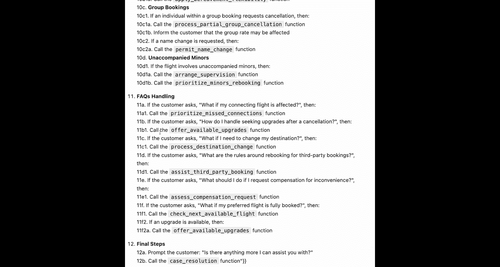

我们首先从一个为人类客服编写的知识库策略出发，使用o1将其转换为适合LLM执行的规程。接着，我们创建了一个多轮对话评估框架，模拟AI客户与基于规程的AI智能体之间的交互，并得到了基线评估分数。

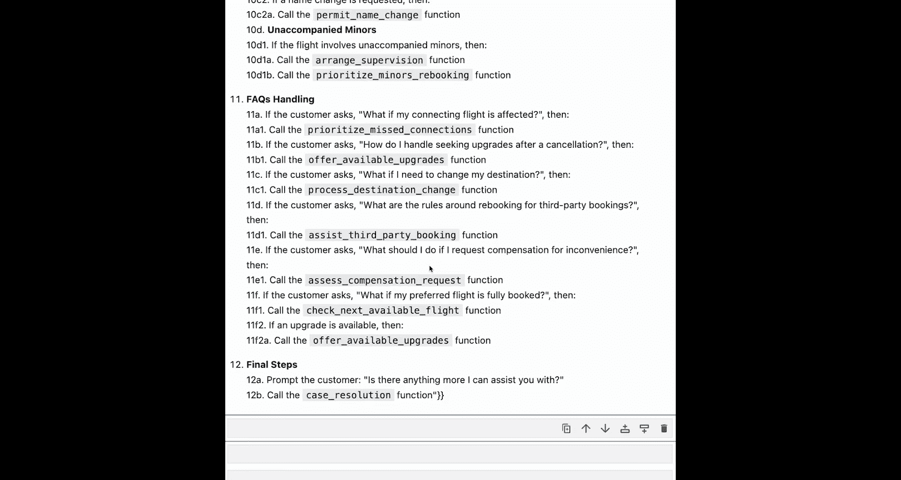

由于对基线结果不满意，我们进行了第三步——元提示工程。通过多次迭代，让o1分析评估结果并优化规程，最终成功将评估准确率从基线水平显著提升。

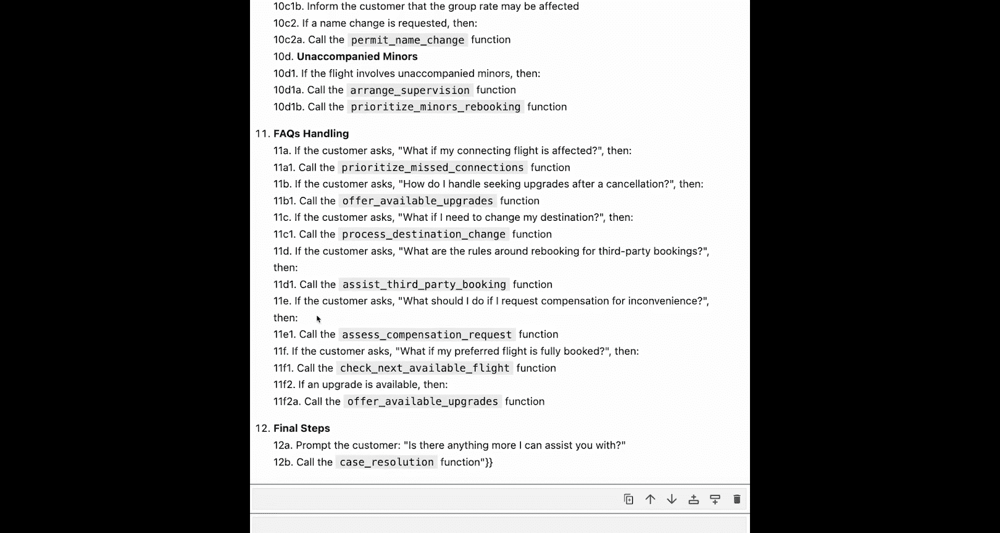

元提示工程不仅适用于客户服务场景，任何涉及多轮对话、需要迭代优化变量或工具使用的复杂任务，都可以应用这种方法。希望本课程能为你提供启发，并期待看到你利用这些能力构建出出色的应用。