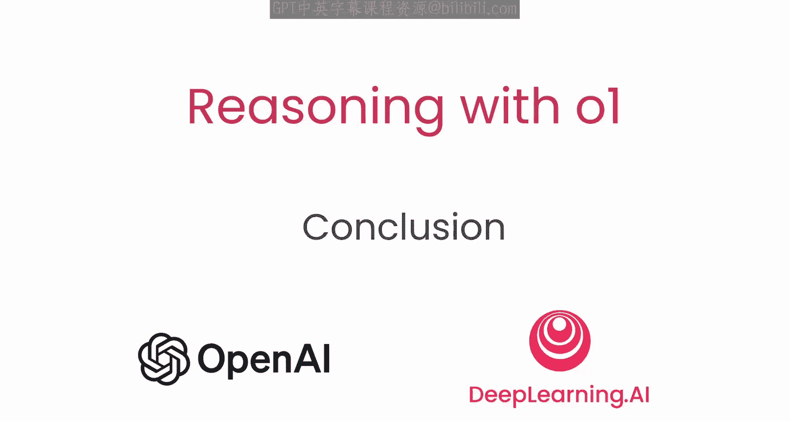

# 008：结论

在本节课中，我们将回顾并总结关于推理模型的核心知识，包括其工作原理、提示方法以及实际应用案例。

## 课程回顾 🧠

上一节我们探讨了推理模型的具体应用场景，本节中，我们将对整个课程内容进行总结。

在本课程中，你学习了我们的推理模型如何工作，以及如何对它们进行提示。

你还了解了一些开发者正在现实世界中交付的优秀应用案例。

你现在已经掌握了开始使用这类新型模型进行构建所需的知识。

我们非常期待看到你将创造出什么。

---

本节课中我们一起学习了推理模型的基础原理、提示技巧及其多样化的实际应用。你现在已经具备了利用这类强大模型进行创新开发的基础。