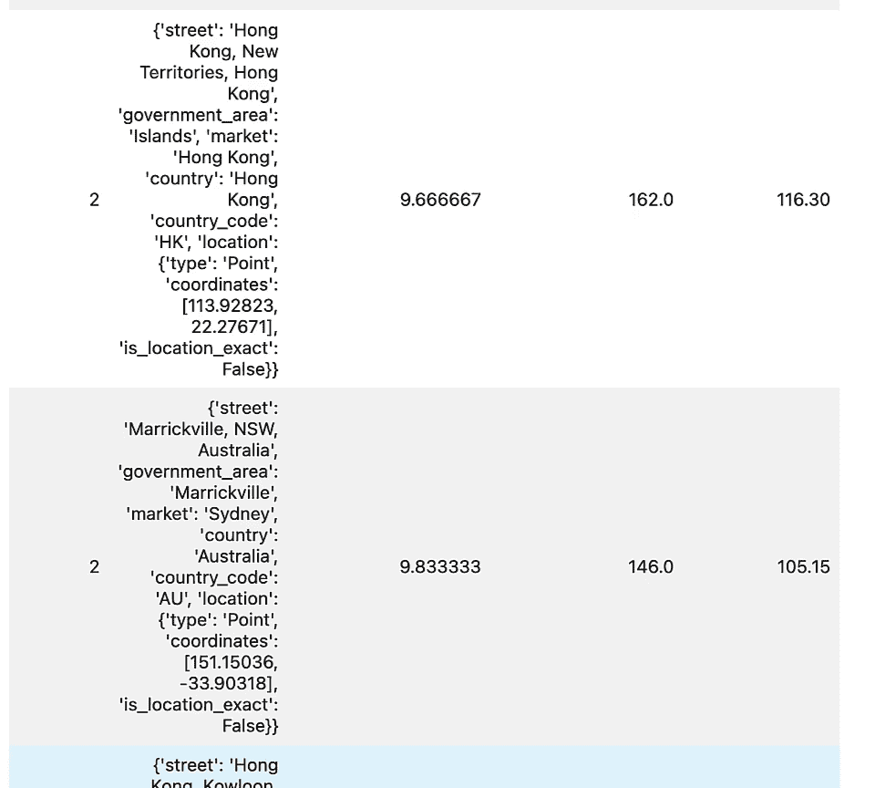
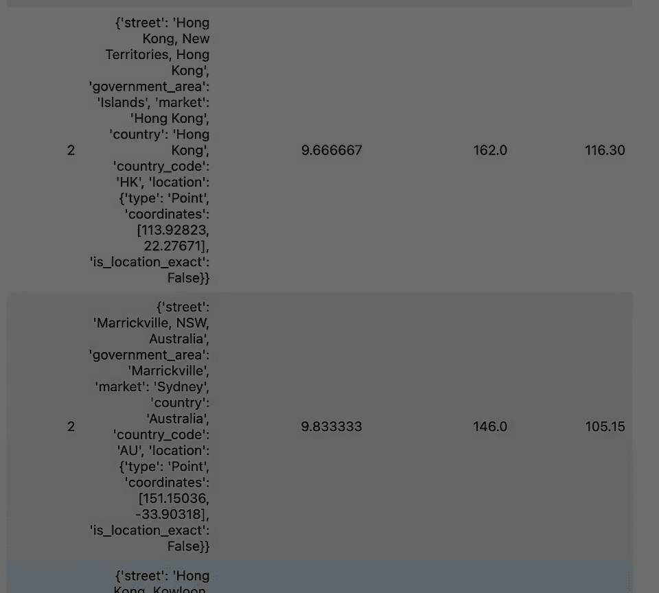

# 005：L4 提升 - 使用元数据优化搜索结果排序 🚀

## 概述
在本节课中，我们将学习如何通过“提升”技术，在向量搜索结果的基础上，结合文档的元数据（如评分、评论数量）来优化文档的最终排序。这种方法能确保返回的结果不仅语义相关，而且在质量和受欢迎程度上也满足用户的期望。

上一节我们介绍了基础的向量搜索，本节中我们来看看如何通过额外的元数据来增强排序逻辑。

---

## 提升的概念与价值

在某些情况下，一个文档可以包含其他影响其在搜索结果中位置的字段。以爱彼迎的房源列表为例，其中有评分和评论数量字段。这些字段表示定性和定量的衡量标准，它们可以对文档相对于用户查询和搜索标准的相关性做出贡献。

考虑这些字段的值以影响文档在返回的搜索结果列表中的位置，这被称为提升。

### 为什么需要提升？
以下是使用提升技术的几个关键原因：

1.  **补充向量搜索的不足**：向量搜索是一种根据语义相似性对文档进行排名的有效方法。尽管向量搜索得分和排名是有效的，但元数据值可以对文档相关性做出贡献，从而影响搜索结果中的排序。
2.  **增加结果可信度**：使用额外的定性和定量衡量标准对文档进行排名，可确保数据库操作结果对用户查询及其搜索标准是可信和相关的。
3.  **引入个性化**：提升也可用于确保结果满足用户特定要求，从而在搜索结果中引入个性化。

---

## 实践：在RAG管道中实现提升

在编码部分，你将经历一些熟悉的步骤。首先是设置一个 RAG 管道，你将添加相关阶段。然后你将添加一个提升逻辑，它将使用 MongoDB 数据库中可用的一些数学运算符。和往常一样，你将处理用户查询并可视化结果。

### 1. 环境与数据准备
首先像在之前的课程中那样导入你自定义的工具模块。接着像之前的课程中那样加载数据。你也可以花些时间查看每个数据点的属性。

接着进行文档建模，将列表加载到符合模型中。这与你在之前课程中执行的过程类似。

下一步是获取你的数据库对象和集合。然后通过在集合记录上调用删除菜单来开始一个干净的集合。这与之前课程中执行的过程类似。

完成数据摄取过程，接着进行向量搜索索引定义过程，都与之前的课程类似。

### 2. 定义结果模型
现在，你将为本课中显示的结果定义一个搜索结果项模型。每个结果的属性需要包含综合得分、评价数量和平均评价得分。这个新属性稍后会解释。

再次，就像在之前的课程中一样，你有完全相同代码的处理用户查询函数。

### 3. 实现提升逻辑
现在，我们可以进入本课的主要方面。你将实现一个增强逻辑并将其添加到在应用程序管道上进行的向量搜索操作中。在这里，你将其分配给一个名为 `reviewAverageStage` 的变量。

在这个单元格中，正在发生的是我们正在向从数据库操作返回的每个文档添加两个新字段。

以下是添加新字段的两个步骤：

*   **添加平均评价得分（定性度量）**：平均评价得分将遍历文档的每个评价组件并取评价组件总和的平均值。所以在每个文档中，我们可以看到准确性、清洁度、登记以及列表的其他属性。获取分数，使用 `$add` 运算符进行加法运算，我们可以得到所有评价组件的总和。然后我们将其除以评价组件的数量，在这种情况下，对于我们数据集中的列表，是 6。这让我们了解一个列表的平均评级是多少。这就解释了我们添加到每个文档中的新字段，称为平均评价分数。
    ```python
    # 伪代码示例：计算平均评分
    average_review_score = $divide(
        $add(accuracy, cleanliness, checkin, ...),
        6
    )
    ```

*   **添加评价数量提升（定量度量）**：添加到每个文档的第二个字段是评价数量提升。这是一个定量测量，这个字段将取每个文档中评价属性的数量值。这就是你如何使用 `$` 运算符和字段名称将一个字段的值传递到一个新字段。

要将这个新字段添加到数据库操作中的每个文档，你可以将此过程添加为一个新阶段，特别是添加字段阶段。这就完成了添加定性测量和定量测量。

### 4. 加权与排序
在下一步，你需要添加权重并确定定性测量和定量测量的每个组件在向量搜索操作后应如何影响文档的排名。这是通过向我们的管道添加一个新阶段来完成的。这是加权阶段。

现在，加权阶段紧跟在评价平均阶段之后。所以加权阶段将随后具有在评价平均阶段添加到每个文档中的平均评价分数和评价数量提升的参考。这就是你如何从文档中参考这些字段的值。

要实现加权逻辑，你将使用 MongoDB 数据库启用的几个操作符来进行数学运算：加法操作符和乘法操作符。

*   对于乘法操作符，你将平均评价分数的值（这是定性度量），乘以一个权重。我使用 0 到 1 之间的数字来分配权重。
*   然后，对评价数量提升也做同样的操作。这是一个将在向量搜索操作后用于对文档进行排序的定量度量。
*   然后你将使用加法操作符来组合不同乘法运算的两个结果，将这个新的附加值分配给组合分数字段。组合分数是两个相乘值的组合，我们可以通过使用添加字段操作符在数据库操作中为每个文档添加组合分数。

这是加权阶段。

要完成这个过程还有一个阶段。最后阶段是排序阶段。排序阶段非常简单。使用 `$sort` 操作符，我们实际上可以根据它们的组合分数或某个字段重新对文档进行排序。在这种情况下，你使用组合分数，并且以降序对其进行重新排序。所以这由 `-1` 表示。升序将由 `1` 表示。

### 5. 整合阶段并执行
现在你已经实现了所有要添加到向量搜索操作的附加阶段。你可以创建一个名为 `additionalStages` 的新变量，它接受所有已定义阶段的列表。

1.  第一个是评价阶段，在那里我们进行数学运算以获得定性和定量度量，并在向量搜索操作后将其作为新字段添加到文档中。
2.  然后有一个加权阶段。
3.  然后有一个排序阶段。

所有阶段在向量搜索操作之后按顺序执行。记住，我们在这节课中使用的向量搜索操作是一种类似于你在之前课程中创建的预过滤向量搜索。

---

## 观察提升效果

现在，是时候让你看看提升逻辑的结果了。使用与之前课程相同的查询以及相同的来自之前课程的函数，即处理用户查询函数，你正在传递额外的阶段并做笔记，以使用带有过滤器的向量索引。在这里，你可以观察到向量搜索操作阶段在一毫秒的一小部分时间内进行。

现在，让我们观察从这个操作返回的文档，其中包括多个阶段的组合以模拟我们的提升逻辑。在这里，你可以看到包括多个阶段的数据库操作的结果。平均评价分数与评价数量和综合评分一起包括在内。记住，综合评分包括权重考虑。

现在，显示的文档是按综合评分排序的。你可以在这里暂停视频并观察其他文档的综合评分。

要注意的一件事是，由于我们添加的加权逻辑，你会观察到，尽管这个文档有很高的评分，但与上面的其他文档相比，它的排名较低，因为它的评价数量较少。这就是为你的提升逻辑所考虑的组件添加权重的影响。

### 调整权重
还有一件事，你可以调整权重并调整数字以查看它如何影响结果。要做到这一点，只需回到加权阶段并调整权重。

现在，我给评论数量赋予更高的权重，给平均评论赋予较低的权重。一旦你改变了权重，你可以再次观察结果。正如你从结果中可以观察到的，因为你给评论数量增加了更多的权重，与具有高评分数量的文档相比，具有高评论数量的文档排名更高。在此处暂停视频以观察结果。

---



## 总结
在这节课中，你已经学习了如何实现一个典型的 RAG 系统，进行向量搜索，但现在你已经在聚合管道中添加了多个阶段来模拟一个增强逻辑，该逻辑在数据库操作后为你的文档排名增加了更多的相关性和上下文。



在下一节课中，你将学习如何利用提示压缩来减少发送给大型语言模型的提示，以降低运营成本。