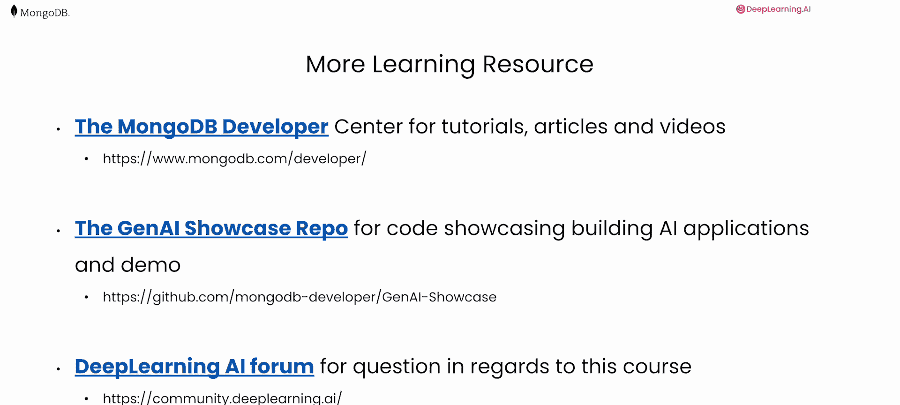
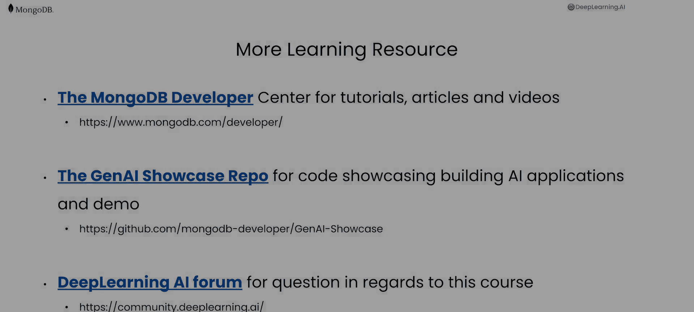

# 007：总结 🎯

在本课程中，我们学习了如何通过向量搜索、元数据过滤与提示压缩等技术，来优化检索增强生成系统的性能与成本效益。

恭喜你完成了这门课程。在这门课程中，你实施了向量搜索。你通过使用元数据和一个 MongoDB 聚合管道来优化检索系统，以提高系统效率和输出相关性。最后，你学会了如何通过使用提示压缩来降低大型语言模型应用的运营成本。

我期待看到你自己会构建什么。这里有一些额外的资源，我建议你在完成这节课后看一看。

以下是推荐的后续学习资源：

*   **MongoDB 开发者中心**：它包含了教程、文章和视频，涵盖了与人工智能相关的各种主题。
*   **生成式人工智能展示库**：这里包含不同的代码，是一个展示 RAG 和智能体系统不同用例的资源库。
*   **深度学习人工智能论坛**：在那里你可以就这门课程提出问题并进行讨论。

---

在本节课中，我们一起学习了向量搜索的实施、利用元数据与聚合管道优化检索系统，以及通过提示压缩降低应用成本的核心方法。希望这些知识能帮助你构建更高效、更经济的AI应用。