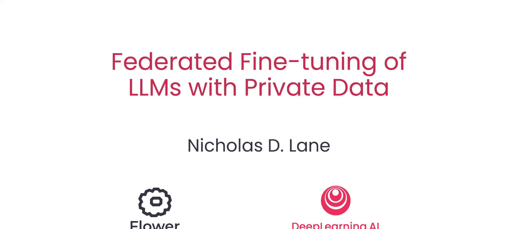
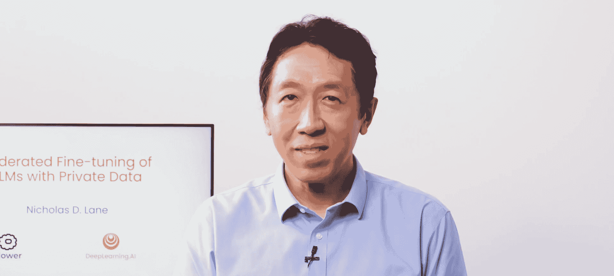
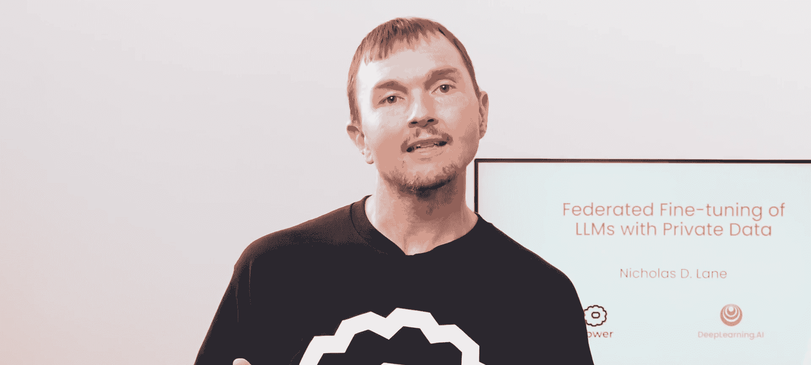
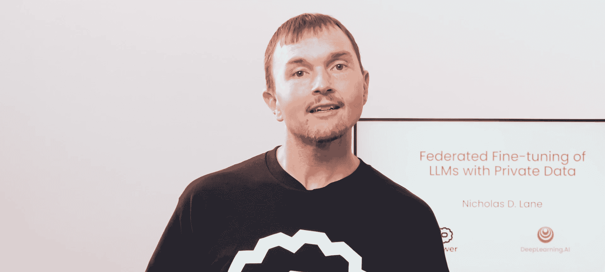
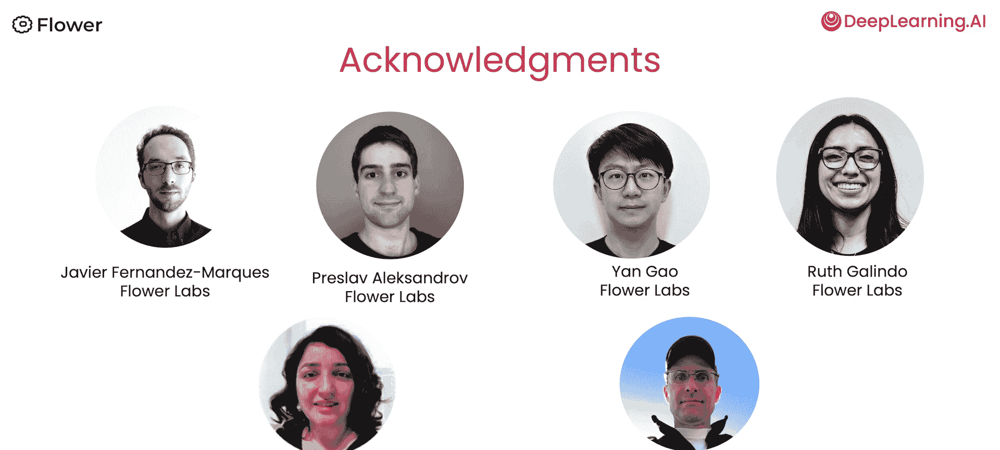
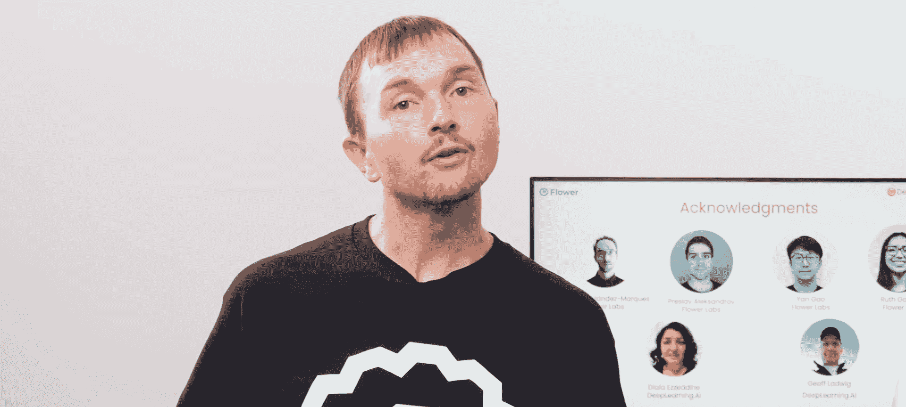

# 001：课程介绍 🎯

在本节课中，我们将要学习如何利用联邦学习技术，结合私有数据对大语言模型进行微调。我们将探讨这一方法的核心优势、面临的挑战以及解决这些挑战的关键技术。

---

假设您在一家拥有多个分支机构的医疗保健提供商工作，希望开发一个大语言模型来回答健康相关问题。用于训练模型的数据分布在各个地点，但隐私限制阻止您直接访问所有这些数据。

在之前的Flower Labs课程《介绍联邦学习》中，您可能已经了解到，联邦学习允许您将模型训练分发到数据所在的位置，而不是将数据集中到模型。在本课程中，您将学习如何将这个概念应用于微调大语言模型。

大语言模型通常具有数十亿个参数。在联邦学习中，您将模型分发到数据所在地，然后在每个训练迭代中与其他地点交换参数更新。这可能涉及大量数据的交换。

## 提升效率的关键技术 🔧

上一节我们介绍了联邦学习应用于大语言模型的基本概念，本节中我们来看看如何提升这一过程的效率。

完全正确。在本课程中，您将学习两种可以显著提高整个过程效率的技术。

以下是两种核心优化方法：

1.  **使用预训练模型进行微调**：不要试图从头开始训练大语言模型，而是使用预训练模型，并使用私有数据进行微调。现在有许多优秀的开源大语言模型可以作为很好的起点，从而加快整个过程。
2.  **采用参数高效微调**：您将进一步优化标准的微调方法，采用参数高效微调。在微调过程中，PEFT只需修改大语言模型权重的一小部分，而不是更新所有参数。在本课程中，您将看到，这可以仅用总参数量的 **0.1%** 来实现。

## 应对隐私泄露风险 🛡️

开发者担心的一个问题是，训练好的大语言模型是否可能泄露敏感的训练数据。例如，如果某人的个人信息（如家庭地址或信用卡号码）不知何故出现在训练数据中，大语言模型是否会泄露这些信息？

在本课程中，您将看到一些示例，说明即使是当前的开源大语言模型也可能恢复训练数据。然后，您将学习如何应用联邦学习和差分隐私技术，在微调大语言模型时最小化私有数据被曝露的风险。

在本课程示例中，每个医疗保健地点在训练过程中无需传输原始数据，这要归功于联邦学习。这为您打下了坚实的基础。通过差分隐私，模型更新已经添加了校准噪声，使数据恢复变得更加困难。

这种结合使得数据变得更加难以恢复。同时您还可以了解到，通过添加额外的方法（如加密），可以进一步增强数据的隐私保护，如果您的数据需要的话。

## 课程贡献者与展望 🙏

有很多人为创建这门课程作出了贡献。我想要感谢Flower Labs的哈维尔·费尔南德斯-马奎斯、普雷斯洛夫·亚历山德罗夫、高岩、鲁思·加林多，以及DeepLearning.ai的迪亚拉·埃扎丁和杰夫·路德维希。

第一课将介绍联邦大语言模型以及使用大语言模型进行联邦微调的主要优势。

---

本节课中我们一起学习了联邦微调大语言模型的课程概述。我们明确了其应用场景（如分布式医疗数据），回顾了联邦学习的基本原理，并介绍了提升效率的两种关键技术：**基于预训练模型的微调**和**参数高效微调**。同时，我们也探讨了隐私泄露的风险及解决方案——结合**联邦学习**与**差分隐私**来构建更安全的训练流程。下一节课，我们将深入探讨联邦大语言模型的具体优势。