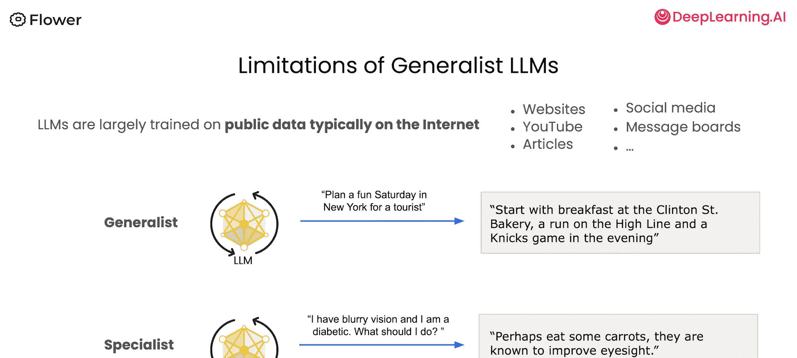
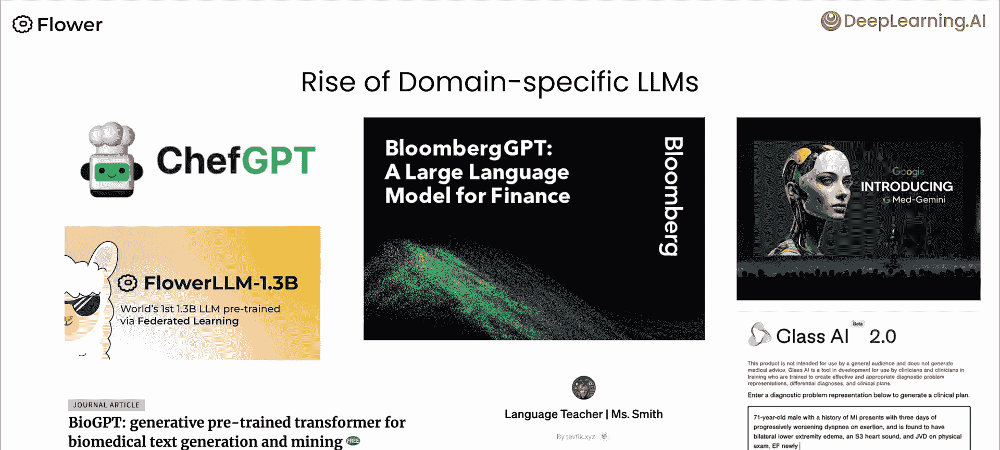
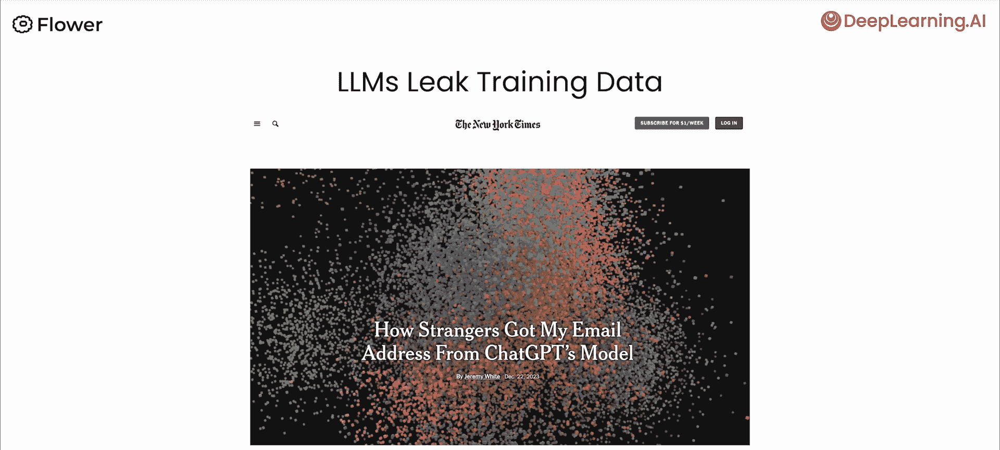
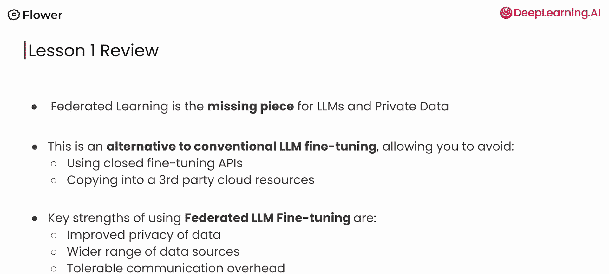

# 002：利用私有数据构建更智能的大型语言模型

在本节课中，我们将要学习大型语言模型当前训练数据的局限性，以及如何通过联邦微调技术，安全地利用私有数据来显著提升模型的能力。

## 概述

大型语言模型的能力令人印象深刻，但一个关键限制在于，它们主要是在公开的互联网数据上进行训练的。世界上大量的有价值信息，如个人医疗记录、企业敏感数据或受监管的金融信息，并未被纳入训练过程。本节课将探讨这一现状，并介绍联邦大型语言模型微调如何帮助我们安全地利用这些私有数据，从而构建更强大、更专业的模型。

## 当前大型语言模型的训练数据限制

上一节我们概述了课程目标，本节中我们来看看大型语言模型当前训练数据的实际情况。

大型语言模型目前主要是在公开数据上进行训练的。这些数据包括互联网上的文本、网站内容、YouTube视频、大众媒体、博客、杂志文章以及部分社交媒体和留言板信息。这就是我们所知的、被嵌入到当前大型语言模型中的数据类型。

这种数据来源对模型能提供的回答类型有切实的影响。例如，当你询问“为游客在纽约计划一个有趣的星期六”时，模型基于公开的旅游信息，可能会给出一个合理的行程建议，比如从克林顿街面包店开始早餐，然后去高线公园跑步，最后观看尼克斯队的比赛。

然而，当你开始询问专业领域的问题时，情况就不同了。让我们尝试一个涉及医学的问题。如果你问：“我视力模糊，并且是糖尿病患者，我该怎么办？”一个基于公开数据训练的通用语言模型可能会给出不理想的答案，例如“也许吃些胡萝卜，因为它们已被认为能改善视力”。这个回答源于一个关于胡萝卜改善视力的都市传说，但对于一个严肃的医疗问题来说，这是非常不准确的。

因此，当我们向通用语言模型询问医疗或其他许多专业领域的问题时，得到的答案可能并不可靠。

## 未被纳入训练的数据世界

考虑到通用模型的局限性，我们自然会问，世界上还有哪些数据未被利用？事实上，大部分世界的数据尚未进入大型语言模型。

以下是目前普遍缺失于大型语言模型训练的数据类别：

*   **私有数据**：例如个人手机、电子邮件中的数据。
*   **敏感数据**：各种敏感信息，有些是私有的，有些则不是。例如图像数据、门铃摄像头数据、智能扬声器收集的音频等。
*   **受高度监管的数据**：例如银行、金融机构持有的数据，以及医学和医院中的所有数据。
*   **分布式企业数据**：存储在企业内部数千台计算机中的数据。
*   **物联网与设备数据**：世界各地的孤立物联网设备、机器人、制造机器和工厂中产生的有价值信息。

如果我们能开始利用这些目前已知不在大型语言模型中的数据，我们预计模型的能力将获得显著进步。

## 领域特定语言模型的兴起

为了应对通用模型的不足，各种领域特定的语言模型应运而生。这些模型擅长处理特定任务。

其中一些模型基于非私有但更专业的数据集进行训练。例如，专注于烹饪的“Chef GPT”类模型会使用大量食谱信息进行训练；帮助学习语言或其他学科的模型也会使用相应的专业资料。

另一些模型则是基于特定领域的专有数据进行训练的，尤其是在医学领域。例如，Bio GPT 和 Gemini Glass AI 是经过医学数据训练的语言模型，它们在回答健康和医学相关查询方面能力显著增强。

一个著名的例子是 Bloomberg GPT。这是一个拥有500亿参数的模型，它广泛使用了彭博社内部的金融档案进行训练。这些财务文件赋予了 Bloomberg GPT 在金融领域的增强能力。

这个例子表明，一旦语言模型获得特定形式的数据，它们就能在相应领域中表现出色。

## 使用私有数据的主要障碍

既然领域特定模型效果显著，我们为什么不普遍使用私有数据来训练模型呢？原因有很多，但其中一个最大的问题是：**大型语言模型会泄露它们训练数据的部分内容**。

当你考虑使用私密数据、受管制数据或分布式数据时，必须非常谨慎。例如，2023年12月《纽约时报》的一篇文章提到，有作者发现自己的电子邮件地址出现在了ChatGPT的公共模型中，因为该地址曾出现在其训练数据里。

因此，作为开发者，在处理和使用这类敏感数据构建大型语言模型时，必须极为小心。这意味着，你可能已经了解的传统方法，比如对大型语言模型进行常规的集中式微调，对于使用私有数据来说通常并不适用。

## 解决方案：联邦大型语言模型微调

那么，我们如何安全地利用私有数据呢？本课程将重点介绍一种传统微调的替代方法：**联邦大型语言模型微调**。

这种方法的核心思想可以通过一个动画示意图来理解。假设有三家医院，每家都拥有高度私密的患者医疗记录。联邦微调的目标是将这些信息嵌入到模型中，但无需将数据复制到一个中心服务器。

以下是联邦微调的基本步骤：

1.  数据始终保留在本地（如各家医院）。
2.  在每个本地数据隔离部分上分别进行模型训练。
3.  只将训练后更新的模型权重（而非原始数据）传输到一个中央服务器。
4.  在中央服务器汇总来自各处的模型更新，整合成一个全局模型。

请注意，在此过程中，原始私密数据永远不必离开其所在地。这是保护数据隐私的基础构建模块。我们可以将这种方法与其他技术结合，以实现在利用各种私有数据的同时，提供对训练数据的隐私保护。

## 学习建议与课程总结

联邦大型语言模型微调方法使我们能够克服使用私有数据时的许多障碍，如隐私泄露风险、数据法规、硬件限制等。但这涉及很多概念，包括大语言模型微调和联邦学习。

因此，我建议您，如果尚未学习过联邦学习的基础知识，可以先查看相关的入门课程。这将帮助您更快地理解本课程后续的内容。当然，本课程本身也是独立完整的，您可以直接继续学习。

本节课中我们一起学习了以下三个核心要点：

1.  **数据缺口**：世界上大部分数据（如私有数据、受监管数据、分布式数据）尚未被纳入大型语言模型的训练中，这限制了模型在医疗、金融等关键领域的能力。
2.  **核心障碍**：这类数据未被广泛使用的最重要原因，是大型语言模型存在泄露训练数据的风险。这使得传统的集中式微调方法通常不可行。
3.  **解决方案**：**联邦大型语言模型微调**是一种让你能够利用私有数据，并在将其嵌入模型时保护信息隐私的方法。它还能帮助解决使用此类数据时遇到的其他相关障碍。

我们的目标是，通过安全地纳入更多新型的私有数据源，构建出更智能的大型语言模型，特别是那些能够准确回答特定领域（如医学）问题的专业模型。