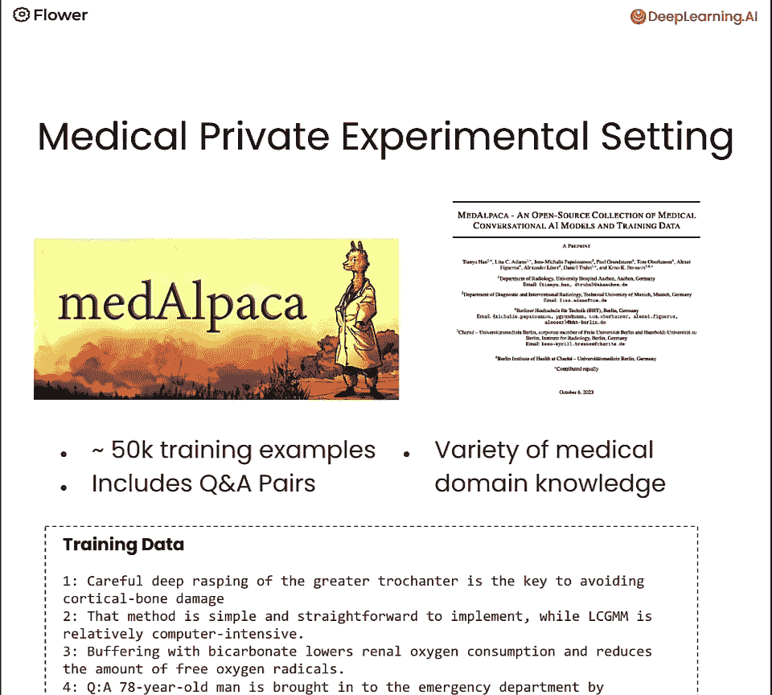
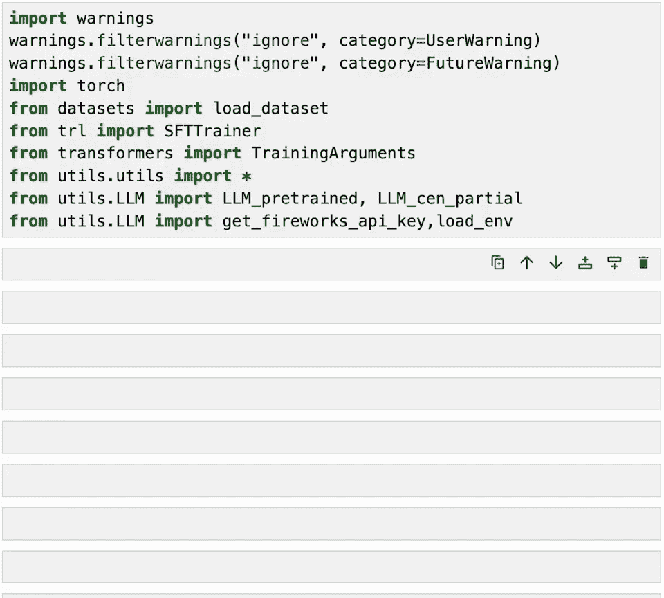
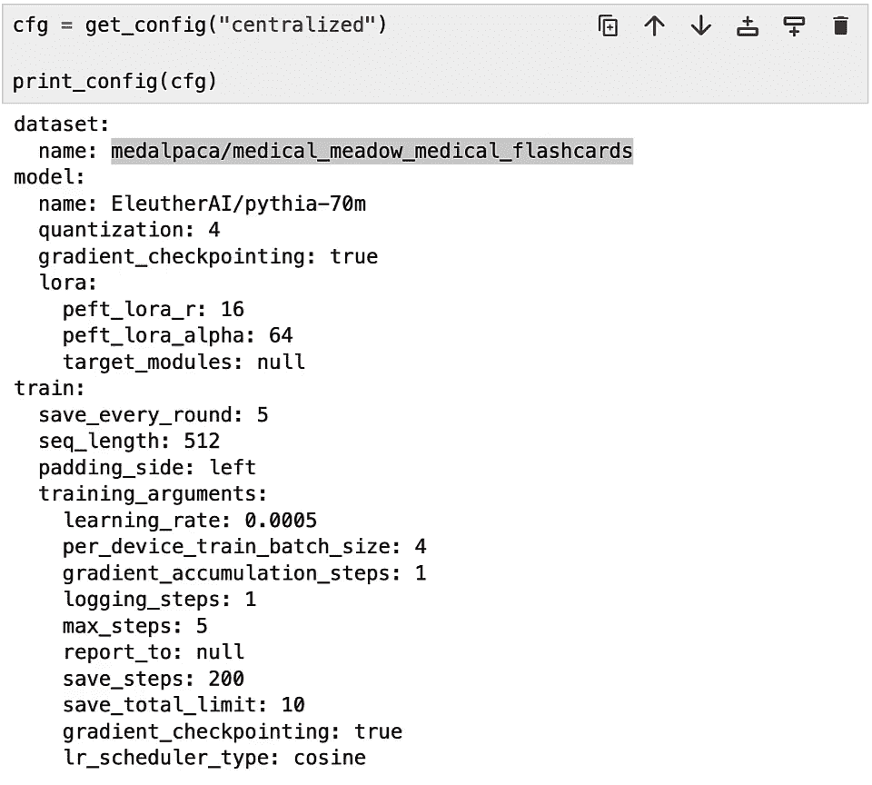
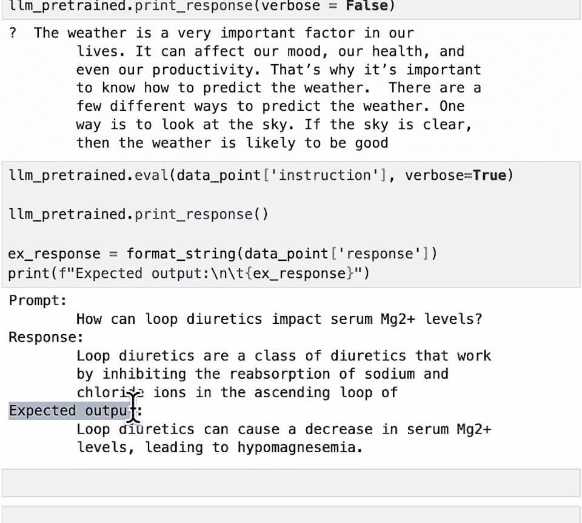
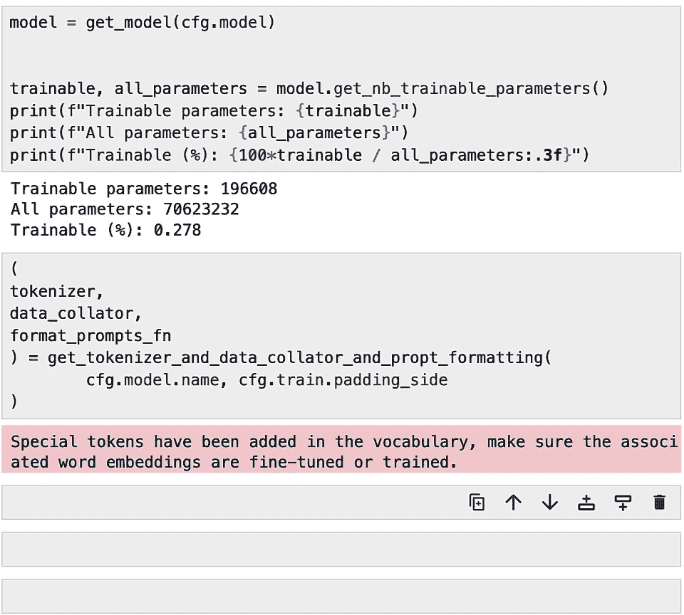
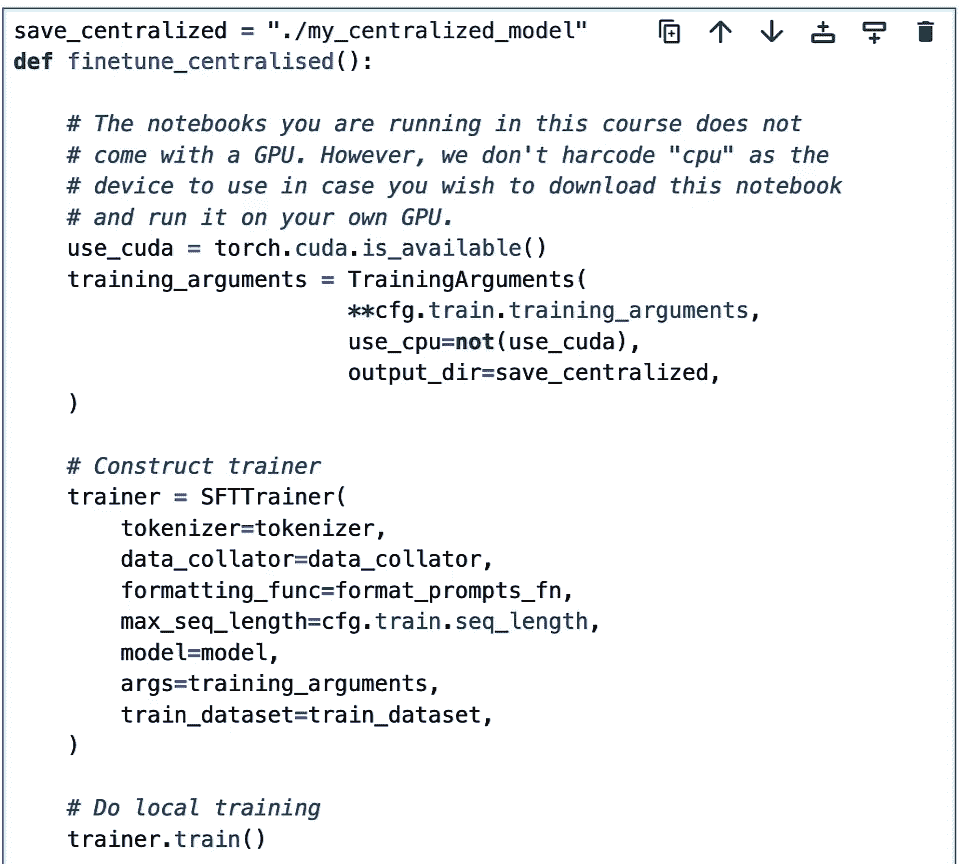
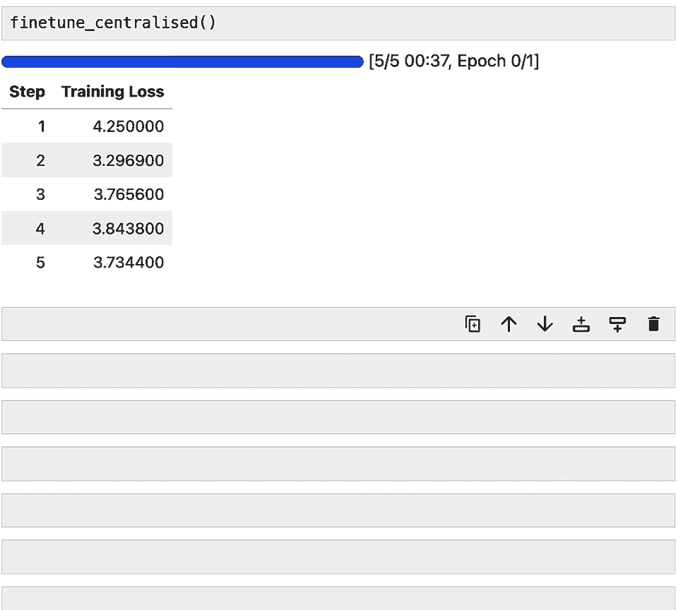
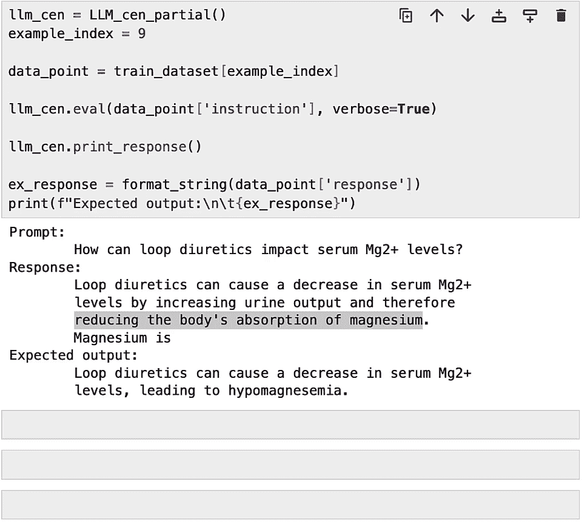
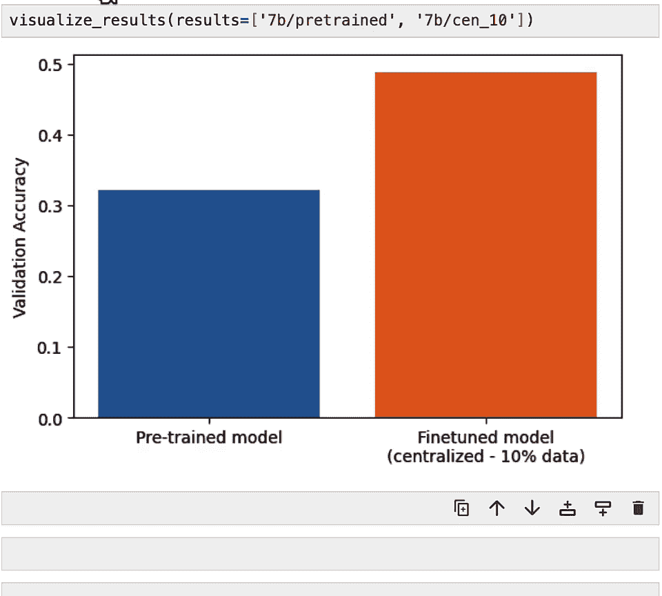
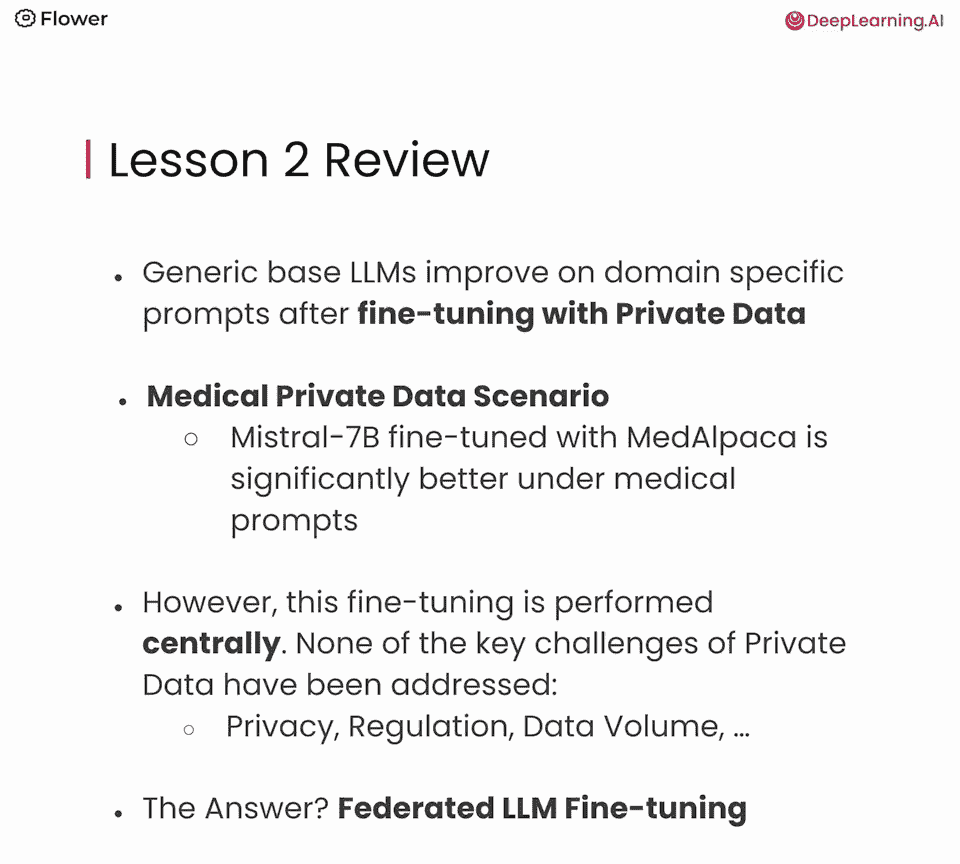

# 003：集中式大语言模型微调 🏥

在本节课中，我们将学习如何使用私有医疗数据对一个大型语言模型进行集中式微调，并评估其性能提升。通过这个过程，我们可以直观地理解利用私有数据微调模型的价值，并为后续学习联邦学习方法打下基础。

## 场景介绍 🏢

在开始之前，让我们先介绍本课程将使用的场景。如下图所示，场景中有多个医疗机构（如动画底部的三座建筑）。每个机构都拥有高度敏感的医疗数据。我们的目标是利用这些数据微调一个大语言模型，以提升模型回答医疗问题的能力。

虽然我们使用的是医疗数据，但此基本场景可以广泛推广到法律、企业、金融等其他行业和应用。


本节课我们不会使用联邦学习。相反，我们将采用传统的**集中式微调方法**。如上图动画所示，数据会从各个医疗机构流出，汇集到中央服务器，在那里进行模型微调和更新。这正是我们接下来要在代码中实现的过程。

## 数据集介绍 📊


在进入代码之前，我们先了解一下将要使用的数据。为了提供一个私有数据的代表性示例，我们使用了 **MedAlpaca** 数据集。这是一个优秀的资源，包含了各种医疗领域的知识。关键的是，它包含了**问答对**。

虽然评估大语言模型的回答质量可能是主观的，但由于这个数据集提供了标准问题和答案，我们可以更容易地评估模型性能，因为我们知道对于每个问题，什么是“正确”的离散答案。

通过使用这个完全开源在线的 MedAlpaca 数据集，我们可以将其作为私有数据如何有益于大语言模型的一个有力代理。你将能亲身体验到，当把这种方法应用到你自己领域的私有数据时，可以期望获得怎样的改进。



## 代码实践：环境准备与配置 ⚙️

现在让我们开始查看代码。首先，我们需要导入一些必要的包和工具函数。


```python
# 导入必要的库
import transformers
from peft import get_peft_model, LoraConfig, TaskType
from utils import load_config, prepare_dataset
```

你会看到我们使用了 Hugging Face 的 `transformers` 库和 **PEFT**。PEFT 是一种**参数高效微调**的方法，我们将在下一节课详细解释。我们还从工具模块导入了一些函数，以保持代码整洁。

在本课程的笔记本中，我们将使用 **Hydra** 来管理配置文件，这是一个非常强大的工具。




接下来，让我们加载描述集中式微调如何执行的配置文件。

```python
# 加载配置文件
cfg = load_config(‘configs/centralized_finetuning.yaml’)
```

以下是配置文件中几个关键部分：
*   **数据集**：我们使用的是 MedAlpaca 数据集的“抽认卡问答”子集。
*   **模型**：我们将使用来自 Eleuther AI 的 **7000 万参数**的大语言模型。
*   **训练方法**：我们将使用 PEFT 和 **LoRA** 进行训练（下节课详解）。
*   **超参数**：配置文件中的训练部分包含了典型超参数，如学习率、训练步数等。这些值已经过调整，以便在本笔记本中快速完成微调。




## 探索数据集与基准测试 🔍

在开始微调之前，我们先看看 MedAlpaca 数据集，并测试一下预训练模型的基线性能。

首先，使用 Hugging Face 的 `datasets` API 加载数据，并抽取 **10%** 的训练数据。这模拟了现实场景：假设你作为研究人员，只能访问分布在合作医院的总数据的 10%。

```python
# 加载数据集并抽取10%
from datasets import load_dataset
dataset = load_dataset(cfg.data.name, split=‘train’)
small_dataset = dataset.train_test_split(test_size=0.9)[‘train’] # 取10%
print(f“数据集包含列：{small_dataset.column_names}”)
print(f“10% 子集包含 {len(small_dataset)} 个训练样本。”)
```

打印结果显示，这个子集包含近 3400 个训练样本，每个样本有“指令”（问题）和“响应”（答案）两列。让我们看一个例子（比如第10个样本）：

```
指令：袢利尿剂如何影响血清钾、镁和钙水平？
响应：袢利尿剂通过抑制亨利袢升支粗段的Na-K-2Cl共转运体来增加这些电解质的排泄，可能导致低钾血症、低镁血症和低钙血症。
```

这是一个关于利尿剂的高度专业医学问题，数据集提供了技术性很强的理想答案。

现在，让我们了解一下我们的起点：一个未经微调的、预训练的大语言模型表现如何。我们首先通过 API 加载一个预训练的 **70 亿参数**的 Mistral 模型进行评估。

我们先问一个通用问题：“如何预测天气？”。模型给出了一个模糊但尚可接受的回答。

接着，我们用一个来自 MedAlpaca 的特定领域问题来“强测试”它：

```
提示（来自数据集）：袢利尿剂如何影响血清钾、镁和钙水平？
模型回答：利尿剂是一种帮助身体排出多余水分和盐分的药物。袢利尿剂是其中一种，主要作用于肾脏的亨利袢…
```

观察发现，模型做出了很好的尝试，但它并没有直接回答所问的问题，而是主要提供了利尿剂的定义。这显然没有包含我们要求的具体信息。



相比之下，数据集中提供的**真实答案**（上文已列出）则直接、切中要害。这清楚地表明，预训练模型在回答特定领域问题方面能力有限。


## 实施集中式微调 🚀

既然我们已经看到预训练模型的局限，现在可以开始引入微调所需的代码了。

首先，让我们实例化模型、分词器并准备数据。

```python
# 实例化模型和分词器
model = AutoModelForCausalLM.from_pretrained(cfg.model.name)
tokenizer = AutoTokenizer.from_pretrained(cfg.model.name)
# 对数据集进行标记化处理
tokenized_dataset = small_dataset.map(lambda x: tokenize_function(x, tokenizer), batched=True)
```



这里值得提一下模型的统计信息：我们即将使用 PEFT 微调的 7000 万参数模型，实际上**只会修改约 17 万个参数**，不到总参数的 **0.3%**。这种高效性是 PEFT 的优势之一。

所有组件（模型、数据集、分词器）都准备好后，就可以开始微调了。我们需要一个函数将所有部分整合在一起。




让我们看看 `fine_tune_centralized` 函数做了什么：

1.  **检测设备**：自动检测使用 CPU 还是 GPU（CUDA）。
2.  **配置训练器**：使用 Hugging Face 的 `Trainer` API，连接模型、数据、训练参数。
3.  **开始训练**：执行微调。
4.  **保存检查点**：仅保存微调后的参数（PEFT 适配器权重）。

```python
def fine_tune_centralized(model, tokenized_dataset, cfg):
    # 设备检测
    device = torch.device(“cuda” if torch.cuda.is_available() else “cpu”)
    model.to(device)
    # 设置训练参数
    training_args = TrainingArguments(**cfg.training)
    # 初始化训练器
    trainer = Trainer(
        model=model,
        args=training_args,
        train_dataset=tokenized_dataset,
        tokenizer=tokenizer
    )
    # 开始训练
    trainer.train()
    # 保存模型（仅PEFT权重）
    trainer.save_model(cfg.output_dir)
```

现在，让我们运行微调。为了快速演示，我们只训练 **5 个步骤**，并使用小批量大小。

```python
# 执行微调
fine_tune_centralized(model, tokenized_dataset, cfg)
```

训练过程中，你会看到损失值逐渐下降。大约一分钟后，微调完成。


## 评估微调后的模型 📈



关键问题来了：微调后的模型比我们开始时看到的未微调模型表现更好吗？

让我们在**同一个**医疗问题上再次测试。注意，这次测试的是已经在 10% MedAlpaca 数据上微调过的 70 亿参数模型。

```
提示（同一问题）：袢利尿剂如何影响血清钾、镁和钙水平？
微调模型回答：袢利尿剂通过抑制肾脏亨利袢升支粗段的Na-K-2Cl共转运体，增加钾、镁和钙的排泄，可能导致这些电解质水平的降低（低钾血症、低镁血症、低钙血症）。
```

这次我们得到了一个**好得多的答案**！它直接回答了问题，准确解释了袢利尿剂会**降低**这些电解质水平，甚至提到了相应的医学术语。这与数据集中的真实答案非常吻合。

成功！我们看到了针对一个问题的明显改进。


## 系统性评估与结果可视化 📊

然而，要得出确切的结论，我们需要在大量问题上观察模型的系统性改进。在大量样本上提示模型并评估答案需要时间。

因此，我们预先离线进行了评估，并将结果保存下来以便可视化。当然，笔记本中也提供了生成这些结果的代码，你可以用自己的模型和数据运行它。



以下是我们评估结果的总结：


图表说明：
*   **Y轴**：**准确率**。基于数据集中有明确对错的问答对进行评估。
*   **对比模型**：
    *   **预训练模型**：未经微调的 70 亿参数模型。
    *   **微调模型**：在 10% MedAlpaca 数据上微调后的同一模型。
*   **观察结果**：准确率从略高于 **30%** 显著提升至接近 **50%**。请注意，这个提升仅使用了**一小部分（10%）** 的可用私有数据。

这个结果清晰地展示了，即使在有限的数据上进行微调，也能带来显著的性能提升。




## 课程总结 🎯

在本节课中，我们一起学习了如何采用一个通用的大语言模型，在私有医疗数据上对其进行**集中式微调**，并观察到了其在专业领域回答能力的显著提升。

我们通过代码实践了整个过程：
1.  介绍了医疗私有数据微调的场景。
2.  探索了 MedAlpaca 数据集。
3.  测试了预训练模型的基线性能。
4.  使用 PEFT-LoRA 方法高效地微调了模型。
5.  评估了微调后模型的性能，并通过可视化确认了系统性改进。

这展示了利用通常无法获得的私有数据所能带来的巨大价值。然而，正如第一课所讨论的，使用集中式方法在敏感数据上微调大语言模型是危险的，因为模型可能记忆并复述训练数据。

那么，解决方案是什么？答案将是**联邦学习**。我们将在下一节课中深入探讨如何在不共享原始数据的前提下，利用联邦学习安全地微调大语言模型。



