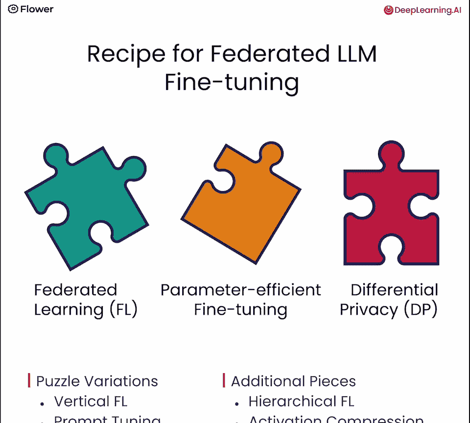
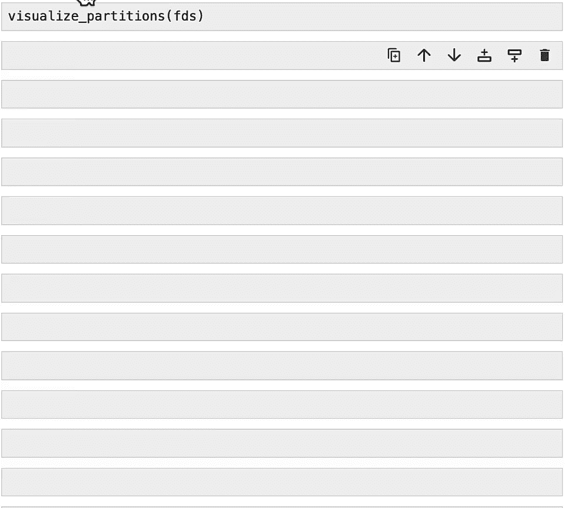
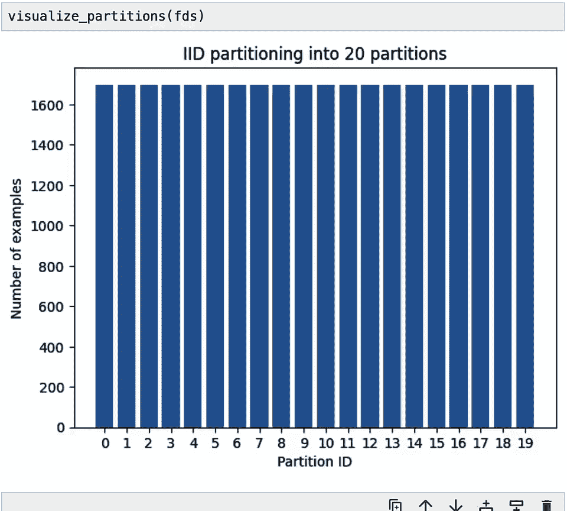
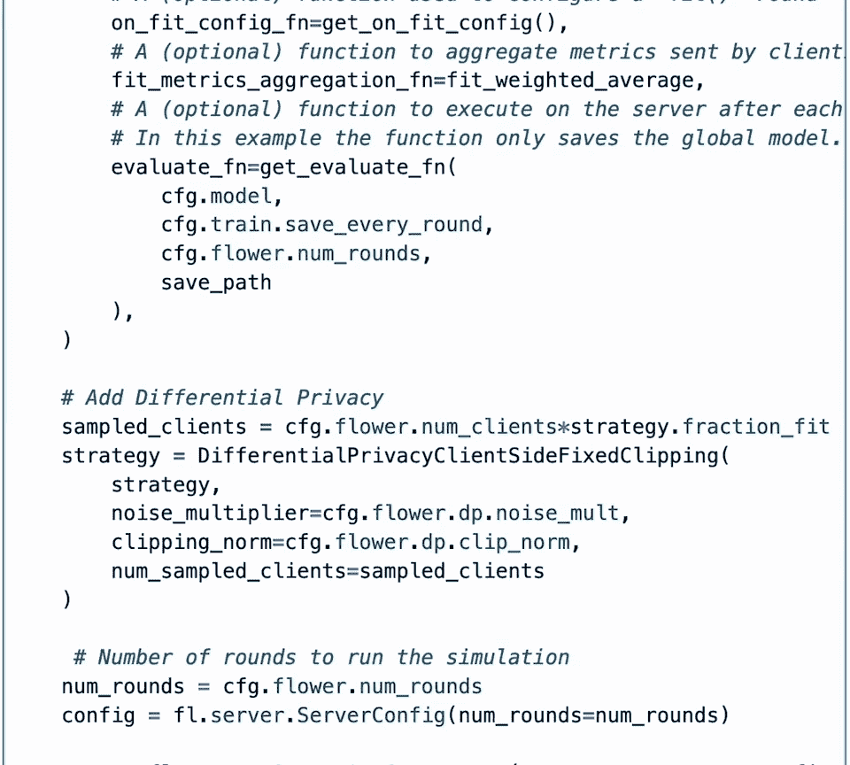
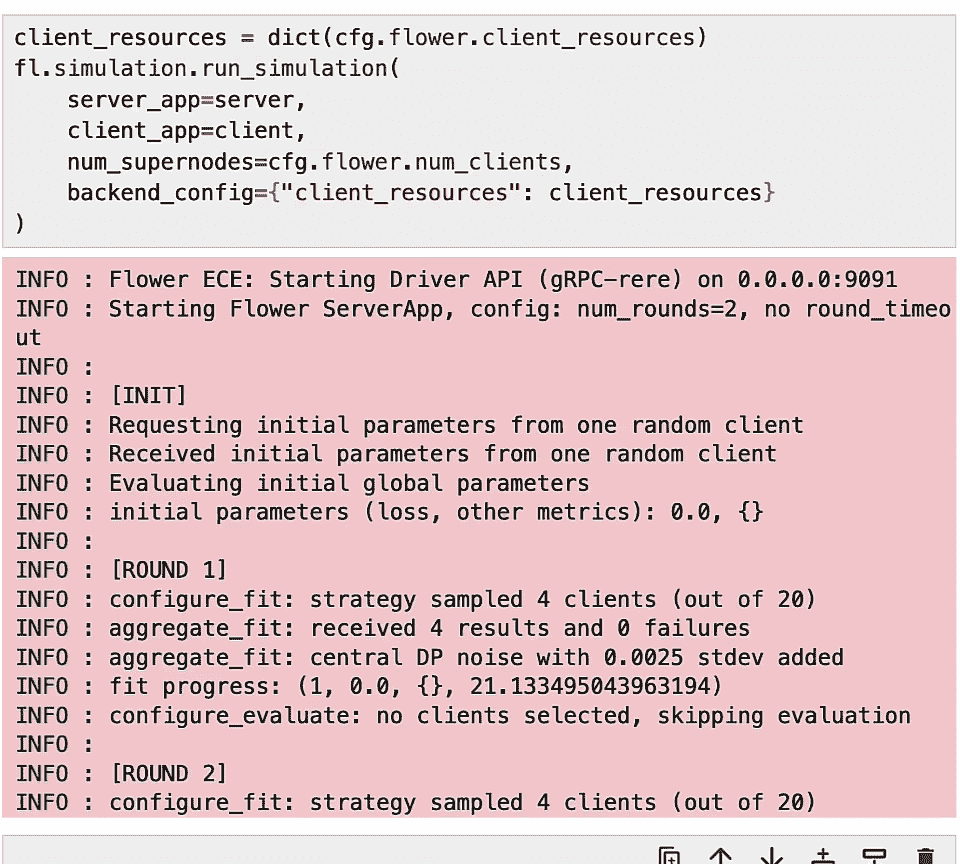
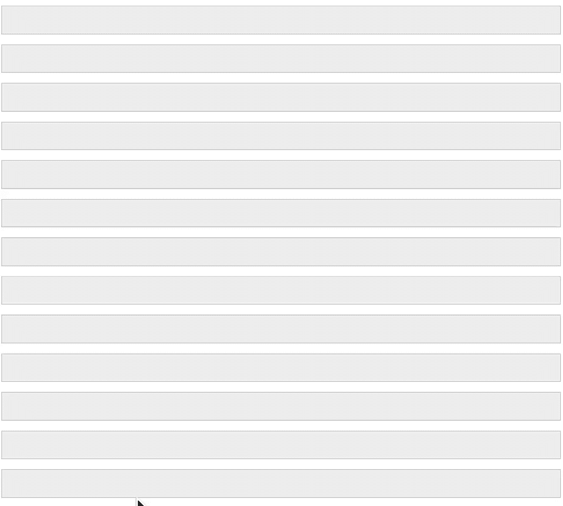
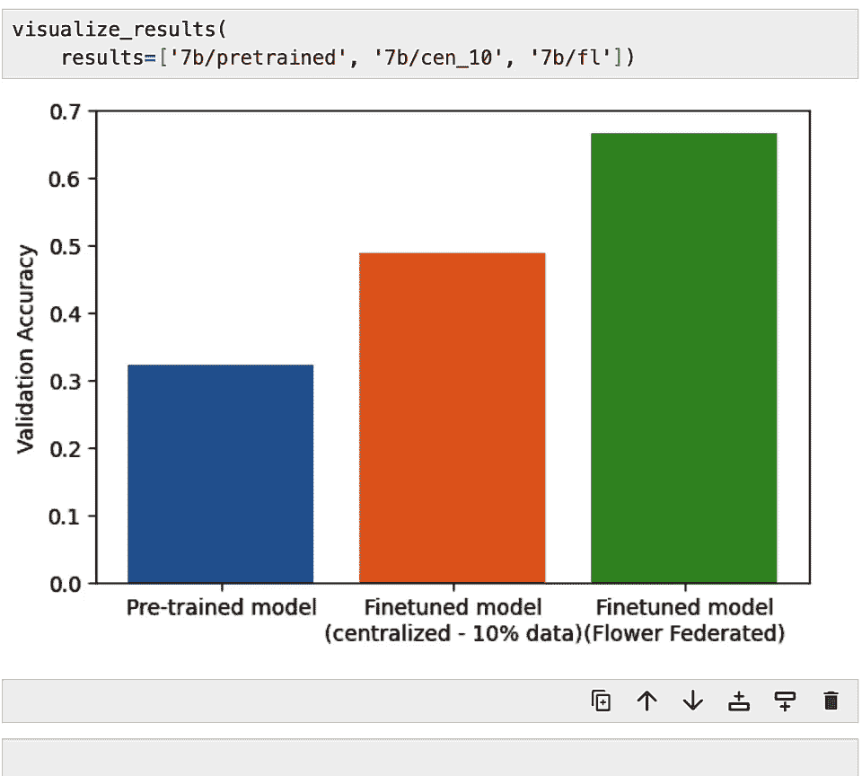
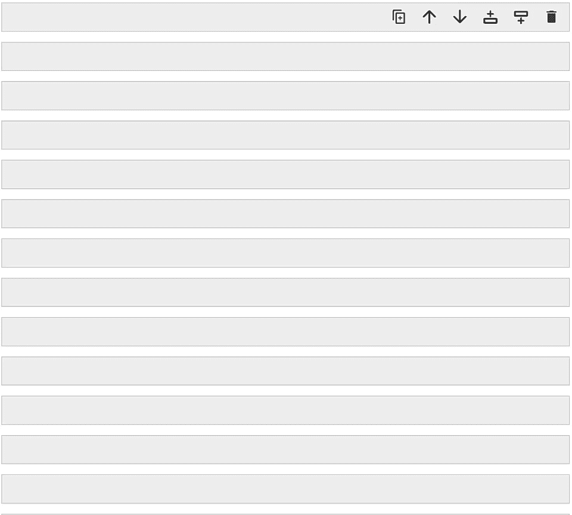
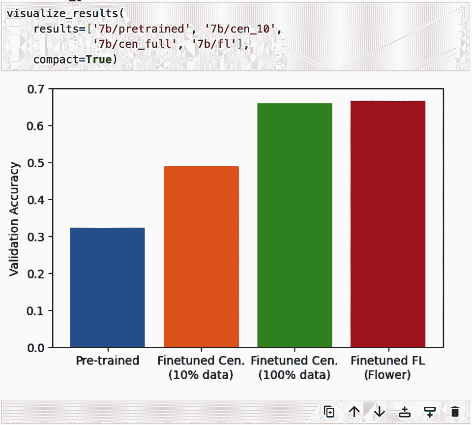
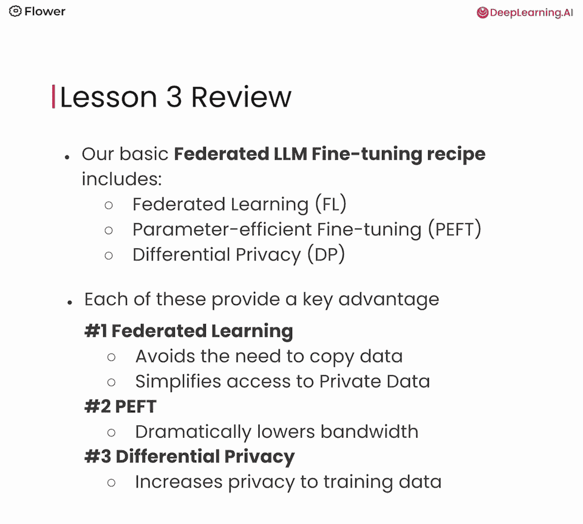

# 004：联邦大型语言模型微调 🧩

在本节课中，我们将学习如何利用私有数据对大型语言模型进行联邦微调。我们将了解这种方法的工作原理，如何克服隐私和效率等挑战，并最终动手构建一个联邦大型语言模型。

## 概述

为了将私有数据用于大型语言模型，联邦大型语言模型微调是最佳工具之一。本节将首先解释该方法的工作原理，然后指导你使用它来构建自己的联邦大型语言模型。

## 联邦学习基础

上一节我们介绍了利用私有数据微调大模型的需求，本节中我们来看看实现这一目标的核心技术——联邦学习。

联邦学习的核心思想是训练过程转移到数据所在的位置，而不是将数据集中到服务器。这通过一个动画进行了说明。在本节中，我们将从动画中展示的概览，深入到理解使这种学习方式得以实现的所有核心技术。

但在深入之前，让我们先与上一节课中使用的方法进行比较。回想一下，我们使用了集中式微调方法，这需要在微调开始之前将数据复制到服务器。动画展示了每个医院的数据必须先移动到服务器，然后才能开始微调。这就是本课程中两种方法的根本区别。



需要强调的是，本课程专注于大型语言模型、私有数据及其与联邦微调的关系。关于联邦学习的更广泛细节，请参考其他介绍性课程。

## 核心配方：三大组件

在我们即将看到的代码中，我们将使用一个执行联邦大型语言模型微调的基本配方。你可以将其想象成一个拼图，由三个主要部分组成：

1.  **联邦学习**
2.  **参数高效微调**
3.  **差分隐私**

这三个部分共同构成了一个配方，使我们能够执行这种特定类型的微调，并获得我们讨论过的所有好处。

这个配方是基础性的。例如，你可以用垂直联邦学习替换联邦学习部分，用提示微调替换参数高效微调部分，或者研究差分隐私的不同变体。根据你的应用程序和数据需求，还可以添加额外的部分，例如支持分层联邦学习、执行模型压缩或包含同态加密。这些变化和添加是为了满足特定的隐私、准确性或架构需求。

现在，我们将首先解释这种大型语言模型微调技术的基本形式，并逐一剖析每个组件。

## 基础形式：无PEFT与差分隐私

为了建立深入的理解，让我们从联邦大型语言模型微调的最基本形式开始，一开始甚至不使用差分隐私或参数高效微调。它们将逐步被引入，这样你也能看到为什么它们是必需的。

我们从下图所示的场景开始，它使用了我们在前一课中描述的场景：利用来自许多不同医院的私有数据。在代码中，我们使用了Mistral 70亿参数基础模型，这就是为什么它被添加到了图中，位于服务器上方，作为待改进的全局模型。

在这种模式下进行微调的第一步是**客户端选择**。图中已经选择了两个客户端（由蓝色箭头指示）。根据设计，你可以让所有客户端在一轮训练中同时参与（完全参与），但选择客户端子集允许我们管理通信开销等问题。在这个例子中，这两个客户端将对本地可用的模型架构（即Mistral模型）进行标准训练。每个客户端根据其拥有的数据更新大型语言模型的权重。

下一步是，每个客户端更新后的模型权重将被发送到服务器，在那里进行**聚合**。来自客户端的更新被聚合，例如使用`FedAverage`方法，这是一种将所有模型更新直接平均在一起的方案。然后，这个平均后的更新应用于现有的Mistral模型，以根据本地客户端的数据对其进行微调。每个平均步骤称为**一轮**，需要完成多轮联邦学习，直到微调完成。

至此，我们已经描述了一种对大型语言模型进行联邦微调的完整方法。

## 挑战一：通信开销与PEFT解决方案

接下来是什么？你可能已经注意到可能存在通信开销问题。原因是大型语言模型比联邦学习通常使用的模型大得多。传输模型更新通常意味着在客户端和服务器之间传输整个模型。对于较小的架构，这可能没问题，但在大型语言模型领域，这可能很快失控。

作为参考，拥有70亿参数的Mistral模型本身可能约为27吉字节（取决于参数精度）。如果在多轮训练中，在多个客户端和服务器之间传输27吉字节的数据，所需的数据量和传输时间可能会变得不可接受地慢。这在非大型语言模型设置中通常不会如此突出。

那么我们该怎么办？这就是我们引入**PEFT（参数高效微调）** 的地方。PEFT将降低每轮从客户端到服务器必须发送的参数数量。

在下图中，左下角展示了典型的联邦拓扑结构，客户端与服务器交换模型更新。右侧则说明了PEFT如何极大地减少需要传输的数据量。

在PEFT中，关键思想是我们能够冻结模型的大部分权重。在客户端层面的图表中，模型的许多部分从黄色变为蓝色，表示这些权重被冻结，在本地模型更新期间实际上没有被更新。我们只需要传输那些被允许改变的权重。

有趣的是，即使将冻结参数的百分比调到极高水平（例如98%冻结，仅2%可改变），这种技术也被证明是有效的。基础模型仍然能够很好地适应并提取大量所需信息。通过这个过程，模型可以更新，但需要交换的数据量大大减少。

当我们查看代码时，你会看到具体的数字，了解这在多大程度上提高了性能。这里我们提到了两个重要因素：一是管理了在大型语言模型情况下变得尖锐的带宽问题；二是减少了所需的计算量，因为我们不必修改那么多参数。

## 挑战二：隐私与差分隐私解决方案

整个课程的一个重点领域一直是隐私。我们知道大型语言模型在某些情况下能够复述训练数据。因此，即使联邦学习的核心优势是数据无需传输，但这本身并不足够。所以我们要在拼图中加入最后一块：**差分隐私**。

让我们深入了解在这种情况下差分隐私是关于什么的。对于更详细的解释，请查看我们关于联邦学习介绍的配套课程。这里我们简要勾勒出如何使用差分隐私。

再次观察左边的参考框架图，它展示了客户端如何与服务器通信。在右边，我们深入研究了通过引入差分隐私而发生的一些具体变化。

差分隐私引入了许多技术，用于掩盖个别训练样本的具体细节，以降低它们被泄露的机会。在客户端层面，我们在训练期间故意添加校准噪声。图中红线概念化地表示，通过减少模型误差获得的信号被故意添加了噪声。选择和应用噪声是为了在重要方面仔细掩盖信号。添加了这种噪声的模型更新然后与服务器共享，这些带噪声的模型更新增强了训练数据的隐私保护水平。

在这个特定应用中，合理的保护粒度是在个别训练样本层面。但根据不同的应用，你可能需要保护不同的实体（例如，以作者为粒度）。

从技术角度看，差分隐私试图实现什么？它展示了两个不同的模型`LLM_A`和`LLM_B`，它们之间的唯一区别是，一个是用特定的训练实例训练的，另一个则没有。差分隐私通过添加噪声，试图使这两个模型产生无法区分的结果。通过这种方式，它提供了一种合理的否认形式，增加了获取底层训练数据的难度，有助于防止模型反刍训练数据等问题。

因此，差分隐私帮助我们提高训练数据的保护水平，它与“数据无需复制”这一核心优势协同工作，提供了一个更私密和安全的系统。

为了提供关于差分隐私如何工作及其与添加噪声关系的直觉，请看下面的图示。上图是原始图像，包含可能敏感的信息（人脸、背景文本）。下图是同一图像，但有策略地模糊了敏感区域（人脸、单词）。你仍然可以从添加了选择性噪声的图像中理解和学习宏观模式（例如房间人数、房间类型、活动类型）。这个额外的噪声使得识别某些特征（如人脸）变得更加困难。这希望能给你一个强烈的直觉，了解这个机制如何运作以保护单个训练样本，同时仍然允许我们学习对模型成功非常重要的宏观模式。

## 动手实践：代码实现

现在我们已经描述了所有协同工作以使联邦大型语言模型微调成为可能的各个部分。是时候转向代码了。

简要提醒一下，我们将回到我们喜欢的医疗场景，我们希望从许多不同的私有数据源中学习，以改进一个大型语言模型的通用骨干，使其能够以高得多的保真度回答非常具体的医疗问题。

在第三课中，你的主要目标将是学习如何对大型语言模型进行联邦微调。正如我们在前一节课的笔记本中看到的，很多时候我们将使用一个7000万参数的较小模型，但我们也会为你提供微调一个70亿参数模型所需的一切。

回想一下，在前一个笔记本中，你扮演了医院里的一位数据科学家，只能利用医院内可用的数据。但现在通过使用联邦学习，我们将允许这位数据科学家获取并利用他们周围许多不同医院的数据。通过这样做，让他们突破仅占总数据10%的障碍。我们将看到当你允许模型接触到越来越多的数据时会发生什么。

在这个特定的笔记本中，你将使用Flower模拟引擎来模拟一个有20个客户端的真实联邦学习系统，每个客户端代表一个不同的医院。

### 步骤1：导入必要的包

首先导入一些我们将需要的包和实用函数。这个笔记本还使用了Hugging Face Transformers库和PEFT。

以下是特别相关的导入：
*   `flwr`：用于运行Flower模拟引擎。
*   `flwr_datasets`：一个库，允许我们将MedAlpaca数据集分割成20个不相交的独立数据集，对应20家不同的医院。
*   差分隐私模块：导入使客户端（Flower客户端）能够使用差分隐私的模块，以及一个在聚合后应用差分隐私的包装策略。

```python
import flwr
from flwr_datasets import FederatedDataset
from flwr.server.strategy import FedAvg
from flwr.client import NumPyClient, ClientApp
# ... 其他导入，如 transformers, datasets, torch 等
```



### 步骤2：加载配置



接下来加载配置。其内容与我们在专注于集中微调方法的第二节课中使用的非常相似。它使用MedAlpaca数据集。在笔记本中运行时，我们使用的是7000万参数的较小版本。还包括一些通用的超参数。

在配置的下部，`flower`标签下有几个新条目：
*   `num_clients`：指定客户端数量。
*   `num_rounds`：指定联邦学习的轮次数量（这里设为2，以便快速完成）。
*   `client_resources`：调整模拟中使用的并行程度（例如，`num_cpus=2`代表分配给每个客户端的CPU核心数）。
*   `dp`部分：指定范数裁剪和噪声乘数参数，定义了在微调过程中对训练数据的保护程度。

### 步骤3：准备联邦数据集

现在开始将MedAlpaca数据集分割成20个不相交的集合。每个集合对应联邦中20家医院之一的本地数据集。一个客户端对应一家医院。

使用`flwr_datasets`工具包来协助下载、处理和分割数据集。数据集分割可能很复杂，尤其是在引入数据异质性时。`flwr_datasets`带有内置的分割方案，让你可以专注于架构和算法设计。



这里采用最简单的方法，使用IID划分器来分割数据，这意味着所有分区都通过从整个数据集中均匀抽样来构建。

运行代码后，可以检查第一个分区的元数据，并对每个数据分区进行可视化，显示每个分区拥有的训练数据量。你会发现所有20个分区都大约有1700个训练示例。

### 步骤4：加载分词器与预处理组件



与上一个笔记本类似，加载分词器和其他预处理大型语言模型输入所需的组件。

### 步骤5：定义客户端应用

在Flower中，客户端是使用客户端应用来定义的。客户端应用通过指定一个返回客户端对象的函数来构建。该对象知道如何做两件事：
1.  实例化模型。
2.  运行训练循环（每个客户端在联邦轮次中需要在本地做的事情）。

因为这个客户端将使用差分隐私，所以在客户端规范中会传递一个差分隐私模块（例如`FixedClipping`模块）。

### 步骤6：定义服务器策略

在服务器应用的核心，有一个策略。Flower策略负责抽样客户端、向客户端传达指令、从客户端接收模型更新、运行模型聚合以及其他记账项目。

在这个笔记本中，你将使用`FedAvg`，这是一种相对简单但在服务器级别聚合模型更新非常有效的方法。

为了增强差分隐私，你将使用一种包装策略，它维持联邦平均策略的行为，但也添加差分隐私所需的必要额外功能（即向聚合模型的结果添加校准噪声）。

现在策略准备好了，并且包含了差分隐私，你还可以通过指定希望运行模拟的轮数来实例化一个服务器应用程序（默认为2轮）。

### 步骤7：运行联邦模拟



现在，数据集、客户端应用程序和服务器应用程序都准备好了。你可以运行模拟函数来启动联邦学习过程。

运行模拟需要几分钟。你实际上是在用一个7000万参数的大型语言模型进行几轮微调，每轮涉及四个客户端。

随着模拟运行，它会生成信息日志，分为四个部分：
1.  模拟初始化过程。
2.  与两轮训练相关的日志。
3.  模拟过程总结。

最有趣的一行是最后一行，它显示了每个客户端的平均训练损失。在这个例子中，没有进行集中评估，所以集中评估的损失为零。



### 步骤8：评估与结果分析

现在你已经对一个7000万参数的大型语言模型进行了联邦学习微调。为了看到改进，我们过渡到较大的70亿参数Mistral模型。我们离线对这个大模型进行了全面微调（使用完全相同的代码），保存了模型检查点，现在将其加载到系统中，并使用API进行推理，以了解在对私有医疗数据进行联邦微调后，它在回答医疗问题方面好了多少。



我们加载先前的模型检查点，并从MedAlpaca数据集中选择一个训练示例（例如第6个）作为问题提问。例如，问题是：“低血糖和高C肽水平的可能原因是什么？”微调模型的响应提到了“胰岛素瘤”这种情况。预期的黄金标准响应也指向了同样的问题。这表明模型响应相当好。

与上一节课类似，仅展示几个例子是不够的。我们进行了广泛的系统性分析，对大量不同问题进行推断，并将结果保存下来。现在我们来可视化这个分析的结果。



**结果图1：不同数据访问范围下的准确率**
*   **Y轴**：验证准确率。
*   **柱状图1（预训练）**：预训练的70亿参数Mistral模型在医疗问题上表现较差（略高于30%）。
*   **柱状图2（集中微调-10%数据）**：模拟一家医院的数据科学家，仅使用10%可用数据进行集中微调后的准确率。
*   **柱状图3（联邦微调）**：在本节课中，通过联邦制度让同一个Mistral模型接触20家不同医院的私有数据后，模型的准确率进一步提高，达到了更有用的水平。可以想象，如果向联邦网络中添加更多医院，准确率很可能继续提高。

**结果图2：数据量相同时，联邦与集中方法的对比**
我们重复了相同的分析，但这次为上一节课的集中微调方法提供了与本节课联邦方法相同数量的私有数据。结果显示，两种方法达到了相似的精度水平。然而，请记住，在现实世界的许多情况下，由于法规和无法将敏感数据复制到医院之外等障碍，那些本可通过集中方法使用的数据实际上无法被利用。联邦方法正是在这些场景下发挥作用。

### 步骤9：通信成本分析

在结束之前，让我们检查一下与较小模型（7000万参数）相关的通信成本。我们提供了一个`compute_communication_cost`函数，它使用Flower的系统配置来估计重要的通信因素。

运行该函数后，你会发现，多亏了PEFT，通信成本降低了300多倍。如果通信整个模型，仅在这个笔记本中进行的微调就会通信超过4吉字节的数据。但因为使用了PEFT，客户端和服务器只需要通信大约12兆字节的数据，非常令人印象深刻。

我们也查看了全规模70亿参数配置的输出。在这种情况下，使用PEFT的通信节省超过千倍。对于这个巨大的模型，一次更新只需要传输26兆字节（假设20 Mbps的链接，上传只需10秒）。这种开销在联邦学习下是可以承受的。

## 总结

本节课中我们一起学习了以下关键内容：

1.  **核心配方**：我们使用的配方包括三个主要成分：**联邦学习**、**参数高效微调**和**差分隐私**。正是通过这些拼图块的合作，我们能够提供一种对大型语言模型进行联邦学习的方法。
2.  **方法优势**：这种方法允许大型语言模型微调过程利用私有数据，同时尊重数据隐私，没有过高的通信开销，并且数据无需离开本地。
3.  **实践成果**：在代码中应用这些概念后，我们看到微调后的大型语言模型通过接触现实中难以获得的私有数据，有了显著改进。模型能够对特定的高度技术性医疗问题做出比未微调时更恰当的回应。
4.  **性能对比**：在这种设置下，联邦微调方法能够达到与集中式方法相似的精度水平，同时解决了集中式方法在数据隐私和法规遵从性方面的根本限制。
5.  **效率提升**：通过PEFT技术，通信成本被降低了数百甚至上千倍，使得对大规模语言模型进行联邦微调变得可行。



通过本节课，你掌握了利用联邦学习框架对大型语言模型进行私密、高效微调的基本技能。