# 005：保护大型语言模型的隐私 🔒

在本节课中，我们将学习大型语言模型在处理私有数据时可能面临的数据泄露风险。我们将深入探讨一种常见的攻击方式——训练数据提取，并了解其工作原理。更重要的是，我们将学习如何使用联邦微调技术来增强大型语言模型的隐私保护能力，使其更难泄露训练数据。

---

大型语言模型存在多种已知的安全漏洞。这些漏洞范围广泛，例如需要保护模型权重、限制模型使用方式、用户去匿名化问题、训练算法中的后门攻击，以及系统内数据传输相关的攻击。当使用更敏感的私有数据时，所有这些风险都会变得更加严重和尖锐。

鉴于课程中涉及众多漏洞，我们专注于私有数据用户可能最关心、也是最重要的问题：**训练数据能够被提取的风险**。但重要的是要理解，存在一整个需要被考虑的漏洞全景图。

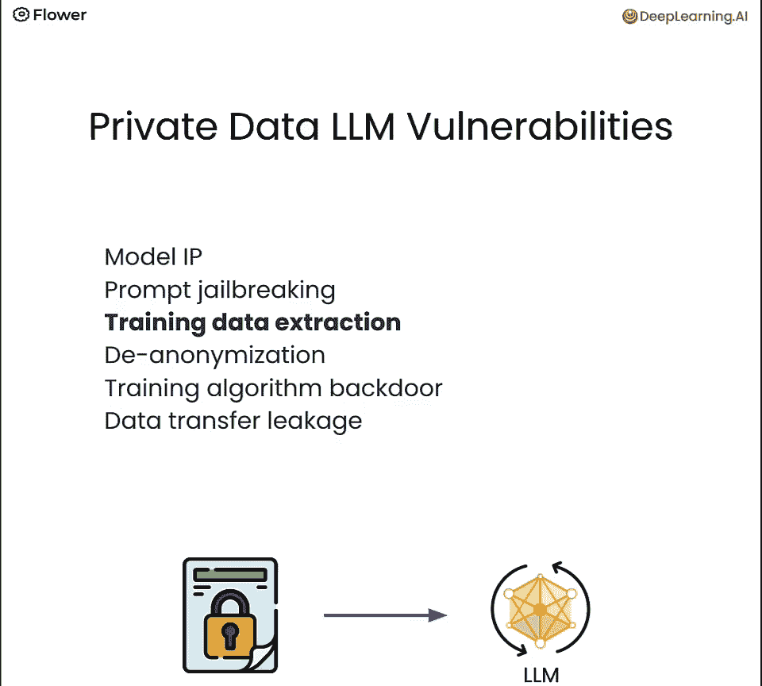

---

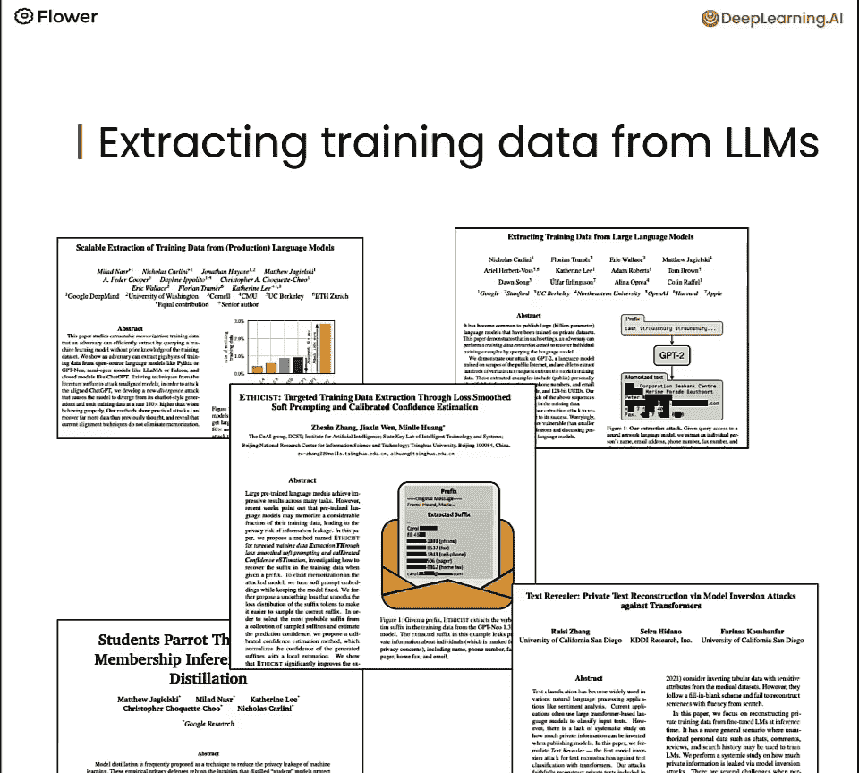

## 训练数据提取方法概览

在从大型语言模型中提取训练数据的特定领域内，已经有了很大的研究兴趣，并发明了各种各样的方法。上图仅展示了已发表学术论文中的一小部分，每一篇都描述了从大型语言模型中提取训练数据的独特方法。显然，由于我们正在研究私有敏感数据的使用，这种类型的攻击更加令人担忧。

所以在本节课中，我们将深入研究这些提取方法的基本原理。目的是让你了解它们是如何运作的，从而更好地理解它们所带来的风险。

### 攻击的一般框架

现在让我们来看看这些提取数据方法的一般框架。你可以将这些攻击的运作方式分解为两个不同的阶段。

**第一阶段：生成候选响应**
大型语言模型必须能够产生可能是实际训练数据示例的响应。这个过程本身有各种各样不同的形式，人们已经发明了促使模型更有可能生成实际训练数据示例的方法。例如，人们想出了巧妙的提示，比如提供一个起始标记、一个空字段，或者一个包含可能引导大型语言模型产生敏感数据片段的关键字的字符串。在后续代码中，我们使用一个非常基本的方法——仅用一个空字符串提示，即使这样也能成功。但一般来说，第一步围绕着不同的策略来提示模型生成一长串候选示例，希望这些示例包含训练数据。

**第二阶段：成员资格测试**
一旦完成了第一步，这类方法中的第二步执行可以被视为一种**成员资格测试**。这一步试图测试每个单独的候选示例，并执行一个过程，通过这个过程你可以决定候选示例实际上是否是模型训练集的一部分。如果你不能准确地执行这一步，进行这些训练数据提取攻击实际上是不可行的，因为你可以提示模型生成很多响应，但你需要能够可靠地理解这个示例是否真的在训练集中，才能真正取得进展。

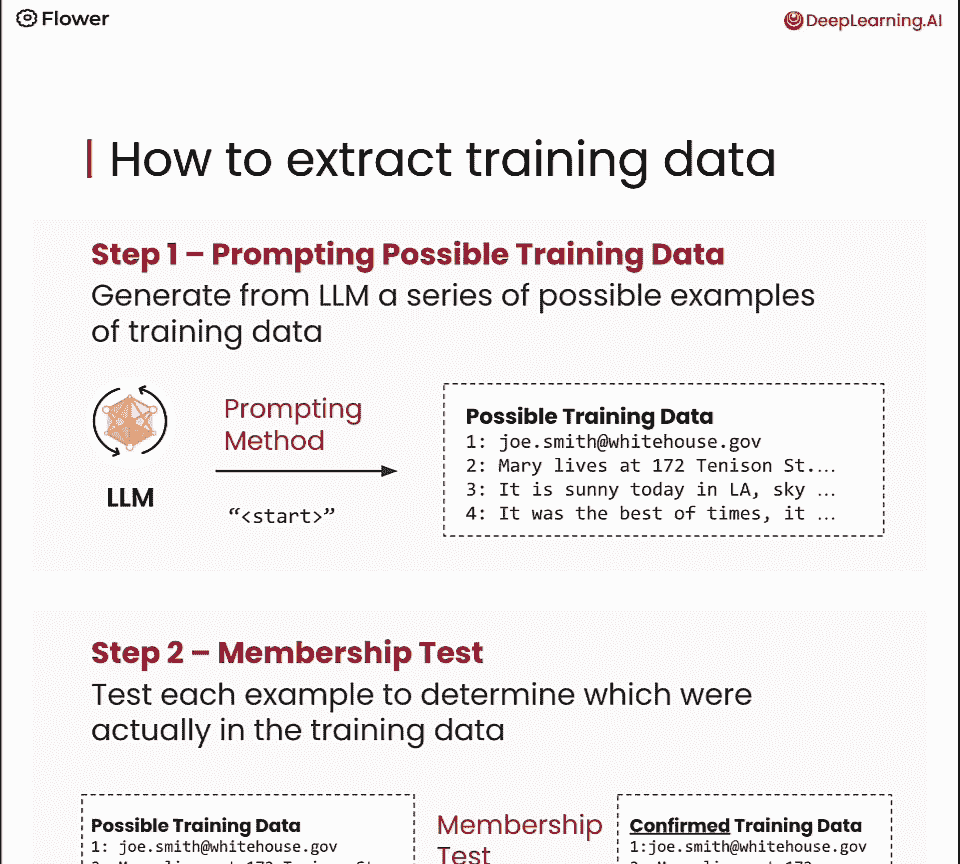

---

## 深入理解成员资格测试

让我们深入研究这第二步——成员资格测试。我们将用三个关键概念来理解它是如何工作的。

### 关键概念一：使用度量标准

我们要理解的第一个关键想法是**度量标准**的使用。我们在接下来的代码中将要使用的度量标准是**困惑度**。这是一种“惊讶”的度量，可以为大型语言模型产生的整个序列计算困惑度。根据困惑度值，你可以判断模型对产生这个序列有多“惊讶”。

困惑度的计算基于序列中每个标记被模型单独产生的归一化概率。因此，对模型来说不令人惊讶的序列往往是训练示例。这背后的直觉是，模型能够产生的大型语言模型训练示例往往是模型已经记住的示例。一个被记住的示例被产生，对模型来说不会是一个令人惊讶的示例。因此，通过计算困惑度，我们能够量化那种惊讶程度，并指示该序列、该示例是否真的是训练数据。

### 关键概念二：计算单个标记的概率

并非所有人都知道，但实际上可以询问一个大型语言模型，并让它为你生成一个单个标记产生或不产生的概率。这是我们如何总体计算困惑度的一个构建块。

我之前说过，困惑度是基于序列中所有单个标记的归一化概率。所以我们现在需要考虑如何生成单个标记的概率。这样做的方式是，对于给定序列，当你提示模型时，如果你在该序列中屏蔽后面的标记，你可以确定序列中下一个标记将是产生的那个的概率。

例如，我们有一个片段：“玛丽住在 172 号坦尼森街”。我们用前面的片段“玛丽住在 172”提示模型，然后屏蔽序列的其余部分。我们检查模型的权重以确定出现的单词的概率，并看看接下来的单词“坦尼森”在下一个“街道”中的概率是多少。这使我们能够确定那些后续标记的概率。

通过对序列中单个标记或单词的这些概率计算，我们然后可以计算困惑度。

### 关键概念三：设定阈值进行判断

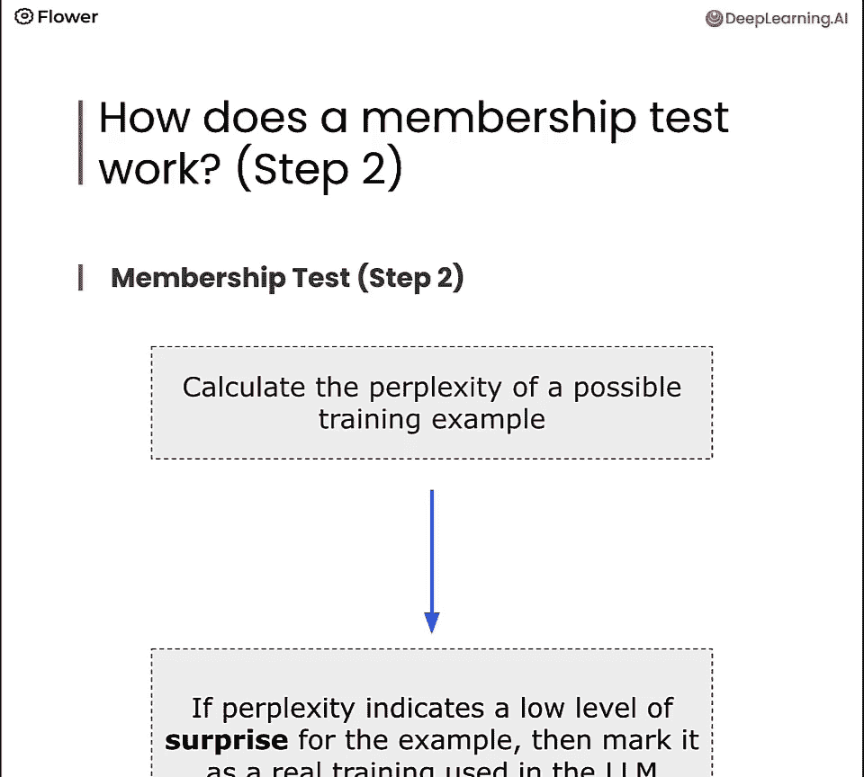

成员资格测试的最后一步是采用我们现在已经检查过如何计算的这个困惑度示例。然后我们检查困惑度的值以确定它是否足够低以表明模型是否惊讶。根据这个困惑度水平以及我们认为惊讶是否发生的水平，我们然后可以标记该示例是否真的是实际训练示例。

对于确定这种类型的阈值，即困惑度水平，以确定模型是否恰好同意这个训练候选者确实是来自训练数据集的一个例子，有各种各样不同的方法。

---

## 实践：代码演示训练数据提取

那么现在你理解了深入并执行这些训练数据提取方法之一所需的所有核心概念，我们现在要跳入代码中，亲眼看到它的发生。

在这第四课中，你将学习大型语言模型如何泄露训练数据，并观察到在联邦大型语言模型微调下微调的模型对这种特定漏洞具有显著更强的抵抗力。就像我们在以前的笔记本中所做的那样，当某些步骤需要时，我们将在7000万参数的大型语言模型和更大的70亿参数模型之间交替。但你看到的所有代码都可以应用于任何一个。此外，我们将使用与这个医疗数据集场景一致的相同模型和相同场景。

### 第一步：导入必要的包

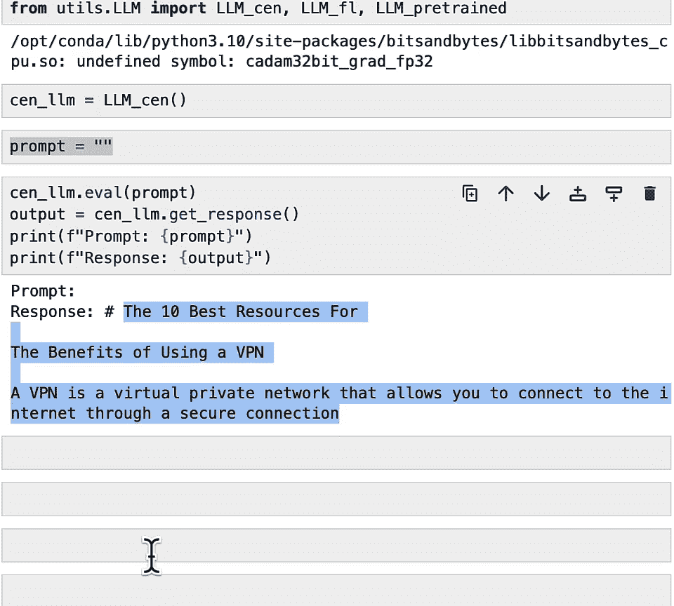

第一步，一如既往，让我们导入一些重要的包和实用函数，当你在这个笔记本中执行代码时我们将需要它们。

这些导入中的大多数实际上是为你编写的实用程序，以帮助并简化你执行这些攻击中的一些以及评估从不同版本的微调大型语言模型中提取训练数据有多难的任务。

### 第二步：尝试从微调模型中提取数据

在下一节中，你将逐步看到我们之前在幻灯片中描述的可以用于从大型语言模型中提取训练数据的简单方法。那么让我们开始吧。

你将首先使用在第2课中基本上在MedAlpaca上微调的大型语言模型工作。这是你将首先尝试从中提取训练数据的模型。所以让我们加载它。回想一下，这个模型是Mistral 7B大型语言模型。

**提取训练数据的第一步是生成可能的候选例子。** 这是通过提示模型来完成的。如前所述，已经开发了各种各样聪明的方法来以这样一种可能产生包含部分训练数据的响应的方式提示模型。那么让我们尝试一些这些方法的简单变体。

评估函数使用fireworks.ai服务在Mistral 7B参数大型语言模型上调用提示。并且正如我们在代码中看到的，即使使用空提示进行提示，也会产生一个可能是训练数据的有趣响应。看起来这个响应确实可能来自描述特定VPN服务好处的网站或其他材料。因此，可以想象这实际上是训练数据的一个例子。

你可以尝试不同的提示。

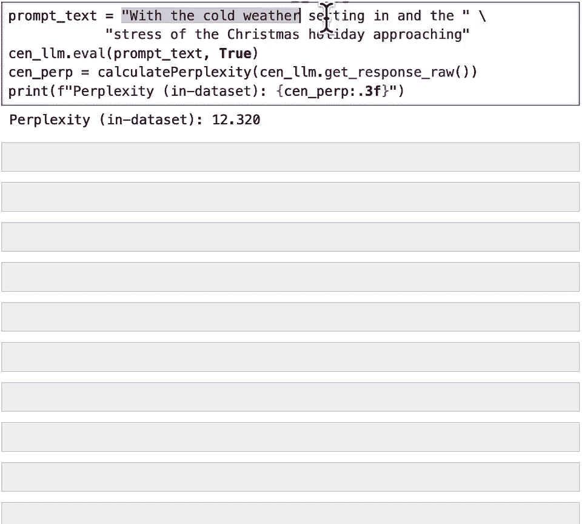

那么让我们试试一些。你可能想尝试的一个是简单地用一个前缀、一个带有电子邮件地址冒号的句子来提示它，然后看看模型是否会吐出一个电子邮件地址。作为另一个例子，你可以用一个名字的片段“彼得·W”来提示。如果你这样做，你可以看到响应给你的文本实际上可能来自一个网站上的传记，这可能是潜在地用于模型的训练数据。

所以主要在这里，我们看到了你可以用来生成一系列可能是或不是训练数据的候选例子的所有不同类型的简单提示。显然下一步将是决定你是否能够确定这些是否实际上是训练数据样本。

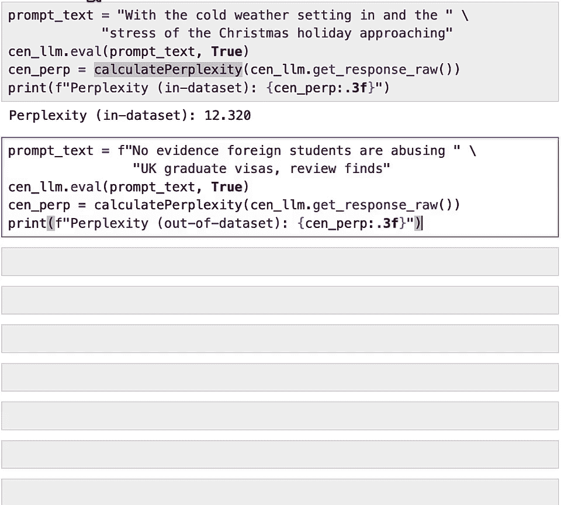

如果我们看这个最后的例子，我们在这里使用这个名字的片段“彼得·W”，并且我们似乎得到了一个是传记片段的响应，可能会很容易认为即使这是训练数据，这也是无害的。但请记住，我们正在看我们想要在私有数据上进行训练的例子。所以对于这个Mistral模型，如果这碰巧是训练数据，那么如果我们训练Mistral不是用公共网络数据，而是实际上用敏感私有数据进行训练，例如，像人力资源记录，那么这个传记很有可能直接来自某人的实际人力资源记录，比如某个特定公司的彼得的员工档案。

### 第三步：计算候选示例的困惑度

现在我们已经看到了你如何生成一些可能是训练数据的候选例子，下一步是为这些候选者中的一些计算困惑度。记住，我们不知道这些响应中的任何一个是否真的是训练数据。

困惑度为我们所做的是衡量大型语言模型能够多好地预测这些单词序列。低困惑度表明模型对产生的序列不感到惊讶。这可以是一个信号，表明该序列可能是实际训练数据的一个记忆片段。另一方面，高困惑度表明该序列不太可能由大型语言模型生成，因此在训练数据中以前不太可能被模型实际观察到。

你可以使用和以前一样的评估函数，但将第二个可选参数设置为真，这样当我们提示模型时我们可以注意到可能性。然后你可以使用计算困惑度函数根据你在代码中看到的那些收集到的可能性来计算困惑度。这里的困惑度值相当低，但请记住，困惑度和其他类似的此类度量标准只是表明该示例是训练数据的指示。

### 第四步：分析困惑度阈值

现在让我们更仔细地看看这些困惑度值。如前所述，当困惑度较低时，那么数据更有可能来自实际训练数据。但多低才算低呢？好的阈值是多少？让我们看两个例子。

这是一个来自Mistral 70亿参数模型的响应示例，很可能是实际训练数据。这是因为我们可以在一个很可能被Mistral爬取的实际网站上找到这个文本片段，或者至少在Mistral使用的数据集中，并进入了这个模型的训练数据。

现在让我们看一个不同的例子。让我们看看这个句子的困惑度。

这个句子来自《卫报》的一篇新闻文章。《卫报》是英国的一家主要报纸。实际上，这篇文章发表于2024年5月9日，所以这太新了，不可能已经包含在Mistral 7B模型的训练集中。

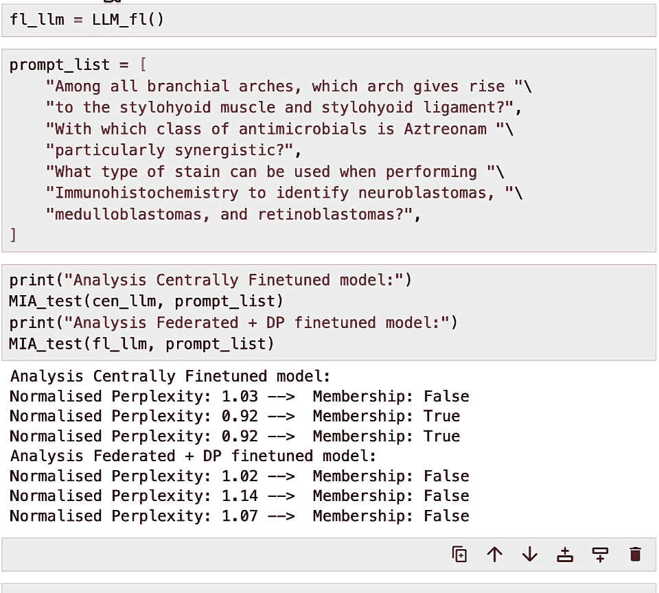

所以你在这里看到的是一个困惑度值，极有可能实际上不可能在Mistral模型的训练集中。这样你就可以开始对这个特定模型进行校准，以及对于它们来说困惑度需要达到什么水平才完全不可能是训练数据。

然后如果我们看前面的例子，我们看到一段实际上很可能是训练数据集一部分的文本，我们可以开始看到当示例确实是训练数据时困惑度值的倾向。请注意，在不是训练数据的例子中，困惑度高出六倍。

需要注意的是，在这两种情况下，我们都为你提供了指向时光机的URL，所以即使一些链接如新闻文章不太可能持久，但无论你何时观看本课程，你都能够访问这些，并且看到这些实际的网站示例，至少看起来很有可能数据被爬取并是Mistral模型的一部分，并且我们能够从Mistral模型中提取出来。在第二个例子中，我们从互联网上获取了一个我们知道几乎不可能出现在Mistral内部的文本片段，然后验证了这个特定片段的困惑度值。

### 第五步：应用于私有数据与微调模型

鉴于你现在已经学到和看到的，你可以将此方法应用于代表性私有数据、MedAlpaca数据集以及我们到目前为止构建和训练的微调模型。

首先，加载在中央进行微调的大型语言模型。你在第二课就这么做过。然后你可以尝试回答这个问题：我们能否从这个微调模型中提取来自MedAlpaca数据集的问题？

在这里你可以看到你可以再次计算困惑度，然后使用未微调的同一个大型语言模型进行归一化。你会观察到归一化后的困惑度非常低，这表明数据很可能来自训练数据集，在这种特殊情况下我们知道这是真的，因为这个模型实际上是在我们获取计算困惑度的提示文本的训练集上进行训练的。所以这是一个可以从集中训练的大型语言模型中提取的提示文本的例子。

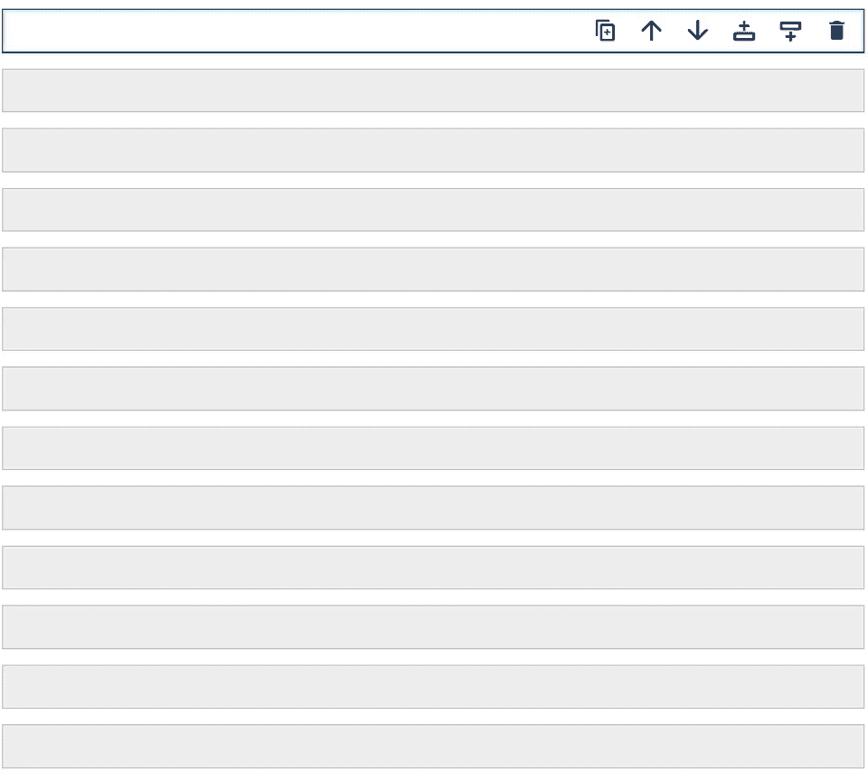

### 第六步：比较联邦微调与集中微调

在本课程中我们研究的核心之一是如何使用带有大型语言模型微调的联邦学习，使其更难以提取训练数据。那么让我们通过开始比较第二课和第三课的微调模型，即中央微调的模型和使用联邦方法微调的模型，来看看哪个更难以提取医学羊驼数据，当然在整个课程中这一直是我们的私有数据代表。

到目前为止你在这个笔记本中探索的技术已经很好地打包成一个名为`MIA_test`的单一函数。这个测试将一系列可能的训练示例（这些候选者）作为输入，然后帮助我们根据困惑度来决定它们是否是模型训练数据的一部分。

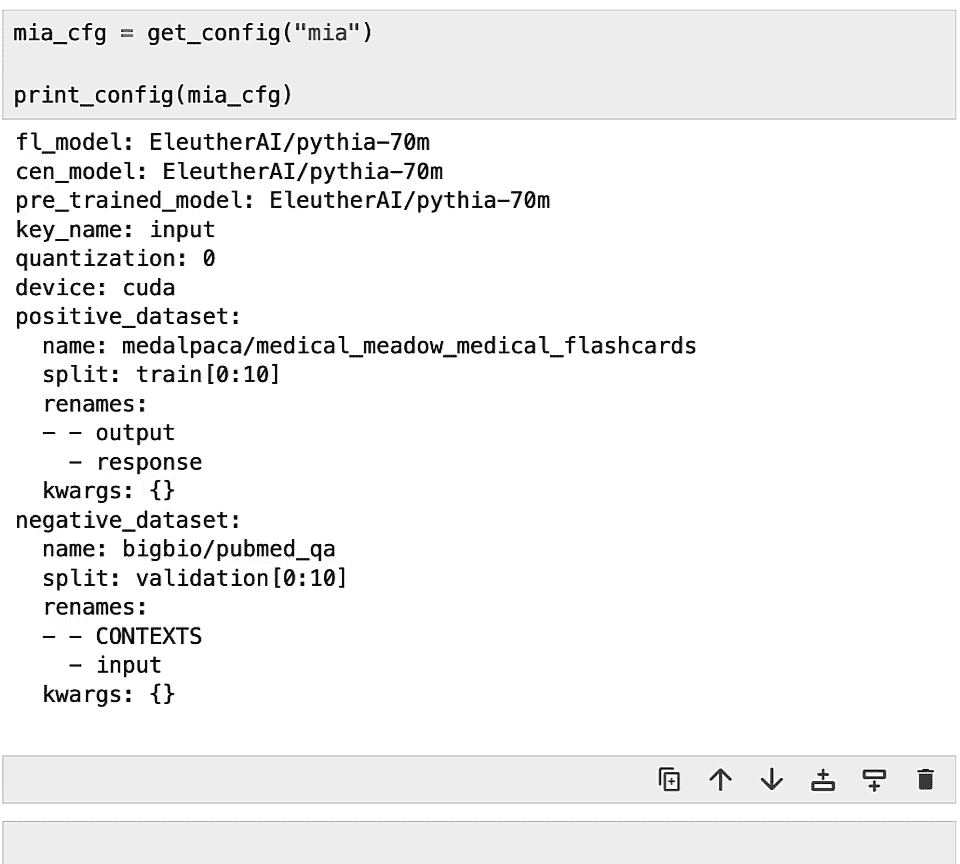

最初，你将针对集中微调模型运行此测试，然后接下来你将针对联邦版本运行此测试。

从结果中，你可以看到我们在这里使用的三个例子中的两个，每个例子都来自医学羊驼数据。你可以看到三个中的两个被识别为来自集中模型的训练数据。我们当然再次知道它们是这个模型训练集的一部分，因为我们自己在这个数据集上对它们进行了微调，所以我们意识到该函数返回成员资格为真，以表示该示例被认为是训练集的一部分。

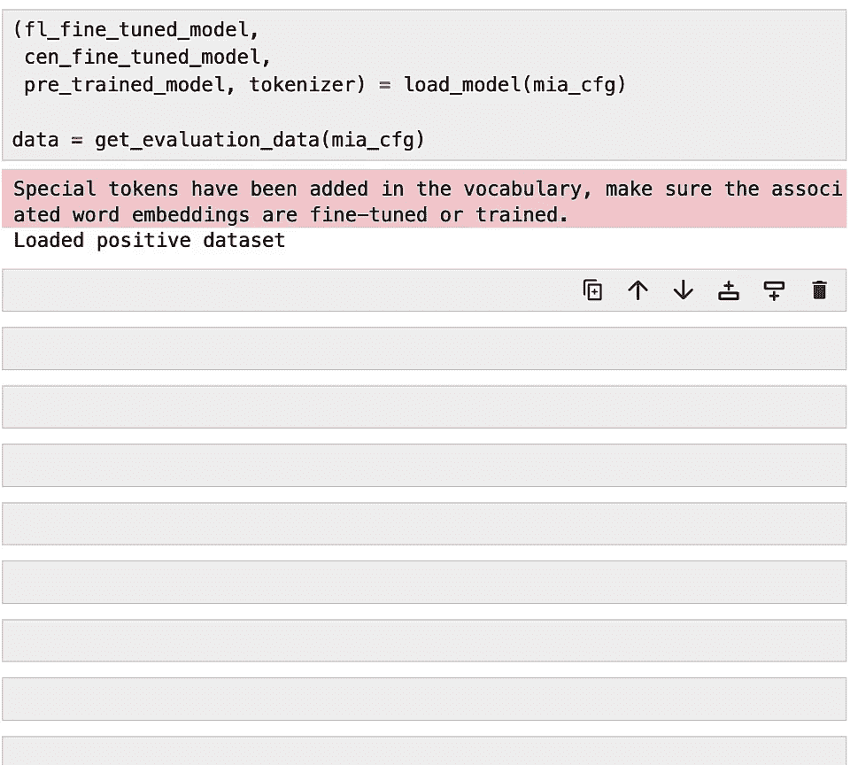

所以总的来说，在三个例子中我们试图从集中微调模型中提取，然后在这三个例子中我们能够这样做两个。

另一方面，让我们看看联邦模型。从结果中我们可以看到我们试图提取的每个候选者都被报告为假。该算法，这种基于困惑度的技术不确定这个特定的训练示例是否是训练集的一部分。所以在联邦模型下，这种方法无法识别这些示例是训练数据，因此试图提取训练数据的人将无法知道模型的哪个响应（可能有很多记忆的训练数据）或只是对提示的典型大型语言模型响应。无法区分它。

所以在这个小实验中，我们看到集中式模型三次尝试中有两次成功，而联邦情况下三次尝试都为零成功，这表明在提供的隐私方面可能有了一些显著的改进。

### 第七步：大规模实验验证

但接下来自然要问的问题是，在更大的实验中这是否还成立？如果是这样，那么我们可以开始认为该陈述将更普遍地成立。为了回答这个问题，你可以在更大的规模上进行前面的实验，不仅涉及三个示例，还涉及我们在整个课程中一直使用的MedAlpaca数据集的很大一部分。

分析这个新实验结果的标准方法是使用**受试者工作特征曲线**。所以当我们在更多示例上以更大规模应用这种提取训练数据的方法时，受试者工作特征曲线将告诉我们对于集中式模型和联邦模型，真阳性和假阳性可以被检测得有多好。

让我们从这个7000万参数的小模型开始并进行这个分析，你将通过一个配置开始这样做。

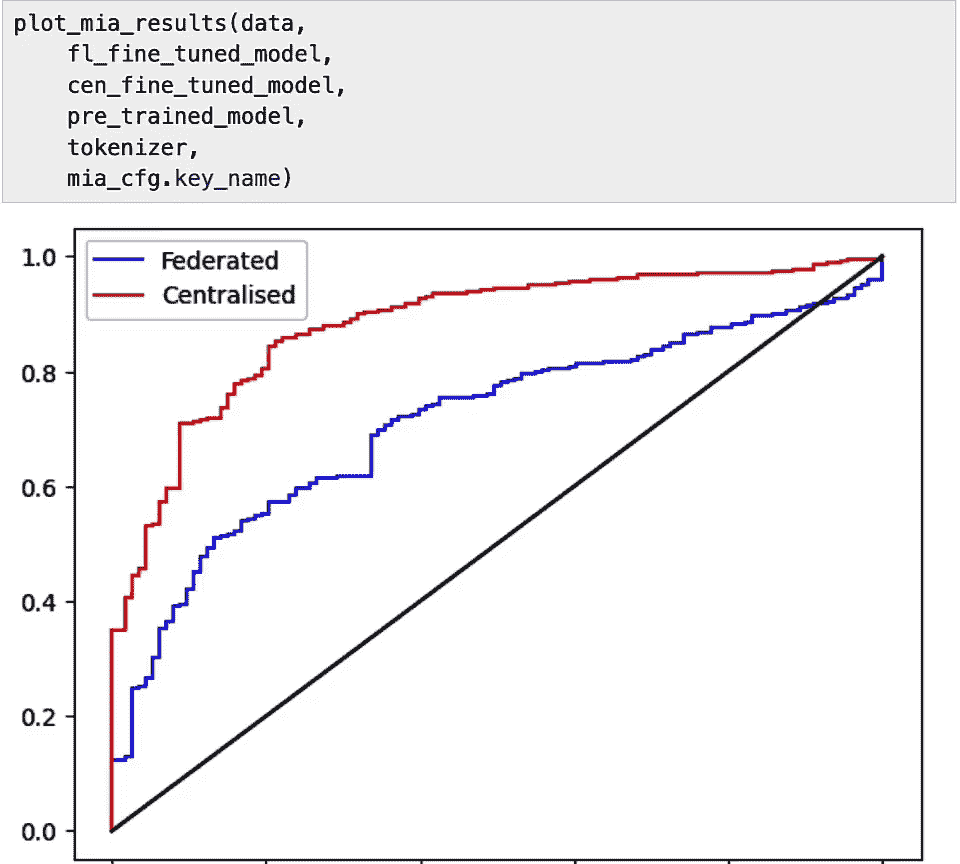

在这个配置中有几件值得注意的事情是两个数据集是如何设置的。受试者工作特征曲线将需要指定阳性和阴性数据集。这就是在这个配置文件中已经完成的。在一种情况下你使用MedAlpaca医疗抽认卡，在另一种情况下使用BigBio PubMed问答来满足阳性和阴性数据集的这些要求。这个配置使用了10个示例，每个样本索引从0到9。你可以很容易地调整配置以使用更多的数据和验证。在这个配置中，训练设置在0到10之间，验证设置在15到25之间。你也可以用你喜欢的任何模型替换这个模型，并通过简单地更改这个配置来使用其他数据集。

进行整个这个分析将意味着等待相当长的时间。所以我们希望你能够看到我们对大量示例进行这种分析的结果。所以我们已经为你离线完成了。我们早些时候已经完成了，并像我们在本课程的许多早期课程中所做的那样保存了输出。让我们加载这个输出。你将使用一个叫做`plot_MIA_results`的函数。

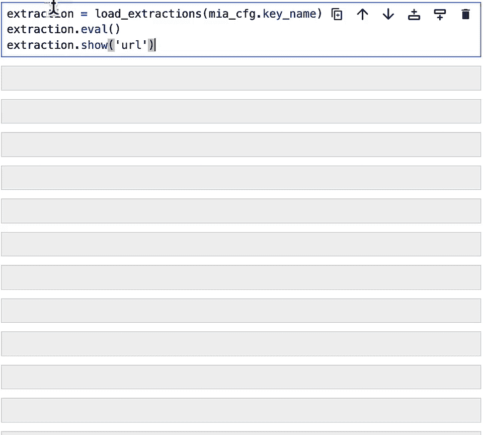

这需要前面提到的分析所保存的输出，并将信息呈现为一条ROC曲线，该曲线比较了联邦和集中式模型相对于仅仅使用随机选择来决定候选示例是否是训练数据集一部分的第三种情况。

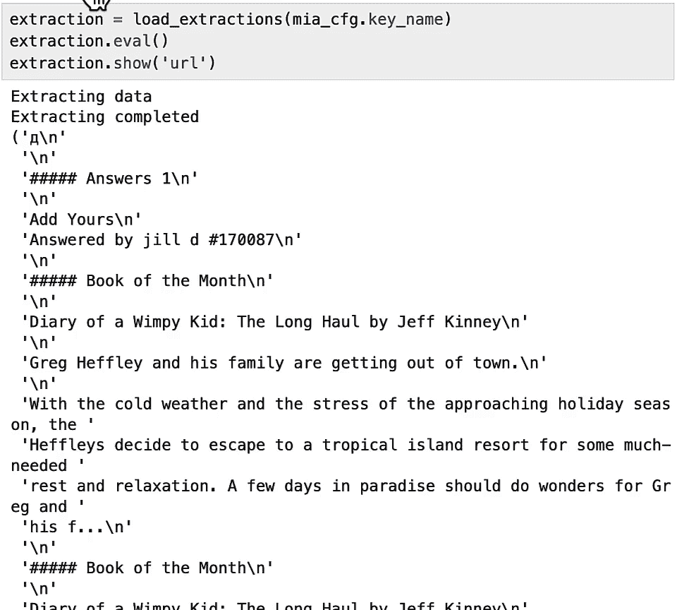

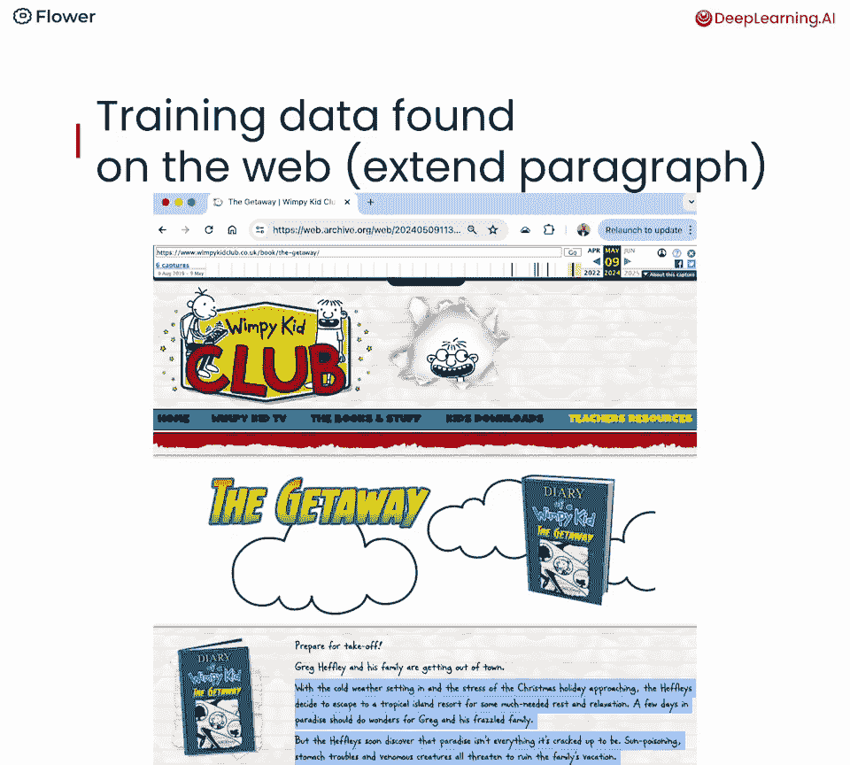

从这个图中立即跃入你眼帘的一个重要信息是，对于用这条红线表示的集中微调模型，训练数据提取系统地比用蓝色表示的联邦微调模型更容易。在这个图中，黑色是随机机会。现在ROC曲线衡量提取过程的效果如何。曲线的面积表示这个过程实际上能够多么成功以及以多么少的错误被应用并且能够正确识别训练示例。这个过程越准确，它就越向左上角移动。你可以看到这对于对应于集中微调模型的红色曲线是这样发生的。

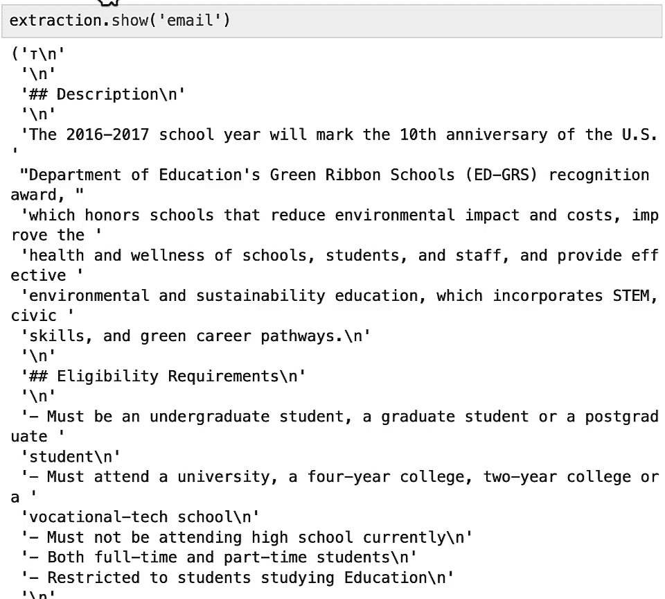

在这条ROC曲线中，y轴是真阳性率。x轴是假阳性率。那么让我们考虑在这个图中显示的几个数据点。该图显示，我们使用的MedAlpaca数据集部分中大约83%的候选示例在集中设置下被正确分类。这比在联邦微调模型下可以看到发生的成功率高大约30%，联邦微调模型仅以63%的成功率成功。

但请记住，这些曲线的形状，我们得到的百分比，都取决于调整。你可以通过改变诸如差异隐私的关键变量和我们在前一节课中看到的描述的联邦LLM微调配方的其他成分的选项，来选择如何增加和降低这些曲线。通过改变这些值，你能够降低或减少你收到的隐私保护量。你可能想要这样做的原因是，在微调期间，随着你增加隐私保护水平，对所得模型的保真度往往会有相应的影响。

### 第八步：在大型模型上的实际应用

在这个笔记本的最后一部分，让我们更详细地看看你到目前为止一直在使用的困惑度方法在Mistral 70亿参数模型上实际上是如何工作的。这很有趣，因为Mistral是一个广泛使用的、非常大规模的语言模型，我们知道它是在公共数据上训练的。所以我们可以执行并检查提取这种训练数据有多容易，因为这在某种程度上可以作为尝试提取私有数据的一个代理，在这个例子中，假设你实际上无法访问任何训练数据。你只是想识别用于训练模型的敏感数据，或者在这种情况下，用于训练模型的公共数据。

因为你没有任何训练数据，所以会生成各种各样的训练示例候选。所以需要生成大量候选并测试它们的困惑度。并且就像在这个特定的笔记本中已经发生过几次的那样，为了避免你等待，这个过程又一次在离线状态下进行。我们从Mistral模型生成了相当多的候选。然后该生成的输出已为我们保存以便检查。

提取用于存储输出。

所以这个提取变量，即`mi_config`，配置并指定行为、要检查的模型等等。然后这里再次有趣的是这不是一个玩具模型。然而我们所描述的程序被认为运行良好。评估和展示被用于提取这些例子中的一些。

第一个例子显示模型能够产生甚至是现有网站的整段内容。

在第二个例子中，我们可以看到在模型中找到电子邮件地址，并且这些与训练数据相对应。

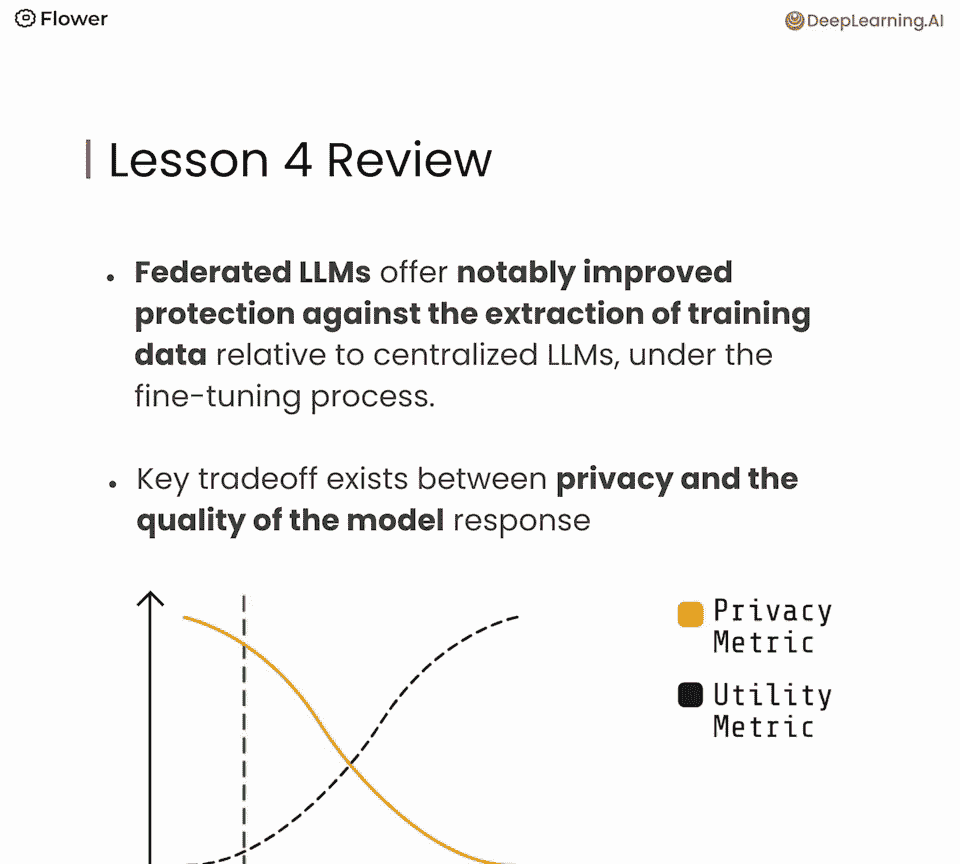

![](img/2b670b1eb6a4616ac