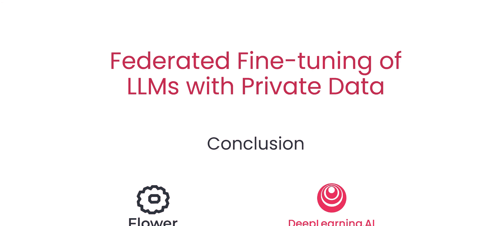
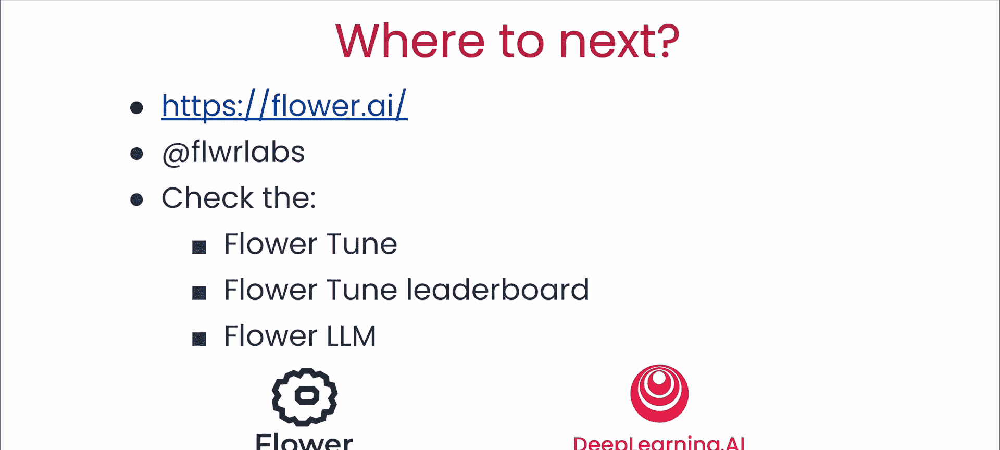

# 006：6. 结论 🎯

在本节课中，我们将一起回顾并总结利用联邦学习技术，结合私有数据对大型语言模型进行微调的核心内容。

---

恭喜你完成本课程。通过本课程的学习，你了解了利用联邦学习技术，借助私有数据使大型语言模型变得更智能的潜力。特别是，你学习了这种方法如何帮助你处理将联邦学习与大型语言模型结合时，所出现的关键隐私和效率问题。

现在，你已经在大型语言模型与联邦学习的道路上迈出了第一步。接下来可以做什么呢？你可以通过访问 `flower.ai` 网站，或在 `x.com` 上关注 `@flowerlabs` 来获取更多信息。你也可以加入 Flower 社区的 Slack 频道，与数千名志同道合的人工智能研究人员和工程师交流，探索关于这个主题的更多内容、新配方、新方法以及示例。

我特别建议你查看 **FlowerTune**、**FlowerTune 排行榜**，以及我们称为 **FlowerLLM** 的新大型语言模型预训练技术。

最后，感谢令人惊叹的 Flower 社区。我十分期待看到你们所有人即将构建出的卓越的联邦大型语言模型应用。

---

**本节课总结**：本节课我们一起回顾了联邦学习结合私有数据微调大模型的潜力与挑战，并为你指明了后续深入学习和实践的方向与资源。