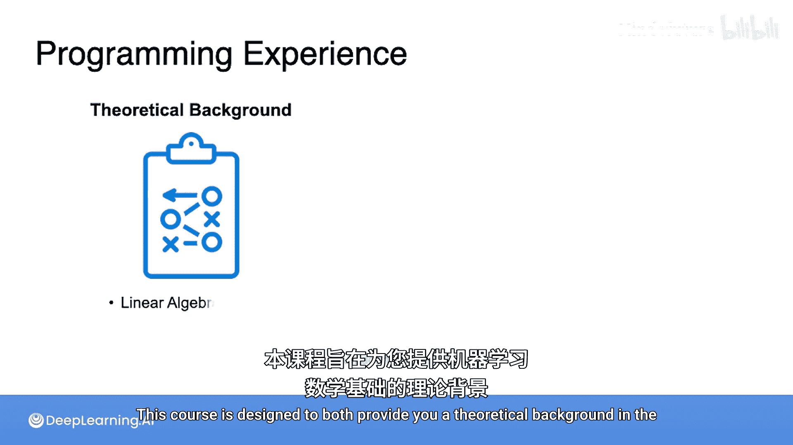
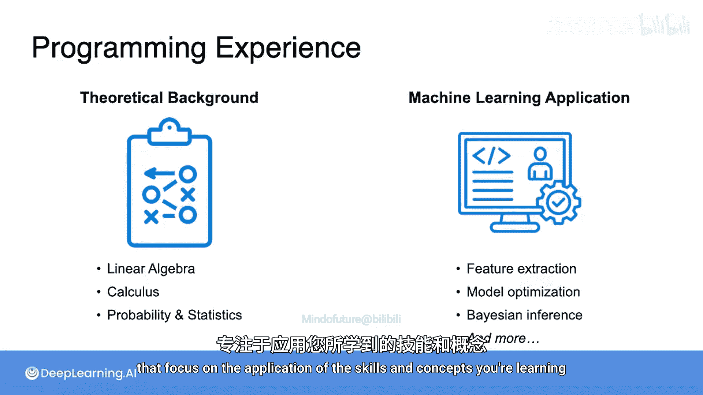
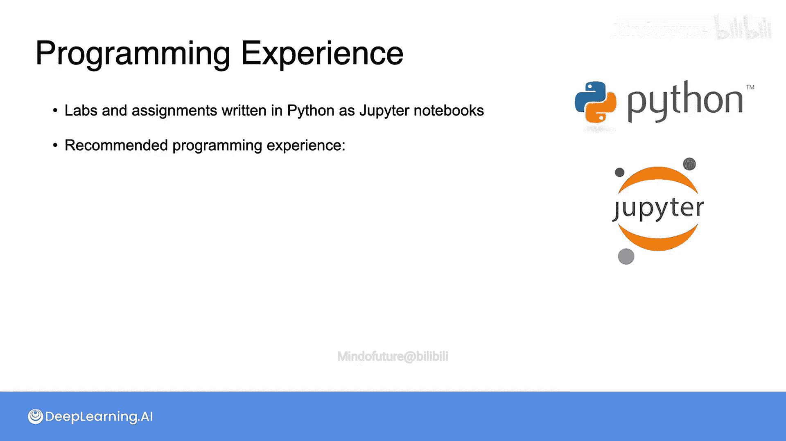
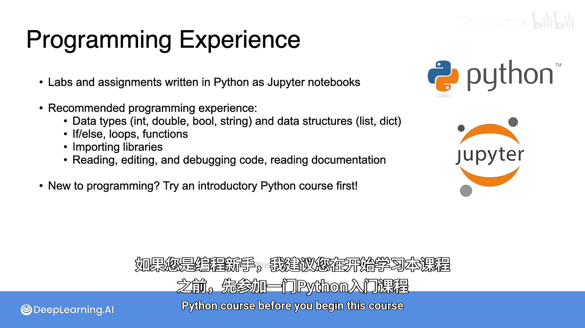
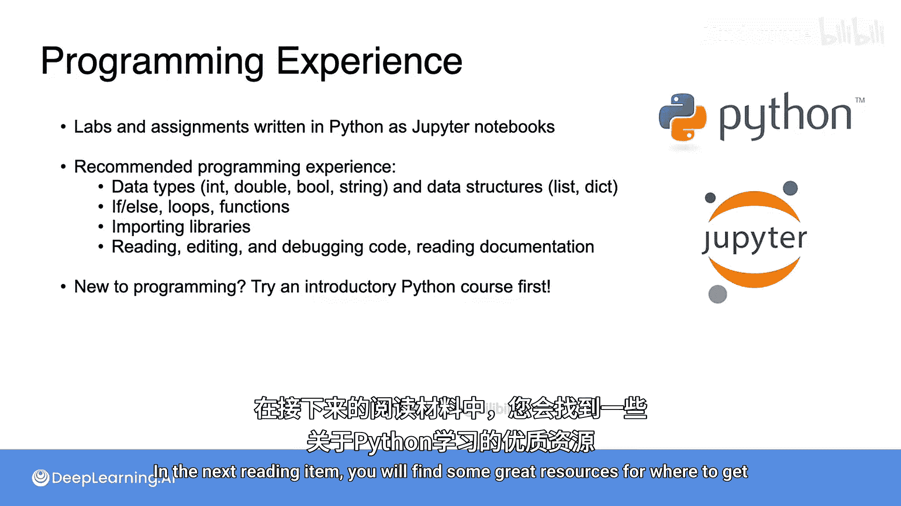

# 002：关于编程经验的说明 🐍

在本节课中，我们将要学习本课程对编程经验的要求，并了解如何为课程中的实践环节做好准备。

本课程旨在为您提供机器学习背后的数学理论基础，并向您展示这些概念如何在实践中应用。这意味着您需要进行一些编程。课程包含评分编程作业和未评分编程实验，这些练习专注于应用您正在学习的技能和概念。

## 编程语言与工具

上一节我们介绍了课程包含编程实践，本节中我们来看看具体使用的工具和语言。

这些练习使用 **Python** 编写，并以 **Jupyter Notebook** 的形式呈现。Jupyter Notebook 是一个基于网页的交互式界面，允许您阅读、运行和编辑这些程序。

您不需要成为 Python 专家也能成功完成这些练习，但您应该熟悉通常在 Python 入门课程中教授的概念。

以下是您需要掌握的核心 Python 概念：
*   **数据类型与数据结构**：例如整数、浮点数、字符串、列表、字典等。
*   **控制流**：使用条件语句（`if`/`elif`/`else`）、循环（`for`/`while`）和函数。
*   **库的使用**：导入和使用不同的 Python 库（如 `numpy`, `pandas`）。

## 所需技能水平

您应该能够运用上述概念来阅读和编辑 Python 代码，编写和调试自己的代码，并偶尔查阅新软件包的文档。

如果您精通另一种编程语言，那么在学习本课程的过程中，同步学习所需的 Python 知识应该没有问题。

然而，如果您是编程新手，建议您在开始本课程之前，先学习一门 Python 入门课程。

在接下来的阅读材料中，您将找到一些关于从何处开始学习 Python 的优秀资源。

本节课中我们一起学习了本课程对编程经验的具体要求。我们了解到课程实践部分使用 Python 和 Jupyter Notebook，并明确了成功完成练习所需具备的编程基础技能。对于有经验或无经验的学员，课程也给出了相应的学习路径建议。