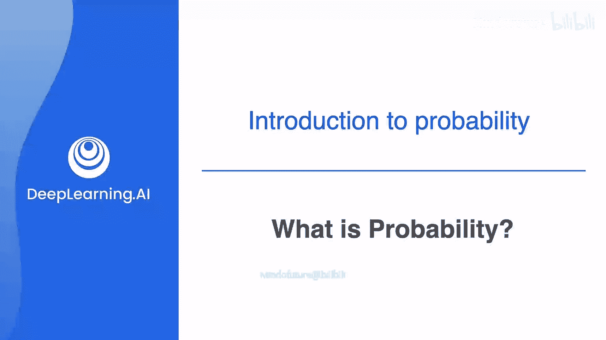
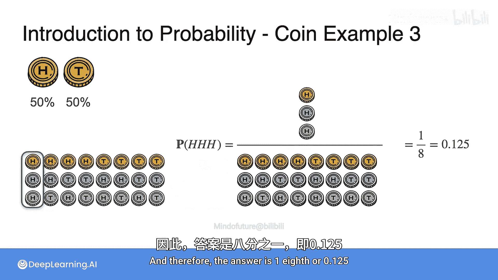

# 003：什么是概率

在本节课中，我们将要学习概率的基本概念。我们将从一个简单的例子开始，理解概率的定义和计算方法，然后通过掷硬币的例子，逐步探索更复杂的概率问题。

## 概述

概率是衡量一个事件发生可能性的度量。例如，抛一枚公平的硬币，正面朝上的概率是50%或1/2。掷一个骰子，得到数字4的概率是1/6。理解这些基础概念是学习机器学习和数据科学中更高级概率理论的第一步。

## 概率的基本定义

简单来说，概率是衡量一个事件发生可能性的度量。

为了开始我们的探索，我们将通过一个有趣的问题来测试你的概率技能。想象你在一所有10个孩子的学校里，你想从学校的所有孩子中随机挑选一个。其中，有3个孩子踢足球，7个不踢。

问题是，你随机挑选的孩子踢足球的概率是多少？

让我们深入概率的世界，一起学习如何解决这个问题。

回想一下，你想找到随机挑选的孩子踢足球的概率。在数学中，我们有一种方式来表示这个陈述，我们将使用 **P(足球)** 来表示一个孩子踢足球的概率。

为了计算一个孩子踢足球的概率，我们需要知道踢足球的孩子数量以及学校里的孩子总数。我们将用以下概率公式来表达：**踢足球的孩子数量 / 孩子总数**。

因此，随机挑选的孩子踢足球的概率是 **3/10** 或 **30%**，也可以写成 **0.3**。

*   分子代表事件，即实验中有利的结果。在我们的案例中，就是踢足球的孩子，数量是3。这是事件的大小。
*   分母对应样本空间，即所有可能结果的总数。这个数量是10。这是样本空间的大小。

这样，我们就成功地运用概率的基本原理解决了问题。通过理解这个简单的问题，你将能够在机器学习和数据科学中更复杂的现实世界场景中应用这些概念。

## 使用文氏图理解概率

现在，使用文氏图的概念，总人口（所有孩子）在这里由绿色矩形表示，这将是100%的人口。包含踢足球和不踢足球孩子的绿色矩形就是样本空间。

踢足球的30%的孩子将在这个圆圈内，这就是事件，即你感兴趣的群体。而不喜欢足球的孩子将在圆圈外，但仍在绿色矩形内，因为他们仍然是人口的一部分。

因此，我们可以通过将有利结果的数量除以可能结果的总数来计算概率。

## 掷硬币实验

在我们的下一个例子中，我们将抛一枚硬币。当我们这样做时，硬币可能正面朝上或反面朝上。因为抛硬币这个活动会产生一个不确定的结果，我们称之为**实验**。在概率论中，实验是任何产生不确定结果的过程。

因此，在我们的语境中，抛硬币是一个实验，我们将确定硬币正面朝上的概率，记为 **P(正面)**。

我们将抛一枚**公平的硬币**，这意味着每个结果（正面或反面）发生的可能性相等，因此两者都以50%的概率发生。

**P(正面)** 等于**正面朝上事件**除以**结果总数**，即 **1/2** 或 **0.5**。

## 更复杂的概率问题

现在让我们把问题变得稍微复杂一点，抛两枚硬币。两枚硬币都正面朝上的概率是多少？

为了回答这个问题，让我们逐步分析实验以确定结果总数。

*   第一枚硬币可以正面朝上或反面朝上。
*   现在，对于第一枚硬币的每一种结果，第二枚硬币也可以正面朝上或反面朝上。

所以我们的最终结果是：
1.  正面，正面。
2.  正面，反面。
3.  反面，正面。
4.  反面，反面。

总共有四种结果。

在这些四种可能结果中，我们感兴趣的是两枚硬币都正面朝上的那一种，所以只有一种这样的结果，即“正面，正面”。

因此，两枚硬币都正面朝上的概率，记为 **P(HH)**，是**有利结果数（1）**除以**结果总数（4）**，所以是 **1/4** 或 **0.25**，也称为 **25%**。这就是两枚硬币都正面朝上的概率。

## 扩展到三枚硬币

现在，如果我们抛三枚硬币呢？让我们计算三枚硬币都正面朝上的概率。

当你抛三枚硬币时：
*   第一枚硬币可以正面朝上或反面朝上。
*   现在，对于第一枚硬币的每一种结果，第二枚硬币可以正面朝上或反面朝上。
*   并且，对于第一枚和第二枚硬币的每一种结果组合，第三枚硬币可以正面朝上或反面朝上。

我们总共有多少种结果？我们有八种：
1.  正面，正面，正面。
2.  正面，正面，反面。
3.  正面，反面，正面。
4.  正面，反面，反面。
5.  反面，正面，正面。
6.  反面，正面，反面。
7.  反面，反面，正面。
8.  反面，反面，反面。

现在的问题是，三次都得到正面的概率是多少？

在这八种可能结果中，我们感兴趣的是三枚硬币都正面朝上的那一种，即 **1** 除以**结果总数 8**。

因此，答案是 **1/8** 或 **0.125**。

## 总结

在本节课中，我们一起学习了概率的基本概念。我们从概率的定义开始，即事件发生可能性的度量。我们通过一个挑选孩子的例子，学习了如何用公式 **P(事件) = 有利结果数 / 可能结果总数** 来计算概率。接着，我们使用文氏图直观地展示了样本空间和事件。然后，我们通过抛一枚、两枚和三枚硬币的例子，实践了计算更复杂事件的概率，理解了如何通过列举所有可能结果（样本空间）来解决问题。这些基础是构建后续更高级概率知识，如概率规则、贝叶斯定理和概率分布的基石。