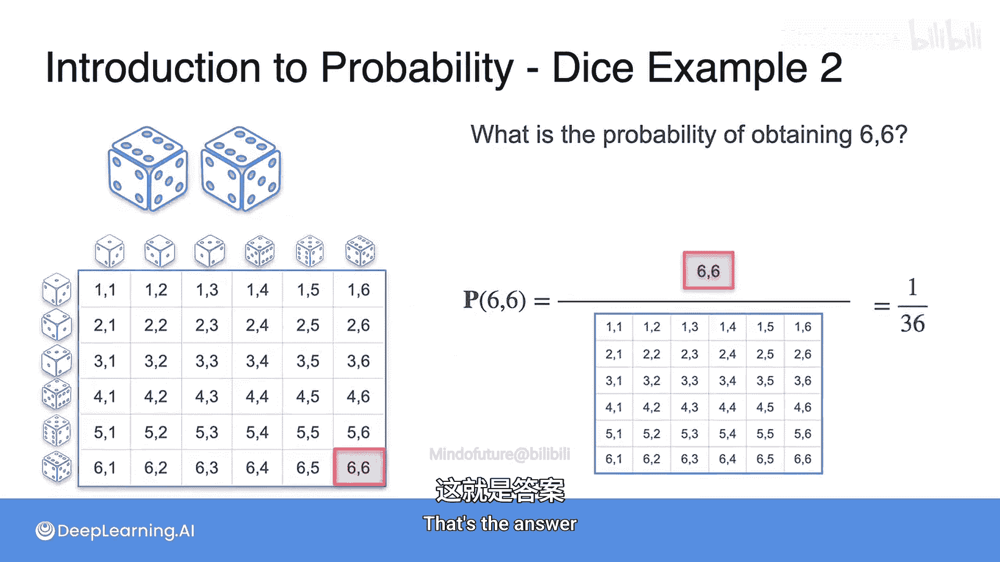
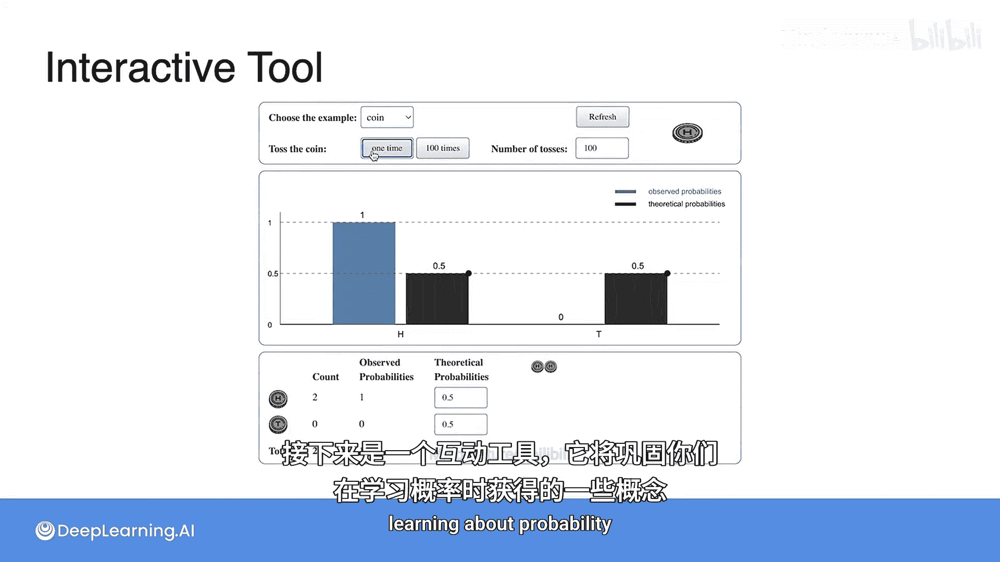
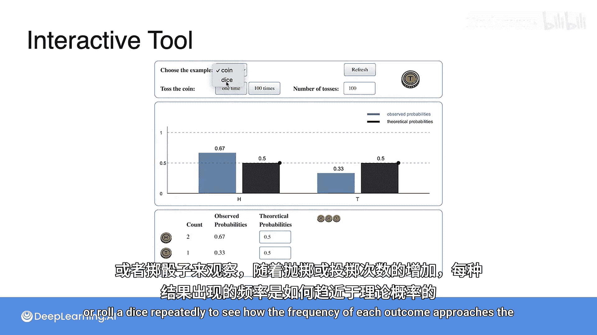
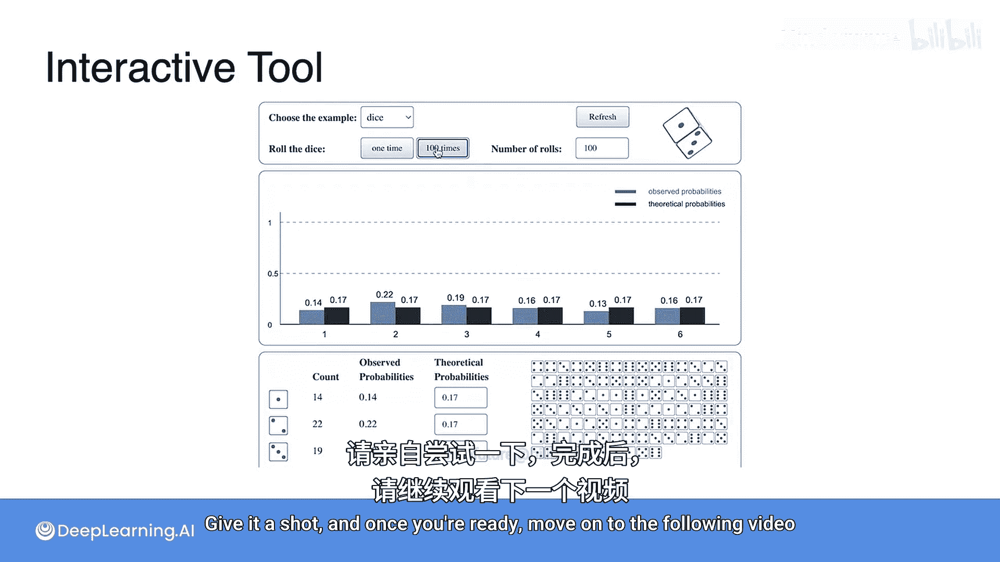

# 004：骰子示例 🎲

在本节课中，我们将通过掷骰子的示例来巩固对概率的理解。我们将学习如何计算单一事件和复合事件的概率，并观察实验频率如何随着试验次数的增加而趋近于理论概率。

## 掷一个公平的六面骰子

上一节我们介绍了概率的基本概念，本节中我们来看看一个具体的例子：掷一个公平的六面骰子。

现在有一个问题：掷一次这个骰子，得到点数为6的概率是多少？

由于骰子是公平的，所有六个面（1到6）出现的可能性均等。样本空间包含6个等可能的结果。事件“掷出6点”只对应其中一个结果。

因此，掷出6点的概率计算公式为：

**P(6) = 1 / 6**

## 掷两个骰子

理解了单一事件的概率后，我们进一步探讨更复杂的情况：同时掷两个骰子。

下一个问题是：同时掷两个骰子，得到两个都是6点（即结果为“66”）的概率是多少？

我们需要考虑整个样本空间。对于第一个骰子的每一种结果（6种可能），第二个骰子也有6种可能的结果。因此，总的可能结果数量是：

**6 × 6 = 36**

样本空间包含从(1,1)、(1,2)一直到(6,6)的36种等可能组合。事件“两个骰子都是6点”只对应(6,6)这一个结果。

因此，得到“66”的概率计算公式为：

**P(66) = 1 / 36**

## 交互实验：频率与概率

理论概率为我们提供了预期，而实际实验中的频率可能会有所不同。以下是一个可以强化你概率概念的工具。

你可以通过反复抛硬币或掷骰子来进行实验。随着抛掷或投掷次数的增加，观察每个结果出现的频率是如何逐渐接近其理论概率的。

请尝试这个实验。当你准备好后，可以继续学习接下来的视频内容。

## 总结

本节课中，我们一起学习了如何通过掷骰子的例子计算概率。我们首先计算了掷一个骰子得到特定点数的概率（**P(6) = 1/6**），然后计算了掷两个骰子得到特定组合的概率（**P(66) = 1/36**）。最后，我们通过交互实验观察了频率随着试验次数增加而逼近理论概率的现象，加深了对概率本质的理解。