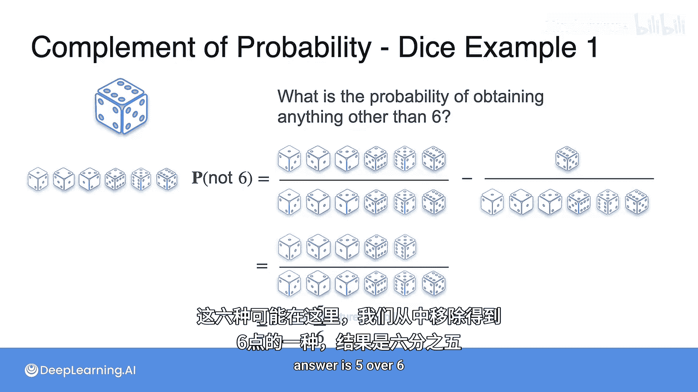

# 005：概率的补集

## 概述
在本节课中，我们将要学习概率论中的一个重要概念——事件的补集及其概率。我们将了解如何计算一个事件不发生的概率，并学习一个简洁的规则来简化计算过程。

## 补集概率的概念
上一节我们介绍了如何计算一个事件发生的概率。本节中，我们来看看如何计算该事件**不发生**的概率，这被称为事件的补集概率。

例如，如果一个事件发生的概率是75%，那么该事件不发生的概率就是25%。

## 通过实例理解补集
让我们回到之前有10个孩子的学校例子，其中3个孩子踢足球，7个不踢。

以下是一个问题：如果随机挑选一个孩子，这个孩子不踢足球的概率是多少？

要计算孩子不踢足球的概率，我们记为P(不踢足球)。我们采用和之前相同的方法：计算不踢足球的孩子数量，然后除以孩子总数。结果是7除以10，即0.7。

然而，你可能已经注意到，这个概率与孩子踢足球的概率有关。不踢足球的概率是0.7，而踢足球的概率是0.3，两者相加等于1。事实证明，这种情况总是成立。

我们可以将其重写为1减去0.3。这本质上就是**补集规则**。

## 补集规则
补集规则指出：一个事件A不发生的概率等于1减去事件A发生的概率。

因此，不踢足球的概率等于1减去踢足球的概率。这就是补集规则。

我们可以用以下公式形式化这个规则：
**P(A') = 1 - P(A)**
其中，A'代表事件A的补集，即事件A不发生的情况。

使用这个公式，我们可以用一种更直接的方式计算事件不发生的概率。

## 文氏图表示
我们可以用文氏图以类似的方式来看待这个问题。整个矩形代表样本空间。圆圈内部代表“踢足球”的事件，圆圈外部则代表“不踢足球”的事件。图中显示，圆圈外部的面积占70%，圆圈内部占30%。

## 应用补集规则：抛硬币实验
现在，让我们将补集规则应用到抛三枚硬币的实验中。

以下是一个问题：**不**得到三个正面的概率是多少？

根据补集规则，不得到三个正面的概率P(非三个正面)等于1减去得到三个正面的概率P(三个正面)。正如你在之前的视频中所见，P(三个正面)是1/8。

因此，我们有：
**P(非三个正面) = 1 - 1/8 = 7/8**

你也可以将其理解为：所有可能情况（8种）减去“三个正面”这一种情况，剩下的7种“好情况”除以总数8。

## 应用补集规则：掷骰子实验
现在，让我们将补集规则应用到掷骰子实验中。

如果你掷一个骰子，得到**非6点**的概率是多少？

我们知道总共有6种可能结果。得到非6点的概率P(非6)等于1（即6/6）减去得到6点的概率P(6)。P(6)是1/6。

因此：
**P(非6) = 1 - 1/6 = 5/6**

## 总结
本节课中，我们一起学习了概率论中的补集概念。我们了解到，一个事件不发生的概率可以通过**补集规则**轻松计算：**P(A') = 1 - P(A)**。我们通过学校孩子、抛硬币和掷骰子等多个实例应用了这个规则，证明了它在简化概率计算方面的实用性。掌握补集规则是理解更复杂概率概念的重要基础。