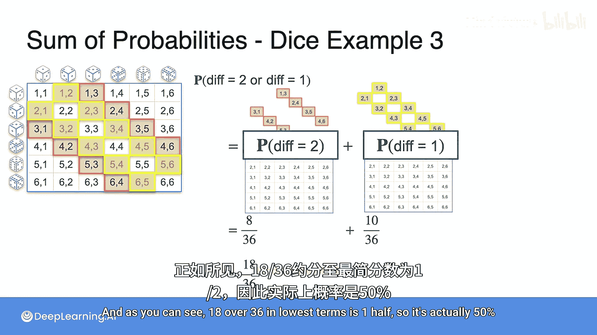

# 006：互斥事件的概率之和 🎲

在本节课中，我们将要学习一个核心的概率概念：互斥事件的概率之和。这个概念非常简单，它描述了当我们想知道两个事件中**至少有一个**发生的概率时，如果这两个事件是互斥的，我们可以直接将它们的概率相加。

## 核心概念：互斥事件的概率加法规则

上一节我们介绍了概率的基本定义，本节中我们来看看当事件互斥时，如何计算它们的“或”概率。

两个事件是**互斥的**，意味着它们不能同时发生。例如，掷一次骰子，得到“2”和得到“3”就是互斥事件，因为一次掷骰的结果只能是其中一个。

对于互斥事件A和B，它们中至少有一个发生的概率（即A发生**或**B发生）等于它们各自概率的和。这可以用以下公式表示：

**P(A ∪ B) = P(A) + P(B)**

其中，符号 **∪** 表示“并集”或“或”。

## 学校运动示例 🏫

让我们通过一个具体的例子来理解这个概念。假设有一所学校，规定每个学生**只能参加一项**体育运动，可以选择足球或篮球。

*   学生踢足球的概率 **P(足球) = 0.3**
*   学生打篮球的概率 **P(篮球) = 0.4**

由于一个学生不能同时参加两项运动（事件互斥），那么一个学生参加足球**或**篮球的概率就是：

**P(足球 ∪ 篮球) = P(足球) + P(篮球) = 0.3 + 0.4 = 0.7**

我们可以这样理解：如果有10个学生，那么3个踢足球，4个打篮球。参加其中一项运动的学生总数为 3 + 4 = 7人。因此概率是 7/10 = 0.7。

## 骰子示例 🎲

现在，让我们将这个概念应用到掷骰子的场景中。

### 示例1：掷一个骰子
问题：掷一个公平的六面骰子一次，得到**偶数**或**数字5**的概率是多少？

以下是分析步骤：
1.  事件A（得到偶数）：结果为 {2, 4, 6}，概率 **P(A) = 3/6**。
2.  事件B（得到5）：结果为 {5}，概率 **P(B) = 1/6**。
3.  事件A和B是互斥的（一个数字不能既是偶数又是5）。
4.  因此，概率为：**P(A ∪ B) = 3/6 + 1/6 = 4/6 = 2/3**。

### 示例2：掷两个骰子（点数之和）
问题：同时掷两个骰子，得到的点数之和为**7**或**10**的概率是多少？

以下是分析步骤：
1.  总共有 6 × 6 = 36 种等可能的结果。
2.  事件A（和为7）：有6种组合：(1,6), (2,5), (3,4), (4,3), (5,2), (6,1)。概率 **P(A) = 6/36**。
3.  事件B（和为10）：有3种组合：(4,6), (5,5), (6,4)。概率 **P(B) = 3/36**。
4.  和为7与和为10是互斥事件（一次投掷只能有一个总和）。
5.  因此，概率为：**P(A ∪ B) = 6/36 + 3/36 = 9/36 = 1/4**。

### 示例3：掷两个骰子（点数之差）
问题：同时掷两个骰子，得到的点数之差的绝对值为**2**或**1**的概率是多少？

以下是分析步骤：
1.  事件A（差值为2）：有8种组合，例如 (1,3), (3,1), (2,4) 等。概率 **P(A) = 8/36**。
2.  事件B（差值为1）：有10种组合，例如 (1,2), (2,1), (2,3) 等。概率 **P(B) = 10/36**。
3.  差值为2和差值为1是互斥事件。
4.  因此，概率为：**P(A ∪ B) = 8/36 + 10/36 = 18/36 = 1/2**。

## 总结 📝

本节课中我们一起学习了**互斥事件的概率加法规则**。核心要点是：

*   当两个事件**互斥**（不能同时发生）时，计算它们中**至少有一个发生**的概率非常简单，只需将各自的概率相加。
*   其核心公式为：**P(A 或 B) = P(A) + P(B)**。
*   我们通过学校选择运动、掷一个骰子和掷两个骰子（求和、求差）等多个例子，实践了这一规则的应用。

记住这个规则的关键前提：**事件必须互斥**。在接下来的课程中，我们将探讨当事件不互斥时，概率计算会有什么不同。