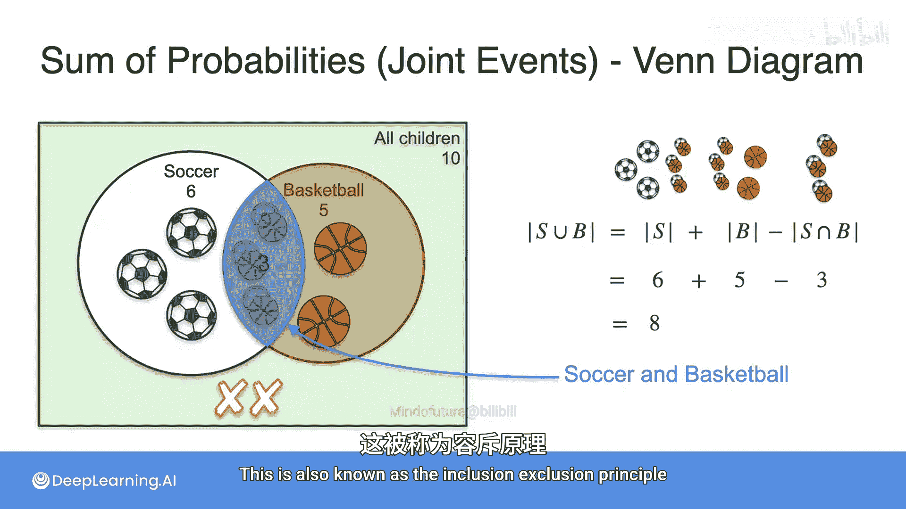
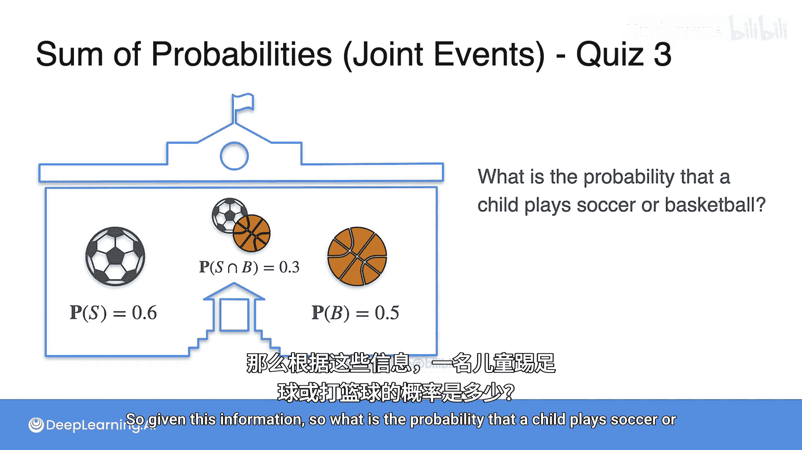
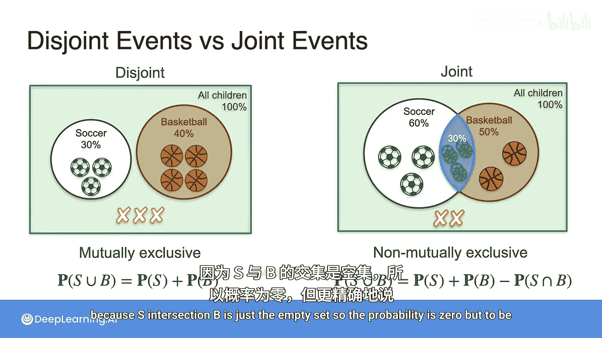
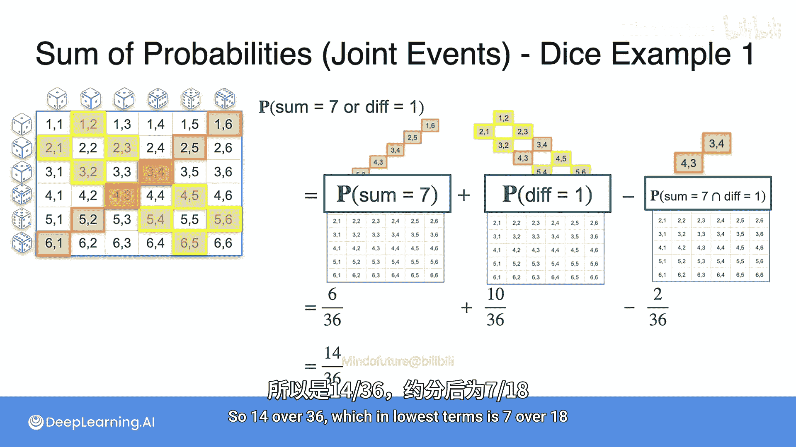

# 007：相容事件的概率之和

## 概述

在本节课中，我们将要学习如何处理相容事件的概率计算。上一节我们介绍了互斥事件的概率加法规则，本节中我们来看看当事件可以同时发生时，如何正确计算它们的并集概率。

## 相容事件的问题

在之前的课程中，我们讨论了互斥事件的概率之和。但当事件不是互斥时会发生什么？这时可能会出现问题。

让我给你一个例子。假设下雨的概率是80%，刮风的概率是70%。那么下雨或刮风的概率是多少？如果你将它们相加，会得到80%加70%，即150%。这显然太多了，并且是完全错误的，因为事件不是互斥的。你可以同时遇到下雨和刮风，这是关键所在。

在现实世界的情况中，事件通常不是互斥的，我们需要考虑结果重叠的可能性。相容事件的加法规则允许我们做到这一点，并计算组合事件的概率。

## 学校运动示例

我们回到之前例子中的学校，但这次孩子们可以参加任意多的运动，不再有只能参加一项运动的限制。选项仍然是足球和篮球。

这里有一个问题：如果一个孩子踢足球的概率是0.6，打篮球的概率是0.5，那么一个孩子踢足球或打篮球的概率是多少？如果你需要提示，可以想象学校只有10个孩子，并以此进行计算。

让我们看看这个例子稍微复杂一些。这里有10个孩子，踢足球的60%可能是这6个，打篮球的50%可能是这5个。但这可能会改变，可能存在重叠。当这种情况发生时，我们并不真正知道有多少孩子参加多项运动。

让我们用文氏图来看。这里是100%的孩子，这里是踢足球的60%，这里是打篮球的50%。最初我们有这个公式：P(S ∪ B) = P(S) + P(B)，但这行不通。事实上，即使你尝试将它们相加，也会得到110%，这超过了学校的孩子数量。所以有些东西我们重复计算了，重复计算的就是这里的交集，即这个同时参加两项运动的孩子。

这就是P(S ∩ B)。两个事件的交集是当它们同时发生时的情况，即同时踢足球和打篮球的孩子。它可能是一个，但也可能是不同的数字，例如可能是3。

因此，我们需要知道有多少孩子同时踢足球和打篮球的信息来解决这个问题。

## 具体数字示例

这是信息。同一所学校。孩子们可以踢足球或打篮球。现在让我们用数字来做：6个孩子踢足球，5个孩子打篮球，3个孩子同时参加两项运动。

那么问题是：有多少孩子踢足球或打篮球？可以是足球，或篮球，或两者都参加。

让我们分解问题。6个踢足球，5个打篮球，这就是这里所有的孩子。我们知道有3个同时参加两项运动，所以总数是8，因为这里的两个不踢足球也不打篮球。

在文氏图中，是这样的。这里是100%的孩子，这里是踢足球的，这里是打篮球的，同时参加两项运动的孩子在这个额外的部分。这就是同时踢足球和打篮球的孩子，我们有以下公式：

参加足球的集合S与参加篮球的集合B的并集的大小，等于集合S的大小（即这里的6）加上集合B的大小（即这里的5）。但我们重复计算了，注意到那3个同时参加两项运动的孩子被计算了两次，所以我们需要减去它们。我们需要减去这里的3个，现在我们得到了踢足球或打篮球的孩子数量：6 + 5 - 3 = 8。这也被称为**容斥原理**。

## 概率表示

现在我们可以用概率来表示同样的事情。

同样是足球和篮球的问题，但现在我们不说10个孩子中有6个踢足球，而是说一个孩子踢足球的概率是0.6，打篮球的概率是0.5，同时参加两项运动的概率是0.3。

那么，给定这个信息，一个孩子踢足球或打篮球的概率是多少？

和之前一样，我们可以做一个文氏图，我们可以看看踢足球的和打篮球的，概率遵循与之前相同的容斥原理。我们有P(S ∪ B) = P(S) + P(B)，但我们重复计算了交集，我们重复计算了P(S ∩ B)，所以我们必须减去它，因为我们计算了两次。

那就是0.6 + 0.5 - 0.3 = 0.8。

## 互斥与相容对比

通过左右两个例子直观地看，左边的问题中孩子只能参加一项运动，所以事件是互斥的，计算概率要容易得多，因为我们只需要将它们相加，它们不重叠。

在右边的情况下，它们重叠了，所以为了计算事件的并集的概率，我们需要考虑交集。左边的情况称为**互斥事件**，对于这种情况，并集的概率是概率之和。对于右边的情况，这被称为**相容事件**，也称为**非互斥事件**，对于这种情况，我们必须遵循公式：**P(S ∪ B) = P(S) + P(B) - P(S ∩ B)**。

注意，左边的情况是右边情况的一个特例，因为S ∩ B只是空集，所以概率为0。但为了更精确，我们可以看看这两种情况。

## 骰子示例

现在让我们看一个骰子的例子。问题是：获得点数和为7或点数差为1的概率是多少？

让我们看看。和为7是所有这里的情况，正如你已经看到的。差为1是所有这里的情况。以前我们只是将它们相加，但这次有点困难。

我们将左边的称为事件A，右边的称为事件B。我们会说A或B是这里的情况，除了我们重复计算了这两个：和为7且差为1的情况被重复计算了两次。为了不重复计算，我们必须减去那个概率。

所以，点数和为7或差为1的概率是：和为7的6/36，加上差为1的10/36，减去我们重复计算的，因为(4,3)和(3,4)被计算了两次，所以我们必须减去2/36。

因此我们得到：6/36 + 10/36 - 2/36 = 14/36。这就是P(和为7) + P(差为1) - P(和为7且差为1)。所以是14/36，约分后是7/18。

## 总结

本节课中我们一起学习了如何处理相容事件的概率计算。我们了解到，当两个事件可以同时发生时，计算它们的并集概率不能简单地将各自的概率相加，否则会重复计算交集部分。正确的公式是 **P(A ∪ B) = P(A) + P(B) - P(A ∩ B)**。我们通过学校运动和骰子的具体例子，直观地理解了容斥原理的应用。这个规则是概率论中的一个基础且重要的工具。