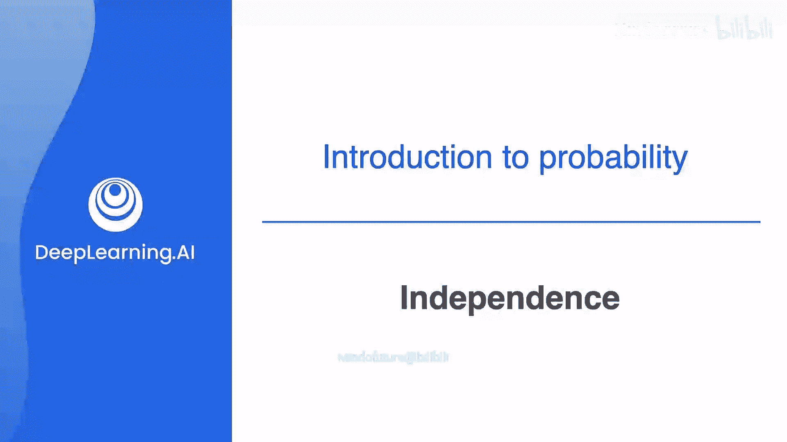
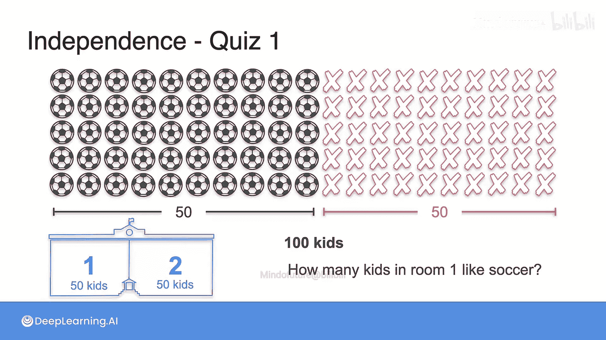
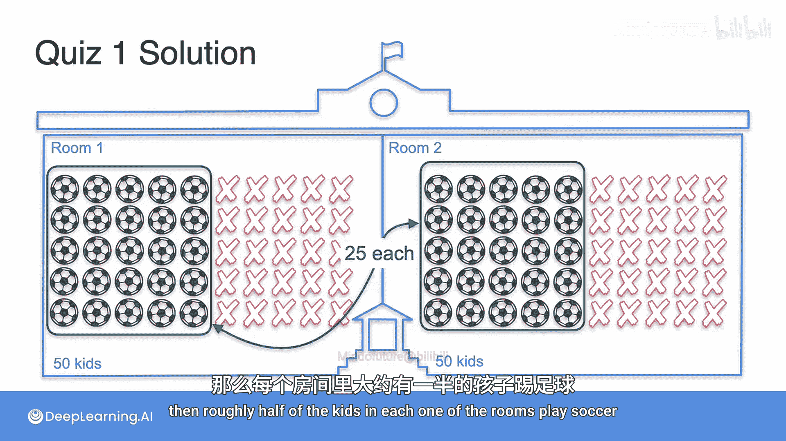
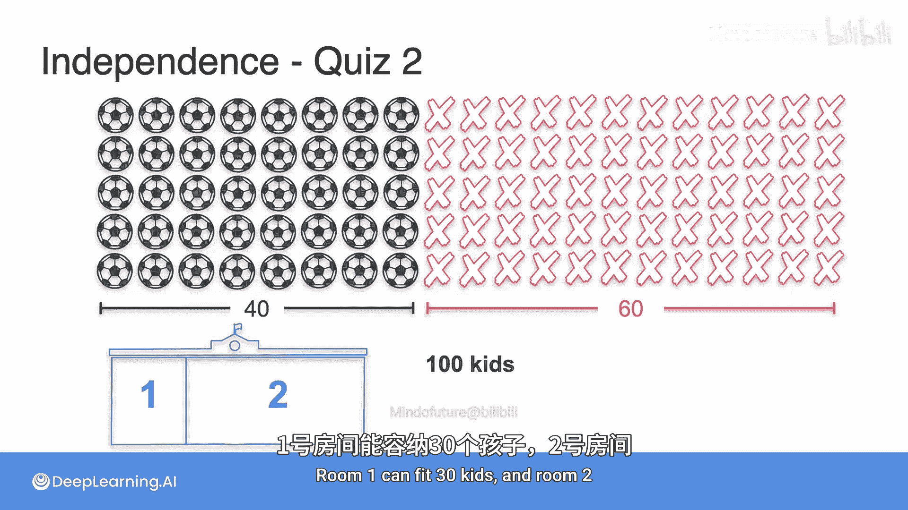
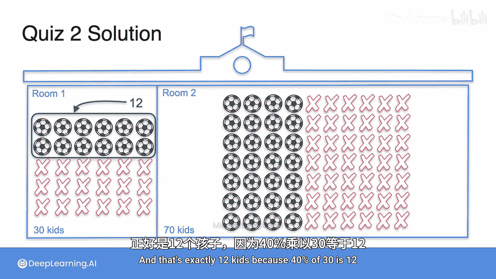
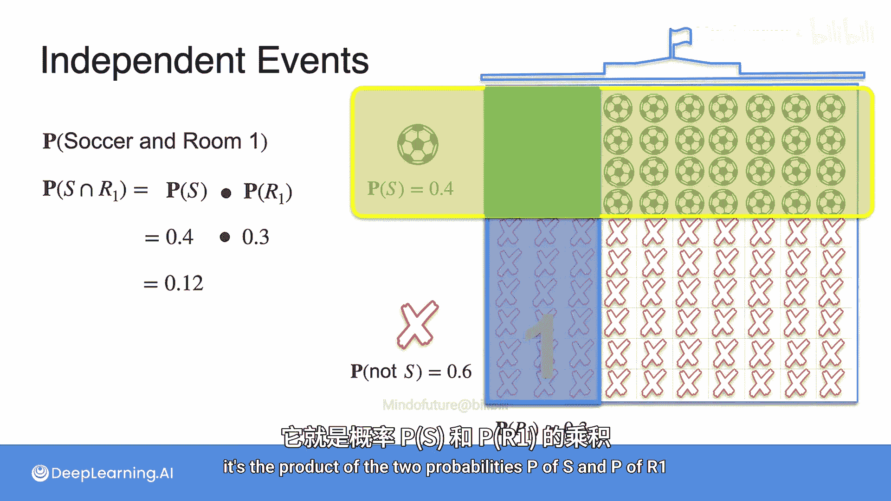
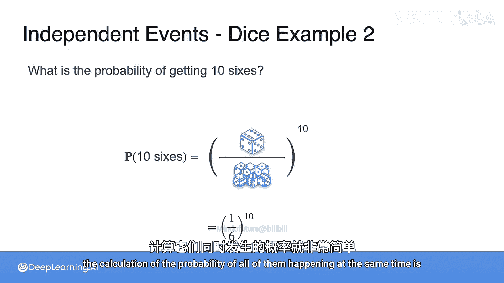

# 008：独立性

在本节课中，我们将要学习概率论中的一个核心概念——**独立性**。理解独立性对于简化概率计算和进行机器学习预测至关重要。

## 什么是独立性？🤔

上一节我们介绍了概率的基本概念，本节中我们来看看**独立性**。

独立性是指一个事件的发生不会影响另一个事件发生的概率。例如，抛一枚硬币两次，第一次抛掷的结果不会影响第二次抛掷的结果。另一方面，在下棋时，第10步棋的走法会影响第11步棋的走法，因此这些事件不是独立的。

理解独立性在概率论和机器学习中非常重要，因为假设事件相互独立可以帮助我们简化计算并做出预测。

## 独立性实例分析：学生分班问题

以下是两个关于学生分班的例子，帮助我们直观理解独立性。

### 实例一：均匀分班

一所学校有100名学生。其中一半（50名）喜欢踢足球，另一半不喜欢。这些学生被随机平均分配到两个房间，每个房间50人。

基于你的知识，你对房间1中喜欢踢足球的学生数量最好的估计是多少？

由于学生是随机分配的，且总体中喜欢足球的比例是50%，因此每个房间中喜欢足球的学生数量很可能也接近一半。所以，最好的估计是房间1中大约有25名学生喜欢踢足球。

### 实例二：非均匀分班

另一所学校也有100名学生，但其中只有40名喜欢踢足球（概率为0.4），60名不喜欢（概率为0.6）。这次，学生被随机分配到两个大小不同的房间：房间1可容纳30人（概率为0.3），房间2可容纳70人。

基于你的知识，你对房间1中喜欢踢足球的学生数量最好的估计是多少？

由于分配是随机的，我们期望每个房间中喜欢足球的学生比例与总体比例（40%）保持一致。因此，房间1中喜欢足球的学生数量预计为 `30 * 0.4 = 12` 人。

更正式地，我们寻找一个学生既喜欢足球又在房间1的概率，即事件“喜欢足球”（S）与事件“在房间1”（R1）的**交集**概率。

## 独立事件的乘积法则 ✖️

从上面的例子中，我们引出了独立事件的核心计算法则。

当两个事件A和B相互独立时，它们同时发生的概率（即交集的概率）等于各自发生概率的乘积。这被称为**乘积法则**。

其公式表示为：
`P(A ∩ B) = P(A) * P(B)`

在我们的例子中：
`P(S ∩ R1) = P(S) * P(R1) = 0.4 * 0.3 = 0.12`

这意味着，随机抽取一名学生，他既喜欢足球又在房间1的概率是12%。

## 乘积法则的扩展应用

乘积法则可以扩展到多个相互独立的事件。

以下是两个应用乘积法则的经典概率问题。

### 应用一：连续抛硬币

考虑连续抛掷一枚公平硬币五次。每次抛掷都是独立的。那么，硬币连续五次都正面朝上的概率是多少？

计算过程如下：
`P(五次都是正面) = (1/2) * (1/2) * (1/2) * (1/2) * (1/2) = (1/2)^5 = 1/32`

### 应用二：连续掷骰子

首先，掷一个公平的六面骰子，得到6点的概率是 `1/6`。
掷两个骰子，两个都得到6点（即得到“双六”）的概率是多少？

由于两次掷骰子是独立的，根据乘积法则：
`P(第一个是6 ∩ 第二个是6) = P(第一个是6) * P(第二个是6) = (1/6) * (1/6) = 1/36`

进一步，如果连续掷10个公平的骰子，全部得到6点的概率是：
`P(十个都是6) = (1/6)^10`
这是一个非常小的数字。

## 总结 📝

本节课中我们一起学习了概率论中的**独立性**概念及其核心计算法则——**乘积法则**。

我们了解到：
1.  当事件A的发生不影响事件B的发生概率时，称事件A和B**相互独立**。
2.  对于独立事件，它们同时发生的概率等于各自概率的乘积，即 `P(A ∩ B) = P(A) * P(B)`。
3.  乘积法则可以推广到任意多个相互独立的事件。
4.  利用独立性假设，可以极大地简化复杂场景下的概率计算，这在机器学习和数据分析中是非常有用的工具。

理解并正确应用独立性，是构建概率模型和进行统计推断的重要基础。