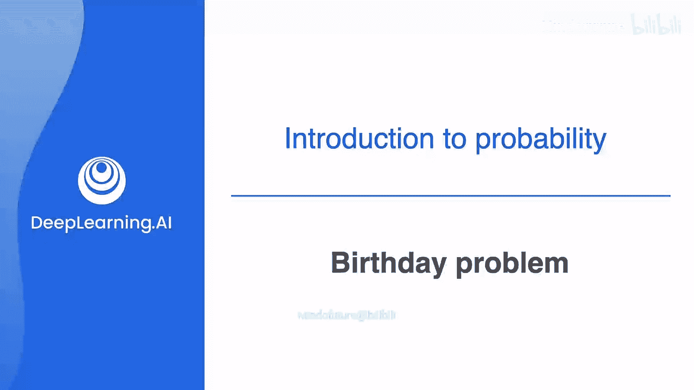
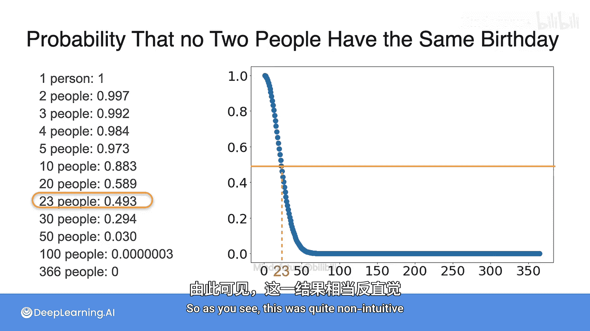

# 009：生日问题 🎂

在本节课中，我们将探讨概率论中最引人入胜的问题之一：生日问题。我们将计算在一群人中，至少两人拥有相同生日的概率。这个问题的结果常常出人意料。

## 概述

生日问题旨在探究：在一个随机人群中，至少两人在同一天过生日的概率有多大？直觉上，这个概率可能看起来很低，但数学计算会揭示一个令人惊讶的事实。

## 问题定义

假设你身处一个派对，现场有30位朋友（不包括你自己）。我们想知道，在这30人中，**存在至少两人生日相同**的概率大，还是**所有人的生日都不同**的概率大？为简化问题，我们假设一年有365天，不考虑2月29日。

## 计算过程

计算“至少两人生日相同”的概率，最直接的方法是先计算其对立事件——“所有人生日都不同”的概率，然后用1减去它。

以下是计算“所有人生日都不同”概率的逐步推导：

1.  **第一个人**：他可以是一年中的任何一天生日，不会与他人冲突。概率为：
    `365 / 365 = 1`

2.  **第二个人**：为了不与第一个人生日相同，他必须在剩下的364天中选择一天。概率为：
    `364 / 365`

3.  **第三个人**：为了不与前两人生日相同，他必须在剩下的363天中选择一天。概率为：
    `363 / 365`

4.  **以此类推**：每增加一个人，就乘以一个递减的分数。

因此，对于 **n** 个人，所有人生日都不同的概率 **P(不同)** 计算公式为：

**P(不同) = (365/365) * (364/365) * (363/365) * ... * ((365-n+1)/365)**

那么，至少两人生日相同的概率 **P(相同)** 为：

**P(相同) = 1 - P(不同)**

## 结果分析

让我们将这个公式应用于不同规模的人群：

以下是不同人数对应的“所有人生日都不同”的概率：

*   **9人**：概率约为 0.905。这意味着在9人的小团体中，有90.5%的可能性所有人的生日都不同。
*   **20人**：概率降至 0.589。
*   **23人**：概率约为 0.493。**这是关键转折点**。在23人中，“至少两人生日相同”的概率（1-0.493=0.507）首次超过了50%。
*   **30人**：概率迅速降至 0.294。这意味着在30人的群体中，有超过70%的概率存在生日相同的人。
*   **50人**：概率仅为 0.03，几乎可以确定存在生日相同的人。
*   **100人**：概率变得微乎其微。
*   **366人**：根据鸽巢原理，概率为0，必然存在生日相同的人。

## 可视化与结论

右侧的图表清晰地展示了这一趋势：横轴是人数，纵轴是“所有人生日都不同”的概率。曲线在人数达到23左右时跌破0.5，之后急剧下降。

这个结果之所以反直觉，是因为我们倾向于从“某个人与我生日相同”的个体角度思考，而问题考虑的是“任意两人之间”的组合可能性。随着人数增加，这种配对的数量呈组合级增长，导致重复的概率迅速上升。

## 总结

本节课我们一起学习了著名的**生日问题**。通过计算“所有人生日都不同”这一对立事件的概率，我们推导出，**仅需23人**，就有一半以上的概率出现生日相同的情况；而在30人的群体中，这个概率高达约70%。这个例子生动地展示了概率论如何帮助我们量化反直觉的随机现象，并理解组合效应在其中的巨大影响。