# 011：条件概率第二部分

在本节课中，我们将继续学习条件概率，并通过具体的学校学生案例，深入理解事件之间的独立性与依赖性。我们将学习如何计算联合概率，并使用概率树来直观地表示和分析复杂的概率场景。

---

## 应用条件概率规则

上一节我们介绍了条件概率的基本概念。本节中，我们来看看如何在一个具体的场景中应用这些规则。

再次假设一所学校有100名学生。其中50名喜欢踢足球，另外50名不喜欢。现在，我们将他们分配到两个各能容纳50人的房间。

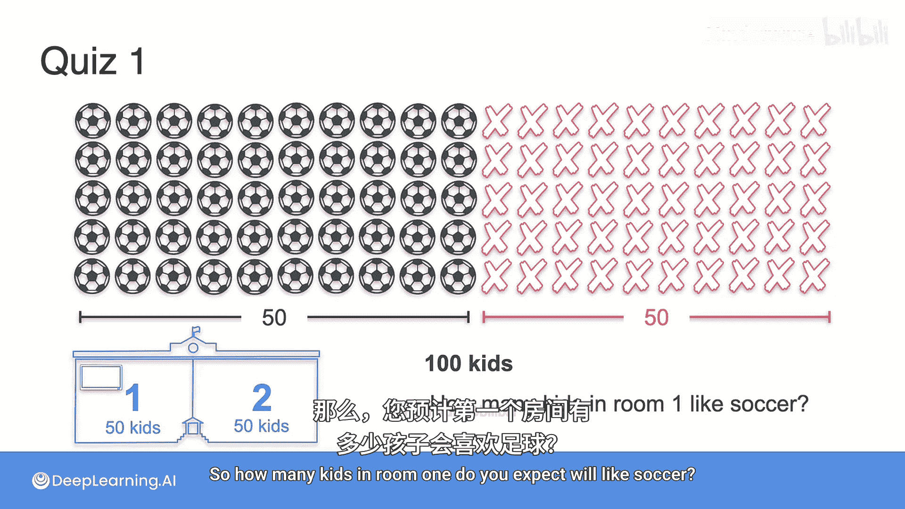

学生们可以自由选择去哪个房间，但这里有一个关键信息：第一个房间的电视正在播放世界杯，而第二个房间的电视在播放一部与足球完全无关的电影。

根据你的直觉，你预计第一个房间里会有多少孩子喜欢足球？请记住，第一个房间的电视在播放世界杯。

在公平的情况下，我们可以想象所有喜欢足球的孩子都去了播放世界杯的房间，如图所示。也许实际情况并非如此，但我们可以假设这种情况发生了。

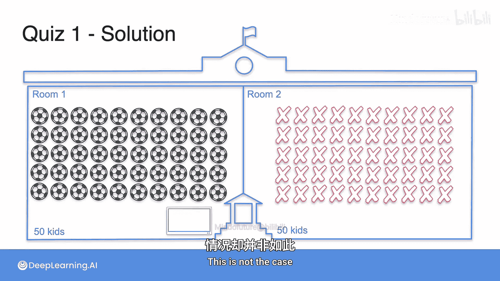

因此，事件“喜欢足球”和“在房间一”是**依赖的**。在我们之前做的例子中，孩子们是随机分配的，这使得事件独立。但在这里，情况并非如此，它们是依赖的，概率发生了变化。

---

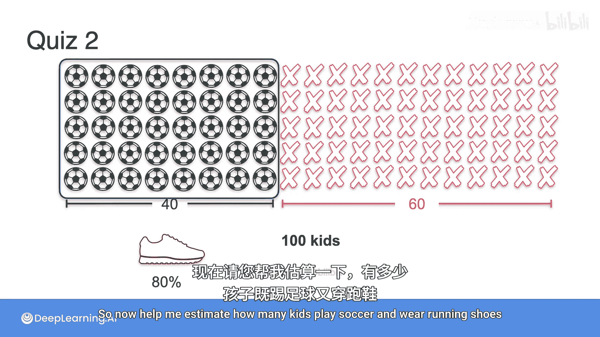

## 计算联合概率

现在，让我们看一个略有不同的问题。假设一所学校有100名孩子，其中40名踢足球，其余的不踢。在踢足球的孩子中，我们注意到在任何一天，有80%的人喜欢穿跑鞋。现在，请帮我估算有多少孩子既踢足球又穿跑鞋。

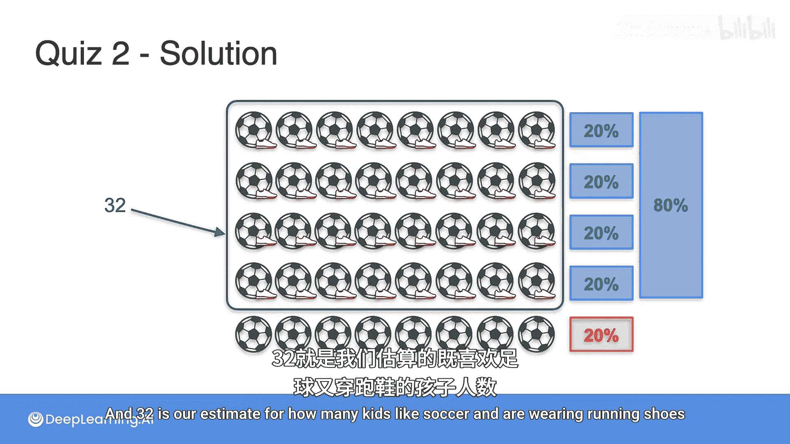

这里有40名孩子。假设其中80%穿跑鞋。让我们将他们按20%一组分开，其中四组（即80%）穿跑鞋。所以是32人，因为40的80%是32。32就是我们估算的既喜欢足球又穿跑鞋的孩子数量。

让我们从另一个角度看待同一个问题。

一个孩子踢足球的概率是40%。这意味着如果我们有100个孩子，其中40个踢足球。即 **P(足球) = 0.4**。

不踢足球的概率是0.6或60%。这意味着在这100个孩子中，60个不喜欢足球。

在踢足球的孩子中，80%穿跑鞋。因此，**给定踢足球时穿跑鞋的条件概率 P(跑鞋 | 足球) = 0.8**。

现在我们想要**足球和跑鞋的联合概率 P(足球 ∩ 跑鞋)**。为此，我们需要足球的概率（这里的40%），乘以给定踢足球时穿跑鞋的条件概率（这里的80%）。即80%的40%。

或者用公式表示：**P(足球 ∩ 跑鞋) = P(足球) × P(跑鞋 | 足球)**。

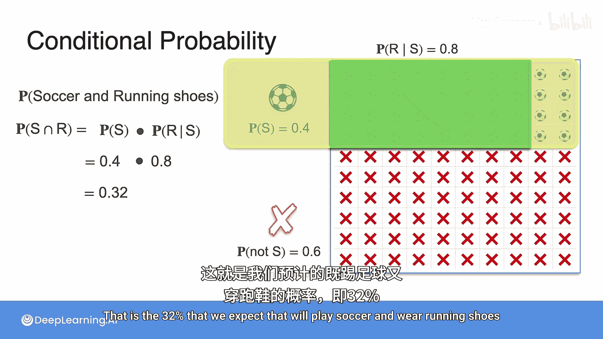

计算：0.4 × 0.8 = 0.32。这就是我们预期的32%的孩子会既踢足球又穿跑鞋。

因此，我们说 **P(S ∩ R) = 0.32**。

---

## 考虑相反情况

现在，让我们看看其他情况。假设有人告诉我以下信息：一个孩子在不踢足球时穿跑鞋的概率是50%。这意味着在不踢足球的孩子中，有一半穿跑鞋。

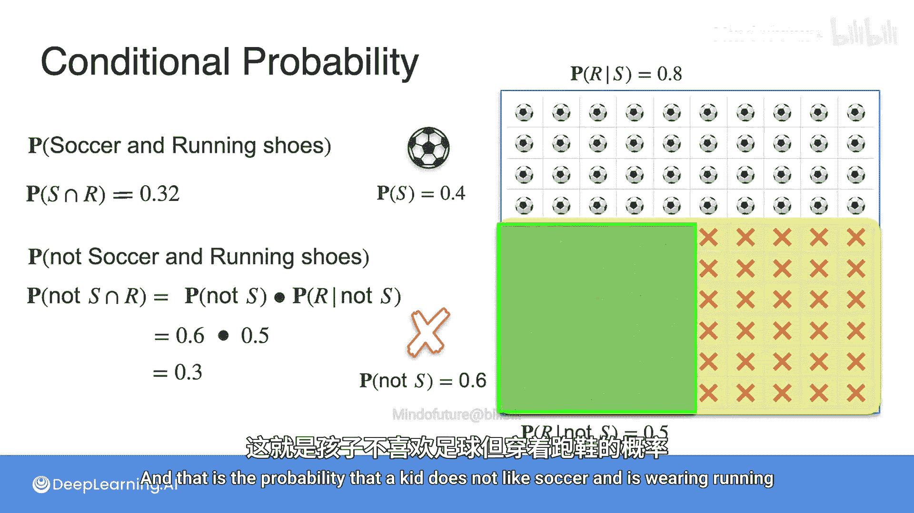

那么，“不踢足球且穿跑鞋”的概率是多少？即 **P(非足球 ∩ 跑鞋)**。

这等于 **P(非足球)**（这里的60%）乘以 **P(跑鞋 | 非足球)**（这里的50%）。

计算：0.6 × 0.5 = 0.3。这就是一个孩子不喜欢足球但穿跑鞋的概率，为30%。

---

## 使用概率树

另一种看待问题的方式是使用概率树。

可能发生两件事：孩子踢足球或不踢足球。
*   踢足球的概率是40%（P(S)=0.4）。
*   不踢足球的概率是60%（P(非S)=0.6）。

在踢足球的孩子中：
*   穿跑鞋的概率是80%（P(R|S)=0.8）。
*   不穿跑鞋的概率是20%（P(非R|S)=0.2）。

在不踢足球的孩子中：
*   穿跑鞋的概率是50%（P(R|非S)=0.5）。
*   不穿跑鞋的概率是50%（P(非R|非S)=0.5）。

这样就产生了四种场景：
1.  踢足球且穿跑鞋（S ∩ R）：概率为32%（即40%的80%）。
2.  踢足球且不穿跑鞋（S ∩ 非R）：概率为8%（即40%的20%）。
3.  不踢足球且穿跑鞋（非S ∩ R）：概率为30%（即60%的50%）。
4.  不踢足球且不穿跑鞋（非S ∩ 非R）：概率为30%（即60%的50%）。

这些是所有可能性。

---

## 案例回顾与总结

现在，让我们回顾一下我们从一开始看到的各种情况。

首先，我们将孩子们随机分配到两个房间，这创造了两个**独立事件**。从图形上看，当划分“房间一”和“房间二”的线与划分“踢足球”和“不踢足球”的线在图中相交时，事件是独立的。

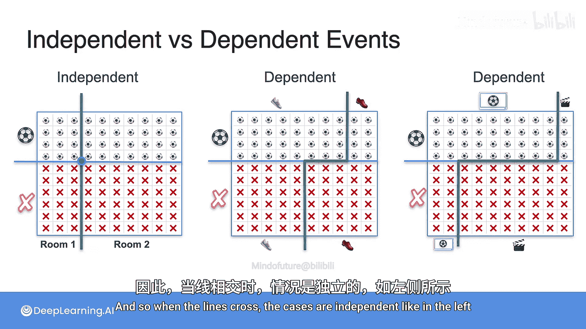

然后，我们遇到了“穿跑鞋”或“不穿跑鞋”的情况，这些事件是**依赖的**，因为如果一个孩子踢足球，他穿跑鞋的可能性比不踢足球时更大。

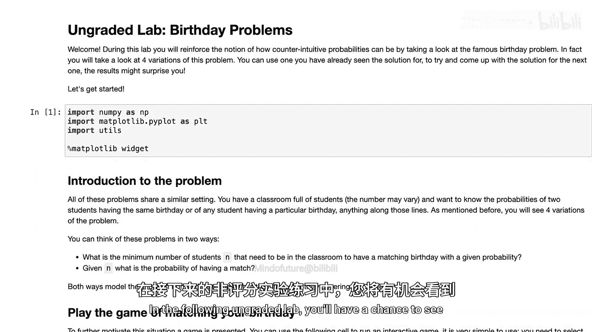
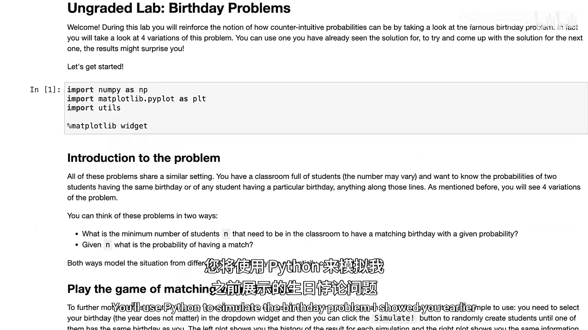

另一个案例是当我们根据偏好（一个房间放足球赛）将他们送到两个不同的房间时，这些情况也非常依赖，因为喜欢足球的孩子更有可能去看足球赛。

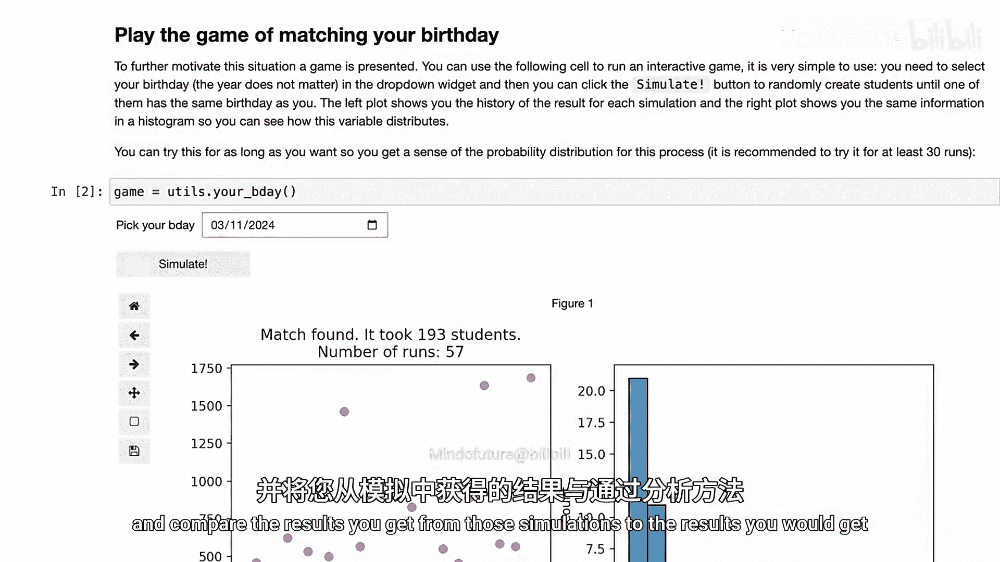
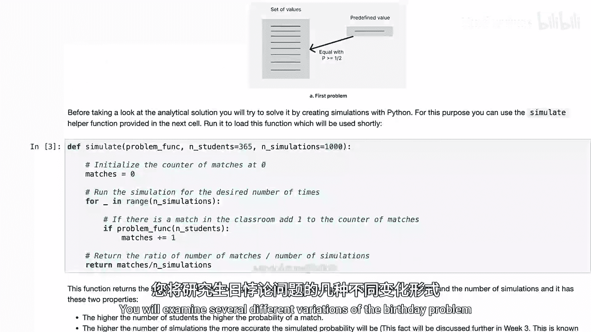

简而言之，当图中的线交叉时，案例是独立的（如左图）；当它们不交叉时，案例是依赖的（如右图）。

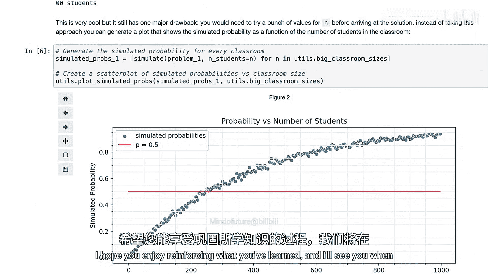

---

在接下来的未评分实验课中，你将有机会看到一些已经学过的概率概念的实际应用。你将使用Python模拟我之前展示的“生日问题”，并将模拟得到的结果与分析求解这些问题得到的结果进行比较。你将研究生日问题的几种不同变体，查看用于解决每个问题的模拟可视化，并学习如何分析性地处理它们。希望你享受巩固所学知识的过程，完成实验后我们下个视频再见。

---

本节课中我们一起学习了条件概率在具体场景中的应用，重点区分了事件的独立性与依赖性。我们通过计算联合概率 **P(A ∩ B) = P(A) × P(B|A)** 来解决实际问题，并利用概率树来清晰地枚举和分析所有可能的结果场景。理解这些概念是构建更复杂概率模型和机器学习算法的基础。