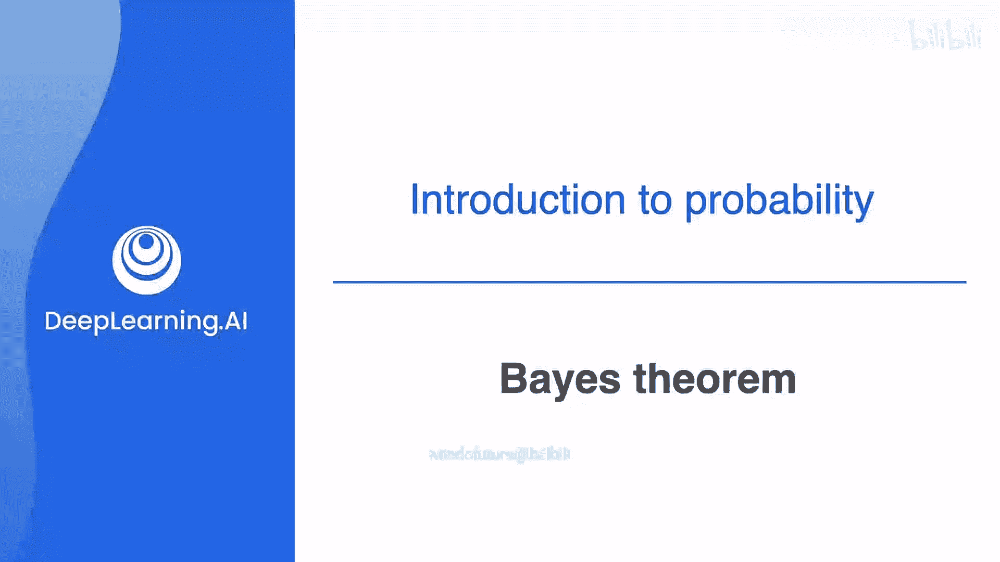
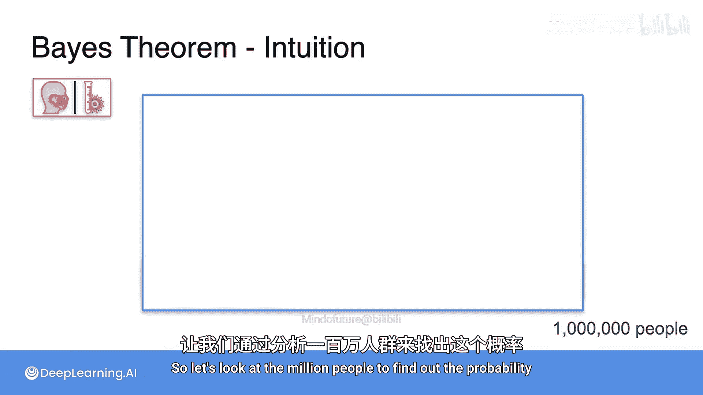
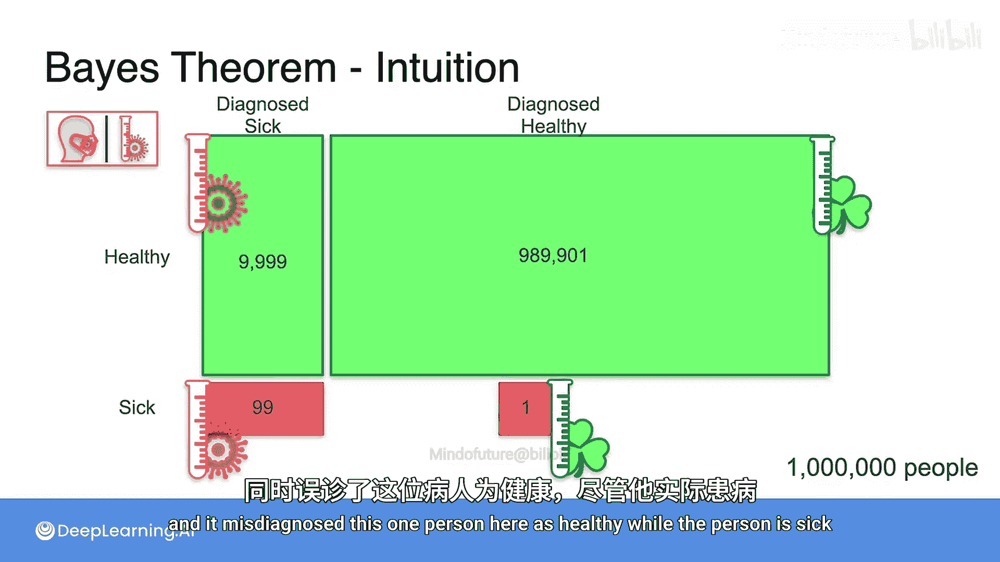
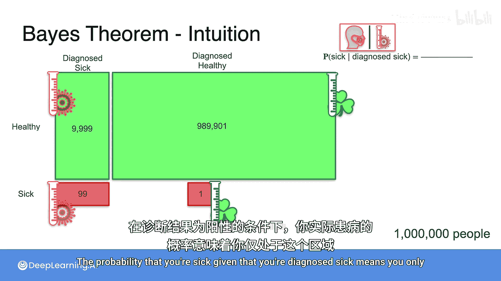
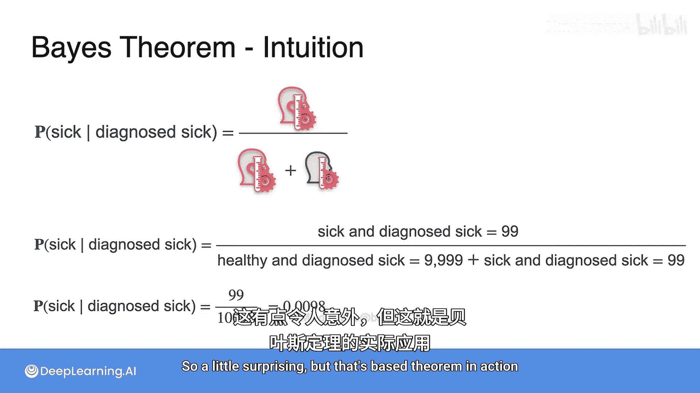

# 012：贝叶斯定理直观理解 🧠



在本节课中，我们将通过一个具体的医学诊断例子，直观地理解贝叶斯定理。贝叶斯定理是概率论中最重要的定理之一，在机器学习的诸多领域，如垃圾邮件识别、语音检测等，都有广泛应用。

## 场景设定

想象以下场景：一种罕见疾病正在流行，你希望接受检测。你去看医生，医生告诉你：“我有一个非常有效的检测方法，大多数时候都是准确的。”你接受了检测并回家，随后医生打电话通知你：检测结果为阳性。

在恐慌之前，我们最好先做一些数学计算。我们的目标是计算：在已知检测结果为阳性的条件下，你真正患有该疾病的概率。

## 引入具体数字

为了让分析更清晰，我们引入一些具体数字。

*   假设总人口为 **1,000,000** 人。
*   该疾病非常罕见，发病率仅为 **万分之一**。这意味着在总人口中，只有 **100** 人患病，而 **999,900** 人是健康的。
*   医生提供的检测方法 **有效率为 99%**。这包含两层含义：
    1.  对于真正的患者：每 100 名患者中，有 **99** 人被正确诊断为阳性（真阳性），有 **1** 人被错误诊断为阴性（假阴性）。
    2.  对于真正的健康者：每 100 名健康者中，有 **99** 人被正确诊断为阴性（真阴性），有 **1** 人被错误诊断为阳性（假阳性）。

现在，你的检测结果是阳性。问题是：你真正患病的概率有多大？

## 人群分类分析



上一节我们设定了人群和检测的基本数据，本节中我们来看看如何对整个人群进行分类。

让我们根据患病状态和检测结果，将一百万人分成四组：

1.  **患病且检测为阳性（真阳性）**：患者共100人，检测正确率为99%，因此这组人数为 `100 * 0.99 = 99` 人。
2.  **患病但检测为阴性（假阴性）**：患者共100人，检测错误率为1%，因此这组人数为 `100 * 0.01 = 1` 人。
3.  **健康但检测为阳性（假阳性）**：健康者共999,900人，检测错误率为1%，因此这组人数为 `999,900 * 0.01 = 9,999` 人。
4.  **健康且检测为阴性（真阴性）**：健康者共999,900人，检测正确率为99%，因此这组人数为 `999,900 * 0.99 = 989,901` 人。

我们可以用以下伪代码来概括这个分类过程：
```python
total_population = 1_000_000
disease_prevalence = 0.0001 # 万分之一
test_accuracy = 0.99

sick_count = total_population * disease_prevalence # 100
healthy_count = total_population - sick_count # 999,900

true_positive = sick_count * test_accuracy # 99
false_negative = sick_count * (1 - test_accuracy) # 1



false_positive = healthy_count * (1 - test_accuracy) # 9,999
true_negative = healthy_count * test_accuracy # 989,901
```

## 计算条件概率



现在，我们已知你的检测结果为阳性。这意味着你只可能属于第1组（真阳性）或第3组（假阳性）。这两组构成了“所有检测为阳性的人”。

因此，在检测为阳性的条件下，你真正患病的概率计算公式为：

**P(患病 | 检测阳性) = 真阳性人数 / 所有检测阳性人数**

代入我们的数字：
*   真阳性人数 = 99
*   所有检测阳性人数 = 真阳性 + 假阳性 = 99 + 9,999 = 10,098

所以：
**P(患病 | 检测阳性) = 99 / 10,098 ≈ 0.0098**

这个结果小于 **1%**。

## 结果分析与贝叶斯思想

这个结果可能令人惊讶：尽管检测准确率高达99%，但在收到阳性结果后，你真正患病的概率却不到1%。

原因在于疾病的**先验概率**（基础发病率）极低（0.01%）。虽然检测犯错的概率（1%）也很低，但由于健康人群基数巨大（999,900人），即使很小的错误率也会产生大量的假阳性病例（9,999人）。相比之下，真正的患者数量（100人）本身就很稀少。

因此，在分析检测结果时，必须结合疾病的先验概率。这正是贝叶斯定理的核心思想：**利用新的证据（检测结果）来更新我们对某个事件（患病）发生概率的信念（从先验概率更新为后验概率）**。

贝叶斯定理的通用公式可以表示为：
**P(A|B) = [P(B|A) * P(A)] / P(B)**
其中：
*   `P(A|B)` 是后验概率：在B发生条件下A发生的概率（本例中为“检测阳性下患病的概率”）。
*   `P(B|A)` 是似然度：在A发生条件下B发生的概率（本例中为“患病者检测呈阳性的概率”，即99%）。
*   `P(A)` 是先验概率：A发生的初始概率（本例中为疾病的发病率，0.01%）。
*   `P(B)` 是证据B发生的总概率。

## 总结



本节课中，我们一起学习了贝叶斯定理的直观应用。我们通过一个医学诊断的例子，展示了如何计算在得到新证据（检测阳性）后的后验概率。关键要点是：即使测试本身非常准确，如果所检测事件的先验概率极低，那么阳性结果也可能主要来自误报。在机器学习和数据科学中，贝叶斯定理为我们提供了一种强大的框架，用于在不确定性下进行推理和更新预测。