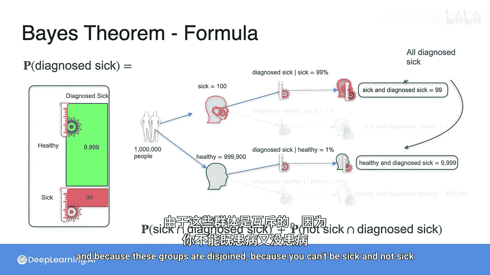
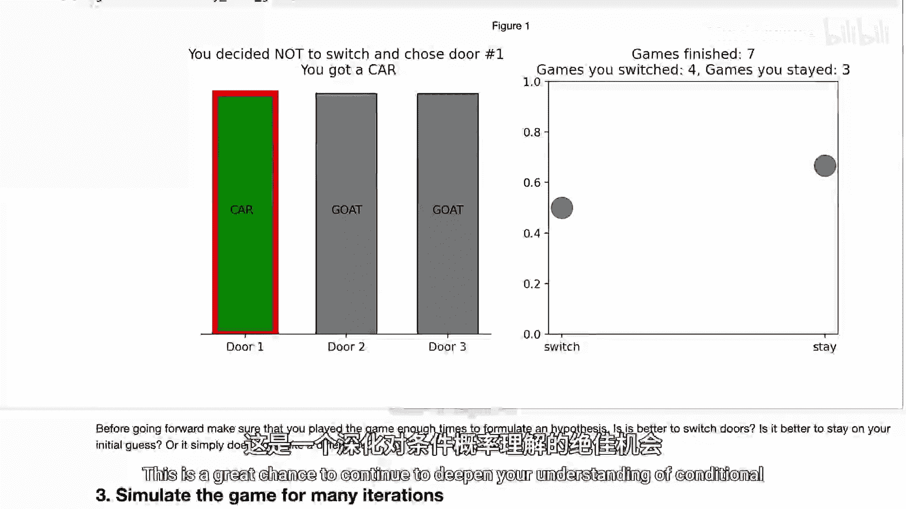
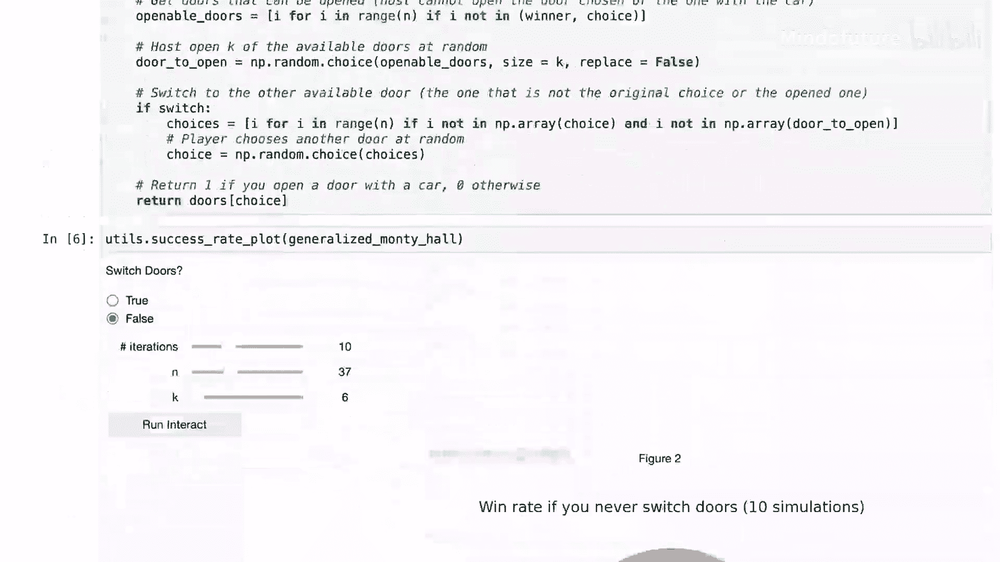

# 013：贝叶斯定理数学公式 🧮

在本节课中，我们将学习贝叶斯定理的数学推导过程。我们将从一个具体的医学诊断问题出发，逐步推导出贝叶斯定理的公式，并理解其背后的逻辑。

## 概述

我们试图解决的问题是：在已知某人检测结果为阳性的情况下，计算他实际患病的概率。这需要用到条件概率和贝叶斯定理。

## 问题设定与基础概率

首先，我们回顾一下问题中的已知信息。假设总人口为100万，其中只有万分之一的人患病。因此，患病的概率 `P(患病)` 为：
```
P(患病) = 1 / 10000 = 0.0001
```
相应地，健康的概率 `P(健康)` 为：
```
P(健康) = 1 - P(患病) = 0.9999
```
检测的准确率为99%。这意味着，对于真正患病的人，检测结果为阳性的概率 `P(检测阳性 | 患病)` 为99%。对于健康的人，被误诊为阳性的概率 `P(检测阳性 | 健康)` 为1%。

## 推导目标概率

我们的目标是计算 `P(患病 | 检测阳性)`。根据条件概率的定义，我们有：
```
P(患病 | 检测阳性) = P(患病 ∩ 检测阳性) / P(检测阳性)
```
接下来，我们需要分别计算分子 `P(患病 ∩ 检测阳性)` 和分母 `P(检测阳性)`。

### 计算分子

根据条件概率公式，`P(患病 ∩ 检测阳性)` 可以表示为：
```
P(患病 ∩ 检测阳性) = P(患病) * P(检测阳性 | 患病)
```
代入已知数值：
```
P(患病 ∩ 检测阳性) = 0.0001 * 0.99
```

### 计算分母

分母 `P(检测阳性)` 表示所有检测结果为阳性的人群比例。这部分人由两个互斥的群体组成：
1.  真正患病且被正确诊断为阳性的人。
2.  健康但被误诊为阳性的人。

因此，`P(检测阳性)` 是这两个事件概率的和：
```
P(检测阳性) = P(患病 ∩ 检测阳性) + P(健康 ∩ 检测阳性)
```
其中，`P(健康 ∩ 检测阳性)` 同样可以用条件概率公式计算：
```
P(健康 ∩ 检测阳性) = P(健康) * P(检测阳性 | 健康) = 0.9999 * 0.01
```
所以，分母为：
```
P(检测阳性) = (0.0001 * 0.99) + (0.9999 * 0.01)
```

## 贝叶斯定理公式

将分子和分母代入最初的公式，我们得到：
```
P(患病 | 检测阳性) = [P(患病) * P(检测阳性 | 患病)] / [P(患病) * P(检测阳性 | 患病) + P(健康) * P(检测阳性 | 健康)]
```
这就是贝叶斯定理在本问题中的具体形式。更一般地，如果我们用 `A` 代表“患病”，用 `B` 代表“检测阳性”，用 `A'` 代表“不患病”（即健康），贝叶斯定理的通用公式可以写作：
```
P(A|B) = [P(A) * P(B|A)] / [P(A) * P(B|A) + P(A') * P(B|A')]
```



## 代入计算与结果

现在，我们将具体数值代入公式进行计算：
```
P(患病 | 检测阳性) = (0.0001 * 0.99) / [(0.0001 * 0.99) + (0.9999 * 0.01)]
```
计算这个表达式，得到的结果约为 **0.0098** 或 **0.98%**。

这个结果直观地展示了贝叶斯定理的核心洞察：即使检测准确率高达99%，但由于患病的基础概率极低（0.01%），一个阳性检测结果更可能来自庞大的健康人群中的误诊，而非来自极少数真正的患者。因此，在得到阳性结果后，实际患病的概率仍然很低。

## 总结

本节课中，我们一起学习了贝叶斯定理的数学推导。我们从条件概率的基本定义出发，通过分解联合概率和全概率公式，逐步构建了贝叶斯定理。这个定理为我们提供了一种在已知新证据（如检测结果）后，更新对某个假设（如是否患病）发生概率的方法。理解这个推导过程，对于掌握贝叶斯思想在机器学习和数据科学中的应用至关重要。

---






接下来，你将会在Python实验中发现一个关于“蒙提霍尔问题”的练习。这是一个经典的概率问题，是加深你对条件概率理解的绝佳机会，同时也让你能再次比较通过模拟仿真和通过解析方法（如贝叶斯定理）解决问题所得到的结果。