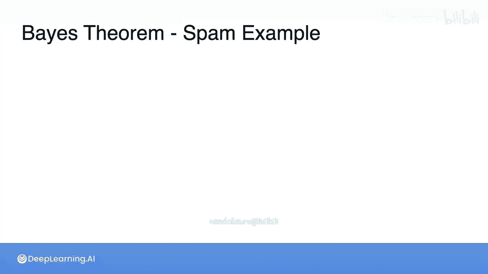
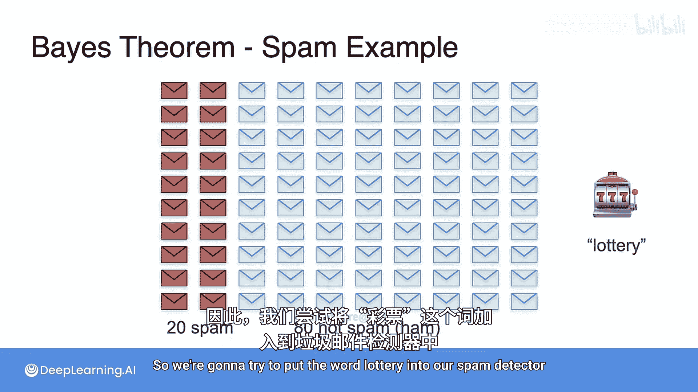
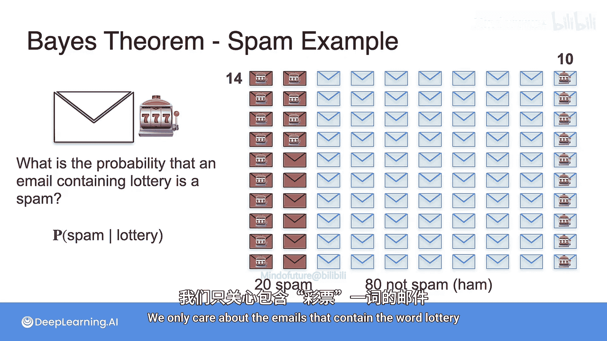
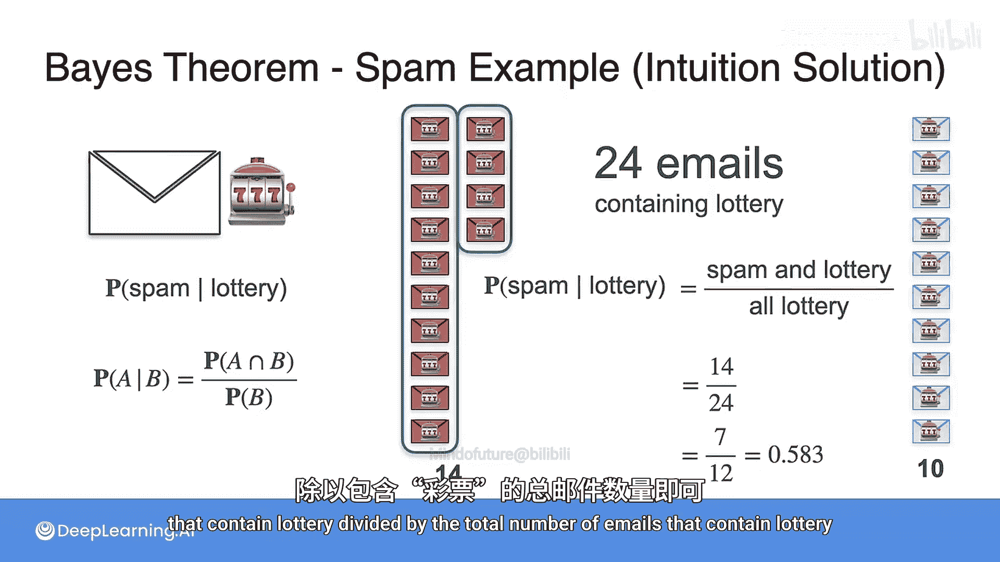
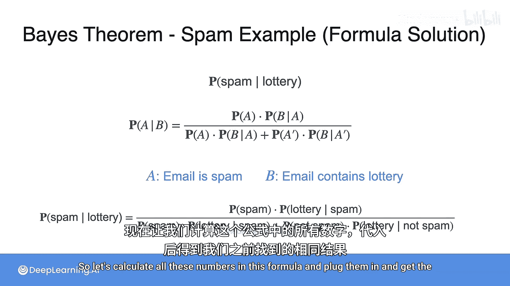
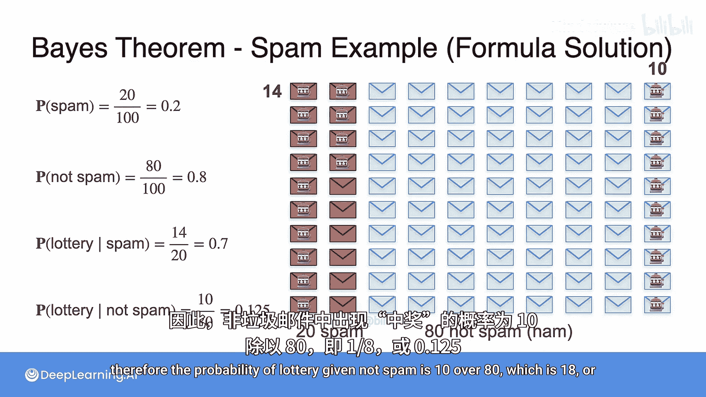
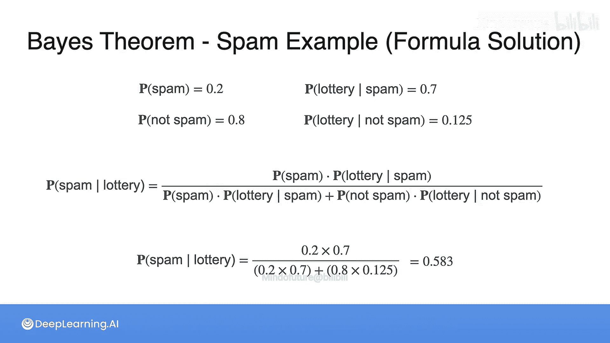

# 014：贝叶斯定理垃圾邮件示例 🧠📧

在本节课中，我们将学习如何应用贝叶斯定理来解决一个实际问题：构建一个简单的垃圾邮件分类器。我们将通过一个具体的例子，一步步理解如何计算在已知邮件包含特定词汇（如“彩票”）的条件下，该邮件是垃圾邮件的概率。

---

## 问题设定与数据

假设我们有一个包含100封邮件的数据集。其中，20封是垃圾邮件（Spam），其余80封是非垃圾邮件（Ham）。我们的目标是构建一个分类器。

最初，我们只知道垃圾邮件的先验概率是20%。一个最简单的分类器可以预测任何邮件有20%的概率是垃圾邮件。但我们可以利用更多信息来改进它。

## 引入特征：“彩票”一词

我们观察到，垃圾邮件中经常出现“彩票”（lottery）这个词。因此，我们决定将这个特征纳入分类器。

以下是数据集中关于“彩票”一词的统计：
*   在20封垃圾邮件中，有14封包含“彩票”一词。
*   在80封非垃圾邮件中，有10封包含“彩票”一词。

## 直观理解条件概率

我们想知道：**如果一封邮件包含“彩票”这个词，那么它是垃圾邮件的概率是多少？** 即求 **P(Spam | Lottery)**。

我们可以直观地计算。我们只关心包含“彩票”的邮件，总共有 14 + 10 = 24 封。在这24封邮件中，有14封是垃圾邮件。因此，概率为：
**P(Spam | Lottery) = 14 / 24 ≈ 0.583**

这个计算过程的核心思想是：**在应用条件（包含“彩票”）后，我们只关注满足该条件的样本子集，然后在这个子集中计算目标事件（是垃圾邮件）的概率。**

## 应用贝叶斯定理公式

上一节我们通过直观筛选数据得到了结果。本节中，我们来看看如何通过贝叶斯定理的公式得到相同的答案。

贝叶斯定理的公式如下：
**P(A|B) = [P(B|A) * P(A)] / [P(B|A) * P(A) + P(B|¬A) * P(¬A)]**

在我们的例子中：
*   **A** 代表事件“邮件是垃圾邮件”（Spam）。
*   **B** 代表事件“邮件包含‘彩票’一词”（Lottery）。
*   **¬A** 代表事件“邮件不是垃圾邮件”（Not Spam）。

我们需要计算公式中的各个组成部分：

以下是需要计算的概率值：
1.  **先验概率 P(Spam)**：在不知道邮件内容的情况下，它是垃圾邮件的概率。P(Spam) = 20/100 = **0.2**
2.  **先验概率 P(Not Spam)**：P(Not Spam) = 1 - P(Spam) = 80/100 = **0.8**
3.  **似然度 P(Lottery | Spam)**：在已知是垃圾邮件的条件下，它包含“彩票”一词的概率。P(Lottery | Spam) = 14/20 = **0.7**
4.  **似然度 P(Lottery | Not Spam)**：在已知不是垃圾邮件的条件下，它包含“彩票”一词的概率。P(Lottery | Not Spam) = 10/80 = **0.125**

现在，我们将这些值代入贝叶斯公式：

**P(Spam | Lottery) = (0.7 * 0.2) / (0.7 * 0.2 + 0.125 * 0.8)**
**P(Spam | Lottery) = 0.14 / (0.14 + 0.1)**
**P(Spam | Lottery) = 0.14 / 0.24 ≈ 0.583**

计算结果与之前直观方法得到的结果完全一致。

---

本节课中我们一起学习了如何将贝叶斯定理应用于垃圾邮件分类的实例。我们首先通过直接筛选数据子集计算了条件概率，然后使用贝叶斯公式验证了结果。这个过程清晰地展示了贝叶斯定理如何结合**先验知识**（垃圾邮件的总体比例）和**新的证据**（邮件包含特定词汇）来更新我们对事件发生概率的信念。这是构建许多机器学习分类器（如朴素贝叶斯分类器）的基础。