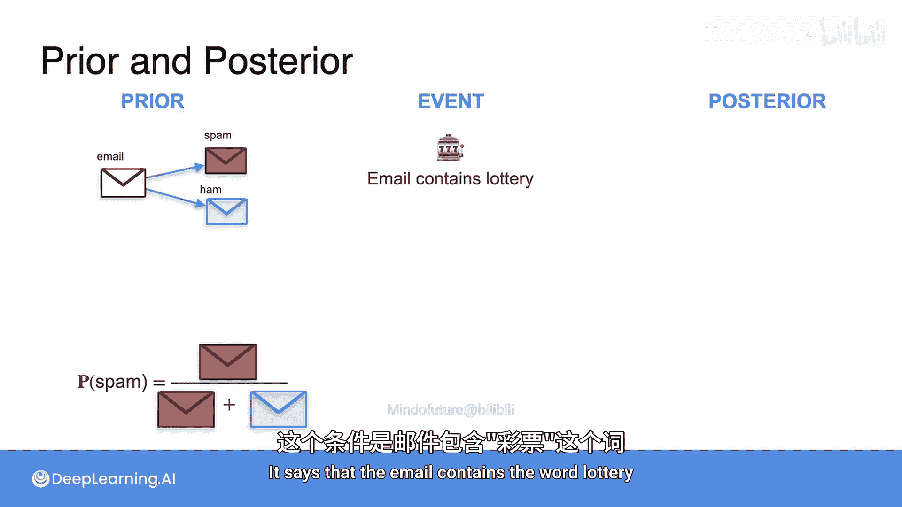
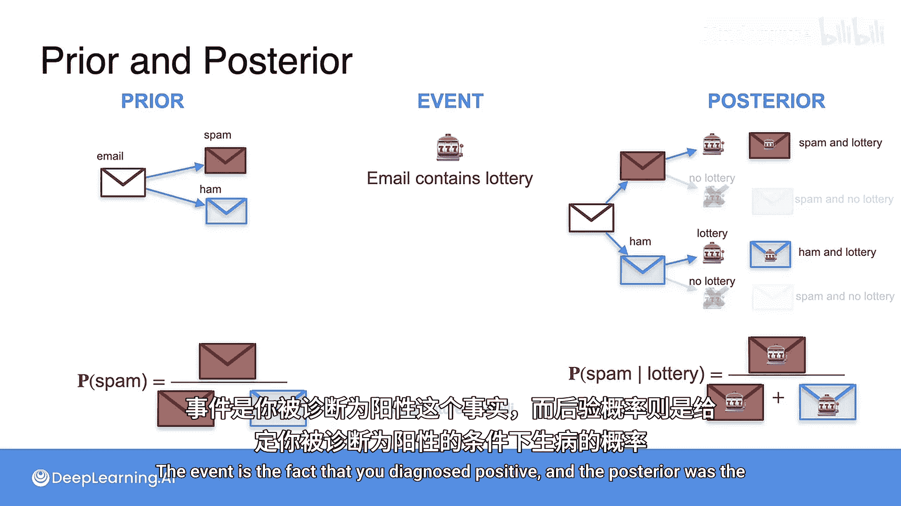
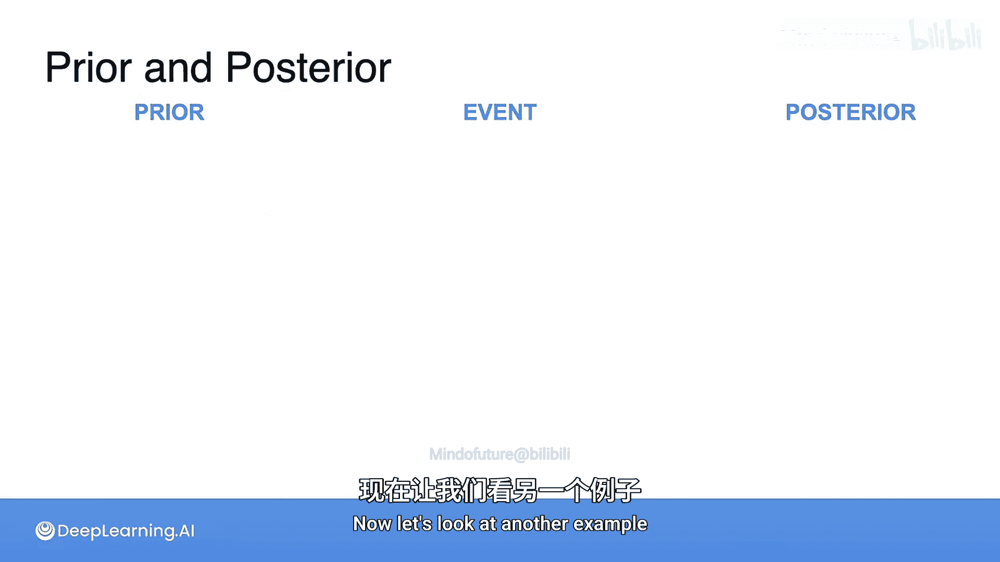
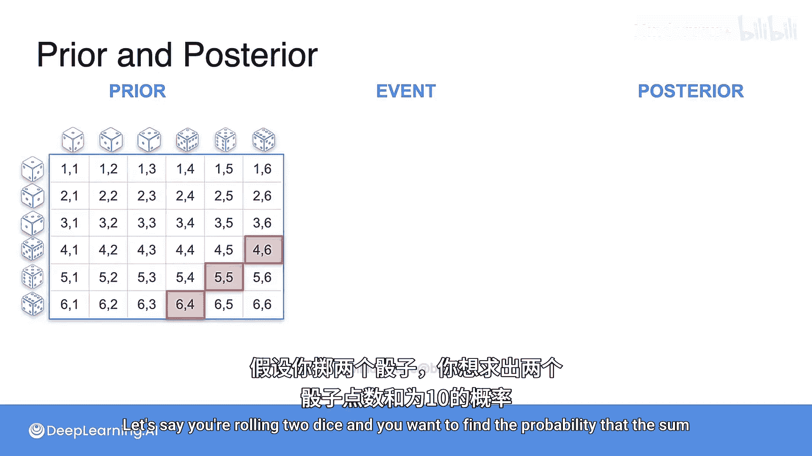
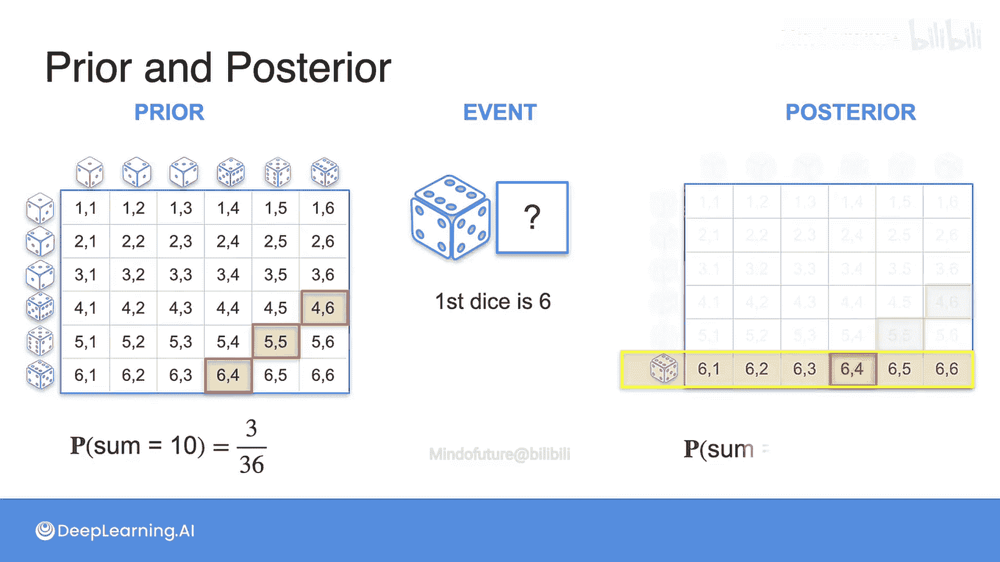
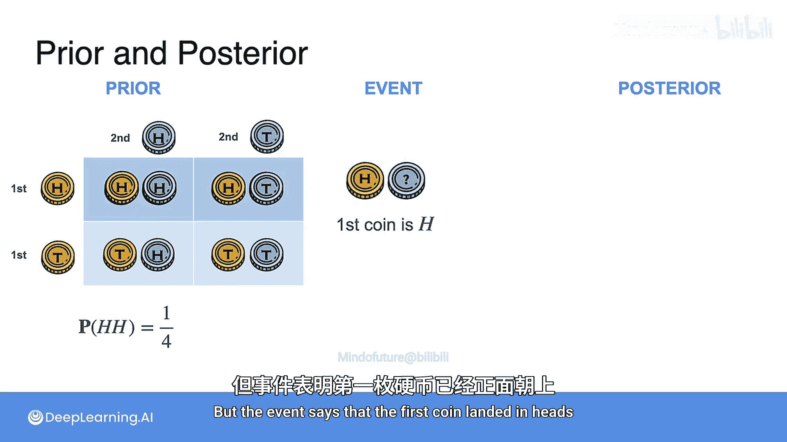
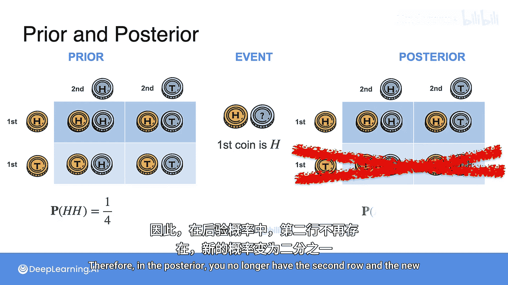

# 015：贝叶斯定理中的先验与后验 📊

在本节课中，我们将要学习贝叶斯定理中的核心概念：先验概率、事件与后验概率。我们将通过几个具体的例子，理解如何利用新信息（事件）来更新我们对某个假设的概率估计。

上一节我们介绍了条件概率的基本概念，本节中我们来看看如何将条件概率应用于贝叶斯推理，具体表现为先验概率到后验概率的更新过程。

## 核心概念定义

首先，我们来正式定义几个关键术语。

*   **先验概率**：这是在未获得任何额外信息之前，对某个假设或事件发生可能性的初始估计。其计算公式通常基于历史数据或基本假设。
    *   公式表示为：`P(A)`
*   **事件**：这是一个发生的事实或观察到的数据，它为我们提供了关于世界的新信息。
    *   通常表示为 `E`
*   **后验概率**：这是在考虑了事件 `E` 所提供的证据之后，对假设 `A` 发生概率的更新估计。它是给定证据 `E` 时 `A` 发生的条件概率。
    *   公式表示为：`P(A|E)`

后验概率总是比先验概率更准确，因为它包含了事件所带来的新信息。

## 实例解析

以下是几个例子，用以说明先验、事件与后验如何在实际情境中运作。

### 1. 垃圾邮件过滤示例 📧

*   **先验概率**：一封邮件是垃圾邮件的初始概率。假设根据历史数据，所有邮件中有20%是垃圾邮件。
    *   `P(垃圾邮件) = 20%`
*   **事件**：我们观察到这封邮件中包含“彩票”这个词。
*   **后验概率**：在已知邮件包含“彩票”一词的条件下，该邮件是垃圾邮件的概率。这个概率不再是简单的20%，而是所有包含“彩票”的邮件中，垃圾邮件所占的比例。
    *   `P(垃圾邮件 | 包含“彩票”) = (包含“彩票”的垃圾邮件数量) / (所有包含“彩票”的邮件数量)`

### 2. 医疗诊断示例 🏥

*   **先验概率**：一个人患某种疾病的初始概率（发病率）。
*   **事件**：该人的诊断检测结果为阳性。
*   **后验概率**：在诊断检测为阳性的条件下，该人实际患病的概率。这通常需要结合检测的准确率（灵敏度和特异度）来计算。

### 3. 掷骰子示例 🎲

假设我们投掷两个骰子。

*   **先验概率**：两个骰子点数之和为10的概率。总共有36种等可能结果，其中(4,6), (5,5), (6,4)三种情况满足条件。
    *   `P(点数和为10) = 3/36`
*   **事件**：我们观察到第一个骰子的点数是6。
*   **后验概率**：在已知第一个骰子为6的条件下，两个骰子点数之和为10的概率。此时，第二个骰子必须为4，而在第一个骰子为6的6种可能结果中，只有1种满足条件。
    *   `P(点数和为10 | 第一个骰子=6) = 1/6`

### 4. 抛硬币示例 🪙

假设我们抛掷两枚均匀硬币。

*   **先验概率**：两枚硬币都正面朝上的概率。
    *   `P(两个正面) = 1/4`
*   **事件**：我们观察到第一枚硬币是正面朝上。
*   **后验概率**：在已知第一枚硬币为正面的条件下，两枚硬币都正面朝上的概率。此时，样本空间缩小，只需要第二枚硬币也为正面即可。
    *   `P(两个正面 | 第一枚为正面) = 1/2`

## 总结

本节课中我们一起学习了贝叶斯推理的基石：先验概率、事件与后验概率。我们了解到，**先验概率** `P(A)` 是我们的初始信念；当**事件** `E` 发生后，我们获得了新证据；利用这个证据，我们可以计算出更新后的、更精确的**后验概率** `P(A|E)`。通过垃圾邮件过滤、医疗诊断、掷骰子和抛硬币等多个例子，我们看到了这一过程如何在不同场景下应用，其核心思想是**用证据更新信念**，这是机器学习中许多分类和预测算法（如朴素贝叶斯分类器）背后的基本原理。