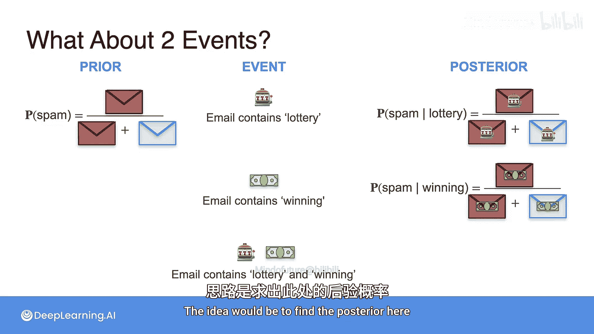
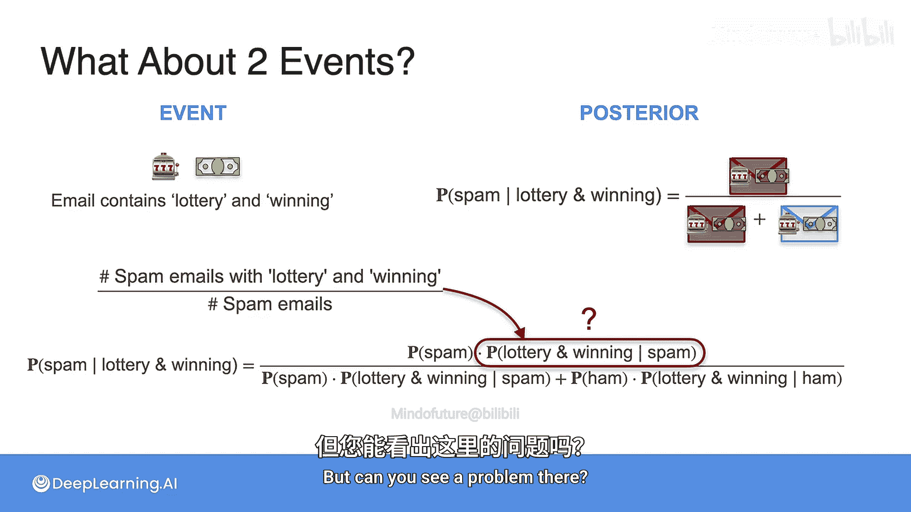
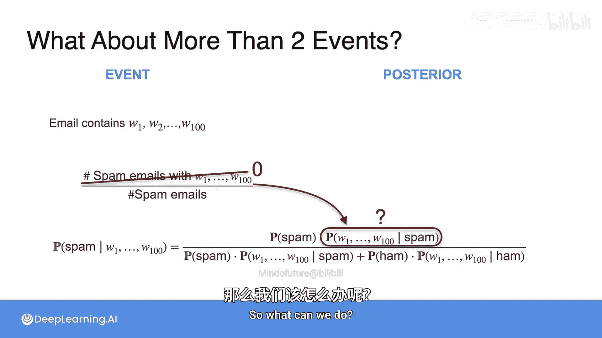
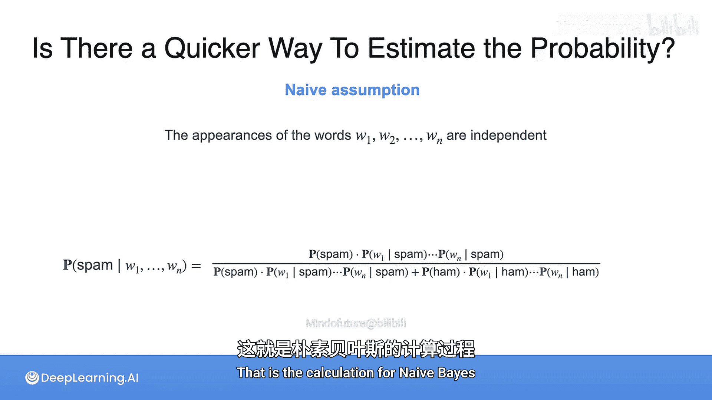
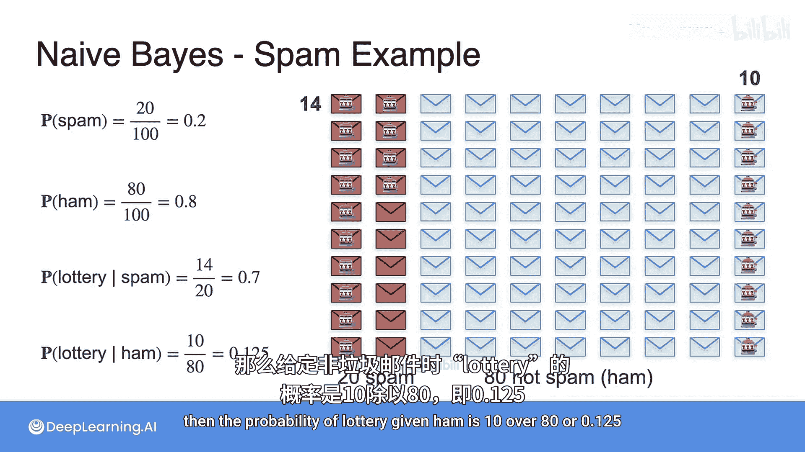
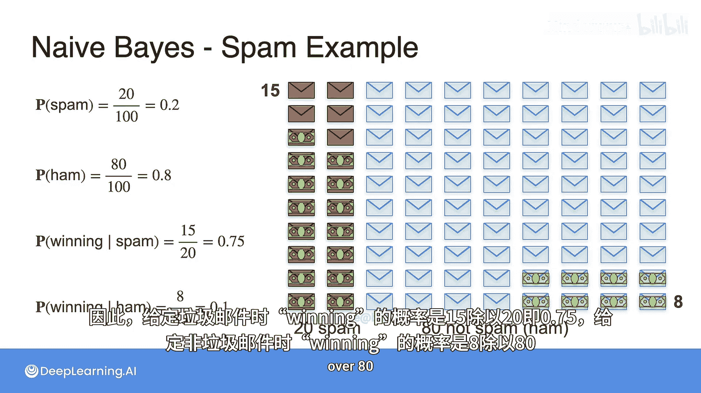
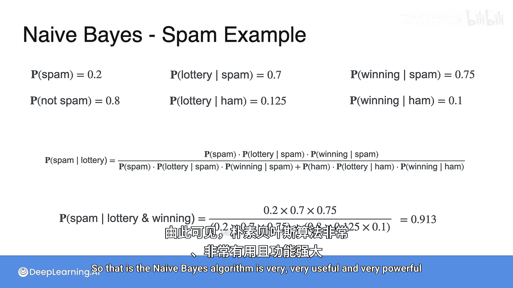

# 016：朴素贝叶斯模型 🧠

在本节课中，我们将要学习朴素贝叶斯模型。这是一种基于贝叶斯定理的简单而强大的分类算法，尤其适用于文本分类任务，如垃圾邮件过滤。我们将从回顾贝叶斯定理开始，逐步引入“朴素”的独立性假设，并最终展示如何利用多个特征（如单词）来计算后验概率。

## 从单一特征到多特征

上一节我们介绍了使用单一单词（如“lottery”）来判断邮件是否为垃圾邮件的贝叶斯定理示例。本节中我们来看看如何结合多个单词（例如“lottery”和“winning”）来构建一个更强的分类器。

理想情况下，我们希望直接计算邮件在同时包含“lottery”和“winning”这两个单词的条件下，属于垃圾邮件的概率。根据贝叶斯定理，这需要计算以下公式：

`P(Spam | Lottery ∩ Winning) = [P(Lottery ∩ Winning | Spam) * P(Spam)] / P(Lottery ∩ Winning)`

然而，直接计算 `P(Lottery ∩ Winning | Spam)` 会遇到问题。它等于垃圾邮件中同时包含这两个单词的数量除以垃圾邮件的总数。当我们试图扩展到100个甚至更多单词时，要求一封邮件同时包含所有指定单词的条件极为苛刻，很可能在我们的数据集中找不到这样的邮件，导致概率估计为0或无法计算。

## 引入“朴素”假设

为了解决上述问题，朴素贝叶斯模型引入了一个关键假设：**特征（在本例中是单词的出现）在给定类别条件下是相互独立的**。这就是“朴素”一词的由来。

虽然这个假设在现实中通常不成立（例如，“good”和“morning”这两个词经常一起出现），但采用此假设后，数学计算变得非常简便，并且往往能取得相当好的分类效果。

基于独立性假设，多个特征（单词）的联合条件概率可以简化为每个特征条件概率的乘积。因此，对于包含n个单词 W1, W2, ..., Wn 的邮件，其属于垃圾邮件的后验概率计算公式变为：

`P(Spam | W1 ∩ W2 ∩ ... ∩ Wn) ∝ P(Spam) * Π [P(Wi | Spam)]`

这里，`Π` 表示连乘。分母 `P(W1 ∩ W2 ∩ ... ∩ Wn)` 的计算也遵循同样的独立性假设，并涉及垃圾邮件（Spam）和非垃圾邮件（Ham）两个类别。

## 计算示例

让我们通过一个具体的例子来演示朴素贝叶斯算法的计算过程。假设我们有一个包含100封邮件的数据集：

*   垃圾邮件（Spam）：20封
*   非垃圾邮件（Ham）：80封

因此，先验概率为：
`P(Spam) = 0.2`
`P(Ham) = 0.8`

关于单词“lottery”的统计如下：

*   在20封垃圾邮件中，有14封包含“lottery”。
*   在80封非垃圾邮件中，有10封包含“lottery”。

因此，条件概率为：
`P(Lottery | Spam) = 14/20 = 0.7`
`P(Lottery | Ham) = 10/80 = 0.125`

关于单词“winning”的统计如下：

*   在20封垃圾邮件中，有15封包含“winning”。
*   在80封非垃圾邮件中，有8封包含“winning”。

因此，条件概率为：
`P(Winning | Spam) = 15/20 = 0.75`
`P(Winning | Ham) = 8/80 = 0.1`

现在，我们使用朴素贝叶斯公式计算一封同时包含“lottery”和“winning”的邮件是垃圾邮件的概率：

`P(Spam | Lottery ∩ Winning) = [P(Spam) * P(Lottery | Spam) * P(Winning | Spam)] / [P(Spam) * P(Lottery | Spam) * P(Winning | Spam) + P(Ham) * P(Lottery | Ham) * P(Winning | Ham)]`

代入数值：
`= [0.2 * 0.7 * 0.75] / [0.2 * 0.7 * 0.75 + 0.8 * 0.125 * 0.1]`
`= 0.105 / (0.105 + 0.01)`
`= 0.105 / 0.115 ≈ 0.913`

计算结果表明，一封同时包含“lottery”和“winning”的邮件有高达91.3%的概率是垃圾邮件。这比仅使用一个单词时的判断要强有力得多。

## 总结

本节课中我们一起学习了朴素贝叶斯模型的核心思想。我们首先回顾了贝叶斯定理在处理单一特征时的应用，然后指出了将其扩展到多特征时面临的计算难题。接着，我们引入了**特征条件独立性**这一“朴素”假设，从而将复杂的联合概率计算简化为单个概率的乘积。最后，通过一个具体的数值示例，我们演示了如何利用先验概率和条件概率来计算邮件属于垃圾邮件的后验概率。朴素贝叶斯算法因其简单、高效且在实践中效果良好，成为了文本分类和许多其他机器学习任务中的基础工具之一。