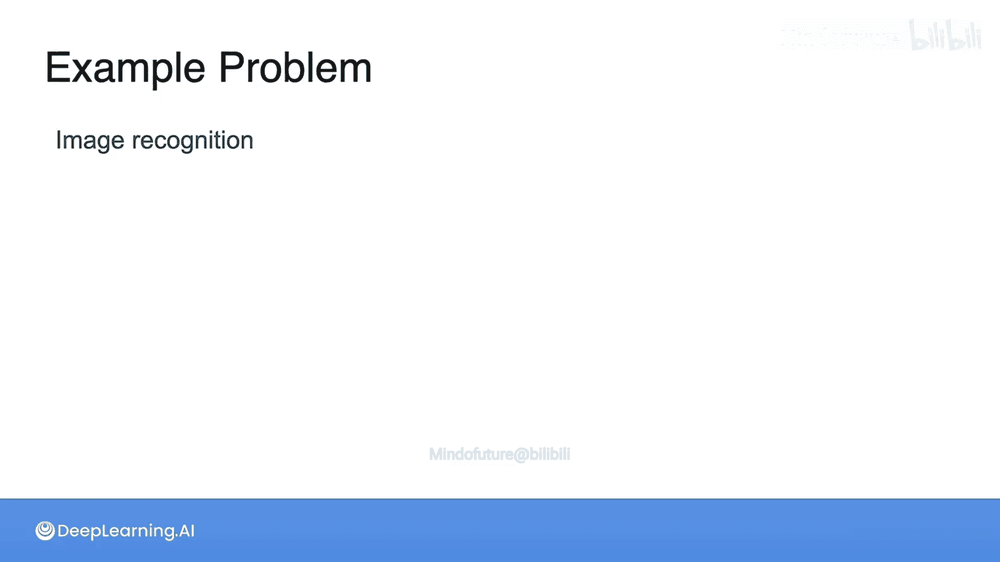
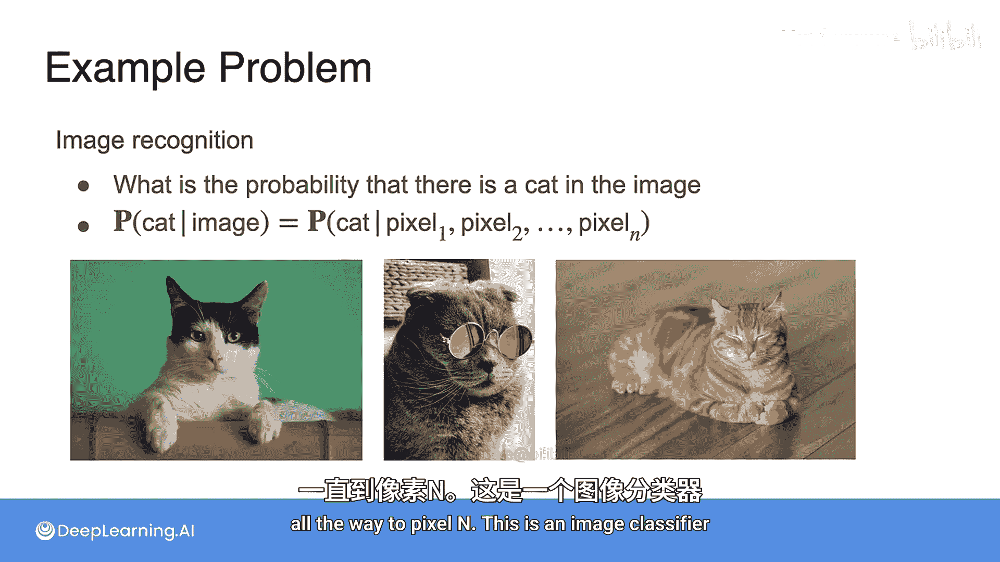
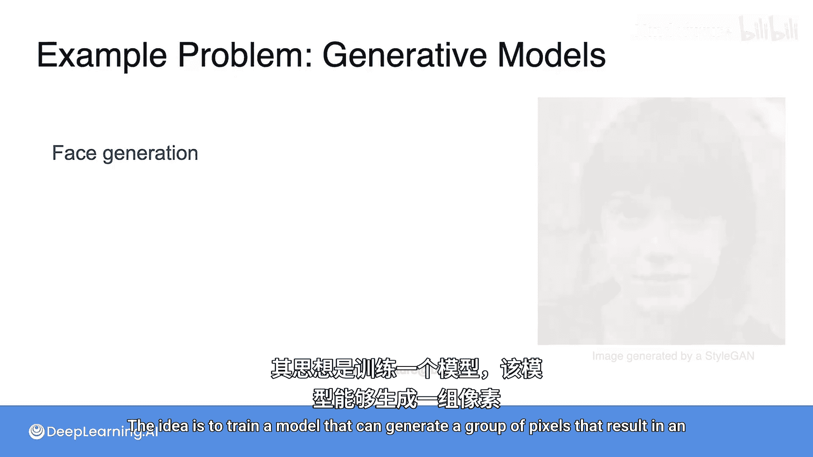
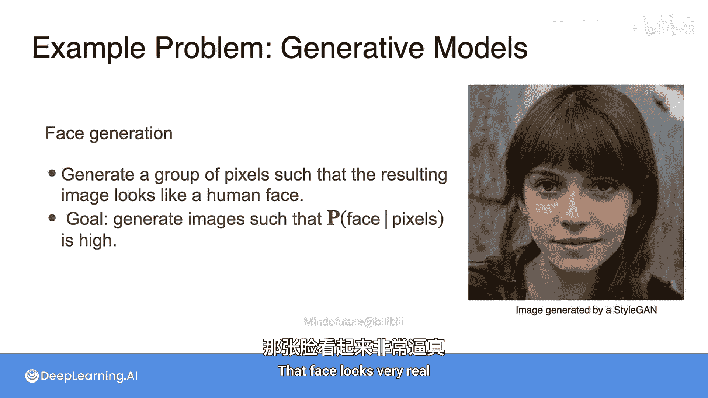

# 017：机器学习中的概率 🧮

在本节课中，我们将探讨概率论与机器学习之间的紧密联系。我们将看到，许多机器学习任务的核心本质是计算条件概率。无论是垃圾邮件检测、情感分析还是图像识别，理解概率都是构建有效模型的关键。

---

## 概率在机器学习中的应用

你可能会好奇，为什么我们要如此深入地讨论概率，它与机器学习有何关系？事实上，机器学习在很大程度上是关于概率的。在机器学习中，很多时候你需要计算在给定某些因素的情况下，某件事发生的概率。

例如，在垃圾邮件检测中，你试图根据邮件中的词语、收件人或附件等特征，计算一封邮件是垃圾邮件的概率。这是一个条件概率，即 **P(垃圾邮件 | 特征)**。

另一个例子是情感分析。你需要判断一段文本是表达快乐还是悲伤。在这种情况下，你需要找到在给定文本包含的词语时，该文本表达快乐的概率，即 **P(快乐 | 词语)**。

让我们再看一个图像识别的例子。在这里，你试图判断一张图像是否包含特定物体。假设你想识别图像中是否有猫，那么你需要根据图像中的像素计算图像中有猫的概率，即 **P(猫 | 像素)**。这些都是条件概率。

然而，纯粹的概率也大量出现在机器学习中。机器学习还有一个重要领域叫做生成式机器学习，它是无监督学习的一部分，其目标是最大化概率。

例如，在图像生成中（你可能见过计算机生成的逼真人脸图像），目标是最大化一组像素构成一张人脸的 **概率**。在文本生成中，目标是最大化一组词语构成有意义的、谈论特定主题的文本的 **概率**。

这些都是大量使用概率的机器学习实例。

---

## 贝叶斯定理与机器学习分类器

在之前的视频中，你已经看到了贝叶斯定理的实际应用。首先，你找到先验概率，即一封邮件是垃圾邮件的初始概率（垃圾邮件数量除以邮件总数）。然后，发生了一个事件，例如邮件包含“彩票”这个词。接着，后验概率通过构建可能性树来细化这个概率。

这为我们提供了四种可能性：邮件是垃圾邮件且包含“彩票”、是垃圾邮件但不包含“彩票”、是正常邮件但包含“彩票”、是正常邮件且不包含“彩票”。然后，你通过忽略所有不包含“彩票”一词的邮件，并在剩余邮件中计算，进一步得出“垃圾邮件且包含彩票”的概率。

那么，在给定“彩票”一词的情况下，邮件是垃圾邮件的概率（后验概率）就等于：
**P(垃圾邮件 | 彩票) = P(垃圾邮件 ∩ 彩票) / [P(垃圾邮件 ∩ 彩票) + P(正常邮件 ∩ 彩票)]**

从高层次看，你所做的是通过计算在给定另一件事的情况下某件事的概率，创建了一个机器学习分类器。而这正是许多机器学习案例的本质。

想象一下图像识别。一个图像识别分类器告诉你一张图像是否包含猫。它真正做的是基于一些事件（即图像中的像素）告诉你图像中有猫的概率。因此，一个分类器会告诉你 **P(猫 | 像素1, 像素2, ..., 像素n)**。这就是一个图像分类器。

另一个例子是在医疗领域。假设你有一批患者的人口统计数据和症状指标，你想知道患者是否健康。你需要做的是根据他们的症状和历史记录，计算患者健康的概率。因此，你构建了一个模型来计算这个条件概率 **P(健康 | 症状, 历史)**。

在情感分析中，你训练一个模型来判断一个给定的句子是快乐的还是悲伤的。你在这里所做的就是计算条件概率 **P(快乐 | 句子中的词语)**。

---

## 通过图像识别理解条件概率

让我们考虑图像识别问题，看看这是如何工作的。你需要训练一个模型。这个模型接收一张图像（即一组像素），并告诉你在给定这些像素的情况下，图像中有猫的概率。

例如，对于一张猫的图片，模型可能会输出概率 0.9。如果你给它一张不同的图片，比如一辆汽车，那么模型会说，在给定这些像素的情况下，这里有猫的概率非常小，比如 0.1。因此，你判定这不是一只猫。

由此可见，机器学习的核心就是寻找条件概率。具体来说，这属于监督式机器学习，因为你是在回答关于数据的问题，例如“图像是否包含猫？”、“句子是否快乐？”、“这封邮件是否是垃圾邮件？”等等。

---

## 生成式模型：另一个条件概率的范例

条件概率另一个非常有趣的例子是生成式模型，例如人脸生成模型。其思想是训练一个模型，能够生成一组像素，从而得到一张看起来像人脸的图像。这是通过尝试实现 **在给定生成像素的情况下，图像是人脸的高概率** 来完成的。

例如，右边的图像（指代原文中提到的图片）并不是一个真实的人，它是由一个名为 StyleGAN 的模型生成的。这张脸看起来非常逼真。

---

## 总结

本节课中，我们一起学习了概率在机器学习中的核心作用。我们了解到：

1.  许多机器学习任务，如分类（垃圾邮件检测、图像识别、情感分析），本质上是计算条件概率 **P(结果 | 特征)**。
2.  贝叶斯定理为这类计算提供了理论基础，并通过先验概率和后验概率的更新来构建分类器。
3.  生成式机器学习（如图像生成）的目标是最大化生成数据符合特定分布的概率。
4.  无论是监督学习中的判别模型，还是无监督学习中的生成模型，概率论都是其不可或缺的数学语言和实现工具。

理解这些概率概念，将为你深入学习更复杂的机器学习算法和模型打下坚实的基础。