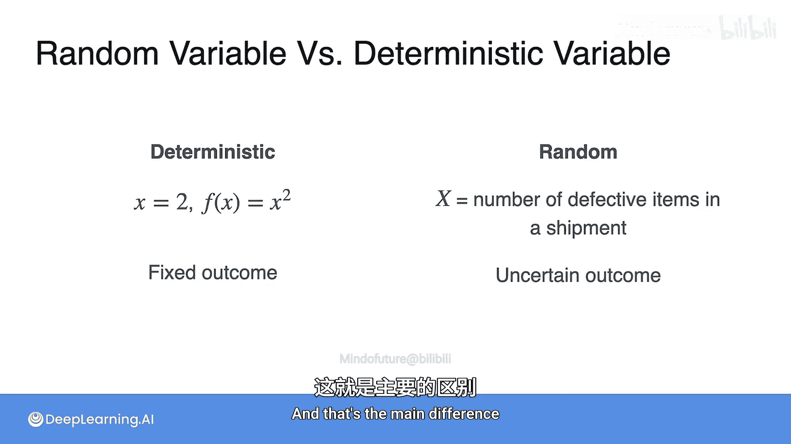

# 018：随机变量

## 概述
在本节课中，我们将要学习概率论与统计学中最重要的概念之一：**随机变量**。我们将了解什么是随机变量，它与普通变量的区别，以及离散型与连续型随机变量的不同。

---

## 随机变量的定义

上一节我们介绍了概率的基本概念，本节中我们来看看**随机变量**。随机变量与我们之前学过的变量不同。例如，在代数中，变量 `x = 3` 总是具有相同的值。而随机变量则可以取许多不同的值。

以下是随机变量的两个例子：
*   **温度**是一个随机变量，它可以取许多值。
*   **抛硬币10次得到正面的次数**是另一个随机变量。

让我们回到抛硬币的实验。抛一枚硬币，可能得到正面（H）或反面（T），假设两者概率均为 `0.5`。现在，我们定义一个变量 `X`，称之为**正面出现的次数**。

那么，抛一次硬币时，`X` 可以取哪些值呢？
*   如果我们得到正面，则得到1次正面，`X = 1`。
*   如果我们得到反面，则得到0次正面，`X = 0`。

其对应的概率为：
*   `P(X = 1) = P(H) = 0.5`
*   `P(X = 0) = P(T) = 0.5`

`X` 就被称为一个**随机变量**。你可以把它看作一个不总是具有相同值的变量：大约一半的时间取值为 `1`，另一半的时间取值为 `0`。

---

## 更复杂的随机变量示例

现在让我们看一个更复杂的随机变量：**抛硬币10次得到正面的次数**。

假设我们抛硬币10次，可能出现以下情况：
*   全部是正面，则 `X = 10`。
*   有9次正面和1次反面，则 `X = 9`。并且 `X = 9` 可以通过多种不同的具体序列（例如，第1次是反面，其余是正面）来实现。

如果我们假设每次抛掷是独立的，且正面概率 `p = 0.5`，那么：
*   得到 `X = 10`（即序列HHHHHHHHHH）的概率是 `(0.5)^10`。
*   得到某个特定的 `X = 9` 序列（例如HHHHHHHHHT）的概率也是 `(0.5)^10`，可以写成 `(0.5)^9 * (0.5)^1`。

然而，一个更难的问题是计算诸如 `P(X = 0)`、`P(X = 1)` 直到 `P(X = 10)` 这样的概率。因为 `P(X = 9)` 需要将所有能导致9次正面的不同序列的概率相加。

为了直观理解这些概率，我们可以进行模拟实验。例如，将这个抛10次硬币的实验重复500次，并记录每次实验中正面出现的次数 `X`，然后绘制成直方图。

模拟结果可能显示：
*   `P(X = 0)` 和 `P(X = 10)` 的概率最小，因为全部是反面或全部是正面不太可能发生。
*   `P(X = 5)` 的概率最高，因为得到大约一半正面的情况最为常见。
*   我们也能看到其他结果的概率，例如 `P(X = 8)`（即8次正面和2次反面）。

---

## 为什么随机变量很重要？

我们为什么关心随机变量？因为它们允许我们**一次性对整个实验进行建模**。概率论中的大多数问题都可以用随机变量来表达。

例如：
*   抛一堆硬币，`X` 为正面的次数。
*   掷一堆骰子，`X` 为出现1点的次数。
*   观察一群患者，`X` 为康复的患者人数。

我们甚至可以定义任意的随机变量，只要其所有可能取值的概率之和为1即可。例如，我可以定义一个随机变量 `Y`：
*   `P(Y = 1) = 0.5`
*   `P(Y = -7) = 0.2`
*   `P(Y = 3.14159) = 0.3`

---

## 随机变量的类型：离散型与连续型

你可能已经注意到，随机变量的行为方式有所不同。这主要因为存在两大类型：**离散型随机变量**和**连续型随机变量**。

以下是每种类型的例子：

**离散型随机变量**：
*   掷骰子得到1点的次数。
*   抛硬币得到正面的次数。
*   特定人群中具有某身高的儿童数量。

**连续型随机变量**：
*   等待下一班公交车的时间。
*   体操运动员的跳跃高度。
*   某个月的降雨量（毫米）。

它们的主要区别是什么？一个常见的误解是离散型只能取有限个值，而连续型可以取无限个值。但事实并非完全如此。

考虑这个例子：**不断抛一枚硬币，直到第一次出现正面所需的次数**。这个次数可能是1次、2次、3次……理论上可以是任意大的正整数，因此它也有无限多个可能值，但它仍然是离散型的。

真正的区别在于：
*   **离散型随机变量**的可能取值是**可数的**。即使有无限多个，这些值也可以被列成一个清单（如1, 2, 3, …）。
*   **连续型随机变量**的可能取值充满**整个区间**。例如，时间可以是1分钟、1.01分钟、1.00123分钟……这些值无法被一一列出，因为它们构成了一个连续的区间。

---

## 随机变量与确定性变量的区别

你可能会想，随机变量和我们在代数、微积分中遇到的变量有什么区别？

核心区别在于：
*   **代数/微积分中的变量是确定性的**。例如 `x = 2`，或者函数 `f(x) = x^2` 中的输入 `x`。一旦被定义，它们就具有固定不变的值。
*   **概率论中的随机变量是随机的**。它关联着一个**不确定的结果**，可以以一定的概率取多个不同的值。

简而言之，确定性变量关联着**固定的结果**，而随机变量关联着**不确定的结果**。

---

## 总结
本节课中，我们一起学习了概率论的核心概念——**随机变量**。
1.  我们定义了随机变量，它是一个将随机实验的结果映射为数值的函数。
2.  我们通过抛硬币的例子，说明了随机变量如何描述实验的整体结果。
3.  我们区分了两种主要类型：**离散型随机变量**（取值可数）和**连续型随机变量**（取值充满区间）。
4.  最后，我们明确了随机变量与数学中确定性变量的根本区别在于其取值的不确定性。

理解随机变量是学习更复杂概率模型和统计推断的基础。在接下来的课程中，我们将深入探讨如何描述和分析随机变量的行为。