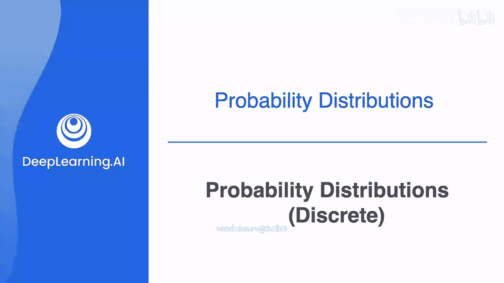
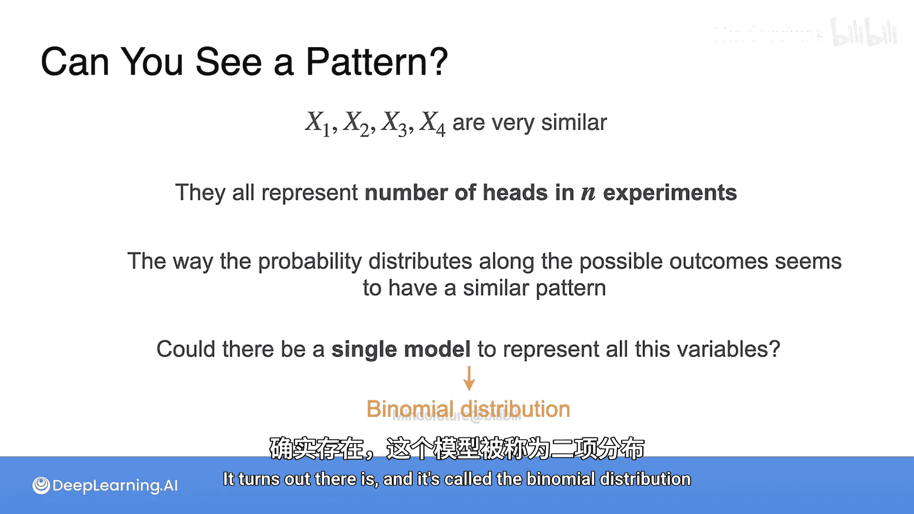

# 019：概率分布与离散型随机变量

在本节课中，我们将学习概率分布的概念，特别是针对离散型随机变量的概率分布。我们将通过掷硬币的例子，直观地理解随机变量如何取值，以及这些值对应的概率是如何分布的。最后，我们将引出概率质量函数（PMF）的定义和性质。

---

## 概率分布的概念

在第一课中，我们学习了如何计算单个事件的概率以及如何进行概率运算。

现在，想象将某个实验所有可能发生的结果放在一条水平轴上，并为每一个结果标注其发生的概率。这就形成了一个**概率分布**，这正是本节课的主题。

## 掷硬币的例子

假设我们投掷三枚硬币，并关心出现正面的次数。这个“正面次数”就是我们的**随机变量**。

那么，每次实验的结果如何影响这个随机变量呢？

以下是所有可能的情况：

*   第一种可能：得到0个正面（即全是反面）。
*   第二种可能：得到1个正面。但这里可以看到，实际上有三种不同的投掷结果能得到1个正面（正面出现在第一枚、第二枚或第三枚硬币上）。
*   第三种可能：得到2个正面。同样，也有三种不同的结果能得到2个正面（反面出现在第一枚、第二枚或第三枚硬币上）。
*   第四种可能：得到3个正面。只有一种情况。

现在让我们重新整理一下：

*   得到3个反面或3个正面，都只有1种方式。
*   得到1个正面（和2个反面）或得到2个正面（和1个反面），各有3种方式。

接下来，将这个数字除以所有可能结果的总数（即8种），我们就得到了每个结果对应的概率。

从下图可以清楚地看出，为什么得到1个或2个正面比得到0个或3个正面可能性大得多。这是因为有多少种不同的实验结果能导致这些随机变量取值。

现在，我们可以将其视为一个普通的直方图。

## 扩展到更多次投掷

上一节我们看了投掷三枚硬币的情况，本节中我们来看看投掷四枚硬币的例子。

此时，你的随机变量是**四次投掷中正面的数量**。你会发现发生了类似的情况。

*   全是正面或全是反面，只有1种可能。
*   得到1个正面（或1个反面），有4种可能。
*   得到2个正面和2个反面，情况稍复杂，有6种可能。

这总共给出了16种可能的硬币落地结果。因此，你可以为得到0或4个正面分配概率 `1/16`，为得到1或3个正面分配概率 `4/16`，为得到2个正面分配概率 `6/16`。这就是四次投掷的概率分布直方图。

现在，让我们看另一个变量：**五次投掷中正面的数量**。

*   全是正面或全是反面：有1种可能（总共有32种可能结果）。
*   得到1个正面或1个反面：有5种可能。
*   得到2个或3个正面：实际上有10种可能。

很容易理解，对于全是正面，只有一种可能性；对于只有一个正面，可能性数量等于投掷次数，因为正面可以出现在五次投掷中的任何一次。但是，如何计算出有10种可能得到两个正面呢？

幸运的是，有一个系统的方法来计算。请继续学习下一个视频来了解其工作原理。

## 概率质量函数

每个条形图都代表了随机变量 `X`（例如五次投掷中的正面数）取每一个可能值（0, 1, 2, 3, 4, 5）的概率。

对于每个 `x`（从0到5），你都有一个概率 `P(X = x)`。这被称为随机变量 `X` 的**概率质量函数**，我们通常用小写字母 `p` 来表示。

**公式：** `p(x) = P(X = x)`

所有这些随机变量都可以用它们的概率质量函数来建模，也简称为 **PMF**。因为它包含了理解概率如何在变量的所有可能值之间分布的所有必要信息。

那么，PMF 有哪些要求呢？

以下是PMF必须满足的条件：

1.  **非负性**：由于PMF定义为随机变量取某个特定值的概率，因此它必须始终是非负的。即对于所有可能的 `x`，`p(x) >= 0`。
2.  **归一性**：当把PMF在所有可能值上求和时，总和必须等于1。这很合理，因为你考虑的是实验所有可能结果的概率。即 `∑ p(x) = 1`（对所有可能的 `x` 求和）。

## 通向二项分布

顺便说一下，我们例子中的 `X1`（三次投掷）、`X2`（四次投掷）、`X3`（五次投掷）都非常相似——它们都是在固定次数的硬币投掷中统计正面数量。

并且，概率在所有可能值上的分布遵循相似的模式。那么，是否存在一个单一的模型来代表所有这些随机变量呢？

事实证明，是存在的，它被称为**二项分布**。你将在下一个视频中学习它。

---

## 总结

本节课中，我们一起学习了概率分布的核心概念。我们通过掷硬币的实验，从具体例子出发，理解了离散型随机变量及其取值的概率。我们定义了**概率质量函数**，它完整描述了一个离散随机变量的概率分布，并必须满足非负性和总和为1两个条件。最后，我们观察到一类特殊的随机变量（固定次数试验中成功的次数）具有相似的分布模式，为下一课学习**二项分布**这一重要模型做好了准备。