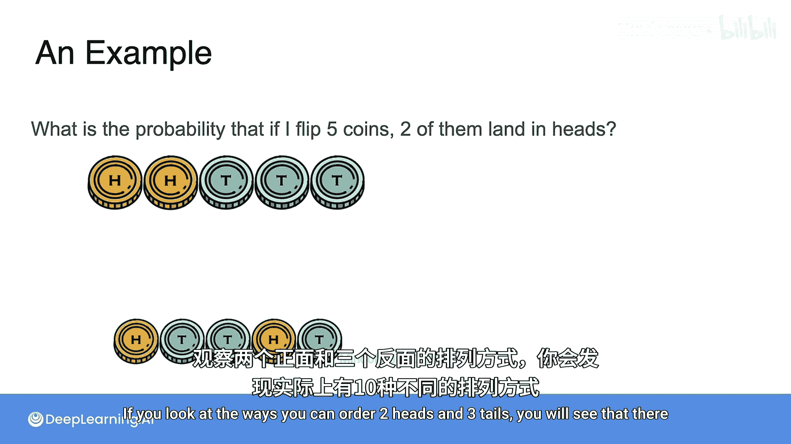
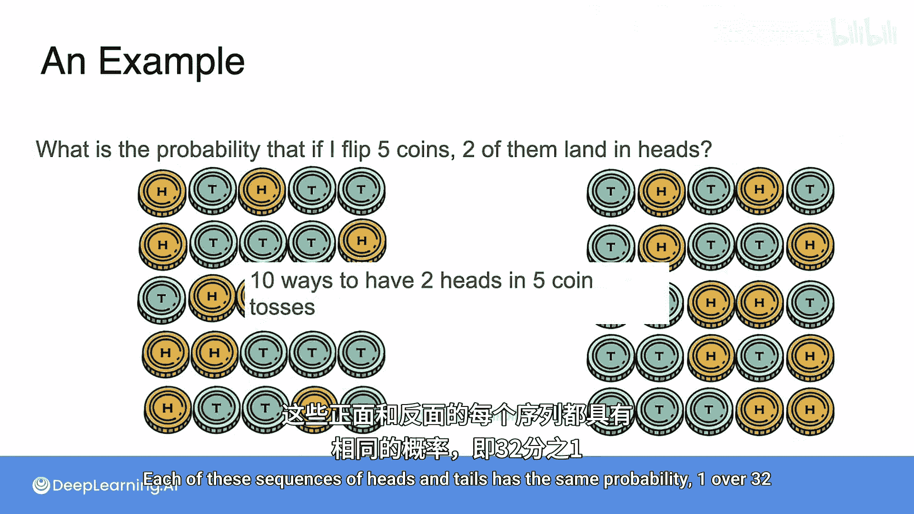
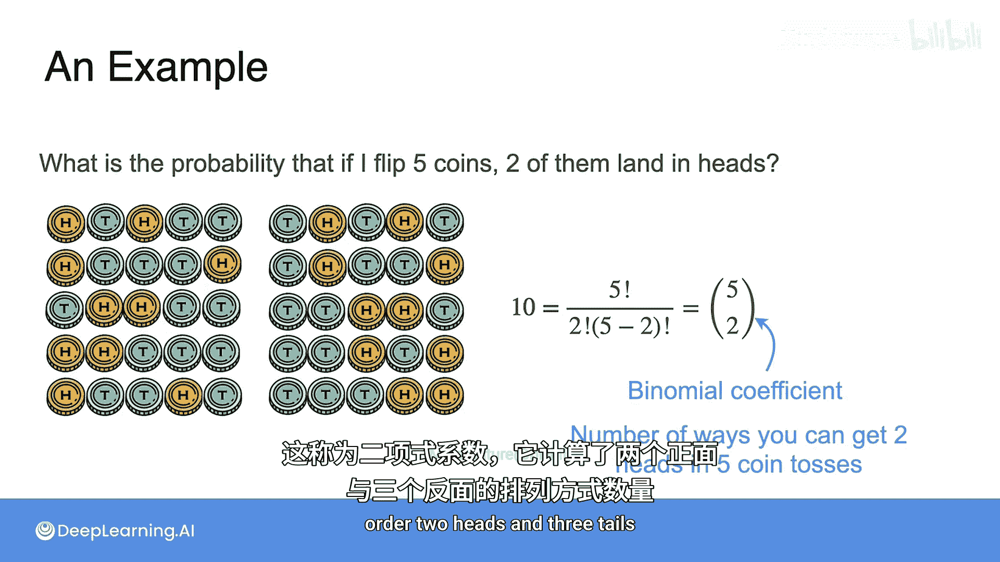
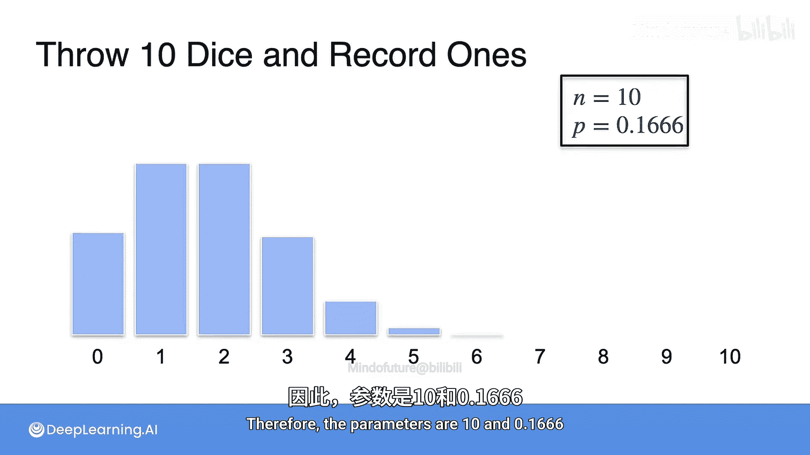

# 020：二项分布

在本节课中，我们将学习概率论中最基础的分布之一：**二项分布**。我们将从简单的抛硬币例子入手，理解其核心概念、公式和应用场景。

## 概述

二项分布描述的是在固定次数的独立试验中，某个事件（如“正面朝上”）发生次数的概率分布。它是理解离散随机变量的重要起点。

---

## 从抛硬币开始

上一节我们介绍了离散分布的基本概念，本节中我们来看看一个具体的例子：二项分布。

想象一下抛一枚硬币。假设我抛一枚硬币10次，我能得到多少次正面朝上？可能是0次、1次、2次，一直到10次。每种结果都有其对应的概率。如果我们画出这些概率的直方图，就得到了二项分布。

二项分布是离散分布的一个例子，也是我们将要学习的最简单的分布之一。在本课程后续部分，我们也会学习连续分布。

## 计算特定结果的概率

现在，让我们具体分析二项分布。当你抛5枚硬币时，得到恰好2次正面的概率是多少？

对于每一次抛掷，得到正面或反面的概率都是1/2。如果你将五次抛掷的概率相乘，会得到1/32。这是**一个特定序列**（例如“正正反反反”）出现的概率。

但是，在5次抛掷中得到2次正面的方式不止一种。例如，“正反正反反”这个序列出现的概率与上一个序列完全相同，都是1/32。

实际上，从5次抛掷中得到2次正面的可能性总共有10种。如果你观察排列2次正面和3次反面的所有方式，你会发现确实有10种不同的序列。每个这样的序列都有相同的概率：1/32。

## 计算组合数：二项式系数

那么，有没有一个通用的方法来计算可能的组合数量呢？这其实就是对包含2次正面和3次反面的序列进行排序。

5的阶乘（`5!`）是排列5个不同物品的方式总数。但这里我们高估了，因为这5次抛掷中有重复（2次正面相同，3次反面相同），所以需要修正。

以下是计算步骤：
1.  首先计算 `5!`。
2.  除以 `2!`，以消除仅仅交换两个正面位置所产生的重复排列。
3.  再除以 `3!`，以消除仅仅交换三个反面位置所产生的重复排列。

这个计算结果被称为**二项式系数**，它计算了排列2次正面和3次反面的所有不同方式。其公式为：

**公式：**
`组合数 = n! / (k! * (n-k)!)`

通常，系数“n选k”计算了在n次抛掷中，出现k次正面的所有组合数。

它的一个性质是：“n选k”等于“n选(n-k)”。原因在于，得到k次正面，等同于得到n-k次反面。这也解释了为什么一枚公平硬币的概率质量函数图形是对称的。

## 二项分布的概率质量函数

现在，你能找到一种通用的方法来写出抛5枚硬币时正面次数的概率质量函数吗？

为了更具一般性，假设得到正面的概率是`p`。考虑事件`X = x`，其中`X`是一个随机变量，`x`是5次抛掷中正面的次数，可以是0、1、2、3、4或5。

这个事件的概率是多少？
1.  你需要得到`x`次正面，其概率为 `p^x`。这是一个特定顺序的概率。
2.  剩下的 `5-x` 次是反面，其概率为 `(1-p)^(5-x)`。
3.  然而，这只是**一个特定顺序**的概率。你需要考虑所有可能的顺序，即“5选x”种。

因此，概率质量函数为：

**公式：**
`P(X = x) = C(5, x) * p^x * (1-p)^(5-x)`

当然，这个表达式仅对 `x = 0, 1, 2, 3, 4, 5` 有效，因为你不可能在5次抛掷中得到超过5次正面。这就是`X`的PMF，我们说`X`服从二项分布。

我们将其记作 `X ~ Binomial(5, p)`，其中5是抛掷次数，`p`是正面概率。符号`~`表示变量`X`服从其右侧表达式所描述的分布。

如果 `p = 0.5` 且 `n = 5`，你会得到如下PMF。记住，这里你抛掷了5枚硬币，正面概率是1/2。图形如下所示。注意，由于`p=0.5`，PMF是对称的。

在`p`不同的情况下，例如我们有一枚有偏的硬币，`p = 0.3`，那么你看到较少正面的机会更大，这反映在了PMF图形中。

## 推广到一般情况

在上面的例子中，你抛掷了5枚硬币。但如果你抛掷任意次数，模型应该是相同的，你只是改变了一个参数。

当我们抛掷`n`枚硬币时，概率质量函数如下：

**公式：**
`P(X = x) = C(n, x) * p^x * (1-p)^(n-x)`

我们称之为 `Binomial(n, p)`，其中`n`和`p`是二项分布的参数。`n`是试验（抛掷）次数，`p`是每次试验中得到“成功”（如正面）的概率。

## 应用示例：掷骰子

现在尝试回答这个问题：掷一个骰子5次，恰好得到一次点数为1的概率是多少？（顺序无关紧要）

当你掷骰子时，你可以得到1点，或者不是1点。这与抛硬币并无太大不同。在抛硬币中，你可以得到正面或反面。你可以把骰子想象成一枚有偏的硬币：掷出1点视为“正面”，掷出其他点数视为“反面”。所以它是一枚有偏的硬币。

对于一枚公平的骰子，每个点数出现的概率是1/6。所以现在这枚“硬币”得到“正面”（即1点）的概率`p = 1/6`，得到“反面”的概率是`5/6`。你可以为不同的`p`（但相同的`n`）绘制类似的直方图。这次我们有 `n = 5`，`p = 1/6`。换句话说，对于这个实验，我们可以将骰子视为一枚有偏的硬币。

让我们看另一个案例：掷骰子10次，和之前一样，我们记录出现1点的次数。这同样是一个二项概率分布。你能告诉我这个分布的参数是什么吗？

上述问题可以用二项分布表示，其中：
*   `n = 10`，代表掷骰子的次数。
*   `p` 代表得到1点的概率，即 `1/6`。

因此，参数是 `10` 和 `0.1666...`。

---

## 总结

本节课中我们一起学习了**二项分布**。我们了解到：
1.  二项分布描述了在固定次数`n`的独立伯努利试验中，“成功”次数`k`的概率分布。
2.  其核心概率由 **二项式系数** `C(n, k)` 与成功概率`p`和失败概率`(1-p)`的幂次相乘得到，公式为 `P(X=k) = C(n, k) * p^k * (1-p)^(n-k)`。
3.  二项分布有两个参数：试验次数 `n` 和每次试验的成功概率 `p`，记作 `X ~ Binomial(n, p)`。
4.  当 `p=0.5` 时，分布是对称的；当 `p` 偏离0.5时，分布会偏向一侧。
5.  许多现实场景（如多次抛硬币、掷骰子看特定点数、质量抽检等）都可以用二项分布来建模。