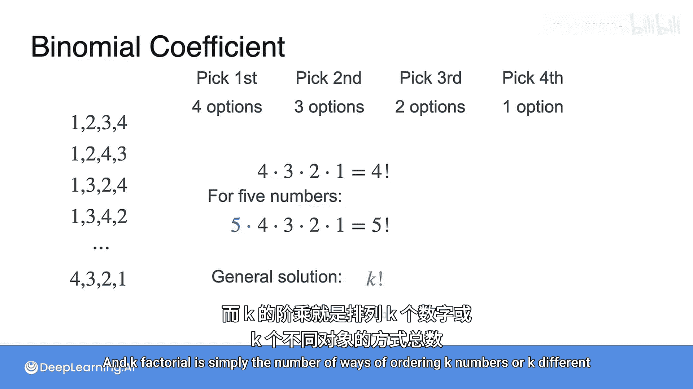
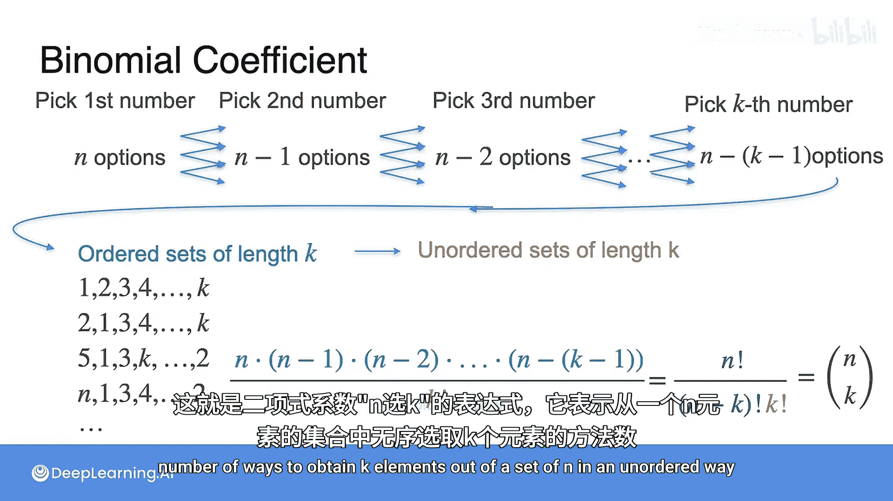
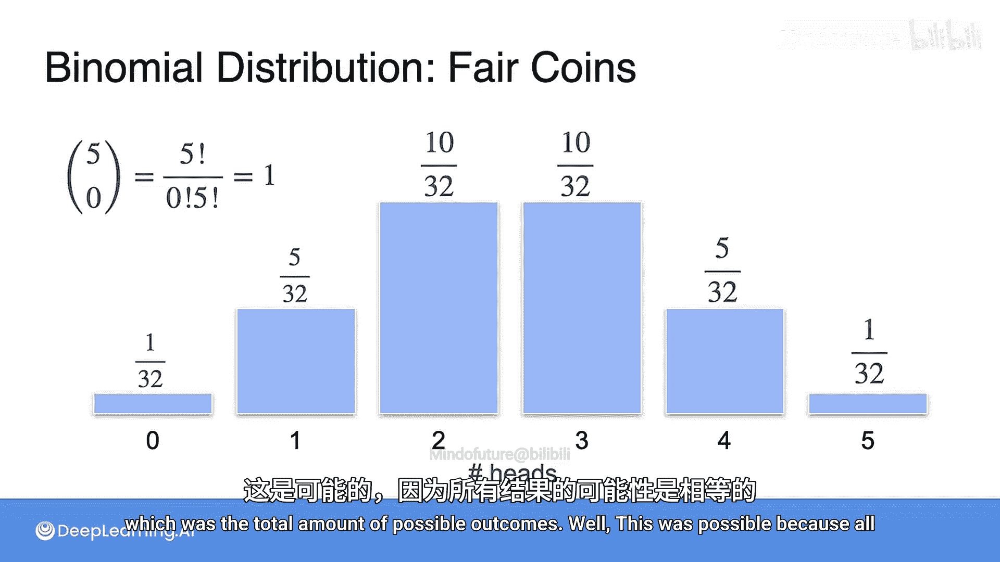
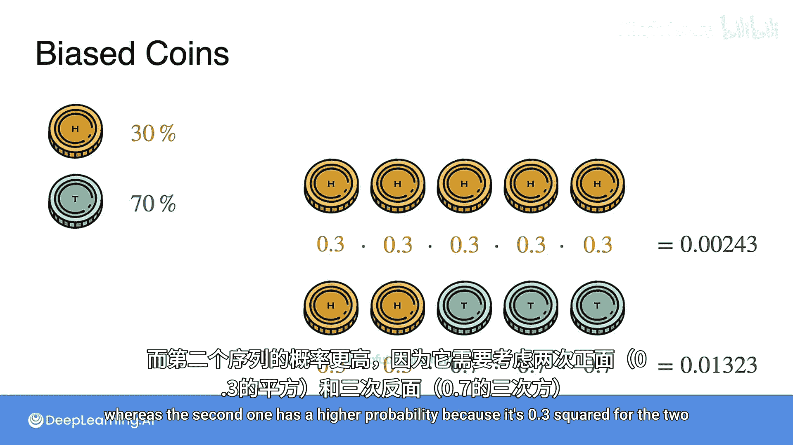
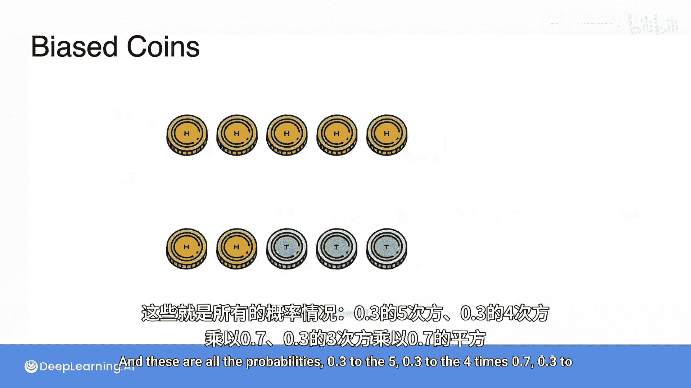
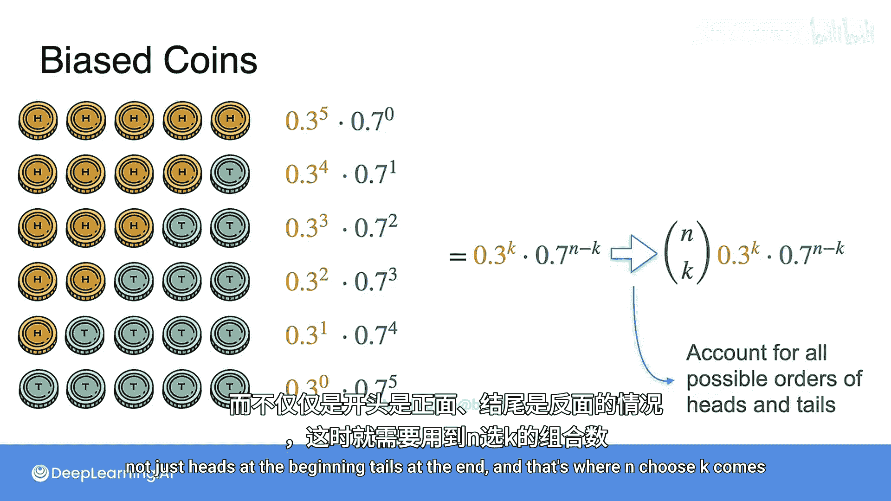
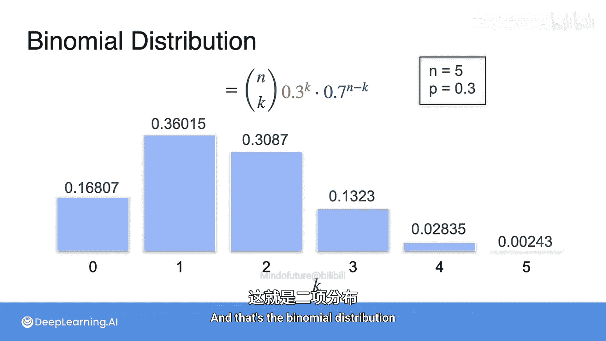

# 021：二项式系数与二项分布 🎲

在本节课中，我们将学习如何从一组元素中无序地选取特定数量的元素，并理解当事件（如抛硬币）概率不相等时，如何计算特定结果出现的概率。我们将重点介绍**二项式系数**和**二项分布**这两个核心概念。

---

## 从有序选取到无序组合

上一节我们讨论了有序选取的情况。本节中，我们来看看当顺序不重要时，如何计算组合的数量。

假设我们需要从 **n** 个不同的数字中，无序地选取 **k** 个数字。我们首先考虑有序选取的情况。

以下是计算有序选取数量的步骤：
1.  选取第一个数字：有 **n** 种选择。
2.  选取第二个数字：由于已经选走一个，剩下 **n-1** 种选择。
3.  选取第三个数字：剩下 **n-2** 种选择。
4.  以此类推，直到选取第 **k** 个数字：剩下 **n - (k-1)** 种选择。

因此，有序选取的总方式数为：
**n × (n-1) × (n-2) × … × (n - k + 1)**

然而，这计算了所有可能的排列。对于同一个由 **k** 个数字组成的集合，不同的排列顺序被重复计算了多次。

## 计算重复次数：阶乘

为了得到无序组合的数量，我们需要知道每个集合被重复计算了多少次。这取决于我们能用多少种方式重新排列（排序）一个包含 **k** 个元素的集合。

以下是排列一个包含 **k** 个不同元素的集合的方式数：
1.  选择第一个位置：有 **k** 种选择。
2.  选择第二个位置：剩下 **k-1** 种选择。
3.  以此类推，直到最后一个位置：只有 **1** 种选择。

因此，排列方式的总数为：
**k × (k-1) × (k-2) × … × 1**

这个连乘积在数学中被称为 **k 的阶乘**，记作 **k!**。
**k! = k × (k-1) × … × 2 × 1**

## 推导二项式系数公式

由于每个无序的 **k** 元素集合在有序计数中被重复计算了 **k!** 次，为了得到真正的无序组合数，我们需要将有序选取的总数除以 **k!**。

因此，从 **n** 个元素中无序选取 **k** 个元素的方式数，即**二项式系数**（也读作“n 选 k”），公式为：
**(n × (n-1) × … × (n - k + 1)) / k!**

这个公式可以更简洁地写成：
**C(n, k) = n! / (k! × (n - k)!)**

其中 **n!** 是 **n 的阶乘**。这个公式之所以成立，是因为 **n! / (n-k)!** 恰好等于分子 **n × (n-1) × … × (n - k + 1)**。

**二项式系数 `C(n, k)` 表示从一个大小为 n 的集合中，无序选取 k 个元素的不同方式的数量。**

## 回到抛硬币的例子

让我们用新学的公式重新审视抛5次公平硬币的例子。获得 **k** 次正面的结果数量，实际上就是从5次抛掷中，选择 **k** 次作为正面的方式数。

因此，概率可以重新计算为：
**P(k次正面) = C(5, k) / 2^5**

例如：
*   `C(5, 0) = 1`（不选任何一次为正面，只有1种方式）。
*   `C(5, 1) = 5`（从5次中选1次为正面，有5种方式）。
*   以此类推。

**特别地，`C(n, 0)` 总是等于 1，因为“不选取任何元素”只有一种方式。**

## 引入偏差：二项分布

前面的计算基于硬币是公平的（正反面概率各为50%）。如果硬币有偏差呢？

假设一枚硬币抛出正面的概率是 **p = 0.3**，抛出反面的概率是 **q = 1 - p = 0.7**。

现在，一个特定的结果序列（例如“正正反反反”）的概率不再都是 `1/32`。它的概率取决于序列中正面和反面的具体数量。

对于一个有 **k** 次正面和 **(n-k)** 次反面的**特定序列**，其概率为：
**p^k × q^(n-k)**

例如，对于“正正反反反”，概率是 `0.3^2 × 0.7^3`。

然而，我们通常关心的是“总共出现 **k** 次正面”的概率，而不关心具体是哪 **k** 次。因此，我们需要将所有能产生 **k** 次正面的不同序列的概率相加。

有多少个这样的序列？正是我们刚学的 **C(n, k)** 个。

于是，我们得到了**二项分布**的概率公式：
**P(在n次试验中恰好有k次成功) = C(n, k) × p^k × (1-p)^(n-k)**

其中：
*   **n** 是总试验次数（如抛硬币次数）。
*   **k** 是成功的次数（如正面朝上的次数）。
*   **p** 是单次试验成功的概率。
*   **C(n, k)** 是二项式系数，计算成功发生位置的所有可能组合。

对于我们的偏差硬币例子（p=0.3， n=5），获得k次正面的概率就是：
**P(k) = C(5, k) × (0.3)^k × (0.7)^(5-k)**

我们可以用这个公式计算出k从0到5的所有概率，并绘制成一个新的概率分布直方图，这就是**二项分布**的直观展示。

---

本节课中我们一起学习了：
1.  **二项式系数 `C(n, k)`**：计算从n个元素中无序选取k个元素组合数量的核心公式 `n! / (k! × (n-k)!)`。
2.  **阶乘 `k!`**：表示排列k个不同对象的方式数。
3.  **二项分布**：描述了在n次独立试验中，成功次数为k的概率分布，其公式为 `P(k) = C(n, k) × p^k × (1-p)^(n-k)`。当p=0.5时，它退化为公平硬币的简单情况。

理解二项式系数和二项分布是学习更复杂概率模型和进行许多统计测试的重要基础。