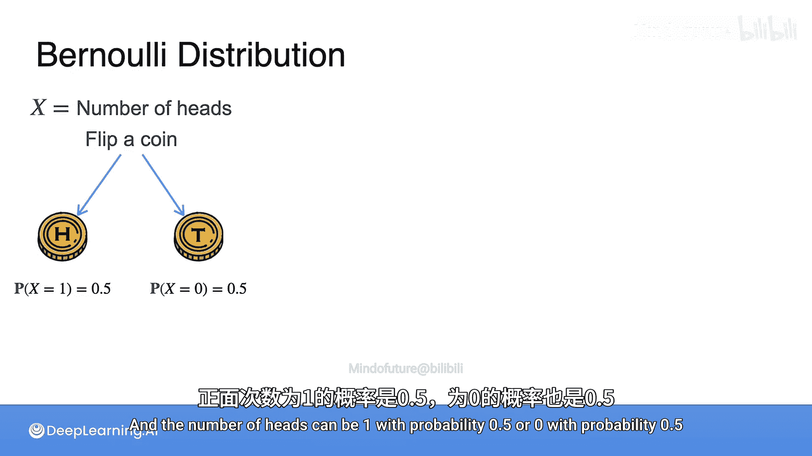
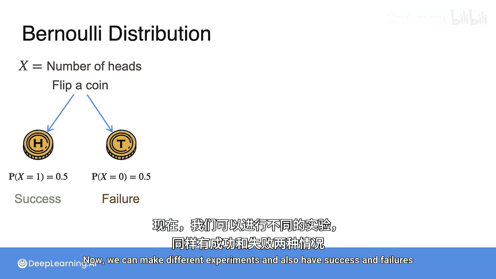
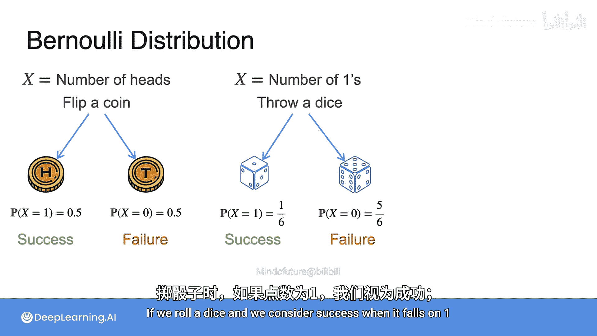
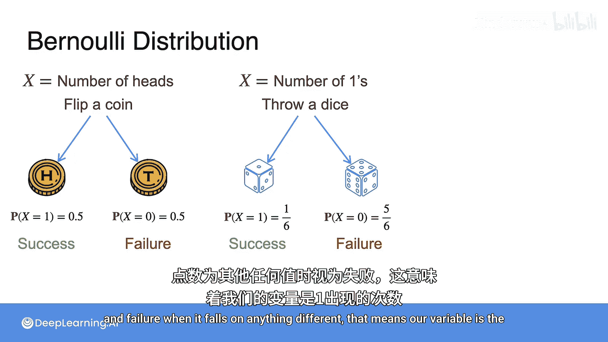
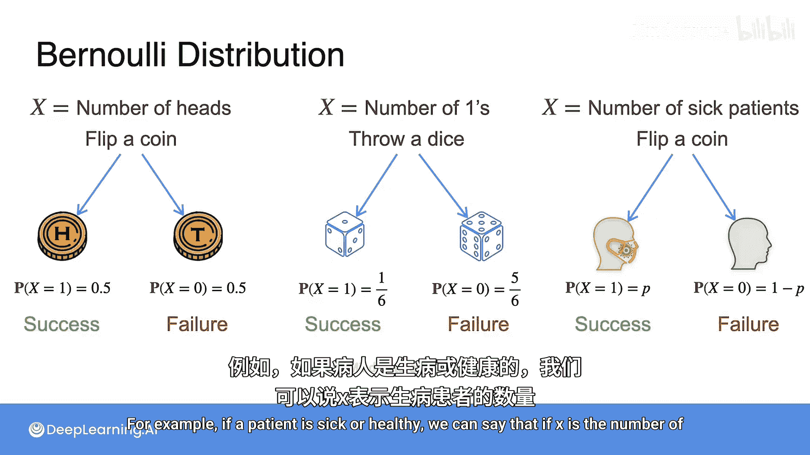
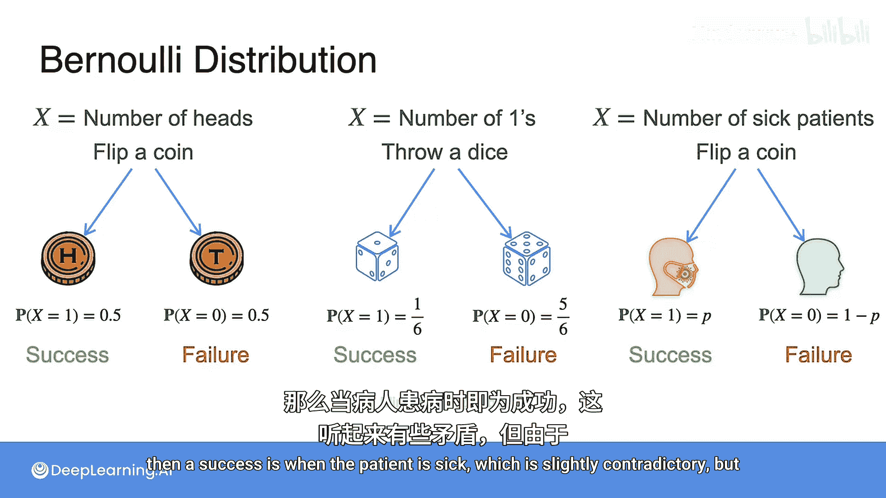
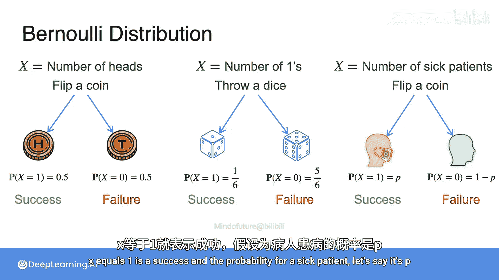
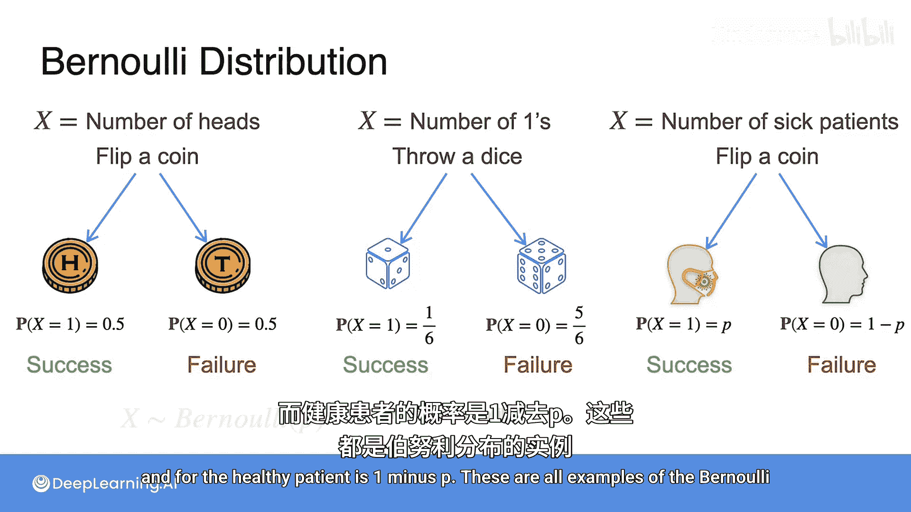
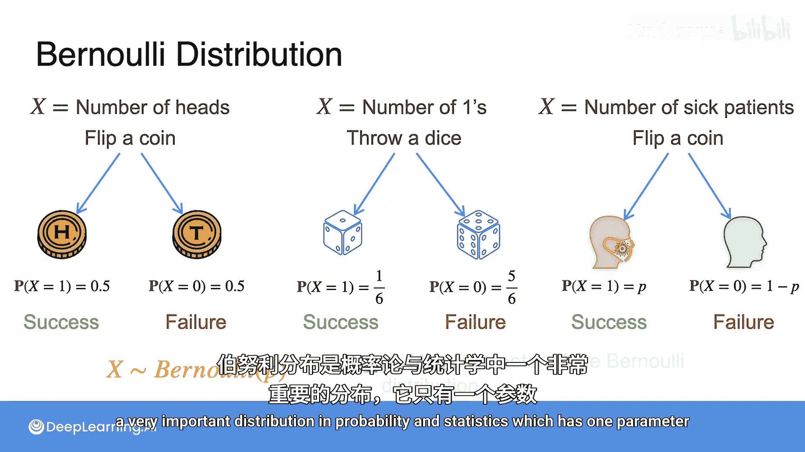

# 022：伯努利分布

在本节课中，我们将要学习概率论与统计学中一个非常基础且重要的分布——伯努利分布。我们将通过抛硬币、掷骰子等简单实验来理解其核心概念，并学习如何用数学公式来描述它。

## 回顾随机变量实验

上一节我们介绍了随机变量的概念。现在让我们回到抛硬币的实验。在这个实验中，你使用一个变量 **x** 来表示正面朝上的次数，这是一个随机变量。当你抛一枚硬币时，结果可能是正面或反面。正面朝上的次数可能是1（概率为0.5）或0（概率也为0.5）。


我们将这个实验定义为：如果硬币正面朝上，则视为一次“成功”；如果反面朝上，则视为一次“失败”。


## 伯努利分布的不同示例




伯努利分布不仅适用于抛硬币实验。我们可以设计不同的实验，同样定义“成功”与“失败”。

例如，如果我们掷一个骰子，并定义掷出点数为1时为“成功”，掷出其他点数时为“失败”。这意味着我们的变量是掷出1的次数。那么，成功的概率是 **1/6**，失败的概率是 **5/6**。

我们还可以有其他实验。例如，在医学统计中，考虑病人是否生病。如果我们用变量 **x** 表示生病的病人数量，那么一个病人被诊断为生病（即 **x = 1**）就被视为一次“成功”。虽然“生病”听起来是负面事件，但在这个统计框架下，它只是我们计数的事件。假设一个病人生病的概率是 **p**，那么健康的概率就是 **1 - p**。

## 伯努利分布的定义





以上所有例子都是**伯努利分布**的实例。伯努利分布在概率论和统计学中非常重要，它只有一个参数，即**成功概率 p**。




一个伯努利随机变量 **X** 的取值只有两种可能：
*   **1**，代表“成功”，其概率为 **p**。
*   **0**，代表“失败”，其概率为 **1 - p**。

我们可以用以下公式来定义伯努利分布的概率质量函数：

**P(X = x) = p^x * (1-p)^(1-x)， 其中 x ∈ {0, 1}**

或者，更直观地写成：
*   **P(X = 1) = p**
*   **P(X = 0) = 1 - p**

在代码中，我们可以用一个简单的函数来描述一次伯努利试验：

```python
import random




def bernoulli_trial(p):
    """
    执行一次伯努利试验。
    p: 成功概率
    返回: 1 (成功) 或 0 (失败)
    """
    return 1 if random.random() < p else 0
```





## 总结





本节课中，我们一起学习了伯努利分布。我们了解到，伯努利分布是描述单次、有两种可能结果（成功/失败）的随机实验的基本模型。它的核心是成功概率 **p** 这个参数。我们通过抛硬币、掷骰子和病人健康状况等多个例子，看到了伯努利分布在各种场景下的应用，并学会了用数学公式和代码来精确地描述它。理解伯努利分布是学习更复杂分布（如二项分布）的重要基础。