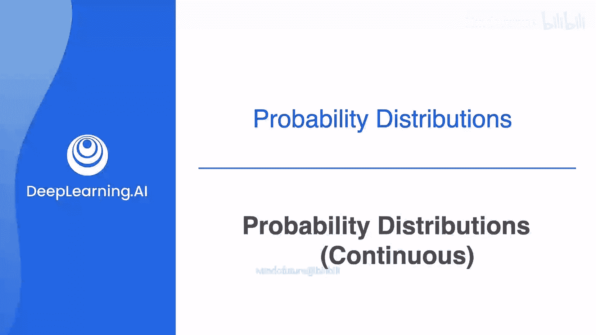
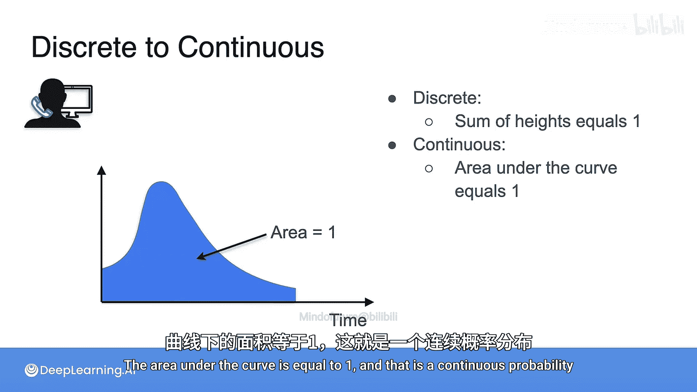

# 023：连续型概率分布

在本节课中，我们将要学习连续型概率分布。我们将了解它与离散型分布的区别，并学习如何通过曲线下的面积来描述连续随机变量的概率。

## 从离散到连续

上一节我们介绍了离散型概率分布，其特点是随机变量的所有可能取值可以列成一个列表。本节中我们来看看连续型概率分布，它与离散型分布有本质的不同。

在离散型分布中，事件总是可以列成一个列表。例如，抛三次硬币，正面朝上的次数可以是0、1、2或3次。一个城镇的人口数量可以是0、1、2、3，甚至一百万，但总能列出一个清单。

那么，什么情况无法列出清单呢？答案是**区间**。例如，我的随机变量是打电话等待的时间或等公交车的时间。这些时间无法被一一列出，因为我可能等待1分钟，也可能是1.01分钟、1.2237分钟，甚至是π分钟。这些数字无法被穷尽地列出。

因此，当你的随机事件可以列成一个清单时，你拥有的是**离散型分布**。当你的随机事件是一个区间时，你拥有的是**连续型分布**。

## 连续型概率的挑战

让我们通过一个例子来深入理解。假设你正在拨打技术支持电话，你想知道等待时间不会太长的概率。如果通话时间只能是1、2或3分钟，我们可以像下图一样绘制概率分布，其中条形的高度代表通话持续1、2或3分钟的概率。

但实际上，通话时间可以是1.01分钟或2.43分钟。你很快会发现，通话时间有无限多个可能的值，这些值遍布在你已有的值之间，甚至在其左右。根据上一节的知识，所有概率（即所有条形的高度）之和必须等于1。但当你加入越来越多、越来越细的条形时，每个条形的概率必须变得非常小，最终趋近于零。那么，我们哪里做错了呢？

我们并没有做错什么。答案是，这种分布本质上是不同的，它不是离散的，而是连续的。因此，用离散列表的方法来理解它行不通。

为了理解这一点，请思考以下问题：**通话时间恰好是1.000...分钟的概率是多少？** 答案是 **0**。因为通话时间有太多可能的值，实际上有不可数无穷多个，它们构成了一个完整的区间。我们不得不承认，通话时间恰好等于某个精确值的概率是0。

## 用区间窗口描述概率

既然无法计算精确值的概率，我们需要用不同的方式来描述这个问题。我们不再询问通话持续某个固定时间的概率，而是考虑它在某个**时间窗口**内的概率。

例如，我们可以问：通话时间在0到1分钟之间的概率是多少？我们可以将这个概率表示为下图蓝色条形的高度。

同样，我们可以计算通话时间在1到2分钟、2到3分钟等区间内的概率。假设通话时间不会超过5分钟，我们就得到了一个离散的概率分布，其中所有蓝色条形的面积（即高度之和）加起来等于1。从图中可以看出，大部分通话时间在1到2分钟或2到3分钟之间，很少有通话持续到5分钟。

## 从离散逼近到连续曲线

如果我们想要更精确的信息，可以将时间区间划分得更细。例如，将区间从1分钟缩短到30秒。这样我们就得到了一个更精细的离散分布，显示了通话时间在0到0.5分钟、0.5到1分钟等区间内的概率。

如果我们想进一步细化，可以将区间缩短到15秒（即0.25分钟）。这样我们就得到了更多、更窄的条形，提供了更详细的信息。

我们可以持续不断地分割这些区间，得到越来越精细的离散分布。如果我们无限次地进行这种分割，会发生什么呢？结果就是一条平滑的曲线。这就是连续型概率分布的样子。

在离散分布中，所有条形的高度之和（即蓝色区域的总面积）必须等于1。在连续分布中，我们有一个相同的条件：**曲线下的总面积必须等于1**。这就是连续型概率分布。

## 核心概念总结

本节课中我们一起学习了连续型概率分布。我们了解到：

*   当随机变量的可能取值是一个区间而非可列清单时，我们处理的是连续型分布。
*   对于连续型随机变量，取某个**精确值**的概率为 **0**。
*   我们通过计算随机变量落在某个**区间**内的概率来描述它，这个概率等于概率密度函数在该区间上**曲线下的面积**。
*   整个概率密度函数曲线下的总面积必须等于 **1**。

理解连续型分布是学习许多重要分布（如正态分布）的基础，我们将在后续课程中继续探讨。