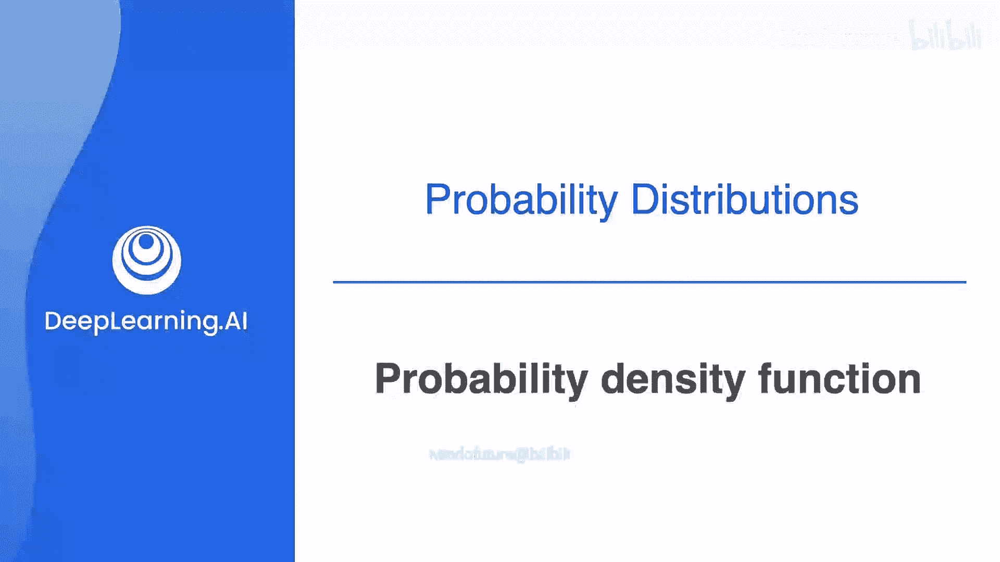
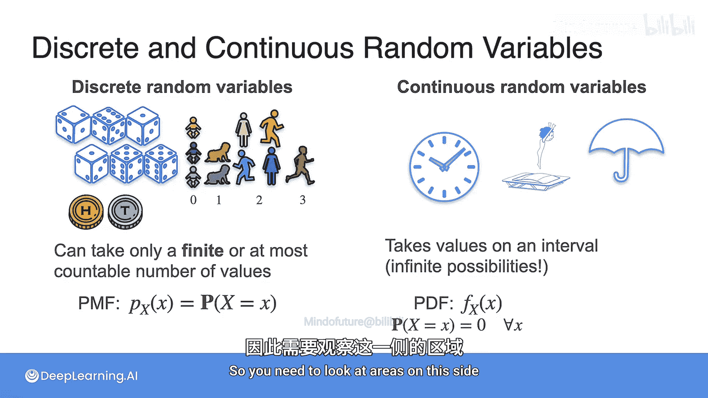

# 024：概率密度函数 📊

在本节课中，我们将学习连续随机变量的核心概念——概率密度函数。我们将了解它与离散随机变量的概率质量函数有何不同，以及如何用它来计算概率。

---

## 从离散到连续：概率的演变

上一节我们介绍了离散随机变量及其概率质量函数。本节中，我们来看看当变量是连续时，描述概率的方式有何根本性变化。

在离散分布中，每个具体事件都有一个概率。例如，抛硬币10次恰好出现3次正面的概率是一个确定的数字。

然而，对于连续分布，我们无法以同样的方式谈论“恰好等于某个值”的概率。例如，一个电话通话**恰好**持续2分钟整的概率是零。但我们仍然可以讨论**区间**的概率，比如通话时长在2分钟到3分钟之间，或在2分钟到2分30秒之间的概率。

这些概率被编码在一种称为**概率密度函数**的工具中。

---

## 一个简单的例子：均匀分布

在深入之前，让我们看一个简单的连续分布案例。假设一个呼叫中心接听电话，通话时长在0到5分钟之间**均匀等可能**地出现。

如下图所示，如果我们将0到5分钟的区域平分为5个部分，那么通话时长落在任何一个矩形区域内的概率是完全相同的。

基于此信息，通话时长在2到3分钟之间的概率是多少？

答案是0.2或20%。因为总概率为1，且被均分为5等份，所以每个矩形的面积（即概率）是 `1/5`。

现在，如果我们把区间分得更细，分成10个30秒的小区间。那么，通话时长在2到2.5分钟之间的概率是多少？

答案是0.1或10%。因为区间宽度减半了，所以对应的概率也减半了。

这里的关键点是：**矩形的高度没有改变，但宽度改变了，因此概率（即面积）也随之改变**。这告诉我们，对于连续变量，我们不能只看“高度”，而必须关注“面积”。

---

## 回到更一般的分布

现在，让我们回到之前视频中更一般的呼叫中心例子，那里的通话时长并非均匀分布。通话更可能持续1到2分钟或2到3分钟，而不太可能持续4到5分钟。

那么，通话在1到2分钟之间的概率，就是概率密度函数曲线下，从1到2区间所围成的面积。

如果我们想计算通话在1到1分30秒之间的概率，那就是更小区间下的面积。

如果我们把区间分得极其细密，如下图所示，那么通话在2到3分钟之间的概率，就是2到3之间所有微小阴影面积的总和。

这就引出了连续分布的核心：**我们只能计算变量落在某个区间内的概率，无法计算它等于某个特定值的概率**。因为“恰好等于2分钟”对应的是曲线下一条线的面积，而线的面积为零。

---

## 概率密度函数的定义与性质

综上所述，描述连续随机变量概率分布的函数称为**概率密度函数**，简称 **PDF**。它通常用小写字母 `f` 表示，是离散分布中概率质量函数（PMF）的连续对应物。为了清晰，可以加上下标表示变量，如 `f_X(x)`。

PDF 是仅为连续变量定义的函数，它表示在每个点附近累积概率的“速率”。

你可以使用 PDF 来计算概率，方法就是计算 PDF 曲线下，介于点 `a` 和点 `b` 之间的面积。

一个函数需要满足以下条件才能被视为有效的 PDF：

以下是成为有效概率密度函数必须满足的条件：
1.  **定义域**：它必须在整个实数轴上有定义（尽管在许多区间上其值可以为零）。
2.  **非负性**：对于所有 `x`，有 `f(x) ≥ 0`。这确保了概率不会为负。
3.  **归一性**：曲线下的总面积必须等于 1。即：`∫_{-∞}^{∞} f(x) dx = 1`。这代表了所有可能结果的概率之和为 1。

---

## 离散与连续的对比总结

本节课中我们一起学习了连续随机变量的概率描述方式。让我们最后总结一下离散与连续随机变量的关键区别：

*   **离散随机变量**：结果只能取有限个或可数无限个值。
    *   使用**概率质量函数**描述，定义为：`P(X = x)`，即变量取某个特定值的概率。
*   **连续随机变量**：结果可以取某个区间内的任意值。
    *   使用**概率密度函数**描述。
    *   变量取**某个特定值**的概率**恒为零**：`P(X = x) = 0`。
    *   概率通过计算 PDF 曲线下的**面积**来获得：`P(a ≤ X ≤ b) = ∫_{a}^{b} f(x) dx`。

正是因为离散与连续随机变量的这种根本差异，它们各自需要不同的工具来描述其行为并计算概率。理解概率密度函数是掌握连续数据概率建模的基础。