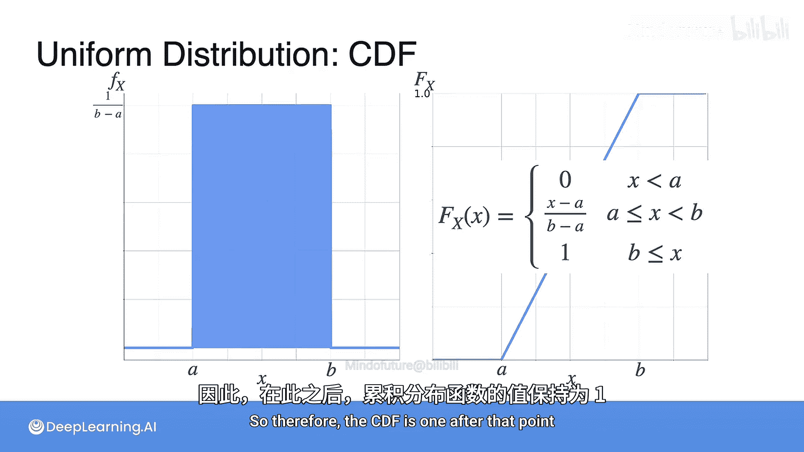

# 026：均匀分布

## 概述
在本节课中，我们将要学习最简单的连续概率分布——均匀分布。我们将通过一个等公交车的例子来理解它的概念，并学习如何用概率密度函数和累积分布函数来描述它。

## 均匀分布简介
上一节我们介绍了连续随机变量的概念，本节中我们来看看一个非常基础的连续分布：均匀分布。

想象一下，一辆公交车每10分钟经过一次，但你不知道它的时刻表，所以你随机走到车站等车。你等待的时间可能是1分钟、5分钟、9.74分钟等等。当你收集了足够多的等待时间数据后，你会发现这些时间值在0到10分钟这个区间内是“均匀”出现的，没有哪个特定的等待时间比其他时间更可能出现。这就是均匀分布的一个直观例子。

## 均匀分布的定义
一个连续随机变量X服从均匀分布，意味着它在某个区间[A, B]内取任何值的可能性都完全相同。区间外的概率则为0。

以下是均匀分布概率密度函数的公式：

**f(x) = 1 / (B - A)， 当 A ≤ x ≤ B**
**f(x) = 0， 其他情况**

其中，A和B是分布的两个参数，分别代表区间的起点和终点。概率密度函数在区间内是一条水平的直线，高度为1除以区间长度(B-A)，这确保了曲线下的总面积（即总概率）等于1。

## 均匀分布的参数变化
均匀分布的形状完全由参数A和B决定，即区间的起点和终点。

以下是参数变化对概率密度函数的影响：
*   当区间[A, B]的长度(B-A)增大时，PDF的高度(1/(B-A))会降低，因为概率被“摊薄”到了一个更宽的区间上。
*   当区间[A, B]的长度(B-A)减小时，PDF的高度会增加，因为概率被“压缩”到了一个更窄的区间上。

## 均匀分布的累积分布函数
累积分布函数描述的是随机变量X小于或等于某个特定值x的概率，即P(X ≤ x)。

对于在区间[0, 1]上的均匀分布，其CDF的计算非常直观。

以下是CDF在不同区间的表达式：
*   当 x < 0 时：F(x) = 0。因为X不可能小于0。
*   当 0 ≤ x ≤ 1 时：F(x) = x。因为从0到x的矩形面积是 x * 1 = x。
*   当 x > 1 时：F(x) = 1。因为X总是小于或等于1。

将其推广到一般区间[A, B]上的均匀分布，其CDF公式为：

**F(x) = 0， 当 x < A**
**F(x) = (x - A) / (B - A)， 当 A ≤ x ≤ B**
**F(x) = 1， 当 x > B**

这个函数图像从0开始，在区间[A, B]内是一条斜率为1/(B-A)的直线，到达B点后变为1。

## 总结
本节课中我们一起学习了均匀分布。我们了解到，均匀分布描述了一个随机变量在特定区间内所有取值可能性均等的情况。我们掌握了它的概率密度函数和累积分布函数的公式与图像，并理解了参数A和B如何决定分布的形状。均匀分布是理解更复杂连续分布的重要基础。