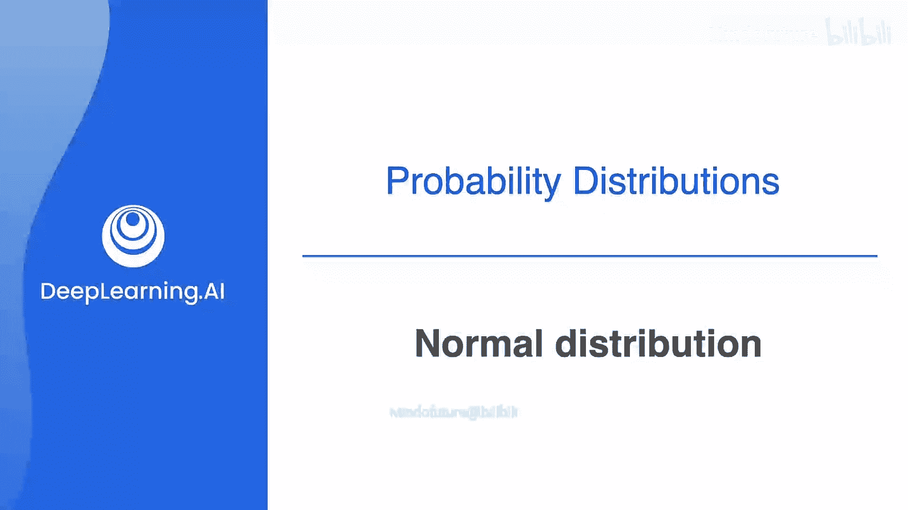
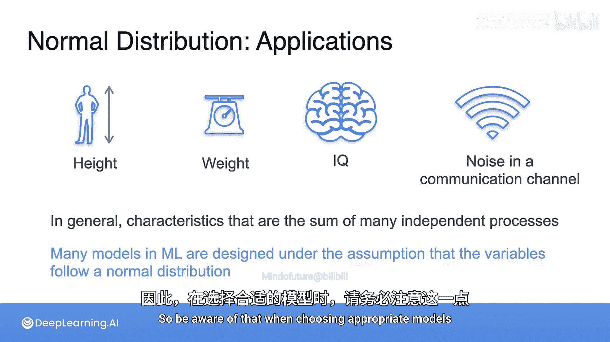

# 027：正态分布



在本节课中，我们将要学习概率论与统计学中最重要的分布之一：正态分布（也称为高斯分布）。正态分布在统计学、科学、现实生活和机器学习中无处不在。我们将了解它的定义、公式、参数以及如何将其标准化。

## 正态分布简介

上一节我们介绍了二项分布等离散分布，本节中我们来看看一个极其重要的连续分布：正态分布。正态分布以其钟形曲线而闻名，由著名数学家卡尔·弗里德里希·高斯命名，因此也被称为高斯分布。

## 从二项分布到正态分布

为了建立直观理解，让我们回顾一下二项分布。二项分布的概率质量函数描述了在 `n` 次独立伯努利试验中成功次数的概率。例如，下图展示了抛掷两次硬币时，正面朝上次数的概率分布。


现在，让我们观察当试验次数 `n` 变得越来越大时会发生什么。下图展示了从 `n=2` 到 `n=100` 的二项分布形状变化。



可以注意到，随着 `n` 增大，分布的形状越来越接近一条连续的钟形曲线。这条橙色的钟形曲线就是我们所说的正态分布或高斯分布。这意味着当 `n` 非常大时，二项分布可以很好地用正态分布来近似。

## 正态分布的公式与参数

正态分布的概率密度函数（PDF）是一个关于其中心对称的钟形曲线。其标准形式（均值为0，标准差为1）的公式如下：

**公式：标准正态分布 PDF**
```
f(x) = (1 / sqrt(2π)) * e^(-x²/2)
```

然而，数据通常不会恰好以0为中心，其分散程度（宽度）也可能不同。因此，我们需要一个更通用的公式，它包含两个关键参数：
*   **均值 (μ)**：数据的中心点，决定了钟形曲线在x轴上的位置。
*   **标准差 (σ)**：数据的离散程度，决定了钟形曲线的“胖瘦”或宽度。σ越大，曲线越宽越平；σ越小，曲线越窄越高。

以下是包含这两个参数的通用正态分布概率密度函数公式：

**公式：通用正态分布 PDF**
```
f(x) = (1 / (σ * sqrt(2π))) * e^(-(x - μ)² / (2σ²))
```

其中：
*   `(1 / (σ * sqrt(2π)))` 是归一化常数，确保曲线下的总面积为1（这是所有概率密度函数的要求）。
*   `e^(-(x - μ)² / (2σ²))` 是指数部分，它创造了钟形形状。`(x - μ)` 将中心点移至 `μ`，除以 `σ²` 则调整了曲线的宽度。

如果一个随机变量 `X` 服从均值为 `μ`、方差为 `σ²` 的正态分布，我们通常写作：

**公式：正态分布表示法**
```
X ~ N(μ, σ²)
```

请注意，这里的第二个参数是方差 `σ²`（标准差的平方），而不是标准差 `σ` 本身。这是一种约定俗成的表示法，两者包含的信息是等价的。

## 标准正态分布

在所有正态分布中，有一个特例至关重要，即**标准正态分布**。它的参数是均值 `μ = 0`，标准差 `σ = 1`。

**公式：标准正态分布**
```
如果 Z ~ N(0, 1)，则其 PDF 为：f(z) = (1 / sqrt(2π)) * e^(-z²/2)
```

标准正态分布的曲线以0为中心，完全对称。它的重要性在于，**任何正态分布都可以通过一个简单的线性变换转化为标准正态分布**。这个过程称为**标准化**。

## 标准化：将任何正态分布转化为标准形式

假设我们有一个随机变量 `X ~ N(μ, σ²)`。我们可以通过以下操作创建一个新的随机变量 `Z`：

**公式：标准化**
```
Z = (X - μ) / σ
```

这个新变量 `Z` 将服从标准正态分布，即 `Z ~ N(0, 1)`。这个过程直观上是：
1.  `(X - μ)`：将数据平移，使其中心移动到0。
2.  `除以 σ`：缩放数据，使其离散程度（标准差）变为1。

标准化在统计学中至关重要，因为它允许我们将不同量纲和范围的变量放在同一个尺度（标准尺度）上进行比较和计算。

## 正态分布的性质与应用

正态分布的累积分布函数（CDF）是一个从0单调递增到1的S形曲线。计算正态分布曲线下特定区间的面积（即概率）在历史上需要查表，现在则可以通过统计软件轻松完成。

正态分布之所以无处不在，是因为以下原因：
*   **中心极限定理**：许多独立随机过程之和的分布会趋近于正态分布。这解释了为什么许多自然现象服从正态分布。
*   **常见应用**：以下是一些通常可以用正态分布很好建模的变量示例：
    *   人群的身高
    *   人群的体重
    *   智商（IQ）分数
    *   通信信道中的噪声
*   **机器学习**：许多机器学习模型（如线性回归、高斯朴素贝叶斯）都假设其误差或某些特征服从正态分布。在选择和评估模型时，这是一个重要的考量因素。

## 总结


本节课中我们一起学习了正态分布（高斯分布）。我们了解到它是从二项分布在大样本下的近似演变而来，其概率密度函数是一个由均值 `μ`（决定中心）和标准差 `σ`（决定宽度）参数化的钟形曲线。我们学习了其标准形式 `N(0,1)` 以及如何通过标准化公式 `Z = (X - μ)/σ` 将任何正态分布转化为标准形式。最后，我们探讨了正态分布因其数学特性和中心极限定理而在自然界和机器学习领域被广泛应用的原理。理解正态分布是深入学习统计学和机器学习的基础。